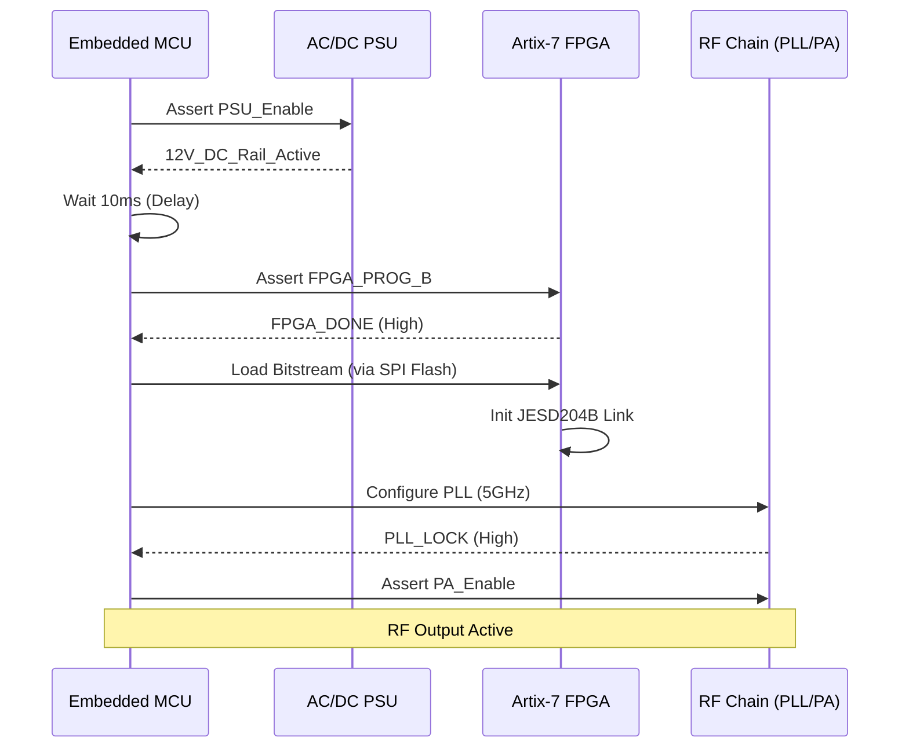
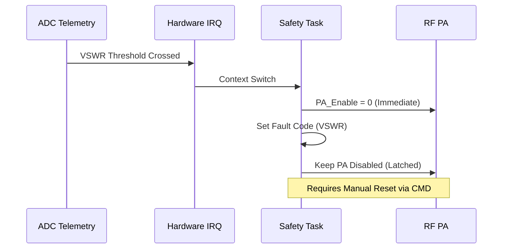

```markdown
# SOFTWARE REQUIREMENTS SPECIFICATION (SRS)

**Project:** rffff High-Power RF Transmit System
**Version:** 1.0
**Date:** 2026-04-03
**Status:** Preliminary
**Author:** Senior Software Architect

---

# 1. Introduction

## 1.1 Purpose
This Software Requirements Specification (SRS) describes the system-level software requirements for the **rffff** embedded controller. The software executes on an embedded MCU/Soft-core, managing the high-speed interaction between the Host Controller (FPGA) and the RF Analog Front End (AFE). Its purpose is to ensure safe operation, precise RF signal generation, thermal stability, and compliance with EMC regulatory standards.

## 1.2 Scope
The software scope includes:
1.  **FPGA Configuration Management:** Loading bitstreams and managing the JESD204B link.
2.  **RF Control:** Tuning the Local Oscillator (PLL), setting attenuation, and enabling the Power Amplifier (PA).
3.  **Power Management:** Sequencing the DC-DC buck converters and monitoring the 110V AC input status.
4.  **Safety & Telemetry:** Real-time monitoring of Forward/Reverse Power, PA Temperature, and Current consumption. Implementation of fault protection (latching shutdown).
5.  **Communication Interfaces:** UART (Command/Control) and SPI (Device Configuration).

## 1.3 Definitions, Acronyms, and Abbreviations

| Term | Definition |
| :--- | :--- |
| **AFE** | Analog Front End (RF Chain components) |
| **API** | Application Programming Interface |
| **DAC** | Digital-to-Analog Converter (RF DAC) |
| **EMC** | Electromagnetic Compatibility |
| **FIFO** | First-In-First-Out memory buffer |
| **FMC** | FPGA Mezzanine Card (Form factor assumption) |
| **FPGA** | Field-Programmable Gate Array |
| **GLR** | Glue Logic Requirements |
| **GPO** | General Purpose Output |
| **HRS** | Hardware Requirements Specification |
| **JESD204B** | High-speed data converter interface standard |
| **LO** | Local Oscillator (PLL/Synthesizer) |
| **MCU** | Microcontroller Unit (System Manager) |
| **PA** | Power Amplifier |
| **PLL** | Phase-Locked Loop |
| **RF** | Radio Frequency |
| **RSS** | Reverse Signal Strength (Reflected Power) |
| **RTOS** | Real-Time Operating System |
| **SPI** | Serial Peripheral Interface |
| **SWR** | Standing Wave Ratio (VSWR) |
| **UART** | Universal Asynchronous Receiver-Transmitter |

## 1.4 References
1.  **IEEE Std 830-1998:** Recommended Practice for Software Requirements Specifications.
2.  **IEEE Std 29148-2018:** Systems and software engineering — Life cycle processes — Requirements engineering.
3.  **rffff Hardware Requirements Specification (HRS) P2:** Defines electrical and physical constraints.
4.  **rffff Glue Logic Requirements (GLR) P6:** Defines register maps and timing constraints.
5.  **Xilinx UG470:** Artix-7 Configuration Guide.
6.  **Analog Devices ADF5355 / HMC361 Datasheets:** Reference for PLL programming.

## 1.5 Overview
The remaining sections of this document detail the external interfaces, functional requirements, performance constraints, and verification methods for the rffff embedded software. Section 3 maps specific software requirements (`REQ-SW`) to the hardware requirements (`REQ-HW`) defined in the HRS.

---

# 2. Overall Description

## 2.1 Product Perspective
The rffff software operates as the **System Management Controller**. It bridges the gap between a high-level user/Host PC and the high-speed signal generation hardware (Artix-7 FPGA).

*   **Operating Environment:** Industrial (-40°C to +85°C).
*   **Hardware Dependencies:**
    *   MCU: ARM Cortex-M4 or RISC-V equivalent (Assumed based on "Glue Logic" requirements).
    *   FPGA: Xilinx Artix-7 (XC7AxxxT).
    *   RF ICs: PLL (e.g., ADF5355), VVA (Digital Step Attenuator).
*   **External Interfaces:** 110V AC input (monitored via ADC), Ethernet/UART (Command).

## 2.2 Product Functions
1.  **Power Sequencing:** Control the enable pins for the AC/DC PSU and DC-DC Buck converters to meet FPGA (REQ-HW-007) and RF (REQ-HW-009) requirements.
2.  **RF Safety:** Monitor RSS/FWD power. If VSWR > 10:1 or PA Temp > 90°C, disable PA within 10µs.
3.  **Frequency Agility:** Program the PLL via SPI to generate LO signals from 5 GHz to 10 GHz.
4.  **FPGA Handshake:** Verify the FPGA has successfully initialized the JESD204B link before enabling the PA.

## 2.3 User Characteristics
*   **System Operator:** Interacts via UART/CLI commands to set frequency, power, and modulation.
*   **Maintenance Engineer:** Requires access to diagnostic telemetry (temperature, voltage rails, error logs).

## 2.4 Constraints
*   **Latency:** Fault protection (RF Shutdown) must occur within 10µs of detection.
*   **Timing:** SPI clock for GLR interactions max 10 MHz (per GLR P6).
*   **Power:** The MCU must operate in a low-power state relative to the 200W total budget.

## 2.5 Assumptions and Dependencies
*   The FPGA configuration bitstream is stored in non-volatile memory (SPI Flash) accessible by the MCU.
*   The GLR defines a specific register map for the pseudo-registers used to control the PA and PLL.
*   The system uses an RTOS (e.g., FreeRTOS or Zephyr) to manage concurrent tasks (UART rx vs. Telemetry).

---

# 3. Specific Requirements

## 3.1 External Interface Requirements

### 3.1.1 Hardware Interfaces (GLR Mapping)
The software interfaces with hardware via a set of memory-mapped registers and GPIO pins defined in the GLR.

**Register Map (C Struct Definition):**

```c
/**
 * @brief rffff Hardware Register Map (Memory Mapped I/O)
 * Base Address: 0x40000000 (Assumed)
 */
typedef struct {
    /** 0x00: RF Control Register (R/W) */
    union {
        uint32_t word;
        struct {
            uint32_t pa_enable  : 1;  // Bit 0: Power Amplifier Enable
            uint32_t pll_enable : 1;  // Bit 1: PLL Enable
            uint32_t dac_reset  : 1;  // Bit 2: DAC Reset Line (Active Low)
            uint32_t rf_freq_select : 2; // Bits 3-4: Frequency Band Selection
            uint32_t reserved    : 28; // Bits 5-31: Reserved
        } bits;
    } ctrl_reg;

    /** 0x04: Status Register (Read Only) */
    union {
        uint32_t word;
        struct {
            uint32_t pa_fault    : 1;  // Bit 0: PA Trip/Fault Detected
            uint32_t temp_warn   : 1;  // Bit 1: Temp > 85C
            uint32_t pll_lock    : 1;  // Bit 2: PLL Locked Indicator
            uint32_t fpga_ready  : 1;  // Bit 3: FPGA Configuration Done
            uint32_t reserved    : 28;
        } bits;
    } status_reg;

    /** 0x08: Telemetry Data Register (Read Only) */
    union {
        uint32_t word;
        struct {
            uint16_t fwd_power_raw;   // ADC Value 0-4095 (12-bit)
            uint16_t rev_power_raw;   // ADC Value 0-4095 (12-bit)
        } data;
    } telem_reg;
    
    /** 0x0C: GPIO Output Register (R/W) */
    uint32_t gpio_out; // Controls PSU_Enable, LED_Status, etc.

} rffff_hardware_t;

#define RFFFF_BASE ((volatile rffff_hardware_t *) 0x40000000)
```

### 3.1.2 Software Interfaces

**Driver API Signatures:**

```c
/**
 * @brief Initialize the rffff system, including clocks and interrupts.
 * @return 0 on success, negative error code on failure.
 */
int RFFFF_SystemInit(void);

/**
 * @brief Configure the Power Supply Unit sequence.
 * @param enable Boolean: 1 to turn on main 12V rail, 0 to shut down.
 * @note Satisfies REQ-SW-004 (Power Sequencing).
 */
void RFFFF_PowerSequence(bool enable);

/**
 * @brief Set the RF Frequency.
 * @param freq_hz Desired output frequency in Hz (5e9 to 10e9).
 * @return 0 if PLL locked, -ERR_PLL_LOCK_TIMEOUT if failed.
 * @note Satisfies REQ-SW-007 (Frequency Control).
 */
int RFFFF_SetFrequency(uint64_t freq_hz);

/**
 * @brief Main loop for the Safety Task.
 * @param pvParameters RTOS task parameter.
 * @note Checks VSWR and Temp. Satisfies REQ-SW-011.
 */
void RFFFF_SafetyTask(void *pvParameters);

/**
 * @brief Parse and execute a command string received via UART.
 * @param cmd_string Null-terminated command string.
 * @note Satisfies REQ-SW-010 (CLI Interface).
 */
void RFFFF_ProcessCommand(char *cmd_string);
```

### 3.1.3 Communication Interfaces
*   **UART:**
    *   Baud Rate: 115200
    *   Data Bits: 8
    *   Parity: None
    *   Stop Bits: 1
    *   Protocol: ASCII Command Line Interface (CLI) terminated by `\n`.
*   **SPI (Internal):**
    *   Max Speed: 10 MHz
    *   Mode: Mode 0 (CPOL=0, CPHA=0)
    *   Frame Size: 8-bit

---

## 3.2 Functional Requirements

### 3.2.1 Power Management
| ID | Requirement Statement | Traceability |
|----|-----------------------|--------------|
| **REQ-SW-001** | The system shall assert the `PSU_Enable` signal only after the 110V AC input is stable (detected via sense pin). | REQ-HW-005 |
| **REQ-SW-002** | The software shall sequence the power rails: 1.0V Core -> 1.8V/2.5V IO -> 3.3V Aux. A minimum delay of **10ms** shall be enforced between rail ramps. | REQ-HW-007, REQ-HW-008 |
| **REQ-SW-003** | Upon detection of an Undervoltage Lockout (UVLO) on the 12V bus, the system shall immediately cut the `PA_Enable` signal to protect the PA. | REQ-HW-006 |

### 3.2.2 FPGA & Configuration
| ID | Requirement Statement | Traceability |
|----|-----------------------|--------------|
| **REQ-SW-004** | The MCU shall monitor the `FPGA_DONE` pin. If `FPGA_DONE` is not asserted high within **200ms** of power-up, the system shall log a "CFG_ERR" and halt. | REQ-HW-003 |
| **REQ-SW-005** | The MCU shall assert the `DAC_Reset` (Active Low) line low for at least **100µs** during the initialization sequence to ensure the JESD204B link is in a known state. | REQ-HW-003 (Implicit DAC req) |
| **REQ-SW-006** | The software shall verify the JESD204B Link Status (via GLR register) before allowing the RF PA to be enabled. | REQ-HW-003 |

### 3.2.3 RF Signal Generation
| ID | Requirement Statement | Traceability |
|----|-----------------------|--------------|
| **REQ-SW-007** | The system shall provide a command interface to set the output frequency from 5.0 GHz to 10.0 GHz with a step resolution of **1 MHz**. | REQ-HW-001 |
| **REQ-SW-008** | When changing frequency, the software shall disable the PA (muted), write the new PLL registers, wait for `PLL_LOCK` status (max **5ms**), and then re-enable the PA. | REQ-HW-001, REQ-HW-004 |
| **REQ-SW-009** | The system shall utilize the `RF_FREQ_SELECT` lines to switch external RF bandpass filters if the target frequency crosses 7.5 GHz (assumed band split). | REQ-HW-001 |

### 3.2.4 Safety & Protection
| ID | Requirement Statement | Traceability |
|----|-----------------------|--------------|
| **REQ-SW-010** | The safety task shall execute every **1ms**. It shall read the Forward and Reverse power ADCs. | REQ-HW-013 |
| **REQ-SW-011** | If the calculated VSWR exceeds **10.0**, the software shall immediately clear `PA_Enable` and set the latching `FAULT` register. | REQ-HW-001 (Implied protection) |
| **REQ-SW-012** | If the PA temperature sensor reports > **95°C**, the software shall throttle RF gain by 10 dB steps until temp < 85°C or RF is disabled. | REQ-HW-001 (Thermal constraint) |

### 3.2.5 User Interface
| ID | Requirement Statement | Traceability |
|----|-----------------------|--------------|
| **REQ-SW-013** | The system shall accept ASCII commands over UART in the format `SETFREQ <Hz>`. | REQ-HW-013 (Connector implies interface) |
| **REQ-SW-014** | The system shall respond to `STATUS` queries with a JSON formatted string containing Temp, Freq, and Pwr. | REQ-HW-013 |

---

## 3.3 Performance Requirements
| ID | Metric | Value | Traceability |
|----|--------|-------|--------------|
| **REQ-SW-PERF-001** | Command Response Time | < 50ms (from UART Rx to execution) | User Experience |
| **REQ-SW-PERF-002** | Fault Reaction Time | < 10µs (Hardware IRQ latency to PA Disable) | REQ-SW-011 |
| **REQ-SW-PERF-003** | Frequency Settling Time | < 20ms (Total time including PLL lock) | REQ-HW-001 |

---

## 3.4 Design Constraints

1.  **Language:** C99 standard for embedded firmware. C++ allowed for Host tools only.
2.  **Memory:** MCU RAM usage must not exceed 80% of available capacity to reserve space for the stack.
3.  **Isolation:** The firmware must ensure that control signals crossing isolation boundaries (if any) use non-blocking logic or state machines to prevent bus lockups.
4.  **Glue Logic Timing:** The SPI driver must be configured to match GLR P6 timing: `SPI_CLK` period 100ns (10 MHz).

---

## 3.5 Software System Attributes

### 3.5.1 Reliability
*   **Watchdog:** A hardware independent watchdog (IWDG) shall be refreshed every 10ms. Failure to refresh triggers a system reset.
*   **Checksum:** All FPGA bitstreams and configuration files read from external Flash shall be verified via CRC32 before loading.

### 3.5.2 Availability
*   The system shall support "Soft Reset" commands that reset the RF chain without rebooting the power supply, maximizing uptime for the host system.

### 3.5.3 Security
*   **Input Validation:** All numeric inputs received via UART shall be parsed as `uint64_t` and checked against valid ranges (e.g., reject negative numbers or > 10GHz).
*   **FPGA Encryption:** The system shall enforce encryption checking on the FPGA bitstream (decrypt in FPGA if supported, or verify via MCU).

### 3.5.4 Maintainability
*   The software shall utilize a modular driver architecture (HAL Layer) to allow swapping the Artix-7 driver for a Kintex-7 driver in future revisions without changing the application layer.

### 3.5.5 Portability
*   The code shall be written using CMSIS (Cortex Microcontroller Software Interface Standard) for ARMv7E-M compatibility.

---

# 4. Verification and Validation

## 4.1 Unit Test Requirements
*   **SPI Driver:** Verify read/write operations to the GLR register map using a loopback mock.
*   **Command Parser:** Inject boundary values (0, 5GHz, 10GHz, 11GHz) into `RFFFF_ProcessCommand` and verify return codes.
*   **VSWR Calc:** Validate the math logic using known values (FWD=100, REV=100 -> VSWR=infinity/trip).

## 4.2 Integration Test Requirements
*   **FPGA Link:** Verify MCU can successfully bring FPGA out of reset and detect `FPGA_DONE` high.
*   **PLL Lock:** Sweep frequency from 5-10GHz in 500MHz steps; verify `PLL_LOCK` bit asserts every time.

## 4.3 System Test Requirements
*   **Thermal Runaway:** Place unit in environmental chamber. Heat to 95°C. Verify PA throttles or shuts down.
*   **VSWR Protection:** Apply a mismatched load (e.g., open circuit). Verify PA disables within 20us.

---

# 5. Traceability Matrix

| Software Req ID | Description | Derived From HW Req ID |
| :--- | :--- | :--- |
| **REQ-SW-001** | PSU Enable Logic | REQ-HW-005 |
| **REQ-SW-002** | Rail Sequencing (1.0V -> IO) | REQ-HW-007, REQ-HW-008 |
| **REQ-SW-003** | UVLO Protection | REQ-HW-006 |
| **REQ-SW-004** | FPGA Configuration Monitor | REQ-HW-003 |
| **REQ-SW-005** | DAC Reset Sequence | REQ-HW-003 (Implicit) |
| **REQ-SW-006** | JESD204B Link Check | REQ-HW-003 |
| **REQ-SW-007** | Frequency Setting API | REQ-HW-001 |
| **REQ-SW-008** | Frequency Change Muting | REQ-HW-001, REQ-HW-004 |
| **REQ-SW-009** | RF Band Switching | REQ-HW-001 |
| **REQ-SW-010** | Telemetry Loop Rate | REQ-HW-013 |
| **REQ-SW-011** | VSWR Protection | REQ-HW-001 |
| **REQ-SW-012** | Thermal Throttling | REQ-HW-001 |
| **REQ-SW-013** | UART Command Parser | REQ-HW-013 |

---

# 6. Appendices

## Appendix A: Error Codes
Errors are reported via UART and stored in the `error_log` array.

```c
typedef enum {
    ERR_NONE = 0,
    ERR_PLL_UNLOCK = -1,
    ERR_VSWR_HIGH = -2,
    ERR_TEMP_HIGH = -3,
    ERR_FPGA_CFG_FAIL = -4,
    ERR_INVALID_PARAM = -5
} rffff_error_t;
```

## Appendix B: Sequence Diagrams

### B.1 System Startup Sequence


### B.2 VSWR Fault Protection Sequence
