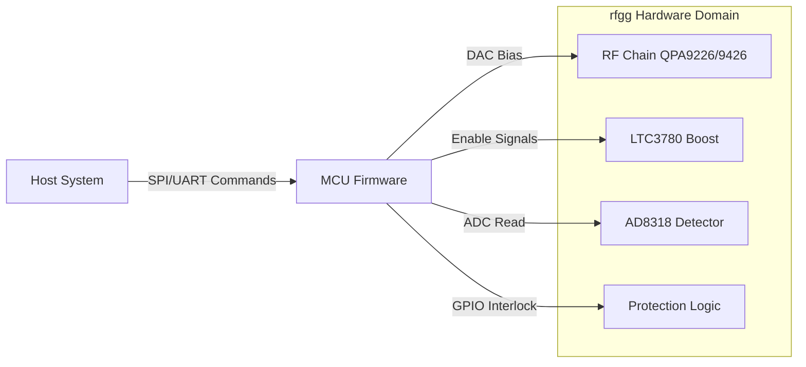
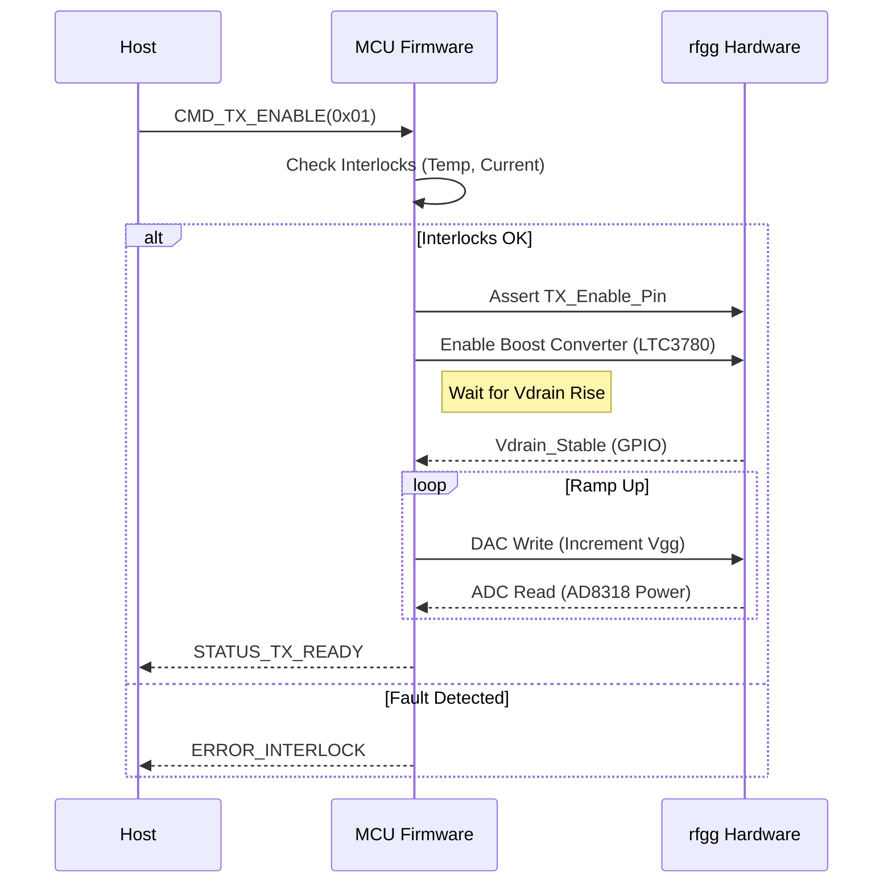
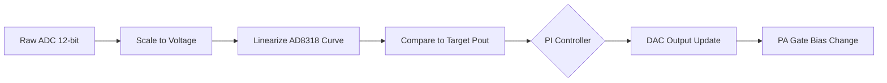

```markdown
# SOFTWARE REQUIREMENTS SPECIFICATION (SRS)
**Project:** rfgg Embedded Control System
**Version:** 1.0
**Date:** 2026-04-04
**Status:** Preliminary
**Standard:** IEEE 830-1998 / IEEE 29148:2018

---

# 1. Introduction

## 1.1 Purpose
This Software Requirements Specification (SRS) defines the software architecture and requirements for the **rfgg** 2.4 GHz Power Amplifier control firmware. The purpose of this document is to specify the functional behavior, external interfaces, and performance constraints of the embedded software responsible for bias sequencing, thermal protection, RF power monitoring, and communication with the host system.

This SRS is the primary reference for:
*   Firmware engineers implementing the control logic on the target MCU (e.g., ARM Cortex-M4).
*   Validation engineers developing software test plans.
*   Systems engineers integrating the rfgg module into larger platforms.

## 1.2 Scope
The scope of this software covers the complete operational control of the rfgg RF amplifier module.

**In-Scope Items:**
*   **Initialization:** Hardware abstraction layer (HAL) configuration, GPIO setup, and peripheral bus initialization.
*   **Power Sequencing:** Automated state machine controlling TX Enable, Gate Bias (Vgg), and Drain Boost (LTC3780) to ensure safe startup and shutdown (< 100µs protection response).
*   **Telemetry:** Digitization of the AD8318 RF Detector output, temperature sensors, and current sense circuits via internal ADC.
*   **Communication:** SPI driver for sensor configuration and a Host Control Interface (UART/SPI) for external commands.
*   **Fault Management:** Real-time monitoring of over-current, over-temperature, and VSWR faults with automatic hardware interlock triggering.

**Out-of-Scope Items:**
*   Host PC GUI or higher-level network stack protocols (TCP/IP).
*   RF modulation algorithms (firmware assumes CW or external modulation input).

## 1.3 Definitions, Acronyms, and Abbreviations

| Term | Definition |
| :--- | :--- |
| **ADC** | Analog-to-Digital Converter: Used to read power detector voltages and temperature. |
| **CMSIS** | Cortex Microcontroller Software Interface Standard. |
|**DAC** | Digital-to-Analog Converter: Used to control Gate Bias voltage (Vgg). |
| **FW** | Firmware: The embedded software running on the microcontroller. |
| **GPIO** | General Purpose Input/Output: Physical pins on the MCU used for control signals. |
| **HAL** | Hardware Abstraction Layer: A software layer providing a standardized interface to the hardware peripherals. |
| **ISR** | Interrupt Service Routine: A function called in response to a hardware interrupt. |
| **LTC3780** | Boost Controller IC: Requires software enable and feedback monitoring. |
| **PA** | Power Amplifier: The Qorvo QPA9226 and QPA9426 cascade. |
| **RTOS** | Real-Time Operating System: (e.g., FreeRTOS) managing task scheduling. |
| **SPI** | Serial Peripheral Interface: Synchronous serial communication protocol. |
| **TX** | Transmit: The active state of the amplifier. |
| **Vgg** | Gate Bias Voltage: The negative voltage applied to the GaN FET gates. |

## 1.4 References
1.  **rfgg Hardware Requirements Specification (P2)**, Rev 1.0.
2.  **rfgg Glue Logic Requirements (GLR)**, Rev 1.0.
3.  **LTC3780 Datasheet**, Linear Technology/Analog Devices.
4.  **AD8318 Datasheet**, Analog Devices.
5.  **IEEE 830-1998**, Recommended Practice for Software Requirements Specifications.

## 1.5 Overview
The remainder of this document is organized as follows:
*   **Section 2** describes the product perspective, functions, and general constraints.
*   **Section 3** details the specific external interfaces and functional requirements mapped to hardware IDs.
*   **Section 4** outlines verification and validation strategies.
*   **Section 5** provides the traceability matrix mapping Software Requirements (REQ-SW) to Hardware Requirements (REQ-HW).

---

# 2. Overall Description

## 2.1 Product Perspective
The rfgg firmware is a self-contained embedded application executing on a 32-bit microcontroller (MCU). The MCU acts as the system controller, sitting between the Host System (Command Source) and the RF Power Chain.



## 2.2 Product Functions
1.  **Bias Sequencing:** Control the specific order of power application to prevent GaN device destruction.
2.  **Closed Loop Power Control:** Adjust Vgg based on AD8318 feedback to maintain +40 dBm output.
3.  **Health Monitoring:** Continuously monitor board temperature and current consumption.
4.  **Fault Protection:** Immediately shut down the PA if parameters exceed safe operating limits (REQ-SW-014).

## 2.3 User Characteristics
The primary users are **System Integrators** and **Automatic Test Equipment (ATE)**.
*   **Integrator:** Requires high-level commands (`TX_ON`, `TX_OFF`, `SET_POWER`).
*   **ATE:** Requires access to raw diagnostic registers (`ADC_TEMP`, `STATUS_WORD`).

## 2.4 Constraints
1.  **Real-Time Response:** Fault detection and response must occur within **100 µs** (derived from REQ-HW-012).
2.  **Environment:** Code must execute reliably at -40°C to +85°C.
3.  **Voltage:** Logic levels are 3.3V. No 5V tolerant I/O unless specified.

## 2.5 Assumptions and Dependencies
1.  **MCU Resources:** Assumes a Cortex-M4 with FPU, 3x SPI, 2x 12-bit ADC, 1x DAC.
2.  **Clock Source:** Assumes a stable 16 MHz external crystal for RTC and system timing.
3.  **Power Rails:** Assumes the 3.3V rail is stable before firmware initialization begins.

---

# 3. Specific Requirements

## 3.1 External Interface Requirements

### 3.1.1 Hardware Interfaces (Memory Mapped I/O)
The firmware shall abstract the physical registers defined in the GLR into C Structs.

**ADC Interface (AD8318 Output & Temp Sensors)**
```c
// Address Base: 0x40012000 (Example ADC1 Base)
typedef struct {
    volatile uint32_t STATUS;      // 0x00
    volatile uint32_t CR1;         // 0x04
    volatile uint32_t CR2;         // 0x08
    volatile uint32_t SMPR2;       // 0x10
    volatile uint32_t JOFR1;       // 0x14
    volatile uint32_t HTR;         // 0x24
    volatile uint32_t DR;          // 0x4C - Data Register
} rfgg_adc_t;

#define RFGG_ADC_BASE      ((rfgg_adc_t *) 0x40012000)
#define ADC_CHANNEL_RF_PWR  1  // AD8318 Vout connected to Channel 1
#define ADC_CHANNEL_TEMP    5  // Thermistor connected to Channel 5
```

**DAC Interface (Gate Bias Control)**
```c
// Address Base: 0x40007400 (Example DAC Base)
typedef struct {
    volatile uint32_t CR;          // 0x00 - Control Register
    volatile uint32_t SWTRIGR;     // 0x04 - Software Trigger
    volatile uint32_t DHR12R1;     // 0x08 - Channel 1 Data Holding
    volatile uint32_t DHR12R2;     // 0x14 - Channel 2 Data Holding
    volatile uint32_t DOR1;        // 0x2C - Channel 1 Output Data
} rfgg_dac_t;

#define RFGG_DAC_BASE    ((rfgg_dac_t *) 0x40007400)
```

**GPIO Interface (Control Lines)**
```c
// Mapping to GLR Pin Assignments
#define RFGG_PIN_TX_ENABLE (1 << 0)  // PA0 - Output
#define RFGG_PIN_BOOST_EN  (1 << 1)  // PA1 - Output
#define RFGG_PIN_FAULT     (1 << 2)  // PA2 - Input (Active Low)
#define RFGG_PIN_LED_TX    (1 << 5)  // PA5 - Output
```

### 3.1.2 Software Interfaces

**Host Communication Protocol (Binary Packet Structure)**
Firmware shall process commands via the UART/SPI interface using the following packet structure.

```c
#pragma pack(push, 1)
typedef struct {
    uint8_t  start_byte;   // 0xAA
    uint8_t  cmd_id;       // See Enum below
    uint16_t payload_len;  // Big Endian
    uint8_t  payload[32];  // Variable data
    uint16_t checksum;     // CRC16-CCITT
} rfgg_host_packet_t;
#pragma pack(pop)

typedef enum {
    CMD_NOP               = 0x00,
    CMD_TX_ENABLE         = 0x01, // Payload: [0x01=On, 0x00=Off]
    CMD_SET_TARGET_POWER  = 0x02, // Payload: float (dBm)
    CMD_GET_TELEMETRY     = 0x03, // Returns Temp, Vout, Idd
    CMD_GET_FAULT_STATUS  = 0x04
} rfgg_cmd_id_t;
```

**Driver API Signatures**
The firmware shall provide the following internal APIs:

```c
// Driver: Power Management (LTC3780 control)
int32_t RFGG_Power_Init(void);
int32_t RFGG_Power_SetState(bool enable); // Maps to REQ-SW-003

// Driver: RF Control (Bias & Sequencing)
int32_t RFGG_RF_Enable(void);
int32_t RFGG_RF_Disable(void);
int32_t RFGG_RF_SetBias_dBm(float target_power); // Maps to REQ-SW-007

// Driver: Diagnostics
int32_t RFGG_Telemetry_Update(rfgg_telemetry_t *data);
```

### 3.1.3 Communication Interfaces
*   **SPI (Sensor Interface):** Speed 10 MHz max, Mode 3 (CPOL=1, CPHA=1), 16-bit words.
*   **UART (Host Interface):** Baud 115200, 8N1.

---

## 3.2 Functional Requirements

### 3.2.1 Power Management & Bias Sequencing
**REQ-SW-001: Automatic Bias Sequencing**
The firmware shall implement a startup state machine that controls the timing of Vdrain (Boost) and Vgg (Gate) to prevent parasitic oscillation and device failure.
*   **Traceability:** REQ-HW-001, REQ-HW-009.
*   **Sequence:**
    1.  Assert `TX_ENABLE` (Logic High).
    2.  Wait **t_delay = 1ms**.
    3.  Enable `LTC3780_BOOST_EN`.
    4.  Wait until `VDRAIN_GOOD` is asserted (Monitor GPIO).
    5.  Ramp DAC (Vgg) from 0V to -1.5V over **t_ramp = 10ms**.
    6.  Set Status to TX_READY.

**REQ-SW-002: Automatic Shutdown Sequence**
Upon receiving a `CMD_TX_ENABLE(0)` or Fault, firmware must:
1.  Ramp DAC (Vgg) to 0V immediately.
2.  Wait **t_drop = 5us**.
3.  Disable `LTC3780_BOOST_EN`.
4.  De-assert `TX_ENABLE`.
*   **Traceability:** REQ-HW-001.

### 3.2.2 RF Power Control
**REQ-SW-003: Output Power Regulation**
The firmware shall maintain output power at +/- 0.5 dB of the target setpoint.
*   **Algorithm:** Closed-loop PI Controller.
*   **Traceability:** REQ-HW-001 (40 dBm), REQ-HW-015 (Detector).
*   **Inputs:** ADC Reading of AD8318 (0-2.5V range).

**REQ-SW-004: Automatic Gain Control (AGC) Limits**
The PI Controller loop shall constrain the DAC output to a safe range corresponding to Gate Bias -0.5V to -2.5V to prevent over-drive.

### 3.2.3 Monitoring & Protection
**REQ-SW-005: Overcurrent Protection**
Firmware shall monitor the current sense ADC (Pin `ADC_ISENSE`) every 100 µs. If current exceeds **12.0A** for more than **3 consecutive samples**, trigger `RFGG_RF_Disable()` and set Latch Fault.
*   **Traceability:** REQ-HW-012.

**REQ-SW-006: Over-Temperature Protection**
Firmware shall monitor the thermistor ADC. If temperature exceeds **+85°C**, the firmware shall immediately disable TX (forcing Bias to 0V).
*   **Traceability:** REQ-HW-001 (Env range).

**REQ-SW-007: Watchdog Timer**
The firmware shall implement an Independent Watchdog (IWDG) with a timeout of **50ms**. The task loop must refresh the watchdog every 10ms.



---

## 3.3 Performance Requirements

| ID | Metric | Requirement | Value |
|:---|:---|:---|:---|
| **PERF-001** | Loop Bandwidth | The AGC loop must correct for 1 dB droop within | 200 µs |
| **PERF-002** | Fault Latency | Max time from Overcurrent event to PA shutdown | 100 µs |
| **PERF-003** | ADC Sampling | Telemetry update rate | 10 Hz |
| **PERF-004** | SPI Speed | Sensor clock frequency | 10 MHz |

---

## 3.4 Design Constraints
*   **Processor:** ARM Cortex-M4 or higher.
*   **Compiler:** GCC 10.0+ with `-std=c11`.
*   **Memory:** Flash < 128KB, RAM < 16KB.
*   **Safety:** Critical code (Protection) must run in High Priority ISR, not main loop.

---

## 3.5 Software System Attributes

### 3.5.1 Reliability
The software must achieve a Mean Time Between Failures (MTBF) of > 10,000 hours under continuous operation. All dynamic memory allocation (`malloc`) is forbidden; static allocation only.

### 3.5.2 Availability
System boot time must not exceed 500ms from power application to UART prompt ready.

### 3.5.3 Security
*   **Input Validation:** All host packets must validate CRC and length buffers before processing.
*   **Command Access:** Critical commands (e.g., `CMD_CALIBRATE`) require a magic byte sequence.

### 3.5.4 Maintainability
Code must be segmented into modules (HAL, Driver, App) with defined header files.

### 3.5.5 Portability
Hardware dependent code (GPIO, SPI) must be isolated into a `Board Support Package` (BSP) folder to allow migration to other MCUs.

---

# 4. Verification and Validation

## 4.1 Unit Test Requirements
*   **Test ID UT-001:** Verify `RFGG_RF_SetBias_dBm` calculates correct DAC hex codes for -10dBm to +50dBm range.
*   **Test ID UT-002:** Verify Watchdog Reset triggers correctly if main loop hangs.

## 4.2 Integration Test Requirements
*   **Test ID IT-001:** Connect SPI Bus Analyzer. Verify SPI commands to Sensor GLR match timing constraints (Setup 10ns, Hold 10ns).
*   **Test ID IT-002:** Inject +40dBm RF signal. Verify ADC reading accuracy matches AD8318 datasheet curve.

## 4.3 System Test Requirements
*   **Test ID ST-001:** Thermal Chamber Run. Operate at +85°C ambient. Verify no unexpected thermal shutdowns at < 10W output.
*   **Test ID ST-002:** Fault Injection. Short RF Output to 50 Ohm load. Verify fault triggers within 100 µs.

---

# 5. Traceability Matrix

| Software ID | Software Title | Traces To | Hardware ID(s) |
| :--- | :--- | :--- | :--- |
| **REQ-SW-001** | Automatic Bias Sequencing | Satisfies | REQ-HW-009, REQ-HW-001 |
| **REQ-SW-002** | Automatic Shutdown Sequence | Satisfies | REQ-HW-009 |
| **REQ-SW-003** | Output Power Regulation | Satisfies | REQ-HW-001, REQ-HW-015 |
| **REQ-SW-004** | AGC Limits | Constrains | REQ-HW-001 |
| **REQ-SW-005** | Overcurrent Protection | Satisfies | REQ-HW-012 |
| **REQ-SW-006** | Over-Temperature Protection | Satisfies | REQ-HW-001 |
| **REQ-SW-007** | Watchdog Timer | Satisfies | REQ-HW-005 (Reliability) |
| **REQ-SW-008** | SPI Level Shifter Control | Satisfies | GLR (3.3V to 1.8V) |

---

# 6. Appendices

## A. Error Codes
```c
typedef enum {
    RFGG_OK = 0,
    RFGG_ERR_TIMEOUT = -1,
    RFGG_ERR_CRC = -2,
    RFGG_ERR_OVERCURRENT = -3,
    RFGG_ERR_OVERTEMP = -4,
    RFGG_ERR_VSWR_HIGH = -5
} rfgg_status_t;
```

## B. Calculated Constants
*   **AD8318 Slope:** -22 mV/dB
*   **AD8318 Intercept:** 2.5V @ 60 dBm (approx)
*   **DAC Max V:** 2.5V Ref.


```