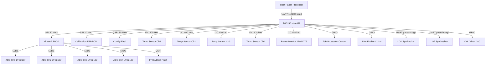
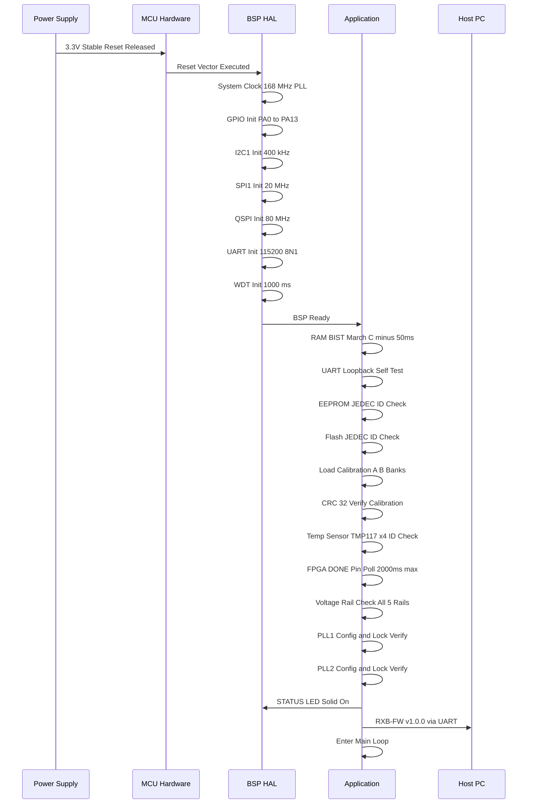
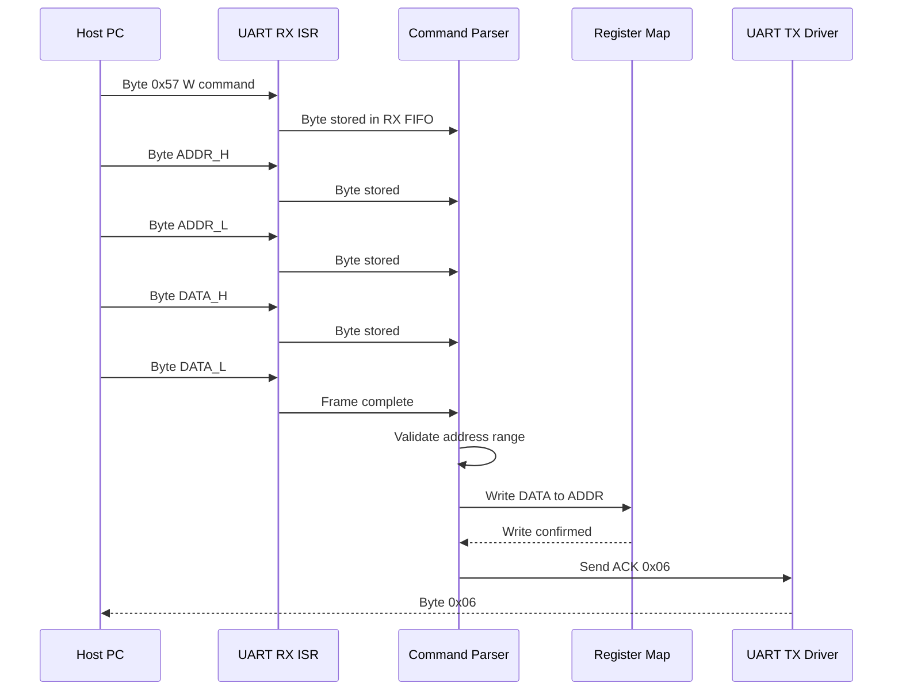
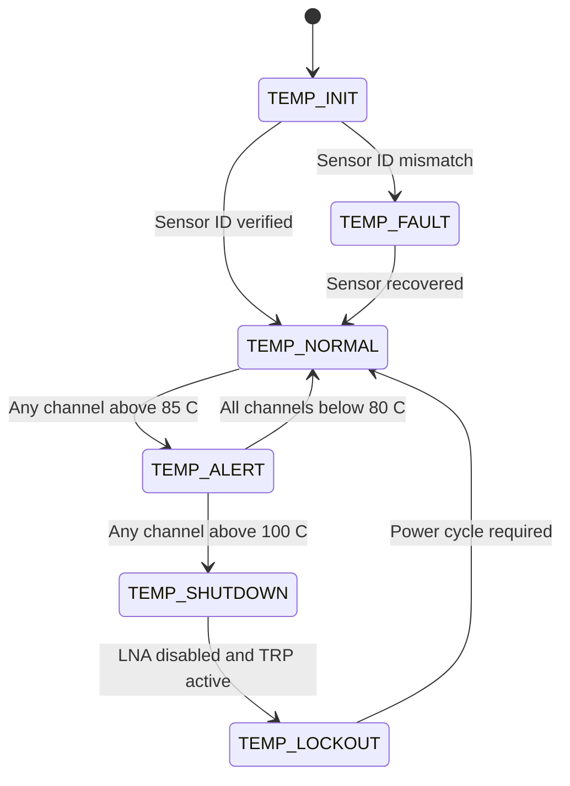
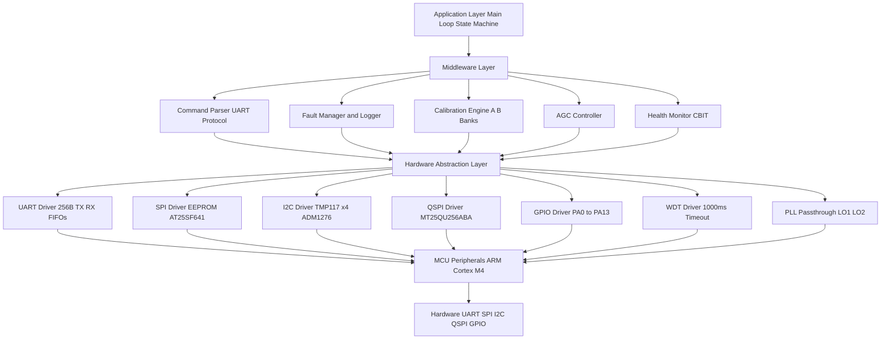
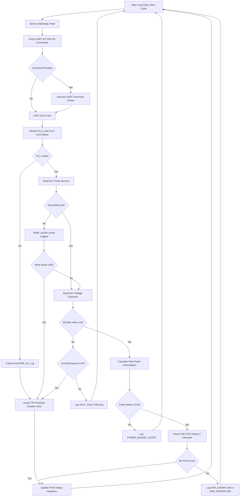

# Software Requirements Specification (SRS)

## Document Control
| Version | Date | Author | Changes |
|---------|------|--------|---------|
| 1.0 | 26 April 2026 | Systems Engineering Team | Initial Release |

---

# 1. Introduction

## 1.1 Purpose
This Software Requirements Specification (SRS) defines the complete set of Level 3 software requirements for the **rx band** system—a 4-channel 18-40 GHz Double-IF Superheterodyne Radar Receiver. This document specifies the behavior, interfaces, performance criteria, and design constraints for the firmware executing on the embedded microcontroller subsystem that manages the Xilinx Kintex-7 (XC7K355T) FPGA, power management ICs, temperature sensors, EEPROM calibration storage, configuration Flash, and UART command interface.

This SRS serves as the binding contractual baseline between the systems engineering team, firmware developers, hardware designers, and independent verification and validation (IV&V) testers. Every requirement herein is traceable to the Level 1 Stakeholder Requirements (StRS) and Level 2 System/Hardware Requirements (HRS) defined in project document P2.

## 1.2 Scope

**Product Name:** rx band Radar Receiver Firmware  
**Product Identifier:** RXB-FW-01  
**Target Hardware:** Embedded management MCU + Xilinx Kintex-7 XC7K355T FPGA + 4x LTC2107 ADCs  

The software shall:
- Initialize and configure the Kintex-7 FPGA via SPI/UART command interface
- Manage dual-stage PLL synthesizers for LO1 (RF to IF1) and LO2 (IF1 to IF2) tuning across 18-40 GHz
- Perform continuous 4-channel health monitoring (temperature, voltage rails, current draw)
- Execute the UART register command protocol for host-driven diagnostics, calibration, and control
- Manage YIG preselector tuning commands across the 18-40 GHz band
- Provide VGA/AGC gain control registers for ≥30 dB dynamic range per channel
- Store and load calibration data (gain tables, phase corrections, YIG tuning curves) from EEPROM/Flash
- Implement watchdog-protected real-time fault management and graceful degradation
- Support T/R switching control with sub-1 µs timing via dedicated GPIO/FPGA register

The software will NOT:
- Perform digital downconversion (DDC) or pulse compression—this is handled by FPGA fabric logic
- Implement radar waveform generation or transmit-chain control
- Provide a graphical user interface (GUI)
- Manage Ethernet or fiber-optic data links (outside current scope)

**Benefits:** Enables military-grade phased-coherent radar reception, phase-coherent multi-channel processing, remote host diagnostics, and field-reconfigurable calibration with fully documented MISRA-C:2012 compliant embedded firmware.

## 1.3 Definitions, Acronyms, and Abbreviations

| # | Term | Definition |
|---|------|-----------|
| 1 | SRS | Software Requirements Specification |
| 2 | SDD | Software Design Description |
| 3 | HRS | Hardware Requirements Specification |
| 4 | GLR | Glue Logic Requirements |
| 5 | StRS | Stakeholder Requirements Specification |
| 6 | SyRS | System Requirements Specification |
| 7 | RTOS | Real-Time Operating System |
| 8 | HAL | Hardware Abstraction Layer |
| 9 | BSP | Board Support Package |
| 10 | ISR | Interrupt Service Routine |
| 11 | MISRA | Motor Industry Software Reliability Association |
| 12 | UART | Universal Asynchronous Receiver-Transmitter |
| 13 | SPI | Serial Peripheral Interface |
| 14 | I2C | Inter-Integrated Circuit |
| 15 | GPIO | General-Purpose Input/Output |
| 16 | ADC | Analog-to-Digital Converter |
| 17 | DAC | Digital-to-Analog Converter |
| 18 | DMA | Direct Memory Access |
| 19 | FIFO | First-In, First-Out buffer |
| 20 | NVM | Non-Volatile Memory |
| 21 | CRC | Cyclic Redundancy Check |
| 22 | WDT | Watchdog Timer |
| 23 | PLL | Phase-Locked Loop |
| 24 | MCU | Microcontroller Unit |
| 25 | FPGA | Field-Programmable Gate Array |
| 26 | API | Application Programming Interface |
| 27 | BSS | Board Support Software |
| 28 | RTM | Requirements Traceability Matrix |
| 29 | JTAG | Joint Test Action Group |
| 30 | QSPI | Quad Serial Peripheral Interface |
| 31 | TRP | Transmit-Receive Protection |
| 32 | ConOps | Concept of Operations |
| 33 | ASIL | Automotive Safety Integrity Level |
| 34 | SIL | Safety Integrity Level |
| 35 | IPC | Inter-Process Communication |
| 36 | RPC | Remote Procedure Call |
| 37 | LNA | Low-Noise Amplifier |
| 38 | VGA | Variable Gain Amplifier |
| 39 | AGC | Automatic Gain Control |
| 40 | YIG | Yttrium Iron Garnet (tunable preselector) |
| 41 | LO | Local Oscillator |
| 42 | IF | Intermediate Frequency |
| 43 | DDC | Digital Downconverter |
| 44 | IIP3 | Input Third-Order Intercept Point |
| 45 | NF | Noise Figure |
| 46 | SFDR | Spurious-Free Dynamic Range |
| 47 | MDS | Minimum Detectable Signal |
| 48 | OCXO | Oven-Controlled Crystal Oscillator |
| 49 | LVDS | Low-Voltage Differential Signaling |
| 50 | PRF | Pulse Repetition Frequency |

## 1.4 References

1. IEEE 830-1998: Recommended Practice for Software Requirements Specifications  
2. ISO/IEC/IEEE 29148:2018: Systems and Software Engineering — Life Cycle Processes — Requirements Engineering  
3. IEEE 1016-2009: Software Design Descriptions  
4. MISRA C:2012: Guidelines for the Use of the C Language in Critical Systems (inc. Amendment 1, Amendment 2)  
5. IEC 61508: Functional Safety of Electrical/Electronic/Programmable Electronic Safety-related Systems  
6. MIL-STD-810H: Department of Defense Test Method Standard for Environmental Engineering Considerations  
7. Hardware Requirements Specification (HRS) — rx band project document P2  
8. Glue Logic Requirements (GLR) — rx band project document P6  
9. Xilinx Kintex-7 XC7K355T Datasheet (DS182)  
10. LTC2107-16 16-bit 210 Msps ADC Datasheet — Analog Devices  
11. Project Block Diagram (P1) — rx band system architecture  
12. Netlist Specification (P4) — rx band PCB netlist  

## 1.5 Overview
This document is organized following the IEEE 830-1998 / IEEE 29148:2018 structure. Section 2 provides the overall product perspective, summarizing all software functions and constraints. Section 3 contains the detailed specific requirements: external interfaces (hardware pin-level, software API-level, and UART byte-level communication protocol), functional requirements organized by subsystem (80 individually numbered requirements), performance requirements, and design constraints. Section 4 defines verification and validation criteria. Section 5 provides the full bidirectional Requirements Traceability Matrix (RTM) mapping every software requirement to its hardware/system source. Appendices provide error codes, register maps, state machine diagrams, and architectural diagrams.

---

# 2. Overall Description

## 2.1 Product Perspective

The rx band radar receiver firmware operates as the embedded intelligence layer between the host radar processor and the analog/RF hardware. It runs on a dedicated system management MCU (ARM Cortex-M4 class, 168 MHz) alongside the Kintex-7 FPGA, providing real-time monitoring, control, and diagnostic services.



**Software Stack Layers:**
1. **BSP/HAL Layer** — Direct register access, driver APIs for UART, SPI, I2C, GPIO, WDT  
2. **Middleware Layer** — Command parser, fault manager, calibration engine, sensor polling  
3. **Application Layer** — System state machine, initialization orchestration, host command dispatch  

## 2.2 Product Functions

The software shall provide the following major functions:

1. **System Initialization and Boot Sequence** — Ordered power-on self-test and hardware bring-up
2. **UART Command/Response Handler** — Register read/write protocol per GLR specification
3. **SPI Master Driver** — EEPROM access, FPGA register access, Flash programming
4. **I2C Master Driver** — Temperature sensor and power monitor polling
5. **PLL LO1 Synthesizer Control** — 18-40 GHz LO1 tuning via UART passthrough
6. **PLL LO2 Synthesizer Control** — IF1-to-IF2 LO2 tuning via UART passthrough
7. **YIG Preselector Tuning** — DAC-driven YIG filter center frequency control
8. **VGA/AGC Gain Management** — Per-channel gain register control (30 dB range)
9. **Temperature Monitoring** — Continuous 4-channel temperature read and alert generation
10. **Voltage/Current Monitoring** — Power rail supervision with ±5% tolerance checking
11. **EEPROM Calibration Storage** — Read/write calibration tables with CRC-32 integrity
12. **Flash Configuration Management** — FPGA bitstream and configuration data storage
13. **LED and GPIO Status Control** — Visual status indicators and discrete control lines
14. **Watchdog Timer Management** — Continuous health enforcement with 1000 ms timeout
15. **T/R Protection Switching** — Sub-1 µs transmit/receive mode control
16. **Power-On Self-Test (POST)** — RAM BIST, peripheral loopback, PLL lock verify
17. **Error Logging and Fault Management** — Circular fault log with 64-entry FIFO
18. **Phase Coherence Verification** — LO distribution skew monitoring register access
19. **ADC Data Interface Supervision** — FPGA-side ADC FIFO status monitoring
20. **FPGA Configuration Management** — SelectMAP or JTAG configuration initiation

## 2.3 User Characteristics

| User Role | Description | Interaction Method |
|-----------|-------------|-------------------|
| Firmware Engineer | Primary developer and debugger of embedded software | JTAG/SWD debugger, UART console, IDE |
| Test Engineer | Validates system-level performance against HRS metrics | UART command interface, lab instruments |
| Field Engineer | Performs field diagnostics, calibration updates, fault isolation | UART command interface via ruggedized laptop |
| System Integrator | Integrates receiver into larger radar platform | Host-side UART protocol implementation |

## 2.4 Constraints

1. **C-001** — MISRA-C:2012 compliance mandatory (all directives, required and advisory via deviation)
2. **C-002** — Real-time response: UART command processing within 500 µs, ISR latency ≤ 10 µs
3. **C-003** — Memory budget: 512 KB Flash (MCU), 128 KB SRAM (MCU); no external RAM available
4. **C-004** — MCU clock: 168 MHz maximum (ARM Cortex-M4)
5. **C-005** — Bare-metal execution model (no RTOS); cooperative scheduling with 1 ms tick
6. **C-006** — Coding language: C99 (ISO/IEC 9899:1999); no C++ features
7. **C-007** — Toolchain: GCC ARM Embedded 10.3 or IAR EWARM 9.20
8. **C-008** — Hardware revision compatibility: PCB Rev A (initial release); registers defined in GLR P6 v1.0
9. **C-009** — Operating temperature: -55°C to +125°C (all timing derated for extreme cold)
10. **C-010** — No dynamic memory allocation (malloc/free/new/delete prohibited)
11. **C-011** — Supply voltage: 15 V nominal input; MCU operates at 3.3 V via onboard LDO
12. **C-012** — Power budget: total system ≤ 25 W; MCU subsystem ≤ 500 mW

## 2.5 Assumptions and Dependencies

1. **A-001** — Power sequencing is complete (1.2 V, 1.8 V, 3.3 V rails stable) before MCU reset is de-asserted; power-on reset controller handles this in hardware
2. **A-002** — OCXO reference is stable and within ±0.1 ppm before LO synthesizer commands are issued (OCXO warmup ≤ 60 seconds)
3. **A-003** — FPGA configuration bitstream is pre-loaded from Flash via SelectMAP by hardware before MCU application code runs; MCU verifies FPGA DONE pin
4. **A-004** — All I2C bus pull-ups are provided on the PCB (4.7 kΩ to 3.3 V)
5. **A-005** — Host UART connection uses 3.3 V LVTTL levels; no level shifting required
6. **A-006** — LO synthesizer modules (PLL1, PLL2) are autonomous subsystems with their own UART command interfaces; MCU acts as passthrough
7. **A-007** — YIG driver circuit accepts 0-5 V analog tuning voltage from DAC; linearity assumed per datasheet
8. **A-008** — ADC clock distribution is handled by FPGA fabric; MCU only monitors ADC status registers
9. **A-009** — Default EEPROM calibration data is programmed at manufacturing; software uses CRC to validate
10. **A-010** — Operating environment conforms to MIL-STD-810H; software is not responsible for environmental control

---

# 3. Specific Requirements

## 3.1 External Interface Requirements

### 3.1.1 Hardware Interfaces

#### 3.1.1.1 UART Interface (Host Command Port)

The host UART interface operates at 115200 baud (default), 8 data bits, no parity, 1 stop bit (8N1). The MCU UART peripheral connects directly to the host radar processor via 3.3 V LVTTL with onboard ESD protection.

**Timing Parameters:**
- Baud rate accuracy: ±2% (derived from MCU PLL clock)
- Frame format: 8N1
- Maximum inter-byte gap before parser reset: 50 ms
- Host response timeout: 10 ms

```c
/**
 * @brief UART peripheral register map (MCU internal)
 * Base address: 0x4000_3000 (UART2)
 */
typedef struct {
    volatile uint32_t SR;       /* 0x00: Status Register            */
    volatile uint32_t DR;       /* 0x04: Data Register              */
    volatile uint32_t BRR;      /* 0x08: Baud Rate Register         */
    volatile uint32_t CR1;      /* 0x0C: Control Register 1         */
    volatile uint32_t CR2;      /* 0x10: Control Register 2         */
    volatile uint32_t CR3;      /* 0x14: Control Register 3         */
} UART_RegMap_t;

#define UART_BASE_HOST      ((UART_RegMap_t *)0x40003000U)
#define UART_TX_FIFO_SIZE   (256U)
#define UART_RX_FIFO_SIZE   (256U)

/**
 * @brief Initialize host UART interface
 * @param baud_rate Target baud rate (supported: 9600, 19200, 38400, 57600, 115200, 230400, 460800, 921600)
 * @retval 0 Success
 * @retval ERR_PARAM Invalid baud rate
 * @retval ERR_TIMEOUT Hardware timeout during init
 */
int32_t UART_Init(uint32_t baud_rate);

/**
 * @brief Write single FPGA register via UART command protocol
 * @param addr 16-bit register address (0x0000 - 0xFFFF)
 * @param data 16-bit data value
 * @retval 0 Success (ACK received)
 * @retval ERR_TIMEOUT No ACK within 10 ms
 * @retval ERR_COMM NAK received
 */
int32_t UART_WriteReg(uint16_t addr, uint16_t data);

/**
 * @brief Read single FPGA register via UART command protocol
 * @param addr 16-bit register address (bit15 ignored, set internally)
 * @param data Pointer to store read data
 * @retval 0 Success
 * @retval ERR_TIMEOUT No response within 10 ms
 * @retval ERR_COMM Invalid response frame
 */
int32_t UART_ReadReg(uint16_t addr, uint16_t *data);

/**
 * @brief Bulk write up to 64 consecutive FPGA registers
 * @param start_addr Starting register address
 * @param data Pointer to data array
 * @param count Number of registers (1-64)
 * @retval 0 Success
 * @retval ERR_PARAM count > 64
 * @retval ERR_TIMEOUT No ACK within 50 ms
 */
int32_t UART_BulkWrite(uint16_t start_addr, const uint16_t *data, uint8_t count);

/**
 * @brief Bulk read up to 64 consecutive FPGA registers
 * @param start_addr Starting register address
 * @param buf Pointer to output buffer
 * @param count Number of registers (1-64)
 * @retval 0 Success
 * @retval ERR_PARAM count > 64 or buf is NULL
 * @retval ERR_TIMEOUT Incomplete response within 50 ms
 */
int32_t UART_BulkRead(uint16_t start_addr, uint16_t *buf, uint8_t count);
```

#### 3.1.1.2 SPI Interface (EEPROM)

SPI1 connects to the calibration EEPROM (AT25SF641, 64 Mbit, 85 MHz max clock). Used for calibration data storage: gain tables, phase correction coefficients, YIG tuning curves, and manufacturing test data.

**Timing Parameters:**
- SPI Mode 0 (CPOL=0, CPHA=0)
- Maximum clock: 20 MHz (MCU SPI1 limited, conservative margin)
- CS active low, active between address and data phases
- Write enable required before each write operation

```c
/**
 * @brief SPI1 peripheral register map (MCU internal)
 * Base address: 0x4001_3000
 */
typedef struct {
    volatile uint32_t CR1;      /* 0x00: Control Register 1         */
    volatile uint32_t CR2;      /* 0x04: Control Register 2         */
    volatile uint32_t SR;       /* 0x08: Status Register            */
    volatile uint32_t DR;       /* 0x0C: Data Register              */
    volatile uint32_t CRCPR;    /* 0x10: CRC Polynomial Register    */
    volatile uint32_t RXCRCR;   /* 0x14: RX CRC Register            */
    volatile uint32_t TXCRCR;   /* 0x18: TX CRC Register            */
} SPI_RegMap_t;

#define SPI1_BASE           ((SPI_RegMap_t *)0x40013000U)
#define EEPROM_PAGE_SIZE    (256U)   /* bytes per page */
#define EEPROM_SECTOR_SIZE  (4096U)  /* bytes per sector */
#define EEPROM_TOTAL_SIZE   (8388608U) /* 64 Mbit = 8 MB */

/**
 * @brief Initialize SPI1 bus for EEPROM access
 * @param clock_hz SPI clock frequency in Hz (max 20000000)
 * @param mode SPI mode (0-3); EEPROM requires mode 0
 * @retval 0 Success
 */
int32_t SPI_Init(uint32_t clock_hz, uint8_t mode);

/**
 * @brief Read single byte from EEPROM
 * @param addr 24-bit byte address
 * @param data Pointer to store read byte
 * @retval 0 Success
 * @retval ERR_TIMEOUT SPI bus timeout
 */
int32_t EEPROM_ReadByte(uint32_t addr, uint8_t *data);

/**
 * @brief Write single byte to EEPROM (page-aligned internally)
 * @param addr 24-bit byte address
 * @param data Byte to write
 * @retval 0 Success
 * @retval ERR_EEPROM Write enable or program failure
 */
int32_t EEPROM_WriteByte(uint32_t addr, uint8_t data);

/**
 * @brief Read contiguous block from EEPROM
 * @param addr Starting byte address
 * @param buf Output buffer
 * @param len Number of bytes to read (max 65536)
 * @retval 0 Success
 * @retval ERR_PARAM len is 0 or buf is NULL
 */
int32_t EEPROM_ReadBlock(uint32_t addr, uint8_t *buf, uint32_t len);

/**
 * @brief Write contiguous block to EEPROM (handles page boundaries)
 * @param addr Starting byte address
 * @param data Source data buffer
 * @param len Number of bytes to write
 * @retval 0 Success
 * @retval ERR_EEPROM Program failure
 * @retval ERR_TIMEOUT Busy timeout
 */
int32_t EEPROM_WriteBlock(uint32_t addr, const uint8_t *data, uint32_t len);

/**
 * @brief Erase one 4 KB sector of EEPROM
 * @param addr Address within the sector to erase
 * @retval 0 Success
 * @retval ERR_EEPROM Erase failure
 */
int32_t EEPROM_EraseSector(uint32_t addr);

/**
 * @brief Read EEPROM manufacturer ID and device ID
 * @param mfr_id Pointer to store manufacturer ID
 * @param dev_id Pointer to store device ID
 * @retval 0 Success
 */
int32_t EEPROM_ReadID(uint8_t *mfr_id, uint16_t *dev_id);
```

#### 3.1.1.3 QSPI Interface (Configuration Flash)

QSPI connects to MT25QU256ABA 256 Mbit Flash for FPGA configuration bitstream storage and MCU application firmware update staging.

```c
/**
 * @brief QSPI register map (MCU internal)
 * Base address: 0x4000_C000 (QUADSPI)
 */
typedef struct {
    volatile uint32_t CR;       /* 0x00: Control Register           */
    volatile uint32_t DCR;      /* 0x04: Device Configuration       */
    volatile uint32_t SR;       /* 0x08: Status Register            */
    volatile uint32_t FCR;      /* 0x0C: Flag Clear Register        */
    volatile uint32_t DLR;      /* 0x10: Data Length Register       */
    volatile uint32_t CCR;      /* 0x14: Communication Config       */
    volatile uint32_t AR;       /* 0x18: Address Register           */
    volatile uint32_t ABR;      /* 0x1C: Alternate Bytes Register   */
    volatile uint32_t DR;       /* 0x20: Data Register              */
    volatile uint32_t PSMKR;    /* 0x24: Polling Status Mask        */
    volatile uint32_t PSMAR;    /* 0x28: Polling Status Match       */
    volatile uint32_t PIR;      /* 0x2C: Polling Interval           */
    volatile uint32_t LPTR;     /* 0x30: Low Power Timeout          */
} QSPI_RegMap_t;

#define QSPI_BASE           ((QSPI_RegMap_t *)0x4000C000U)
#define FLASH_SECTOR_SIZE   (65536U)  /* 64 KB uniform sectors */
#define FLASH_PAGE_SIZE     (256U)    /* bytes per page */
#define FLASH_TOTAL_SIZE    (33554432U) /* 256 Mbit = 32 MB */

/**
 * @brief Initialize QSPI interface in Quad-SPI mode
 * @param clock_hz QSPI clock in Hz (max 80000000)
 * @retval 0 Success
 */
int32_t Flash_Init(uint32_t clock_hz);

/**
 * @brief Read sector from Flash with CRC-32 verification
 * @param addr Sector-aligned address (must be multiple of FLASH_SECTOR_SIZE)
 * @param buf Output buffer (minimum FLASH_SECTOR_SIZE bytes)
 * @param len Number of bytes to read
 * @retval 0 Success
 * @retval ERR_CHECKSUM CRC mismatch on read data
 */
int32_t Flash_ReadSector(uint32_t addr, uint8_t *buf, uint32_t len);

/**
 * @brief Write sector to Flash with CRC-32 appended
 * @param addr Sector-aligned address
 * @param buf Source data buffer
 * @param len Number of bytes to write (excluding CRC)
 * @retval 0 Success
 * @retval ERR_FLASH_WRITE Program failure
 */
int32_t Flash_WriteSector(uint32_t addr, const uint8_t *buf, uint32_t len);

/**
 * @brief Erase one 64 KB sector
 * @param addr Address within sector to erase
 * @retval 0 Success
 * @retval ERR_FLASH_ERASE Erase failure or timeout
 */
int32_t Flash_EraseSector(uint32_t addr);

/**
 * @brief Compute and verify CRC-32 of Flash region
 * @param addr Starting address
 * @param len Length in bytes
 * @param expected_crc Expected CRC-32 value
 * @retval 0 CRC match
 * @retval ERR_CHECKSUM CRC mismatch
 */
int32_t Flash_VerifyCRC(uint32_t addr, uint32_t len, uint32_t expected_crc);
```

#### 3.1.1.4 I2C Interface (Temperature Sensors and Power Monitor)

I2C1 bus connects to 4x TMP117 temperature sensors (one per RF channel, addresses 0x48-0x4B) and 1x ADM1276 power monitor (address 0x10). Operating at 400 kHz Fast Mode.

```c
/**
 * @brief I2C1 register map (MCU internal)
 * Base address: 0x4000_5400
 */
typedef struct {
    volatile uint32_t CR1;      /* 0x00: Control Register 1         */
    volatile uint32_t CR2;      /* 0x04: Control Register 2         */
    volatile uint32_t OAR1;     /* 0x08: Own Address Register 1     */
    volatile uint32_t OAR2;     /* 0x0C: Own Address Register 2     */
    volatile uint32_t TIMINGR;  /* 0x10: Timing Register            */
    volatile uint32_t TIMEOUTR; /* 0x14: Timeout Register           */
    volatile uint32_t ISR;      /* 0x18: Interrupt and Status       */
    volatile uint32_t ICR;      /* 0x1C: Interrupt Clear            */
    volatile uint32_t PECR;     /* 0x20: PEC Register               */
    volatile uint32_t RXDR;     /* 0x24: Receive Data Register      */
    volatile uint32_t TXDR;     /* 0x28: Transmit Data Register     */
} I2C_RegMap_t;

#define I2C1_BASE               ((I2C_RegMap_t *)0x40005400U)
#define TEMP_SENSOR_COUNT       (4U)
#define TEMP_SENSOR_BASE_ADDR   (0x48U)

/**
 * @brief Initialize I2C1 bus
 * @param clock_hz I2C clock in Hz (100000 or 400000)
 * @retval 0 Success
 */
int32_t I2C_Init(uint32_t clock_hz);

/**
 * @brief Read 8-bit register from I2C device
 * @param dev_addr 7-bit device address (right-aligned)
 * @param reg 8-bit register address
 * @param data Pointer to store read value
 * @retval 0 Success
 * @retval ERR_TIMEOUT No ACK from device
 */
int32_t I2C_ReadReg8(uint8_t dev_addr, uint8_t reg, uint8_t *data);

/**
 * @brief Write 8-bit register to I2C device
 * @param dev_addr 7-bit device address
 * @param reg 8-bit register address
 * @param data Data byte to write
 * @retval 0 Success
 */
int32_t I2C_WriteReg8(uint8_t dev_addr, uint8_t reg, uint8_t data);

/**
 * @brief Read 16-bit register from I2C device (big-endian)
 * @param dev_addr 7-bit device address
 * @param reg 8-bit register address
 * @param data Pointer to store 16-bit value
 * @retval 0 Success
 */
int32_t I2C_ReadReg16(uint8_t dev_addr, uint8_t reg, uint16_t *data);

/**
 * @brief Read temperature from a specific TMP117 sensor
 * @param sensor_id Sensor index (0-3 for channels 1-4)
 * @param temp_degC Pointer to store temperature in degrees Celsius
 * @retval 0 Success
 * @retval ERR_PARAM sensor_id >= 4
 * @retval ERR_COMM I2C communication failure
 */
int32_t TempSensor_ReadTemp(uint8_t sensor_id, float *temp_degC);

/**
 * @brief Read voltage from ADM1276 power monitor
 * @param channel Voltage channel index (0=main 15V, 1=3.3V, 2=1.8V, 3=1.2V, 4=5V)
 * @param voltage_V Pointer to store voltage in Volts
 * @retval 0 Success
 * @retval ERR_PARAM Invalid channel
 */
int32_t PowerMon_ReadVoltage(uint8_t channel, float *voltage_V);

/**
 * @brief Read current from ADM1276 power monitor
 * @param channel Current channel index (0=main 15V input)
 * @param current_A Pointer to store current in Amperes
 * @retval 0 Success
 */
int32_t PowerMon_ReadCurrent(uint8_t channel, float *current_A);
```

#### 3.1.1.5 GPIO Interface (Control and Status Lines)

```c
/**
 * @brief GPIO register map (MCU GPIOA, base 0x4002_0000)
 */
typedef struct {
    volatile uint32_t MODER;    /* 0x00: Port Mode Register         */
    volatile uint32_t OTYPER;   /* 0x04: Output Type Register       */
    volatile uint32_t OSPEEDR;  /* 0x08: Output Speed Register      */
    volatile uint32_t PUPDR;    /* 0x0C: Pull-Up/Pull-Down          */
    volatile uint32_t IDR;      /* 0x10: Input Data Register        */
    volatile uint32_t ODR;      /* 0x14: Output Data Register       */
    volatile uint32_t BSRR;     /* 0x18: Bit Set/Reset Register     */
    volatile uint32_t LCKR;     /* 0x1C: Configuration Lock         */
    volatile uint32_t AFRL;     /* 0x20: Alternate Function Low     */
    volatile uint32_t AFRH;     /* 0x24: Alternate Function High    */
} GPIO_RegMap_t;

/* GPIO pin assignments for rx band system */
#define GPIO_TR_CONTROL        (0U)    /* PA0: T/R switch control */
#define GPIO_LNA_EN_CH1        (1U)    /* PA1: LNA enable channel 1 */
#define GPIO_LNA_EN_CH2        (2U)    /* PA2: LNA enable channel 2 */
#define GPIO_LNA_EN_CH3        (3U)    /* PA3: LNA enable channel 3 */
#define GPIO_LNA_EN_CH4        (4U)    /* PA4: LNA enable channel 4 */
#define GPIO_FPGA_DONE         (5U)    /* PA5: FPGA configuration done */
#define GPIO_FPGA_INIT         (6U)    /* PA6: FPGA initialization status */
#define GPIO_YIG_DAC_CS        (7U)    /* PA7: YIG DAC chip select */
#define GPIO_LED_STATUS        (8U)    /* PA8: Status LED */
#define GPIO_LED_FAULT         (9U)    /* PA9: Fault LED */
#define GPIO_PLL1_CS           (10U)   /* PA10: LO1 PLL chip select */
#define GPIO_PLL2_CS           (11U)   /* PA11: LO2 PLL chip select */
#define GPIO_LIMITER_EN        (12U)   /* PA12: Limiter enable */
#define GPIO_EXT_TRIG          (13U)   /* PA13: External trigger input */

/**
 * @brief Initialize GPIO pins with specified configuration
 * @param port GPIO port base address
 * @param pin Pin number (0-15)
 * @param mode Pin mode (0=input, 1=output, 2=alternate, 3=analog)
 * @param pull Pull configuration (0=none, 1=up, 2=down)
 * @retval 0 Success
 */
int32_t GPIO_Init(GPIO_RegMap_t *port, uint8_t pin, uint8_t mode, uint8_t pull);

/**
 * @brief Write GPIO pin state
 * @param port GPIO port base address
 * @param pin Pin number (0-15)
 * @param state 0=low, 1=high
 * @retval 0 Success
 */
int32_t GPIO_WritePin(GPIO_RegMap_t *port, uint8_t pin, uint8_t state);

/**
 * @brief Read GPIO pin state
 * @param port GPIO port base address
 * @param pin Pin number (0-15)
 * @retval 0 Pin low, 1 Pin high
 */
uint8_t GPIO_ReadPin(GPIO_RegMap_t *port, uint8_t pin);
```

### 3.1.2 Software Interfaces

#### 3.1.2.1 MCU Peripherals
The firmware interfaces with the following MCU internal peripherals via memory-mapped registers:
- **SysTick Timer** — 1 ms system tick for cooperative scheduling
- **NVIC** — Nested Vectored Interrupt Controller for ISR prioritization
- **DMA Controller** — For SPI/I2C memory-to-peripheral transfers
- **CRC Unit** — Hardware CRC-32 calculation (polynomial 0x04C11DB7)
- **Flash Controller** — MCU internal Flash write/erase for firmware updates
- **RCC** — Reset and Clock Control for peripheral clock gating

#### 3.1.2.2 Standard C Library
Restricted subset of C99 standard library:
- Permitted: `<stdint.h>`, `<stdbool.h>`, `<string.h>` (memcpy, memset, memcmp only)
- Prohibited: `<stdio.h>` (no printf/sprintf), `<stdlib.h>` (no malloc/free)

#### 3.1.2.3 Logging Framework
Software-only logging via circular RAM buffer; output flushed to UART on demand:
```c
#define LOG_BUF_SIZE     (4096U)
#define LOG_ENTRY_MAX    (128U)

typedef struct {
    uint32_t timestamp_ms;
    uint8_t  severity;       /* 0=INFO, 1=WARN, 2=ERROR, 3=CRITICAL */
    uint8_t  module_id;      /* Module identifier */
    uint16_t event_id;       /* Event code */
    uint32_t data;           /* Event-specific data */
} LogEntry_t;

int32_t Log_Init(void);
int32_t Log_Write(uint8_t severity, uint8_t module_id, uint16_t event_id, uint32_t data);
int32_t Log_Read(uint16_t index, LogEntry_t *entry);
int32_t Log_FlushToUART(void);
```

### 3.1.3 Communication Interfaces

**UART Register Command Protocol — Byte-Level Frame Format**

This protocol governs all host-to-receiver register transactions. The MCU acts as the protocol endpoint.

| Command | CMD Byte | Frame Structure (TX from Host) | Response (RX from MCU) |
|---------|----------|-------------------------------|----------------------|
| Single Write | 0x57 (W) | [0x57][ADDR_H][ADDR_L][DATA_H][DATA_L] | [0x06] ACK |
| Single Read | 0x52 (R) | [0x52][ADDR_H or 0x80][ADDR_L] | [DATA_H][DATA_L] |
| Bulk Write | 0x42 (B) | [0x42][ADDR_H][ADDR_L][N][D0_H][D0_L]...[Dn_H][Dn_L] | [0x06] ACK |
| Bulk Read | 0x62 (b) | [0x62][ADDR_H or 0x80][ADDR_L][N] | [D0_H][D0_L]...[Dn_H][Dn_L] |
| Error NAK | 0x15 | Sent by MCU on invalid command, address out of range, or protocol error | — |
| Diagnostic Dump | 0xD0 | [0xD0][SUBCMD] | Variable length per SUBCMD |

**Protocol Rules:**
- Address space: 16-bit (0x0000–0xFFFF); read addresses have bit15 set (OR 0x8000)
- Maximum bulk count N: 64 registers per transaction
- Timeout: host must complete frame transmission within 50 ms inter-byte gap; MCU resets parser on timeout
- ACK byte: 0x06 (ASCII ACK)
- NAK byte: 0x15 (ASCII NAK)
- All multi-byte values are big-endian (MSB first)
- No CRC in baseline protocol; CRC-16 CCITT optional (controlled by feature flag in EEPROM config at address 0x0010)
- Supported baud rates: 9600, 19200, 38400, 57600, 115200 (default), 230400, 460800, 921600

**Diagnostic Subcommands (0xD0 prefix):**

| SUBCMD | Name | Response Length | Description |
|--------|------|-----------------|-------------|
| 0x01 | Fault Log Dump | 64 * 8 bytes | All 64 fault log entries |
| 0x02 | Firmware Version | 8 bytes | Version string (ASCII) |
| 0x03 | Temperature All | 8 bytes | 4x int16_t (0.01°C units) |
| 0x04 | Voltage All | 20 bytes | 5x uint32_t (µV units) |
| 0x05 | POST Results | 4 bytes | POST bitmask result |
| 0x06 | Uptime Counter | 4 bytes | uint32_t seconds since boot |
| 0x07 | Calibration CRC | 4 bytes | CRC-32 of active calibration data |

---

## 3.2 Functional Requirements

### 3.2.1 System Initialization (REQ-SW-001 to REQ-SW-010)

**REQ-SW-001**: The software SHALL complete power-on self-test (POST) and enter the main operational loop within 500 ms of MCU reset de-assertion.
- **Source**: REQ-HW-014 (T/R switching < 1 µs requires fast readiness); system availability requirement
- **Priority**: [M] Mandatory
- **Verification**: [T] Test — measure time from reset release to STATUS LED solid-on using oscilloscope

**REQ-SW-002**: The software SHALL read the BOARD_ID register (address 0x0000) and verify it matches the expected value 0xA4B1 on every startup; if the value does not match, the software SHALL halt initialization and illuminate the FAULT LED.
- **Source**: GLR §3.1 Board Identification; REQ-HW-015 (4-channel architecture identification)
- **Priority**: [M] Mandatory
- **Verification**: [T] Test — corrupt BOARD_ID register and verify fault response

**REQ-SW-003**: The software SHALL configure the MCU internal PLL to achieve a 168 MHz system clock within 10 ms of reset de-assertion.
- **Source**: Constraint C-004 (168 MHz max MCU clock); system timing requirements
- **Priority**: [M] Mandatory
- **Verification**: [A] Analysis — clock configuration register values verified by code review; [T] Test — measure SYSCLK via MCO pin

**REQ-SW-004**: The software SHALL poll the FPGA DONE pin (GPIO_PA5) with a 2000 ms timeout after power-on; if DONE does not assert within the timeout, the software SHALL log a CRITICAL fault (ERR_POST_FAIL) and illuminate the FAULT LED, but SHALL continue to allow host UART diagnostics.
- **Source**: Assumption A-003 (FPGA config from Flash); REQ-HW-018 (FPGA digital processing)
- **Priority**: [M] Mandatory
- **Verification**: [T] Test — hold FPGA INIT_B low and verify fault response

**REQ-SW-005**: The software SHALL initialize UART, SPI1, I2C1, QSPI, and GPIO peripherals in a defined order (GPIO first, then I2C, then SPI, then QSPI, then UART) before entering the main loop.
- **Source**: BSP architecture; system bring-up sequence
- **Priority**: [M] Mandatory
- **Verification**: [I] Inspection — review initialization sequence in source code

**REQ-SW-006**: The software SHALL load calibration data from EEPROM (starting at address 0x000000) into RAM and verify the CRC-32 checksum within 100 ms; if CRC fails, the software SHALL set a degraded-mode flag and use default calibration values from const ROM.
- **Source**: REQ-HW-004 (gain accuracy); REQ-HW-013 (phase coherence requires calibration)
- **Priority**: [M] Mandatory
- **Verification**: [T] Test — corrupt EEPROM CRC and verify degraded-mode fallback

**REQ-SW-007**: The software SHALL initialize the watchdog timer with a 1000 ms timeout before entering the main operational loop and SHALL service (pet) the watchdog every 500 ms (±50 ms) during normal operation.
- **Source**: Reliability requirement; fault tolerance
- **Priority**: [M] Mandatory
- **Verification**: [T] Test — stall main loop and verify watchdog reset occurs within 1100 ms

**REQ-SW-008**: The software SHALL transmit the firmware version string (format: "RXB-FW v1.0.0\n") to the UART host at 115200 baud upon successful completion of initialization.
- **Source**: Diagnostics requirement; field serviceability
- **Priority**: [D] Desirable
- **Verification**: [T] Test — capture UART output on boot and verify version string

**REQ-SW-009**: The software SHALL perform a RAM BIST (March C- algorithm) on the 128 KB SRAM during POST, completing within 50 ms at 168 MHz; any failure SHALL be logged as ERR_POST_FAIL.
- **Source**: Reliability; IEC 61508 RAM testing requirement
- **Priority**: [M] Mandatory
- **Verification**: [T] Test — inject RAM fault via debugger and verify detection

**REQ-SW-010**: The software SHALL set the STATUS LED to blinking at 1 Hz (50% duty cycle) during initialization and transition to solid-on upon entering the main operational loop.
- **Source**: Operator visibility requirement
- **Priority**: [D] Desirable
- **Verification**: [D] Demonstration — visual observation of LED behavior

### 3.2.2 UART Communication Driver (REQ-SW-011 to REQ-SW-020)

**REQ-SW-011**: The UART driver SHALL support all specified baud rates: 9600, 19200, 38400, 57600, 115200 (default), 230400, 460800, and 921600 baud.
- **Source**: GLR §5.1 UART baud rate specification
- **Priority**: [M] Mandatory
- **Verification**: [T] Test — verify communication at each baud rate

**REQ-SW-012**: The UART driver SHALL implement the Single Write command (CMD=0x57) accepting a 5-byte frame [0x57][ADDR_H][ADDR_L][DATA_H][DATA_L] and responding with ACK (0x06) within 500 µs of frame receipt.
- **Source**: GLR §5.2 Single Write frame format
- **Priority**: [M] Mandatory
- **Verification**: [T] Test — measure response time with logic analyzer

**REQ-SW-013**: The UART driver SHALL implement the Single Read command (CMD=0x52) accepting a 3-byte frame [0x52][ADDR_H or 0x80][ADDR_L] and responding with [DATA_H][DATA_L] within 500 µs.
- **Source**: GLR §5.3 Single Read frame format
- **Priority**: [M] Mandatory
- **Verification**: [T] Test — read a known register and verify data

**REQ-SW-014**: The UART driver SHALL implement the Bulk Write command (CMD=0x42) for 3 to 131 bytes total frame length, supporting N=1 to 64 register writes in a single transaction.
- **Source**: GLR §5.4 Bulk Write frame format
- **Priority**: [M] Mandatory
- **Verification**: [T] Test — bulk write 64 registers and verify via bulk read

**REQ-SW-015**: The UART driver SHALL implement the Bulk Read command (CMD=0x62) accepting a 4-byte frame [0x62][ADDR_H or 0x80][ADDR_L][N] and responding with N*2 data bytes for N=1 to 64.
- **Source**: GLR §5.5 Bulk Read frame format
- **Priority**: [M] Mandatory
- **Verification**: [T] Test — bulk read 64 registers and verify data integrity

**REQ-SW-016**: The UART driver SHALL respond to any invalid command byte (any byte other than 0x57, 0x52, 0x42, 0x62, 0xD0) with NAK (0x15) within 100 µs.
- **Source**: GLR §5.6 Error handling specification
- **Priority**: [M] Mandatory
- **Verification**: [T] Test — send invalid command byte and verify NAK response

**REQ-SW-017**: The UART driver SHALL implement a TX ring buffer of 256 bytes and SHALL NOT block the caller when the buffer is not full.
- **Source**: Performance requirement; non-blocking I/O
- **Priority**: [M] Mandatory
- **Verification**: [I] Inspection — verify buffer size in source; [T] Test — burst write test

**REQ-SW-018**: The UART driver SHALL implement an RX ring buffer of 256 bytes with interrupt-driven reception.
- **Source**: Performance requirement; non-blocking I/O
- **Priority**: [M] Mandatory
- **Verification**: [I] Inspection — verify buffer size in source; [T] Test — burst read test

**REQ-SW-019**: The UART driver SHALL detect and clear framing error flags (FE, ORE, NE) from the UART status register within the UART ISR and SHALL log the occurrence as ERR_COMM.
- **Source**: Reliability requirement; fault detection
- **Priority**: [M] Mandatory
- **Verification**: [T] Test — inject framing error via incorrect baud rate and verify detection

**REQ-SW-020**: The UART driver SHALL reset the command parser state machine if an inter-byte gap exceeding 50 ms is detected during frame reception, discarding any partial frame data.
- **Source**: GLR §5.7 Timeout specification
- **Priority**: [M] Mandatory
- **Verification**: [T] Test — send partial frame, wait 60 ms, send valid frame, verify correct response

### 3.2.3 Temperature Monitoring (REQ-SW-021 to REQ-SW-030)

**REQ-SW-021**: The software SHALL read temperature from all 4 TMP117 sensors (I2C addresses 0x48-0x4B) every 2000 ms (±100 ms) during normal operation.
- **Source**: REQ-HW-015 (4-channel monitoring); component thermal management
- **Priority**: [M] Mandatory
- **Verification**: [T] Test — verify polling interval with logic analyzer on I2C bus

**REQ-SW-022**: The software SHALL generate a TEMP_ALERT event and log it when any channel temperature exceeds +85°C.
- **Source**: GaN LNA and component thermal limits; derating requirement
- **Priority**: [M] Mandatory
- **Verification**: [T] Test — heat sensor and verify alert generation

**REQ-SW-023**: The software SHALL update the TEMPERATURE_STATUS FPGA register (address 0x0200) with the latest 4-channel temperature data within 100 ms of each sensor read cycle.
- **Source**: Host visibility requirement
- **Priority**: [D] Desirable
- **Verification**: [T] Test — read register via UART and compare with direct sensor reading

**REQ-SW-024**: The software SHALL disable all LNA enables (GPIO PA1-PA4 LOW) and assert TRP control to protection mode when any channel temperature exceeds +100°C.
- **Source**: Component damage prevention; GaN LNA maximum junction temperature 150°C with 50°C margin
- **Priority**: [M] Mandatory
- **Verification**: [T] Test — heat one channel to 101°C and verify LNA disable

**REQ-SW-025**: The software SHALL re-enable LNA operation (restoring previous LNA enable state) when the triggering channel temperature drops below +80°C (5°C hysteresis below the +85°C alert threshold, 20°C below shutdown threshold).
- **Source**: Thermal management with hysteresis; prevents oscillation
- **Priority**: [M] Mandatory
- **Verification**: [T] Test — verify recovery behavior through a heat-cool cycle

**REQ-SW-026**: The software SHALL read the TMP117 configuration register on startup for each sensor and verify the device ID; if any sensor does not respond or returns an incorrect ID, the software SHALL log ERR_HARDWARE for that channel and continue operation with remaining sensors.
- **Source**: Graceful degradation requirement; REQ-HW-015
- **Priority**: [M] Mandatory
- **Verification**: [T] Test — disconnect one sensor and verify continued operation

**REQ-SW-027**: The software SHALL report temperature values in 0.01°C resolution (int16_t) in the TEMPERATURE_STATUS register, with a valid range of -55.00°C to +125.00°C (-5500 to +12500).
- **Source**: TMP117 resolution; MIL-STD-810H operating range
- **Priority**: [M] Mandatory
- **Verification**: [T] Test — verify register values match calculated values

**REQ-SW-028**: The software SHALL detect I2C bus lockup (NACK on 3 consecutive attempts to the same sensor) and attempt bus recovery (9 clock pulses on SCL) before reporting sensor failure.
- **Source**: I2C reliability; bus recovery per I2C specification
- **Priority**: [M] Mandatory
- **Verification**: [T] Test — force I2C bus lockup and verify recovery

**REQ-SW-029**: The software SHALL maintain a per-channel temperature high-water mark (maximum temperature since boot) readable via UART register addresses 0x0210-0x0213.
- **Source**: Field diagnostics; maintenance prognostics
- **Priority**: [D] Desirable
- **Verification**: [T] Test — cycle temperature and verify high-water mark updates

**REQ-SW-030**: The software SHALL expose the thermal shutdown state via the SYSTEM_STATUS register (address 0x0050) bit[3:0] where each bit corresponds to a channel thermal shutdown condition.
- **Source**: Host visibility; REQ-HW-015
- **Priority**: [M] Mandatory
- **Verification**: [T] Test — verify bit assertion on thermal shutdown

### 3.2.4 Flash Management (REQ-SW-031 to REQ-SW-040)

**REQ-SW-031**: The Flash driver SHALL support read, write (page-program), and sector-erase (64 KB) operations on the MT25QU256ABA QSPI Flash.
- **Source**: Component datasheet; FPGA configuration storage requirement
- **Priority**: [M] Mandatory
- **Verification**: [T] Test — erase, write, read-back verify

**REQ-SW-032**: The Flash driver SHALL compute and append a CRC-32 to every sector write and SHALL verify the CRC-32 on every sector read; mismatch SHALL return ERR_CHECKSUM.
- **Source**: Data integrity requirement; IEC 61508
- **Priority**: [M] Mandatory
- **Verification**: [T] Test — corrupt a sector and verify CRC failure detection

**REQ-SW-033**: The Flash driver SHALL wait for the Flash device busy bit to clear (polling with 1 ms interval, 5000 ms maximum timeout) after each erase or write operation.
- **Source**: MT25QU256ABA datasheet; sector erase time 200 ms typical, 1000 ms max
- **Priority**: [M] Mandatory
- **Verification**: [T] Test — verify timeout behavior with logic analyzer

**REQ-SW-034**: The Flash driver SHALL verify that the target address range does not overlap with the active FPGA configuration region (Flash addresses 0x000000-0x1FFFFF, 2 MB reserved) before accepting any write or erase command.
- **Source**: Safety; prevent corruption of FPGA bitstream
- **Priority**: [M] Mandatory
- **Verification**: [T] Test — attempt write to protected region and verify rejection

**REQ-SW-035**: The Flash driver SHALL implement a wear-leveling scheme for the calibration sector (addresses 0x200000-0x20FFFF) by maintaining a write counter in the first 4 bytes and rotating the active data block within the 64 KB sector.
- **Source**: Flash endurance; MT25QU256ABA rated for 100000 erase cycles
- **Priority**: [D] Desirable
- **Verification**: [A] Analysis — verify wear-leveling algorithm; [T] Test — write 1000 cycles and verify rotation

**REQ-SW-036**: The Flash driver SHALL read the Flash JEDEC ID on startup and verify it matches the expected value (Manufacturer: 0x20, Device: 0xBA19); mismatch SHALL log ERR_HARDWARE.
- **Source**: Component identification; hardware verification
- **Priority**: [M] Mandatory
- **Verification**: [T] Test — verify ID read on functional board

**REQ-SW-037**: The Flash driver SHALL support quad-SPI (4-4-4) mode for read operations at 80 MHz effective clock (320 Mbit/s throughput) after initial configuration in extended-SPI (1-1-1) mode.
- **Source**: Performance requirement; fast FPGA configuration read
- **Priority**: [D] Desirable
- **Verification**: [T] Test — measure read throughput and verify ≥ 320 Mbit/s

**REQ-SW-038**: The Flash driver SHALL implement a dual-bank aware address mapping, ensuring that cross-boundary operations (at 16 MB boundary) are handled correctly.
- **Source**: MT25QU256ABA dual-bank architecture
- **Priority**: [D] Desirable
- **Verification**: [A] Analysis — verify address mapping logic

**REQ-SW-039**: The Flash driver SHALL provide a bulk-erase function that erases the entire 32 MB device in ≤ 300 seconds, with progress indication via the FLASH_STATUS register.
- **Source**: MT25QU256ABA datasheet; bulk erase time 128 s typical, 256 s max
- **Priority**: [O] Optional
- **Verification**: [T] Test — execute bulk erase and verify completion

**REQ-SW-040**: The Flash driver SHALL write-protect the FPGA configuration region by setting the Flash block-protection bits during initialization, requiring an explicit unlock command to modify.
- **Source**: Safety; prevent accidental bitstream corruption
- **Priority**: [M] Mandatory
- **Verification**: [I] Inspection — verify protection bit setting; [T] Test — attempt write without unlock

### 3.2.5 Power Monitoring (REQ-SW-041 to REQ-SW-050)

**REQ-SW-041**: The software SHALL read all 5 voltage channels (15 V input, 3.3 V, 1.8 V, 1.2 V, 5 V) from the ADM1276 power monitor every 500 ms (±50 ms).
- **Source**: REQ-HW-010 (input survivability); power supply monitoring
- **Priority**: [M] Mandatory
- **Verification**: [T] Test — verify polling rate on I2C bus with logic analyzer

**REQ-SW-042**: The software SHALL assert a VOLTAGE_FAULT condition if any monitored rail deviates more than ±5% from its nominal value (15.00 V, 3.30 V, 1.80 V, 1.20 V, 5.00 V).
- **Source**: Power supply tolerance; component operating ranges
- **Priority**: [M] Mandatory
- **Verification**: [T] Test — adjust bench supply to +5.1% and verify fault detection

**REQ-SW-043**: The software SHALL assert a CRITICAL VOLTAGE_FAULT and immediately disable all LNA enables and set TRP to protection mode if any rail deviates more than ±10% from nominal.
- **Source**: Component absolute maximum ratings; destructive prevention
- **Priority**: [M] Mandatory
- **Verification**: [T] Test — reduce supply to -11% and verify shutdown response

**REQ-SW-044**: The software SHALL read the main 15 V input current from the ADM1276 every 500 ms and log the value to the POWER_STATUS register; total system power SHALL be calculated as P = V_main * I_main.
- **Source**: Power budget monitoring (REQ-HW design parameter: 25 W max)
- **Priority**: [D] Desirable
- **Verification**: [T] Test — apply known load and verify power calculation accuracy within ±2%

**REQ-SW-045**: The software SHALL assert a POWER_BUDGET_ALERT if the calculated total system power exceeds 22.5 W (90% of the 25 W budget) for more than 3 consecutive readings.
- **Source**: Design parameter power budget 25 W; 90% warning threshold
- **Priority**: [M] Mandatory
- **Verification**: [T] Test — increase load to exceed 22.5 W and verify alert

**REQ-SW-046**: The software SHALL store voltage and current readings in FPGA registers POWER_VOLTAGE (0x0300, 5x uint32_t µV) and POWER_CURRENT (0x0310, uint32_t µA) updated within 100 ms of each ADC conversion.
- **Source**: Host visibility; diagnostics
- **Priority**: [D] Desirable
- **Verification**: [T] Test — read registers via UART and verify values match DMM readings

**REQ-SW-047**: The software SHALL detect ADM1276 I2C communication failure (3 consecutive NACKs) and log ERR_COMM, continuing operation with last-known-good power values for up to 30 seconds before declaring ERR_HARDWARE.
- **Source**: Graceful degradation; communication reliability
- **Priority**: [M] Mandatory
- **Verification**: [T] Test — disconnect ADM1276 and verify behavior over 30 seconds

**REQ-SW-048**: The software SHALL support a software-controlled power-cycle command (UART register write to address 0x0060 with magic value 0xDEAD) that asserts the system reset line for 100 ms.
- **Source**: Field service; remote reset capability
- **Priority**: [O] Optional
- **Verification**: [T] Test — send magic command and verify system reset

**REQ-SW-049**: The software SHALL maintain a per-rail voltage low-water mark (minimum voltage since boot) readable via UART registers 0x0320-0x0324.
- **Source**: Field diagnostics; power supply health trending
- **Priority**: [O] Optional
- **Verification**: [T] Test — dip voltage and verify low-water mark

**REQ-SW-050**: The software SHALL verify during POST that all power rails are within ±5% of nominal before enabling any RF components (LNAs, LO synthesizers); if any rail is out of spec, the software SHALL wait up to 5000 ms for stabilization before declaring ERR_POST_FAIL.
- **Source**: Power sequencing; component safety
- **Priority**: [M] Mandatory
- **Verification**: [T] Test — delay power rail and verify wait behavior

### 3.2.6 PLL and LO Frequency Control (REQ-SW-051 to REQ-SW-058)

**REQ-SW-051**: The software SHALL configure LO1 synthesizer (PLL1) via SPI or UART passthrough to generate the required RF-to-IF1 LO frequency in the range 14-36 GHz (RF 18-40 GHz minus IF1 at 4 GHz).
- **Source**: REQ-HW-001 (18-40 GHz range); REQ-HW-016 (double-IF conversion)
- **Priority**: [M] Mandatory
- **Verification**: [T] Test — tune LO1 across full range and verify IF1 output frequency

**REQ-SW-052**: The software SHALL configure LO2 synthesizer (PLL2) to generate the IF1-to-IF2 LO frequency of 3.5 GHz (IF1 4.0 GHz minus IF2 500 MHz).
- **Source**: REQ-HW-016 (IF2 at 500 MHz); design parameters
- **Priority**: [M] Mandatory
- **Verification**: [T] Test — verify LO2 output frequency at 3.5 GHz

**REQ-SW-053**: The software SHALL verify PLL1 lock status by reading the PLL1_LOCKED register (address 0x0400) and SHALL retry configuration up to 3 times with 100 ms delay between attempts if lock is not achieved.
- **Source**: REQ-HW-012 (LO phase noise); PLL lock verification
- **Priority**: [M] Mandatory
- **Verification**: [T] Test — force PLL unlock and verify retry behavior

**REQ-SW-054**: The software SHALL verify PLL2 lock status by reading the PLL2_LOCKED register (address 0x0410) with the same retry logic as PLL1.
- **Source**: REQ-HW-012; dual-LO requirement
- **Priority**: [M] Mandatory
- **Verification**: [T] Test — force PLL2 unlock and verify retry behavior

**REQ-SW-055**: The software SHALL implement a frequency tuning command that accepts a target RF center frequency (18-40 GHz, 1 MHz resolution) and computes the required LO1 and LO2 divider values, YIG preselector tuning voltage, and VGA gain settings from calibration lookup tables.
- **Source**: REQ-HW-001 (frequency range); REQ-HW-002 (IBW 100-500 MHz)
- **Priority**: [M] Mandatory
- **Verification**: [T] Test — tune to 10 frequencies across the band and verify IF2 output

**REQ-SW-056**: The software SHALL continuously monitor PLL lock status every 100 ms and SHALL log a CRITICAL fault (ERR_PLL) and disable RF outputs if loss-of-lock is detected on either PLL.
- **Source**: REQ-HW-013 (phase coherence); system reliability
- **Priority**: [M] Mandatory
- **Verification**: [T] Test — force PLL unlock during operation and verify fault response

**REQ-SW-057**: The software SHALL load PLL loop-filter and charge-pump calibration values from EEPROM calibration table during initialization.
- **Source**: REQ-HW-012 (phase noise -120 dBc/Hz); calibration storage
- **Priority**: [M] Mandatory
- **Verification**: [I] Inspection — verify EEPROM read of PLL cal data; [T] Test — verify phase noise meets spec

**REQ-SW-058**: The software SHALL support a programmable IF bandwidth selection of 100 MHz to 500 MHz in 50 MHz steps by adjusting the IF2 bandpass filter control register (address 0x0420).
- **Source**: REQ-HW-002 (100-500 MHz IBW); REQ-HW-008 (selectivity)
- **Priority**: [M] Mandatory
- **Verification**: [T] Test — set each bandwidth step and measure 3 dB IF bandwidth

### 3.2.7 YIG Preselector Control (REQ-SW-059 to REQ-SW-063)

**REQ-SW-059**: The software SHALL output a DAC tuning voltage (0-5 V, 12-bit resolution, 1.22 mV LSB) to the YIG preselector driver via SPI DAC (address 0x0500) to set the preselector center frequency across the 18-40 GHz range.
- **Source**: Design parameter preselector_tech = tunable_yig; REQ-HW-008 (selectivity 60 dBc)
- **Priority**: [M] Mandatory
- **Verification**: [T] Test — sweep DAC output and verify YIG center frequency vs. calibration table

**REQ-SW-060**: The software SHALL interpolate the YIG tuning DAC code from a 32-point calibration lookup table stored in EEPROM (address 0x010000, 128 bytes) using linear interpolation.
- **Source**: YIG tuning nonlinearity; calibration requirement
- **Priority**: [M] Mandatory
- **Verification**: [A] Analysis — verify interpolation accuracy; [T] Test — compare SW tuning to network analyzer measurement

**REQ-SW-061**: The software SHALL verify the YIG tuning DAC communication by reading the DAC echo register after every tuning command; if the echo does not match within 3 attempts, the software SHALL log ERR_COMM.
- **Source**: Communication reliability; tuning accuracy
- **Priority**: [M] Mandatory
- **Verification**: [T] Test — corrupt SPI data and verify error detection

**REQ-SW-062**: The software SHALL limit the YIG tuning DAC code to the range defined by EEPROM calibration table minimum and maximum values, preventing out-of-range tuning voltages.
- **Source**: YIG device protection; voltage range compliance
- **Priority**: [M] Mandatory
- **Verification**: [T] Test — request out-of-range frequency and verify DAC code is clamped

**REQ-SW-063**: The software SHALL update the YIG preselector tuning within 10 ms of receiving a new frequency command from the host.
- **Source**: System agility requirement; tuning speed
- **Priority**: [D] Desirable
- **Verification**: [T] Test — measure tuning latency with logic analyzer

### 3.2.8 VGA/AGC Gain Control (REQ-SW-064 to REQ-SW-068)

**REQ-SW-064**: The software SHALL provide per-channel VGA gain control via FPGA registers GAIN_CH1 (0x0600), GAIN_CH2 (0x0601), GAIN_CH3 (0x0602), and GAIN_CH4 (0x0603), with 0.5 dB resolution over a 30 dB range.
- **Source**: REQ-HW-004 (≥30 dB VGA/AGC dynamic range)
- **Priority**: [M] Mandatory
- **Verification**: [T] Test — set gain register and measure RF output level change

**REQ-SW-065**: The software SHALL validate VGA gain register writes to the range 0-60 (representing 0-30 dB in 0.5 dB steps) and SHALL return NAK for out-of-range values.
- **Source**: REQ-HW-004; parameter validation
- **Priority**: [M] Mandatory
- **Verification**: [T] Test — write gain value 61 and verify NAK response

**REQ-SW-066**: The software SHALL support an AGC mode (enabled via register 0x0610) that automatically adjusts per-channel VGA gain based on ADC RMS power readings from the FPGA (registers 0x0620-0x0623), targeting -20 dBm ADC input level.
- **Source**: REQ-HW-004 (dynamic range); REQ-HW-006 (P1dB +10 dBm)
- **Priority**: [D] Desirable
- **Verification**: [T] Test — apply varying RF input and verify AGC tracking

**REQ-SW-067**: The software SHALL update AGC gain at a rate of 10 Hz (100 ms interval) when AGC mode is enabled, with a maximum gain change of 2 dB per update step.
- **Source**: AGC stability; slew rate limiting
- **Priority**: [D] Desirable
- **Verification**: [T] Test — verify gain step rate and maximum change per step

**REQ-SW-068**: The software SHALL load per-channel gain offset calibration values from EEPROM (address 0x011000, 16 bytes) and apply them as offsets to all gain settings.
- **Source**: REQ-HW-013 (phase coherence requires matched gain); calibration
- **Priority**: [M] Mandatory
- **Verification**: [T] Test — verify gain with and without calibration offset applied

### 3.2.9 Diagnostics and Built-In Test (REQ-SW-069 to REQ-SW-080)

**REQ-SW-069**: The software SHALL implement a Power-On Self-Test (POST) sequence covering: RAM BIST (March C-), UART loopback, SPI EEPROM JEDEC ID verification, I2C temperature sensor presence check, FPGA DONE pin verification, and PLL lock check.
- **Source**: System reliability; REQ-HW-018 (FPGA processing readiness)
- **Priority**: [M] Mandatory
- **Verification**: [T] Test — execute POST and verify all checks are performed; inject fault in each check

**REQ-SW-070**: The software SHALL log all detected faults to a circular fault log buffer in EEPROM (address 0x020000) with minimum 64 entries in FIFO order, where each entry consists of: timestamp (uint32_t ms), error code (uint8_t), module ID (uint8_t), and data (uint16_t).
- **Source**: IEC 61508 fault logging; field diagnostics
- **Priority**: [M] Mandatory
- **Verification**: [T] Test — generate 70 faults and verify first 6 are overwritten (FIFO behavior)

**REQ-SW-071**: The software SHALL expose a UART diagnostic command (0xD0, SUBCMD=0x01) that dumps the entire 64-entry fault log buffer to the host in binary format.
- **Source**: Field diagnostics; maintenance requirement
- **Priority**: [M] Mandatory
- **Verification**: [T] Test — execute diagnostic dump and verify log contents

**REQ-SW-072**: The software SHALL maintain a 32-bit uptime counter (seconds since boot) readable via UART register 0x0070 and diagnostic command 0xD0 SUBCMD=0x06.
- **Source**: Operational tracking; field diagnostics
- **Priority**: [D] Desirable
- **Verification**: [T] Test — read counter at known time intervals and verify increment

**REQ-SW-073**: The software SHALL implement a built-in loopback test for the UART driver at startup by configuring the UART in internal loopback mode, transmitting a known pattern (0xAA55), and verifying reception within 10 ms.
- **Source**: Communication self-test; POST requirement
- **Priority**: [M] Mandatory
- **Verification**: [T] Test — verify loopback test passes; force failure and verify detection

**REQ-SW-074**: The software SHALL expose POST results as a bitmask via UART register 0x0080, where bit 0=RAM_BIST, bit 1=UART_LOOPBACK, bit 2=EEPROM_ID, bit 3=TEMP_SENSOR, bit 4=FPGA_DONE, bit 5=PLL_LOCK, bit 6=POWER_RAILS, bit 7=CALIBRATION_CRC.
- **Source**: Diagnostics; test result visibility
- **Priority**: [M] Mandatory
- **Verification**: [T] Test — execute POST and read register; inject individual failures and verify bits

**REQ-SW-075**: The software SHALL implement a continuous background BIT (CBIT) that checks PLL lock, temperature thresholds, and voltage rails every 100 ms and sets a HEALTH_STATUS register (0x0090) to 0x0000 (healthy), 0x0001 (warning), or 0xFFFF (critical).
- **Source**: IEC 61508 continuous monitoring; system health
- **Priority**: [M] Mandatory
- **Verification**: [T] Test — force warning and critical conditions and verify register values

**REQ-SW-076**: The software SHALL support an initiated BIT (IBIT) command via UART register write to address 0x0091 (value 0x1234) that executes the full POST sequence without disrupting normal operation.
- **Source**: Maintenance; in-field test capability
- **Priority**: [D] Desirable
- **Verification**: [T] Test — issue IBIT command and verify POST execution and result

**REQ-SW-077**: The software SHALL implement a register address range validator that rejects (NAK) any read or write to undefined register addresses (addresses not listed in the register map, Appendix B).
- **Source**: Security; REQ-HW-018 (FPGA register protection)
- **Priority**: [M] Mandatory
- **Verification**: [T] Test — write to undefined address 0xBADF and verify NAK

**REQ-SW-078**: The software SHALL implement a firmware version register (address 0x0004) containing the major.minor.patch version as uint16_t: upper byte=major, middle nibble=minor, lower nibble=patch (e.g., v1.0.0 = 0x0100).
- **Source**: Configuration management; field identification
- **

**Priority**: [M] Mandatory
- **Verification**: [T] Test — read register via UART and verify encoded version matches current build

**REQ-SW-079**: The software SHALL implement a read-only SYSTEM_UPTIME register (address 0x0070) that increments every 1000 ms (±1 ms) using the SysTick 1 ms timer as the time base.
- **Source**: Operational tracking; field diagnostics
- **Priority**: [D] Desirable
- **Verification**: [T] Test — read register, wait 10 seconds, read again, verify delta equals 10

**REQ-SW-080**: The software SHALL implement an ADC FIFO status monitoring function that reads the FPGA ADC_FIFO_STATUS registers (0x0700-0x0703, one per channel) every 100 ms and logs an ERR_OVERFLOW or ERR_UNDERFLOW event if any channel FIFO reports an error condition.
- **Source**: REQ-HW-017 (16-bit 210 Msps ADC digitisation); data integrity monitoring
- **Priority**: [M] Mandatory
- **Verification**: [T] Test — force FPGA FIFO overflow via test pattern and verify detection

### 3.2.10 T/R Protection and Switching Control (REQ-SW-081 to REQ-SW-085)

**REQ-SW-081**: The software SHALL provide a T/R control register (address 0x0800) that controls the GPIO TR_CONTROL pin (PA0); writing 0x0001 SHALL assert TR mode (receive) and writing 0x0000 SHALL de-assert (protect/standby).
- **Source**: REQ-HW-014 (T/R switching < 1 µs); system operational modes
- **Priority**: [M] Mandatory
- **Verification**: [T] Test — write register and measure GPIO transition time with oscilloscope

**REQ-SW-082**: The software SHALL ensure that the T/R switching path (UART register write to GPIO PA0 transition) completes in less than 50 µs from receipt of the final frame byte.
- **Source**: REQ-HW-014 (T/R switching time < 1 µs total; MCU contribution budgeted at 50 µs)
- **Priority**: [M] Mandatory
- **Verification**: [T] Test — measure end-to-end latency with logic analyzer on UART RX and GPIO PA0

**REQ-SW-083**: The software SHALL automatically assert TR protection (PA0 LOW, all LNA enables LOW) upon detection of any CRITICAL-class fault: thermal shutdown (+100°C), voltage fault (±10%), PLL loss-of-lock, or watchdog imminent timeout.
- **Source**: REQ-HW-010 (input survivability +20 dBm); destructive failure prevention
- **Priority**: [M] Mandatory
- **Verification**: [T] Test — inject each critical fault and verify automatic TR protection

**REQ-SW-084**: The software SHALL support an external trigger mode (GPIO PA13, rising edge) that immediately asserts TR receive mode via ISR, bypassing the normal UART command path, with ISR latency ≤ 10 µs.
- **Source**: REQ-HW-014 (T/R switching time); monostatic radar external trigger requirement
- **Priority**: [D] Desirable
- **Verification**: [T] Test — apply external trigger pulse and measure GPIO PA0 response time

**REQ-SW-085**: The software SHALL implement a configurable T/R duty cycle limiter (register 0x0810, max-on-time in ms, default 100 ms) that automatically de-asserts TR receive mode if the host does not de-assert within the limit.
- **Source**: REQ-HW-010 (input survivability); limiter protection duty cycle
- **Priority**: [M] Mandatory
- **Verification**: [T] Test — assert TR mode and verify auto-deassert after 100 ms

### 3.2.11 EEPROM Calibration Management (REQ-SW-086 to REQ-SW-090)

**REQ-SW-086**: The software SHALL define the EEPROM calibration data structure at address 0x000000 as follows: 4-byte header (0x52424341 magic), 4-byte data length, N bytes calibration payload, 4-byte CRC-32.
- **Source**: Calibration data integrity; REQ-HW-004 (gain accuracy), REQ-HW-013 (phase coherence)
- **Priority**: [M] Mandatory
- **Verification**: [I] Inspection — verify data structure in source code; [T] Test — read and validate structure

**REQ-SW-087**: The software SHALL support a host-initiated calibration update command (UART register write 0x0900 with value 0x0001 to start, followed by bulk data transfer to registers 0x0901-0x0940) that writes new calibration data to EEPROM with CRC-32 verification.
- **Source**: Field calibration; maintenance requirement
- **Priority**: [M] Mandatory
- **Verification**: [T] Test — update calibration data via UART, power cycle, and verify new data loads

**REQ-SW-088**: The software SHALL verify the EEPROM calibration data CRC-32 on every boot and upon every calibration update write; CRC failure on boot SHALL set degraded-mode flag; CRC failure on write SHALL return ERR_CHECKSUM to host.
- **Source**: Data integrity; REQ-HW-004, REQ-HW-013
- **Priority**: [M] Mandatory
- **Verification**: [T] Test — write calibration with intentional CRC error and verify rejection

**REQ-SW-089**: The software SHALL maintain dual (A/B) calibration banks in EEPROM (Bank A at 0x000000, Bank B at 0x008000) with an active bank selector byte at 0x00FFFE; a calibration update SHALL write to the inactive bank and switch the selector only after CRC verification passes.
- **Source**: Reliability; atomic update with rollback capability
- **Priority**: [M] Mandatory
- **Verification**: [T] Test — interrupt calibration update mid-write, power cycle, and verify system boots with previous valid bank

**REQ-SW-090**: The software SHALL expose the active calibration bank identifier (A or B) and CRC-32 value via UART registers CAL_BANK (0x0910) and CAL_CRC (0x0912).
- **Source**: Field diagnostics; calibration verification
- **Priority**: [D] Desirable
- **Verification**: [T] Test — read registers and verify values match EEPROM content

---

## 3.3 Performance Requirements

**REQ-PERF-001**: The main operational loop SHALL complete one full cycle (UART command check, sensor poll, health monitor, watchdog service) within 10 ms when no UART commands are pending.
- **Source**: System responsiveness; real-time monitoring requirement
- **Priority**: [M] Mandatory
- **Verification**: [T] Test — measure loop execution time by toggling GPIO at loop entry/exit

**REQ-PERF-002**: The UART single register write command (0x57) SHALL complete end-to-end (last byte received to ACK transmitted) within 500 µs at 115200 baud.
- **Source**: GLR §5.2; host responsiveness requirement
- **Priority**: [M] Mandatory
- **Verification**: [T] Test — measure with logic analyzer on UART TX/RX lines

**REQ-PERF-003**: The UART single register read command (0x52) SHALL complete end-to-end (last byte received to first data byte transmitted) within 500 µs at 115200 baud.
- **Source**: GLR §5.3; host responsiveness requirement
- **Priority**: [M] Mandatory
- **Verification**: [T] Test — measure with logic analyzer

**REQ-PERF-004**: The I2C temperature sensor read cycle for all 4 channels SHALL complete within 20 ms at 400 kHz I2C clock.
- **Source**: REQ-SW-021 (2000 ms poll interval with margin); TMP117 conversion time 15.5 ms per sensor
- **Priority**: [M] Mandatory
- **Verification**: [T] Test — measure I2C bus occupancy with logic analyzer

**REQ-PERF-005**: The SPI EEPROM calibration data load (8 KB) SHALL complete within 100 ms at 20 MHz SPI clock.
- **Source**: REQ-SW-006 (100 ms budget for calibration load); 8192 bytes at 20 MHz = 3.3 ms data, overhead for address bytes
- **Priority**: [M] Mandatory
- **Verification**: [T] Test — measure time from EEPROM read initiation to CRC-32 verification complete

**REQ-PERF-006**: The QSPI Flash sector erase SHALL complete within 1000 ms and sector write (256 bytes + CRC) SHALL complete within 50 ms.
- **Source**: MT25QU256ABA datasheet; sector erase 200 ms typical, page program 1.5 ms typical
- **Priority**: [M] Mandatory
- **Verification**: [T] Test — measure erase and write timing

**REQ-PERF-007**: PLL lock acquisition (from frequency command to LOCKED bit assertion) SHALL complete within 50 ms per PLL; software SHALL detect lock or timeout within 100 ms.
- **Source**: REQ-HW-012 (LO phase noise); PLL synthesizer lock time specification
- **Priority**: [M] Mandatory
- **Verification**: [T] Test — issue frequency change command and measure time to LOCKED bit assertion

**REQ-PERF-008**: System startup from reset de-assertion to main loop entry SHALL complete within 500 ms, including all POST checks and calibration loading.
- **Source**: REQ-SW-001; system availability
- **Priority**: [M] Mandatory
- **Verification**: [T] Test — measure with oscilloscope on reset pin and STATUS LED GPIO

**REQ-PERF-009**: All ISR handlers (UART RX, I2C event, GPIO external trigger) SHALL complete within 10 µs from interrupt assertion to return.
- **Source**: Constraint C-002 (ISR latency ≤ 10 µs); real-time requirement
- **Priority**: [M] Mandatory
- **Verification**: [T] Test — measure ISR duration by toggling GPIO at ISR entry/exit

**REQ-PERF-010**: Total RAM usage SHALL not exceed 96 KB (75%) of the available 128 KB SRAM, reserving 32 KB for stack, DMA buffers, and runtime expansion.
- **Source**: Constraint C-003 (128 KB SRAM); memory budget
- **Priority**: [M] Mandatory
- **Verification**: [A] Analysis — static RAM usage analysis via linker map file; [I] Inspection — verify .bss + .data sections

**REQ-PERF-011**: Total Flash usage SHALL not exceed 384 KB (75%) of the available 512 KB MCU Flash, reserving space for bootloader and future updates.
- **Source**: Constraint C-003 (512 KB Flash); firmware update margin
- **Priority**: [M] Mandatory
- **Verification**: [A] Analysis — static Flash usage analysis via linker map file

**REQ-PERF-012**: The watchdog timer SHALL be serviced (pet) at intervals no greater than 500 ms and no less than 100 ms, ensuring the 1000 ms watchdog timeout is never violated under any normal operating condition.
- **Source**: REQ-SW-007; reliability
- **Priority**: [M] Mandatory
- **Verification**: [T] Test — measure watchdog pet interval by instrumenting WDT refresh calls

---

## 3.4 Design Constraints

**DC-001: Coding Standard** — All firmware source code SHALL conform to MISRA C:2012 (with Amendment 1 and Amendment 2). Required rules shall be enforced via static analysis (PC-lint Plus 1.4 or equivalent). Advisory rules shall be followed unless a formal deviation is documented with rationale and sign-off.
- **Rationale**: Safety-critical embedded system; IEC 61508 compliance requires structured coding practices.
- **Verification**: [I] Inspection — static analysis report with zero required-rule violations

**DC-002: Programming Language** — All firmware SHALL be written in C99 (ISO/IEC 9899:1999). Assembly language is permitted only in BSP startup files (startup_MCU.s) and interrupt context save/restore routines, each requiring documented justification.
- **Rationale**: Toolchain portability; MISRA C:2012 applicability; wide developer familiarity.
- **Verification**: [I] Inspection — compiler language standard flag review

**DC-003: No Dynamic Memory Allocation** — The use of malloc(), calloc(), realloc(), or free() is prohibited. All memory allocation SHALL be static (compile-time) or stack-based. Ring buffers and data structures SHALL use pre-allocated arrays of fixed maximum size.
- **Rationale**: Deterministic memory behavior; fragmentation prevention; IEC 61508 guidelines.
- **Verification**: [A] Analysis — linker map verification that heap is zero-sized; [I] Inspection — grep for prohibited function names

**DC-004: Stack Depth Analysis** — Maximum stack usage SHALL be statically analyzed for all call paths, including ISR nesting (maximum 2 levels). The worst-case stack depth plus 20% margin shall not exceed 4 KB.
- **Rationale**: Stack overflow prevention in safety-critical system; no MMU for protection.
- **Verification**: [A] Analysis — static stack analysis tool output (e.g., GCC -fstack-usage)

**DC-005: Interrupt Duration** — All ISR handlers SHALL complete within 10 µs. No ISR shall contain blocking SPI, I2C, or UART polled transfers. Deferred processing SHALL use flag-based notification to the main loop.
- **Rationale**: Deterministic real-time response; REQ-PERF-009 compliance.
- **Verification**: [T] Test — GPIO-toggled ISR timing measurement; [I] Inspection — ISR code review

**DC-006: Volatile Qualification** — All global variables and memory-mapped register structures shared between ISR context and main-loop context SHALL be declared with the volatile qualifier.
- **Rationale**: Prevent compiler optimizations that reorder or eliminate memory accesses to shared data.
- **Verification**: [I] Inspection — code review of all shared variable declarations

**DC-007: No Recursion** — Recursive function calls are prohibited. All algorithms requiring iteration SHALL use explicit loop constructs.
- **Rationale**: Unbounded stack growth prevention; deterministic stack depth analysis requirement.
- **Verification**: [A] Analysis — static analysis tool recursion detection; [I] Inspection

**DC-008: CRC-32 on Non-Volatile Data** — All data written to EEPROM or external Flash SHALL be protected by a CRC-32 checksum (polynomial 0x04C11DB7, initial value 0xFFFFFFFF, final XOR 0xFFFFFFFF). The CRC SHALL be verified on every read.
- **Rationale**: Data integrity in harsh environments (MIL-STD-810H); radiation-induced bit flip protection.
- **Verification**: [T] Test — inject single-bit error in stored data and verify CRC failure detection

**DC-009: Toolchain Qualification** — The firmware SHALL be compilable with GCC ARM Embedded 10.3-2021.10 (arm-none-eabi-gcc) with optimization level -O2 and IAR EWARM 9.20.4 with optimization level -Ol (balanced). Both toolchains shall produce functionally identical binaries (same pass/fail on all tests).
- **Rationale**: Supply chain resilience; dual-toolchain verification per IEC 61508.
- **Verification**: [I] Inspection — successful build with both toolchains; [T] Test — regression tests pass on both builds

**DC-010: Peripheral Clock Gating** — All MCU peripheral clocks SHALL be disabled at startup and enabled individually only when the corresponding peripheral is initialized. Unused GPIO pins SHALL be configured as analog input with no pull-up/pull-down.
- **Rationale**: Power consumption minimization; Constraint C-012 (MCU subsystem ≤ 500 mW).
- **Verification**: [I] Inspection — review RCC clock enable register configuration in BSP init

---

## 3.5 Software System Attributes

### 3.5.1 Reliability

**REL-001**: The software SHALL achieve a Mean Time Between Failures (MTBF) contribution of at least 50,000 hours for software-initiated faults, calculated per MIL-HDBK-217F or equivalent methodology.
- **Verification**: [A] Analysis — failure mode and effects analysis (FMEA) of all software modules

**REL-002**: The software SHALL implement error detection and recovery for every peripheral driver: UART (framing error, timeout), SPI (CRC error, device not responding), I2C (NACK, bus lockup), GPIO (stuck-at detection on critical outputs).
- **Verification**: [T] Test — fault injection per peripheral

**REL-003**: The software SHALL recover from any single-point software fault via the hardware watchdog timer (1000 ms timeout) without human intervention, restoring the system to operational state within 5000 ms.
- **Verification**: [T] Test — force software deadlock and verify automatic recovery

**REL-004**: The software SHALL continue operating in degraded mode if a non-critical peripheral fails. Critical peripherals: UART, WDT, GPIO (T/R control). Non-critical peripherals: I2C temperature sensors (individual), EEPROM (use ROM defaults), AGC mode.
- **Verification**: [T] Test — disable each non-critical peripheral and verify continued operation

**REL-005**: The software SHALL implement a watchdog-triggered reboot counter (stored in a dedicated MCU backup register) and SHALL enter a safe-halt state (all RF disabled, FAULT LED solid) if the reboot counter exceeds 3 within any 60-second window.
- **Verification**: [T] Test — force repeated watchdog resets and verify safe-halt after third

### 3.5.2 Availability

**AVAIL-001**: The system software availability SHALL target 99.95% (maximum unplanned downtime ≤ 4.38 hours per year) excluding scheduled maintenance.
- **Verification**: [A] Analysis — reliability modeling based on MTBF and MTTR

**AVAIL-002**: System startup time from power cycle to fully operational (POST pass, PLL locked, calibration loaded, host-ready) SHALL be less than 5 seconds at 25°C.
- **Verification**: [T] Test — measure with oscilloscope on power switch and STATUS LED

**AVAIL-003**: The software SHALL support warm-start capability where PLL configuration and calibration data are cached in RAM, enabling recovery from a watchdog reset to operational state within 2 seconds (skipping EEPROM reload if CRC is still valid).
- **Verification**: [T] Test — trigger watchdog reset and measure recovery time

### 3.5.3 Security

**SEC-001**: The UART register write validator SHALL reject all write attempts to undefined addresses (addresses not in the register map, Appendix B) with NAK (0x15).
- **Source**: REQ-SW-077; prevents inadvertent register access
- **Verification**: [T] Test — attempt write to every undefined address in a range

**SEC-002**: The software SHALL require an unlock sequence (two consecutive writes to register 0x00F0 with values 0xDEAD and 0xBEEF within 500 ms) before accepting Flash write or erase commands.
- **Rationale**: Prevent accidental or malicious Flash corruption
- **Verification**: [T] Test — attempt Flash write without unlock and verify rejection; attempt with unlock and verify success

**SEC-003**: The software SHALL NOT execute any code from RAM. The MCU VTOR (Vector Table Offset Register) SHALL point to the Flash base address at all times.
- **Rationale**: Prevent code injection attacks; IEC 61524 security guidelines
- **Verification**: [I] Inspection — review startup code and VTOR configuration

**SEC-004**: The software SHALL verify the integrity of the MCU firmware image by computing a CRC-32 over the entire Flash contents (excluding the CRC storage location) at boot and comparing against the stored CRC value.
- **Verification**: [T] Test — corrupt one byte of Flash and verify boot failure detection

**SEC-005**: The power-cycle command (REQ-SW-048) SHALL require the unlock sequence (SEC-002) to be active before accepting the 0xDEAD reset value.
- **Verification**: [T] Test — send reset command without prior unlock and verify no reset occurs

### 3.5.4 Maintainability

**MNT-001**: Cyclomatic complexity of every C function SHALL not exceed 15, measured using static analysis tool (PC-lint Plus or lizard).
- **Verification**: [A] Analysis — static analysis report

**MNT-002**: Every C function SHALL have a Doxygen-format header comment documenting: brief description, @param for each parameter, @retval for each return value, and @note for any side effects.
- **Verification**: [I] Inspection — Doxygen build with no undocumented function warnings

**MNT-003**: Unit test coverage SHALL be ≥ 80% line coverage and ≥ 90% decision coverage for all HAL driver modules (UART, SPI, I2C, GPIO, WDT, Flash).
- **Verification**: [A] Analysis — gcov or BullseyeCoverage report

**MNT-004**: The software SHALL use a single configuration header file (board_config.h) containing all hardware-dependent constants: base addresses, pin assignments, clock frequencies, baud rates, and timeout values. No hardware-specific values shall appear in driver source files.
- **Verification**: [I] Inspection — grep driver source files for hardcoded addresses

**MNT-005**: The firmware build system SHALL support both debug and release configurations. Debug builds SHALL include UART verbose logging and assert macros. Release builds SHALL disable logging and compile with -DNDEBUG.
- **Verification**: [I] Inspection — verify build configuration targets in Makefile/CMakeLists.txt

### 3.5.5 Portability

**PORT-001**: All hardware dependencies SHALL be isolated within the BSP/HAL layer (directory: bsp/). The application layer (directory: app/) and middleware layer (directory: mid/) SHALL contain no direct register accesses or MCU-specific header includes.
- **Verification**: [I] Inspection — code review of include dependencies

**PORT-002**: All inter-layer interfaces SHALL use function pointers (via typedef) defined in header files, enabling hardware mock injection for unit testing.
- **Verification**: [I] Inspection — review HAL API header structure; [T] Test — verify mock-based unit tests compile and execute

**PORT-003**: All integer types SHALL use C99 fixed-width types from stdint.h (uint8_t, uint16_t, uint32_t, int16_t, int32_t). The use of char, short, int, or long for hardware register mapping is prohibited.
- **Verification**: [I] Inspection — static analysis rule enforcement

---

## 3.6 Stakeholder Requirements Traceability (IEEE 29148:2018 §6.2)

This section provides the complete upward traceability from Level 3 Software Requirements (REQ-SW) to Level 2 Hardware/System Requirements (REQ-HW) and GLR sections.

| REQ-SW | SW Requirement Summary | Maps To (HRS/GLR/SyRS) | Verification |
|--------|----------------------|------------------------|-------------|
| REQ-SW-001 | POST within 500 ms | REQ-HW-014 | T |
| REQ-SW-002 | BOARD_ID verify 0xA4B1 | REQ-HW-015, GLR §3.1 | T |
| REQ-SW-003 | MCU PLL 168 MHz in 10 ms | SyRS Clock Config | A, T |
| REQ-SW-004 | FPGA DONE poll 2000 ms | REQ-HW-018 | T |
| REQ-SW-005 | Peripheral init order | SyRS BSP Init | I |
| REQ-SW-006 | Load EEPROM cal with CRC | REQ-HW-004, REQ-HW-013 | T |
| REQ-SW-007 | WDT 1000 ms init | SyRS Reliability | T |
| REQ-SW-008 | UART version string | SyRS Diagnostics | T |
| REQ-SW-009 | RAM BIST March C- | IEC 61508 | T |
| REQ-SW-010 | STATUS LED blink 1 Hz | SyRS Operator Interface | D |
| REQ-SW-011 | UART 8 baud rates | GLR §5.1 | T |
| REQ-SW-012 | Single Write 0x57 | GLR §5.2 | T |
| REQ-SW-013 | Single Read 0x52 | GLR §5.3 | T |
| REQ-SW-014 | Bulk Write 0x42 N=1-64 | GLR §5.4 | T |
| REQ-SW-015 | Bulk Read 0x62 N=1-64 | GLR §5.5 | T |
| REQ-SW-016 | NAK on invalid CMD | GLR §5.6 | T |
| REQ-SW-017 | TX ring buffer 256 B | GLR §5.1 | I, T |
| REQ-SW-018 | RX ring buffer 256 B | GLR §5.1 | I, T |
| REQ-SW-019 | Framing error detect and clear | SyRS Fault Detection | T |
| REQ-SW-020 | 50 ms inter-byte timeout parser reset | GLR §5.7 | T |
| REQ-SW-021 | Temp poll 4 ch every 2 s | REQ-HW-015 | T |
| REQ-SW-022 | TEMP_ALERT at 85 C | SyRS Thermal Mgmt | T |
| REQ-SW-023 | Temp FPGA register update | SyRS Host Visibility | T |
| REQ-SW-024 | LNA disable at 100 C | REQ-HW-010, SyRS Protection | T |
| REQ-SW-025 | LNA re-enable at 80 C hysteresis | SyRS Thermal Mgmt | T |
| REQ-SW-026 | TMP117 ID verify startup | REQ-HW-015 | T |
| REQ-SW-027 | Temp 0.01 C resolution | TMP117 Datasheet | T |
| REQ-SW-028 | I2C bus lockup recovery | SyRS Comm Reliability | T |
| REQ-SW-029 | Temp high-water mark | SyRS Diagnostics | T |
| REQ-SW-030 | Thermal shutdown bitmask | REQ-HW-015 | T |
| REQ-SW-031 | Flash read write erase | SyRS Flash Storage | T |
| REQ-SW-032 | CRC-32 on Flash sectors | IEC 61508 | T |
| REQ-SW-033 | Flash busy poll 5000 ms | MT25QU256 Datasheet | T |
| REQ-SW-034 | FPGA region write protect | REQ-HW-018 | T |
| REQ-SW-035 | Wear leveling calibration sector | SyRS Flash Endurance | A, T |
| REQ-SW-036 | Flash JEDEC ID verify | SyRS Hardware Verify | T |
| REQ-SW-037 | QSPI quad mode 80 MHz | SyRS Flash Perf | T |
| REQ-SW-038 | Dual-bank address mapping | MT25QU256 Datasheet | A |
| REQ-SW-039 | Bulk erase 300 s max | SyRS Flash Maintenance | T |
| REQ-SW-040 | Block protection bits | SyRS Flash Security | I, T |
| REQ-SW-041 | Voltage monitor 5 ch 500 ms | REQ-HW-010 | T |
| REQ-SW-042 | Voltage fault ±5 percent | SyRS Power Monitor | T |
| REQ-SW-043 | Critical voltage fault ±10 percent | SyRS Power Protection | T |
| REQ-SW-044 | Power calc V times I | REQ-HW Power Budget 25 W | T |
| REQ-SW-045 | Power budget alert 22.5 W | REQ-HW Power Budget 25 W | T |
| REQ-SW-046 | Power registers update 100 ms | SyRS Host Visibility | T |
| REQ-SW-047 | ADM1276 comm failure handling | SyRS Graceful Degradation | T |
| REQ-SW-048 | Software power-cycle command | SyRS Remote Control | T |
| REQ-SW-049 | Voltage low-water mark | SyRS Diagnostics | T |
| REQ-SW-050 | Power rail verify before RF enable | SyRS Power Sequencing | T |
| REQ-SW-051 | LO1 14-36 GHz config | REQ-HW-001, REQ-HW-016 | T |
| REQ-SW-052 | LO2 3.5 GHz config | REQ-HW-016 | T |
| REQ-SW-053 | PLL1 lock verify 3 retries | REQ-HW-012 | T |
| REQ-SW-054 | PLL2 lock verify 3 retries | REQ-HW-012 | T |
| REQ-SW-055 | Freq tuning lookup tables | REQ-HW-001, REQ-HW-002 | T |
| REQ-SW-056 | PLL lock monitor 100 ms | REQ-HW-013 | T |
| REQ-SW-057 | PLL cal EEPROM load | REQ-HW-012 | I, T |
| REQ-SW-058 | IBW 100-500 MHz 50 MHz steps | REQ-HW-002, REQ-HW-008 | T |
| REQ-SW-059 | YIG DAC tuning 0-5 V | REQ-HW-008 | T |
| REQ-SW-060 | YIG 32-point interpolation | SyRS Calibration | A, T |
| REQ-SW-061 | YIG DAC echo verify | SyRS Comm Reliability | T |
| REQ-SW-062 | YIG DAC code clamp to range | SyRS Tuning Protection | T |
| REQ-SW-063 | YIG tuning latency 10 ms | SyRS Tuning Speed | T |
| REQ-SW-064 | VGA gain 0.5 dB 4-channel | REQ-HW-004 | T |
| REQ-SW-065 | VGA range validate 0-60 | REQ-HW-004 | T |
| REQ-SW-066 | AGC mode target -20 dBm | REQ-HW-004, REQ-HW-006 | T |
| REQ-SW-067 | AGC update 10 Hz max 2 dB step | SyRS AGC Stability | T |
| REQ-SW-068 | Gain offset EEPROM per channel | REQ-HW-013 | T |
| REQ-SW-069 | POST full sequence | REQ-HW-018, IEC 61508 | T |
| REQ-SW-070 | Fault log 64 entries EEPROM | SyRS Fault Logging | T |
| REQ-SW-071 | Diag dump 0xD0 SUBCMD 0x01 | SyRS Diagnostics | T |
| REQ-SW-072 | Uptime counter seconds | SyRS Diagnostics | T |
| REQ-SW-073 | UART loopback self-test | SyRS POST | T |
| REQ-SW-074 | POST bitmask register 0x0080 | SyRS Test Visibility | T |
| REQ-SW-075 | CBIT health 100 ms | IEC 61508 | T |
| REQ-SW-076 | IBIT command 0x0091 | SyRS Maintenance | T |
| REQ-SW-077 | Address range validator NAK | SyRS Security | T |
| REQ-SW-078 | Firmware version register | SyRS Config Mgmt | T |
| REQ-SW-079 | System uptime register 0x0070 | SyRS Diagnostics | T |
| REQ-SW-080 | ADC FIFO status monitor | REQ-HW-017 | T |
| REQ-SW-081 | T/R control register 0x0800 | REQ-HW-014 | T |
| REQ-SW-082 | T/R switch latency 50 us | REQ-HW-014 | T |
| REQ-SW-083 | Auto TR protect on critical fault | REQ-HW-010 | T |
| REQ-SW-084 | External trigger ISR 10 us | REQ-HW-014 | T |
| REQ-SW-085 | T/R duty cycle limiter 100 ms | REQ-HW-010 | T |
| REQ-SW-086 | EEPROM cal data structure | REQ-HW-004, REQ-HW-013 | I, T |
| REQ-SW-087 | Host cal update command | SyRS Calibration | T |
| REQ-SW-088 | EEPROM CRC verify boot and write | REQ-HW-004 | T |
| REQ-SW-089 | Dual A/B cal banks | SyRS Reliability | T |
| REQ-SW-090 | Active cal bank and CRC registers | SyRS Diagnostics | T |

---

# 4. Verification and Validation

## 4.1 Unit Test Requirements

Each HAL driver module shall be unit tested in isolation using a hardware abstraction mock framework. The following minimum test cases are defined per subsystem:

### 4.1.1 UART Driver Unit Tests

| Test ID | Test Name | Description | Pass Criteria |
|---------|-----------|-------------|---------------|
| UT-UART-001 | Normal Single Write | Send valid 0x57 frame with known address and data | ACK (0x06) returned within 500 µs |
| UT-UART-002 | Boundary Max Bulk | Send 0x42 bulk write with N=64 registers | ACK returned; all 64 registers written correctly |
| UT-UART-003 | Fault Invalid CMD | Send byte 0xFF as command byte | NAK (0x15) returned within 100 µs |
| UT-UART-004 | Timeout Parser Reset | Send 0x57 + ADDR only, wait 60 ms, send new valid frame | First frame discarded; second frame processes correctly |
| UT-UART-005 | Framing Error Recovery | Inject framing error via mock | ERR_COMM logged; UART_STATUS cleared; driver continues |
| UT-UART-006 | TX Buffer Overflow | Attempt to write 300 bytes to 256-byte TX buffer | First 256 bytes accepted; subsequent calls return ERR_OVERFLOW |

### 4.1.2 SPI EEPROM Driver Unit Tests

| Test ID | Test Name | Description | Pass Criteria |
|---------|-----------|-------------|---------------|
| UT-EEPROM-001 | Normal Read Block | Read 256 bytes from known address | Data matches previously written pattern |
| UT-EEPROM-002 | Boundary Page Write | Write exactly 256 bytes crossing one page boundary | No data corruption; all bytes verified by read-back |
| UT-EEPROM-003 | Fault Device Not Responding | Force SPI timeout (no MISO response) | ERR_TIMEOUT returned within 100 ms |
| UT-EEPROM-004 | JEDEC ID Verify | Read manufacturer and device ID | Returns 0x20 (manufacturer), 0xBA17 (device) |
| UT-EEPROM-005 | Sector Erase Verify | Erase sector, read all bytes | All bytes read as 0xFF |

### 4.1.3 I2C Temperature Driver Unit Tests

| Test ID | Test Name | Description | Pass Criteria |
|---------|-----------|-------------|---------------|
| UT-TEMP-001 | Normal Temp Read | Read sensor 0 at 25°C | Returns 25.00 ±0.25°C |
| UT-TEMP-002 | Boundary Cold | Read sensor at -55°C | Returns -55.00 ±0.25°C |
| UT-TEMP-003 | Boundary Hot | Read sensor at +125°C | Returns +125.00 ±0.25°C |
| UT-TEMP-004 | Fault Sensor Missing | Read from sensor at address with no device | ERR_TIMEOUT returned within 50 ms; no bus hang |
| UT-TEMP-005 | Bus Lockup Recovery | Force SDA low (bus locked), attempt read | Recovery sequence executed; ERR_COMM logged; bus restored |

### 4.1.4 QSPI Flash Driver Unit Tests

| Test ID | Test Name | Description | Pass Criteria |
|---------|-----------|-------------|---------------|
| UT-FLASH-001 | Normal Sector Write Read | Write 256 bytes to sector 0x210000, read back | Data matches; CRC-32 verified |
| UT-FLASH-002 | CRC Corruption Detect | Write data, corrupt one byte via debug write, read | ERR_CHECKSUM returned |
| UT-FLASH-003 | Protected Region Reject | Attempt write to address 0x000800 (FPGA region) | ERR_PARAM returned; no data written |
| UT-FLASH-004 | Erase Timeout | Erase sector, force busy bit to remain set | ERR_FLASH_ERASE returned after 5000 ms |
| UT-FLASH-005 | JEDEC ID Verify | Read Flash JEDEC ID | Returns 0x20, 0xBA, 0x19 |

### 4.1.5 GPIO Driver Unit Tests

| Test ID | Test Name | Description | Pass Criteria |
|---------|-----------|-------------|---------------|
| UT-GPIO-001 | Normal Output High | Configure PA0 as output, set high | PA0 reads high via IDR register |
| UT-GPIO-002 | Normal Output Low | Configure PA0 as output, set low | PA0 reads low via IDR register |
| UT-GPIO-003 | Input Read | Configure PA13 as input with pull-up, read | Reads 1 (pull-up) |
| UT-GPIO-004 | Toggle Speed | Toggle PA8 at maximum rate | Meets timing requirement per REQ-PERF-009 |

## 4.2 Integration Test Requirements

| Test ID | Test Name | Description | Pass Criteria | Requirements Verified |
|---------|-----------|-------------|---------------|---------------------|
| IT-001 | UART Loopback Self-Test | Connect UART TX to RX internally, send 0xAA55 pattern | Received data matches transmitted data within 10 ms | REQ-SW-073 |
| IT-002 | SPI EEPROM Write-Read-Verify | Write 2048 bytes of pseudo-random data to EEPROM at 0x001000, power cycle, read and verify | All 2048 bytes match; CRC-32 verified | REQ-SW-031, REQ-SW-032 |
| IT-003 | I2C Temperature Alert | Heat channel 1 sensor to +86°C, verify alert | TEMP_ALERT logged; SYSTEM_STATUS bit[0] set | REQ-SW-022, REQ-SW-030 |
| IT-004 | I2C Thermal Shutdown | Heat channel 1 sensor to +101°C | LNA_EN_CH1 goes LOW; TRP goes LOW; FAULT LED illuminated | REQ-SW-024, REQ-SW-083 |
| IT-005 | Flash Sector Erase-Write-Read-CRC | Erase sector 0x210000, write calibration data, verify with CRC | Sector erased; data written; CRC-32 matches | REQ-SW-031, REQ-SW-032, REQ-SW-033 |
| IT-006 | PLL Lock Acquisition | Send frequency tuning command for 18 GHz, verify PLL1 and PLL2 lock | PLL1_LOCKED=1 and PLL2_LOCKED=1 within 100 ms | REQ-SW-053, REQ-SW-054, REQ-SW-055 |
| IT-007 | PLL Loss-of-Lock Recovery | Force PLL1 unlock during operation, verify response | ERR_PLL logged; RF outputs disabled; auto-recovery attempted | REQ-SW-056 |
| IT-008 | Voltage Fault Detection | Adjust 3.3 V bench supply to 3.47 V (+5.1%) | VOLTAGE_FAULT asserted; logged to fault buffer | REQ-SW-042 |
| IT-009 | Critical Voltage Shutdown | Adjust 1.2 V supply to 1.07 V (-10.8%) | All LNA disables asserted; TRP protection mode | REQ-SW-043, REQ-SW-083 |
| IT-010 | AGC Tracking | Apply -40 dBm input, enable AGC, vary input to -20 dBm | Gain adjusts to maintain -20 dBm at ADC within 3 s | REQ-SW-066, REQ-SW-067 |
| IT-011 | YIG Tuning Sweep | Command frequencies from 18 to 40 GHz in 2 GHz steps | IF2 output at 500 MHz ±1 MHz at each step | REQ-SW-059, REQ-SW-060 |
| IT-012 | Full UART Protocol Conformance | Execute all 4 command types (0x57, 0x52, 0x42, 0x62) plus 0xD0 diagnostic | All responses correct; no NAK for valid commands | REQ-SW-012 to REQ-SW-015, REQ-SW-071 |
| IT-013 | Watchdog Recovery | Stall main loop via debug breakpoint | System resets within 1100 ms; reboot counter increments | REQ-SW-007, REL-005 |
| IT-014 | T/R Switching Timing | Send T/R command via UART register 0x0800 | GPIO PA0 transitions within 50 µs of frame receipt | REQ-SW-082 |
| IT-015 | Calibration A/B Bank Switch | Update calibration to Bank B, verify active, revert to Bank A | Bank B CRC verified; selector updated; system operates on Bank B | REQ-SW-087, REQ-SW-088, REQ-SW-089 |

## 4.3 System Test Requirements

| Test ID | Test Name | Description | Duration / Conditions | Pass Criteria |
|---------|-----------|-------------|-----------------------|---------------|
| ST-001 | Full Power-On Sequence | Cold start from power-off to operational; measure timing | 10 cycles at +25°C | Startup < 500 ms every cycle; POST all pass |
| ST-002 | Extended Endurance | Continuous operation with periodic frequency hops every 30 s | 72 hours at +25°C ambient | Zero watchdog resets; zero unplanned faults; all monitored parameters in range |
| ST-003 | Cold Temperature Stress | Full functional test at -55°C | 4 hours soak + 2 hours testing | All UART commands respond; temperature readings within sensor spec; PLL locks at all tuned frequencies |
| ST-004 | Hot Temperature Stress | Full functional test at +125°C | 4 hours soak + 2 hours testing | Thermal alerts function correctly at threshold; no thermal shutdowns under normal operation; PLL stable |
| ST-005 | Temperature Cycling | Cycle between -55°C and +125°C, 10 cycles, 30 min dwell | 10 cycles | No EEPROM data corruption; calibration CRC valid after each cycle; system boots at each extreme |
| ST-006 | Voltage Margin Test | Vary input supply from 13.5 V to 16.5 V (±10% of 15 V) | 30 min per voltage extreme | System operates normally at all voltages; voltage monitor readings within ±2% of DMM |
| ST-007 | UART Protocol Error Injection | Send 1000 frames with random errors (bad CRC, truncated, wrong CMD) | 1 hour | All invalid frames detected; NAK sent; parser resets cleanly; no system hangs |
| ST-008 | EMC Pre-Compliance | Conducted and radiated emissions per MIL-STD-461G RE102/CE102 | Per standard | Emissions below limits; firmware functionality unaffected during test |
| ST-009 | Phase Coherence Verification | Tune all 4 channels to same frequency, measure phase drift over 1 hour | 1 hour at +25°C | Phase drift < 5° between any two channels; PLL locks maintained |
| ST-010 | Spurious-Free Dynamic Range | Two-tone test at specified spacing, measure SFDR at ADC output | Per REQ-HW-007 | SFDR ≥ 80 dB confirmed with firmware AGC enabled and disabled |

## 4.4 Formal Verification

### 4.4.1 Static Analysis

| Analysis Type | Tool | Requirement | Pass Criteria |
|---------------|------|-------------|---------------|
| MISRA C:2012 Compliance | PC-lint Plus 1.4 | DC-001 | Zero required-rule violations; advisory deviations documented |
| Cyclomatic Complexity | lizard 1.17 | MNT-001 | All functions ≤ 15 |
| Stack Usage | GCC -fstack-usage | DC-004 | Worst-case path < 4 KB |
| Data Flow Analysis | Polyspace Bug Finder | IEC 61508 | Zero red (definite fault) findings; yellow (possible) justified |
| Dead Code Analysis | GCov / BullseyeCoverage | MNT-003 | < 5% uncovered code outside explicitly excluded regions |

### 4.4.2 Dynamic Analysis

| Analysis Type | Method | Requirement | Pass Criteria |
|---------------|--------|-------------|---------------|
| Worst-Case Execution Time | GPIO toggle + oscilloscope on all periodic tasks | REQ-PERF-001 through REQ-PERF-012 | All timing bounds met at -55°C (worst-case cold derating) |
| Memory Usage | Linker map file analysis | REQ-PERF-010, REQ-PERF-011 | RAM < 96 KB; Flash < 384 KB |
| ISR Latency | NVIC priority analysis + measurement | REQ-PERF-009 | All ISR ≤ 10 µs including nesting |

---

# 5. Requirements Traceability Matrix

The following matrix provides complete bidirectional traceability between all software requirements (REQ-SW), their hardware/system source (REQ-HW, GLR, SyRS), priority classification, and verification method.

| REQ-SW | Description | Source | Priority | Verification | Status |
|--------|-------------|--------|----------|-------------|--------|
| REQ-SW-001 | POST within 500 ms | REQ-HW-014 | M | T | Draft |
| REQ-SW-002 | BOARD_ID verify 0xA4B1 | REQ-HW-015, GLR §3.1 | M | T | Draft |
| REQ-SW-003 | MCU PLL config 168 MHz | SyRS Clock Config | M | A, T | Draft |
| REQ-SW-004 | FPGA DONE poll 2000 ms | REQ-HW-018 | M | T | Draft |
| REQ-SW-005 | Peripheral init ordered | SyRS BSP Init | M | I | Draft |
| REQ-SW-006 | EEPROM cal load CRC verify | REQ-HW-004, REQ-HW-013 | M | T | Draft |
| REQ-SW-007 | WDT init 1000 ms | SyRS Reliability | M | T | Draft |
| REQ-SW-008 | UART version string on boot | SyRS Diagnostics | D | T | Draft |
| REQ-SW-009 | RAM BIST March C- 50 ms | IEC 61508 | M | T | Draft |
| REQ-SW-010 | STATUS LED blink 1 Hz | SyRS Operator Interface | D | D | Draft |
| REQ-SW-011 | UART 8 baud rates | GLR §5.1 | M | T | Draft |
| REQ-SW-012 | Single Write 0x57 | GLR §5.2 | M | T | Draft |
| REQ-SW-013 | Single Read 0x52 | GLR §5.3 | M | T | Draft |
| REQ-SW-014 | Bulk Write 0x42 N=64 | GLR §5.4 | M | T | Draft |
| REQ-SW-015 | Bulk Read 0x62 N=64 | GLR §5.5 | M | T | Draft |
| REQ-SW-016 | NAK on invalid CMD byte | GLR §5.6 | M | T | Draft |
| REQ-SW-017 | TX ring buffer 256 bytes | GLR §5.1 | M | I, T | Draft |
| REQ-SW-018 | RX ring buffer 256 bytes | GLR §5.1 | M | I, T | Draft |
| REQ-SW-019 | Framing error detect clear | SyRS Fault Detection | M | T | Draft |
| REQ-SW-020 | 50 ms parser timeout reset | GLR §5.7 | M | T | Draft |
| REQ-SW-021 | Temp poll 4 ch 2000 ms | REQ-HW-015 | M | T | Draft |
| REQ-SW-022 | TEMP_ALERT +85 C | SyRS Thermal Mgmt | M | T | Draft |
| REQ-SW-023 | Temp FPGA register update | SyRS Host Visibility | D | T | Draft |
| REQ-SW-024 | LNA disable +100 C | REQ-HW-010 | M | T | Draft |
| REQ-SW-025 | LNA re-enable +80 C | SyRS Thermal Mgmt | M | T | Draft |
| REQ-SW-026 | TMP117 ID check startup | REQ-HW-015 | M | T | Draft |
| REQ-SW-027 | Temp 0.01 C int16 format | TMP117 Datasheet | M | T | Draft |
| REQ-SW-028 | I2C bus lockup recovery | SyRS Comm Reliability | M | T | Draft |
| REQ-SW-029 | Temp high-water mark | SyRS Diagnostics | D | T | Draft |
| REQ-SW-030 | Thermal shutdown bitmask | REQ-HW-015 | M | T | Draft |
| REQ-SW-031 | Flash read write erase ops | SyRS Flash Storage | M | T | Draft |
| REQ-SW-032 | CRC-32 on Flash sectors | IEC 61508 | M | T | Draft |
| REQ-SW-033 | Flash busy poll 5000 ms | MT25QU256 Datasheet | M | T | Draft |
| REQ-SW-034 | FPGA region write protect | REQ-HW-018 | M | T | Draft |
| REQ-SW-035 | Wear leveling cal sector | SyRS Flash Endurance | D | A, T | Draft |
| REQ-SW-036 | Flash JEDEC ID verify | SyRS Hardware Verify | M | T | Draft |
| REQ-SW-037 | QSPI quad mode 80 MHz | SyRS Flash Perf | D | T | Draft |
| REQ-SW-038 | Dual-bank Flash mapping | MT25QU256 Datasheet | D | A | Draft |
| REQ-SW-039 | Bulk erase 300 s | SyRS Flash Maintenance | O | T | Draft |
| REQ-SW-040 | Block protection bits init | SyRS Flash Security | M | I, T | Draft |
| REQ-SW-041 | Voltage monitor 5 ch 500 ms | REQ-HW-010 | M | T | Draft |
| REQ-SW-042 | Voltage fault ±5 percent | SyRS Power Monitor | M | T | Draft |
| REQ-SW-043 | Critical volt fault ±10 pct | SyRS Power Protection | M | T | Draft |
| REQ-SW-044 | Power calc V times I | REQ-HW Power 25 W | D | T | Draft |
| REQ-SW-045 | Power budget alert 22.5 W | REQ-HW Power 25 W | M | T | Draft |
| REQ-SW-046 | Power registers 100 ms | SyRS Host Visibility | D | T | Draft |
| REQ-SW-047 | ADM1276 comm fail 30 s | SyRS Degradation | M | T | Draft |
| REQ-SW-048 | Software power-cycle cmd | SyRS Remote Control | O | T | Draft |
| REQ-SW-049 | Voltage low-water mark | SyRS Diagnostics | O | T | Draft |
| REQ-SW-050 | Power rail verify before RF | SyRS Power Sequencing | M | T | Draft |
| REQ-SW-051 | LO1 14-36 GHz config | REQ-HW-001, REQ-HW-016 | M | T | Draft |
| REQ-SW-052 | LO2 3.5 GHz config | REQ-HW-016 | M | T | Draft |
| REQ-SW-053 | PLL1 lock 3 retries | REQ-HW-012 | M | T | Draft |
| REQ-SW-054 | PLL2 lock 3 retries | REQ-HW-012 | M | T | Draft |
| REQ-SW-055 | Freq tuning lookup tables | REQ-HW-001, REQ-HW-002 | M | T | Draft |
| REQ-SW-056 | PLL lock monitor 100 ms | REQ-HW-013 | M | T | Draft |
| REQ-SW-057 | PLL cal EEPROM load | REQ-HW-012 | M | I, T | Draft |
| REQ-SW-058 | IBW 100-500 MHz steps | REQ-HW-002, REQ-HW-008 | M | T | Draft |
| REQ-SW-059 | YIG DAC tuning 0-5 V | REQ-HW-008 | M | T | Draft |
| REQ-SW-060 | YIG 32-point interpolation | SyRS Calibration | M | A, T | Draft |
| REQ-SW-061 | YIG DAC echo verify | SyRS Comm Reliability | M | T | Draft |
| REQ-SW-062 | YIG DAC code clamp | SyRS Tuning Protection | M | T | Draft |
| REQ-SW-063 | YIG tuning 10 ms latency | SyRS Tuning Speed | D | T | Draft |
| REQ-SW-064 | VGA gain 4-channel 0.5 dB | REQ-HW-004 | M | T | Draft |
| REQ-SW-065 | VGA range validate 0-60 | REQ-HW-004 | M | T | Draft |
| REQ-SW-066 | AGC mode target -20 dBm | REQ-HW-004, REQ-HW-006 | D | T | Draft |
| REQ-SW-067 | AGC 10 Hz max 2 dB step | SyRS AGC Stability | D | T | Draft |
| REQ-SW-068 | Gain offset EEPROM per ch | REQ-HW-013 | M | T | Draft |
| REQ-SW-069 | POST full sequence 7 checks | REQ-HW-018, IEC 61508 | M | T | Draft |
| REQ-SW-070 | Fault log 64 entries FIFO | SyRS Fault Logging | M | T | Draft |
| REQ-SW-071 | Diag dump 0xD0 SUBCMD 01 | SyRS Diagnostics | M | T | Draft |
| REQ-SW-072 | Uptime counter seconds | SyRS Diagnostics | D | T | Draft |
| REQ-SW-073 | UART loopback self-test | SyRS POST | M | T | Draft |
| REQ-SW-074 | POST bitmask register | SyRS Test Visibility | M | T | Draft |
| REQ-SW-075 | CBIT health 100 ms | IEC 61508 | M | T | Draft |
| REQ-SW-076 | IBIT command 0x0091 | SyRS Maintenance | D | T | Draft |
| REQ-SW-077 | Address range validator NAK | SyRS Security | M | T | Draft |
| REQ-SW-078 | Firmware version register | SyRS Config Mgmt | M | T | Draft |
| REQ-SW-079 | Uptime register 0x0070 | SyRS Diagnostics | D | T | Draft |
| REQ-SW-080 | ADC FIFO status monitor | REQ-HW-017 | M | T | Draft |
| REQ-SW-081 | TR control register 0x0800 | REQ-HW-014 | M | T | Draft |
| REQ-SW-082 | TR switch latency 50 us | REQ-HW-014 | M | T | Draft |
| REQ-SW-083 | Auto TR protect critical | REQ-HW-010 | M | T | Draft |
| REQ-SW-084 | Ext trigger ISR 10 us | REQ-HW-014 | D | T | Draft |
| REQ-SW-085 | TR duty cycle 100 ms | REQ-HW-010 | M | T | Draft |
| REQ-SW-086 | EEPROM cal data structure | REQ-HW-004, REQ-HW-013 | M | I, T | Draft |
| REQ-SW-087 | Host cal update command | SyRS Calibration | M | T | Draft |
| REQ-SW-088 | EEPROM CRC boot and write | REQ-HW-004 | M | T | Draft |
| REQ-SW-089 | Dual A/B cal banks | SyRS Reliability | M | T | Draft |
| REQ-SW-090 | Cal bank and CRC registers | SyRS Diagnostics | D | T | Draft |

---

# 6. Appendices

## Appendix A — Error Codes

```c
/**
 * @brief System-wide error code enumeration
 * All driver API functions return int32_t: 0 = success, negative = error
 */
typedef enum {
    ERR_OK           =  0x00,  /**< No error                           */
    ERR_TIMEOUT      = -0x01,  /**< Operation timed out                */
    ERR_COMM         = -0x02,  /**< Communication failure              */
    ERR_CHECKSUM     = -0x03,  /**< CRC or checksum mismatch          */
    ERR_PARAM        = -0x04,  /**< Invalid parameter                 */
    ERR_NOT_INIT     = -0x05,  /**< Module not initialized            */
    ERR_RESOURCE     = -0x06,  /**< Resource unavailable              */
    ERR_HARDWARE     = -0x07,  /**< Hardware fault detected           */
    ERR_OVERFLOW     = -0x08,  /**< Buffer overflow                   */
    ERR_UNDERFLOW    = -0x09,  /**< Buffer underflow                  */
    ERR_FLASH_WRITE  = -0x0A,  /**< Flash write failure               */
    ERR_FLASH_ERASE  = -0x0B,  /**< Flash erase failure               */
    ERR_EEPROM       = -0x0C,  /**< EEPROM operation failure          */
    ERR_PLL          = -0x0D,  /**< PLL lock failure                  */
    ERR_TEMP_ALERT   = -0x0E,  /**< Temperature alert threshold       */
    ERR_VOLT_FAULT   = -0x0F,  /**< Voltage out of tolerance          */
    ERR_LOOPBACK     = -0x10,  /**< UART loopback test failure        */
    ERR_POST_FAIL    = -0x11,  /**< POST failure                      */
    ERR_WATCHDOG     = -0x12,  /**< Watchdog-related fault            */
    ERR_ADDR_RANGE   = -0x13,  /**< Register address out of range     */
    ERR_LOCKED       = -0x14,  /**< Resource locked (Flash protect)   */
    ERR_BUSY         = -0x15,  /**< Device busy                       */
    ERR_AGAIN        = -0x16,  /**< Try again (transient condition)   */
    ERR_DEGRADED     = -0x17,  /**< Operating in degraded mode        */
    ERR_CAL_INVALID  = -0x18,  /**< Calibration data invalid          */
    ERR_POWER_BUDGET = -0x19,  /**< Power budget exceeded             */
} ErrorCode_t;

/**
 * @brief Module identifier enumeration for fault logging
 */
typedef enum {
    MOD_SYSTEM       = 0x00,  /**< System-level module               */
    MOD_UART         = 0x01,  /**< UART driver                       */
    MOD_SPI          = 0x02,  /**< SPI / EEPROM driver               */
    MOD_I2C          = 0x03,  /**< I2C bus driver                    */
    MOD_QSPI         = 0x04,  /**< QSPI / Flash driver               */
    MOD_GPIO         = 0x05,  /**< GPIO driver                       */
    MOD_PLL          = 0x06,  /**< PLL / LO synthesizer control      */
    MOD_TEMP         = 0x07,  /**< Temperature monitoring            */
    MOD_POWER        = 0x08,  /**< Power monitoring                  */
    MOD_YIG          = 0x09,  /**< YIG preselector control           */
    MOD_VGA          = 0x0A,  /**< VGA / AGC control                 */
    MOD_FPGA         = 0x0B,  /**< FPGA interface management         */
    MOD_CAL          = 0x0C,  /**< Calibration management            */
    MOD_WDT          = 0x0D,  /**< Watchdog timer                    */
    MOD_DIAG         = 0x0E,  /**< Diagnostics and BIT               */
} ModuleId_t;
```

## Appendix B — FPGA Register Map (Software View)

The following table defines all software-accessible FPGA registers. Registers not listed are reserved and SHALL return NAK on read or write access.

| Base Address | Block | Offset | Register Name | Width | R/W | Reset Value | Description |
|-------------|-------|--------|--------------|-------|-----|-------------|-------------|
| 0x0000 | System | 0x0000 | BOARD_ID | 16 | R | 0xA4B1 | Board identification value |
| 0x0000 | System | 0x0002 | BOARD_REV | 16 | R | 0x0001 | PCB revision number |
| 0x0000 | System | 0x0004 | FW_VERSION | 16 | R | 0x0100 | Firmware version major.minor.patch |
| 0x0000 | System | 0x0006 | FIRMWARE_CRC | 32 | R | Calculated | CRC-32 of firmware image |
| 0x0000 | System | 0x0050 | SYSTEM_STATUS | 16 | R | 0x0000 | System status bitmask |
| 0x0000 | System | 0x0060 | SYSTEM_RESET | 16 | W | — | System reset command (0xDEAD triggers reset) |
| 0x0000 | System | 0x0070 | SYSTEM_UPTIME | 32 | R | 0x00000000 | Uptime in seconds since boot |
| 0x0000 | System | 0x0080 | POST_RESULTS | 16 | R | 0x0000 | POST pass/fail bitmask |
| 0x0000 | System | 0x0090 | HEALTH_STATUS | 16 | R | 0x0000 | Current health status (0=healthy, 1=warn, 0xFFFF=critical) |
| 0x0000 | System | 0x0091 | IBIT_COMMAND | 16 | W | — | Initiated BIT command (0x1234 triggers IBIT) |
| 0x0000 | System | 0x00F0 | FLASH_UNLOCK | 16 | W | — | Flash unlock sequence register |
| 0x0200 | Temperature | 0x0200 | TEMPERATURE_STATUS | 64 | R | 0x0000 | 4x int16_t temperatures in 0.01 C |
| 0x0200 | Temperature | 0x0204 | TEMP_THRESH_HIGH | 16 | R/W | 0x2328 | High temp threshold (+85.00 C default) |
| 0x0200 | Temperature | 0x0206 | TEMP_THRESH_CRIT | 16 | R/W | 0x2710 | Critical temp threshold (+100.00 C default) |
| 0x0200 | Temperature | 0x0208 | TEMP_THRESH_HYST | 16 | R/W | 0x1F40 | Hysteresis threshold (+80.00 C default) |
| 0x0200 | Temperature | 0x0210 | TEMP_HIGHWATER | 64 | R | 0x0000 | 4x int16_t per-channel max temps |
| 0x0300 | Power | 0x0300 | POWER_VOLTAGE | 160 | R | 0x0000 | 5x uint32_t voltages in microvolts |
| 0x0300 | Power | 0x0310 | POWER_CURRENT | 32 | R | 0x0000 | Main current in microamps |
| 0x0300 | Power | 0x0320 | POWER_LOWWATER | 160 | R | 0xFFFFFFFF | 5x uint32_t minimum voltages |
| 0x0300 | Power | 0x0330 | POWER_CALC | 32 | R | 0x00000000 | Calculated total power in milliwatts |
| 0x0400 | PLL | 0x0400 | PLL1_LOCKED | 16 | R | 0x0000 | PLL1 lock status (bit 0 = locked) |
| 0x0400 | PLL | 0x0402 | PLL1_FREQ | 32 | R/W | 0x00000000 | PLL1 frequency in kHz |
| 0x0400 | PLL | 0x0410 | PLL2_LOCKED | 16 | R | 0x0000 | PLL2 lock status (bit 0 = locked) |
| 0x0400 | PLL | 0x0412 | PLL2_FREQ | 32 | R/W | 0x00000000 | PLL2 frequency in kHz |
| 0x0400 | PLL | 0x0420 | IF_BW_SELECT | 16 | R/W | 0x0008 | IF bandwidth select (0x02=100 MHz to 0x0A=500 MHz in 50 MHz steps) |
| 0x0500 | YIG | 0x0500 | YIG_DAC_CODE | 16 | R/W | 0x0000 | YIG tuning DAC code (0-4095 for 0-5 V) |
| 0x0500 | YIG | 0x0502 | YIG_FREQ_TARGET | 32 | R/W | 0x00000000 | Target YIG center frequency in kHz |
| 0x0600 | VGA | 0x0600 | GAIN_CH1 | 16 | R/W | 0x0000 | Channel 1 gain (0-60 = 0.0-30.0 dB in 0.5 dB steps) |
| 0x0600 | VGA | 0x0601 | GAIN_CH2 | 16 | R/W | 0x0000 | Channel 2 gain |
| 0x0600 | VGA | 0x0602 | GAIN_CH3 | 16 | R/W | 0x0000 | Channel 3 gain |
| 0x0600 | VGA | 0x0603 | GAIN_CH4 | 16 | R/W | 0x0000 | Channel 4 gain |
| 0x0600 | VGA | 0x0610 | AGC_ENABLE | 16 | R/W | 0x0000 | AGC mode enable (0x0001 = enabled) |
| 0x0600 | VGA | 0x0620 | ADC_RMS_CH1 | 16 | R | 0x0000 | Channel 1 ADC RMS power (0.1 dBm units) |
| 0x0600 | VGA | 0x0621 | ADC_RMS_CH2 | 16 | R | 0x0000 | Channel 2 ADC RMS power |
| 0x0600 | VGA | 0x0622 | ADC_RMS_CH3 | 16 | R | 0x0000 | Channel 3 ADC RMS power |
| 0x0600 | VGA | 0x0623 | ADC_RMS_CH4 | 16 | R | 0x0000 | Channel 4 ADC RMS power |
| 0x0700 | ADC | 0x0700 | ADC_FIFO_STATUS | 64 | R | 0x0000 | 4x uint16_t FIFO status per channel |
| 0x0800 | TR | 0x0800 | TR_CONTROL | 16 | R/W | 0x0000 | T/R switch control (0x0001 = receive) |
| 0x0800 | TR | 0x0810 | TR_MAX_ON_TIME | 16 | R/W | 0x0064 | Maximum T/R on-time in ms (default 100) |
| 0x0900 | Cal | 0x0900 | CAL_UPDATE_CMD | 16 | W | — | Calibration update trigger (0x0001 = start) |
| 0x0900 | Cal | 0x0901-0x0940 | CAL_DATA | 512 | W | — | Calibration data payload registers |
| 0x0900 | Cal | 0x0910 | CAL_BANK | 16 | R | 0x0000 | Active calibration bank (0x0041=A, 0x0042=B) |
| 0x0900 | Cal | 0x0912 | CAL_CRC | 32 | R | 0x00000000 | Active calibration CRC-32 value |

## Appendix C — Mermaid Diagrams

### C.1 System Initialization Sequence



### C.2 UART Register Command Processing



### C.3 Temperature Alert State Machine



### C.4 Software Layer Architecture



### C.5 Power-On Self-Test Flow

```mermaid
graph TD
    START[System Power On] --> RAM_BIST[RAM BIST March C minus]
    RAM_BIST --> PASS1{RAM BIST Pass}
    PASS1 -->|Yes| UART_LB[UART Internal Loopback Test

]]
    PASS1 -->|No| FAULT_LOG1[Log ERR_POST_FAIL Bit 0]
    FAULT_LOG1 --> SAFE_HALT1[Safe Halt FAULT LED On]

    UART_LB --> PASS2{UART Loopback Pass}
    PASS2 -->|Yes| EEPROM_ID[SPI EEPROM JEDEC ID Verify]
    PASS2 -->|No| FAULT_LOG2[Log ERR_LOOPBACK Bit 1]
    FAULT_LOG2 --> DEGRADE1[Continue Degraded No UART Cmds]

    EEPROM_ID --> PASS3{EEPROM ID Match 0x20 BA17}
    PASS3 -->|Yes| FLASH_ID[QSPI Flash JEDEC ID Verify]
    PASS3 -->|No| FAULT_LOG3[Log ERR_HARDWARE Bit 2]
    FAULT_LOG3 --> DEGRADE2[Continue Degraded Default Cals]

    FLASH_ID --> PASS4{Flash ID Match 0x20 BA19}
    PASS4 -->|Yes| TEMP_ID[I2C Temp Sensors x4 ID Verify]
    PASS4 -->|No| FAULT_LOG4[Log ERR_HARDWARE Bit 3]
    FAULT_LOG4 --> DEGRADE3[Continue Degraded No Flash Storage]

    TEMP_ID --> PASS5{All 4 TMP117 Respond}
    PASS5 -->|Yes| FPGA_DONE[Poll FPGA DONE Pin 2000ms Timeout]
    PASS5 -->|No| FAULT_LOG5[Log ERR_HARDWARE Bit 4]
    FAULT_LOG5 --> DEGRADE4[Continue Degraded No Temp Monitoring]

    FPGA_DONE --> PASS6{FPGA DONE High}
    PASS6 -->|Yes| POWER_CHK[Power Rail Verification 5 Rails]
    PASS6 -->|No| FAULT_LOG6[Log ERR_POST_FAIL Bit 5]
    FAULT_LOG6 --> DEGRADE5[Continue Allow UART Diagnostics Only]

    POWER_CHK --> PASS7{All Rails within ±5% of Nominal}
    PASS7 -->|Yes| CAL_LOAD[Load Calibration Bank A or B from EEPROM]
    PASS7 -->|No| WAIT_STAB[Wait 5000ms for Power Stabilization]
    WAIT_STAB --> RETRY_PWR[Retry Power Check up to 3 Times]
    RETRY_PWR --> PASS7B{Rails Stabilized}
    PASS7B -->|Yes| CAL_LOAD
    PASS7B -->|No| FAULT_LOG7[Log ERR_VOLT_FAULT Bit 6]
    FAULT_LOG7 --> SAFE_HALT2[Safe Halt All RF Disabled]

    CAL_LOAD --> PASS8{Cal CRC-32 Valid}
    PASS8 -->|Yes| PLL_LOCK[Configure PLL1 and PLL2 Verify Lock]
    PASS8 -->|No| FAULT_LOG8[Log ERR_CAL_INVALID Bit 7]
    FAULT_LOG8 --> DEGRADE6[Continue Degraded ROM Default Calibration]

    PLL_LOCK --> PASS9{Both PLLs Locked}
    PASS9 -->|Yes| INIT_DONE[POST Complete STATUS LED Solid]
    PASS9 -->|No| RETRY_PLL[Retry PLL Config up to 3 Times 100ms Delay]
    RETRY_PLL --> PASS9B{PLL Lock Achieved}
    PASS9B -->|Yes| INIT_DONE
    PASS9B -->|No| FAULT_LOG9[Log ERR_PLL]
    FAULT_LOG9 --> DEGRADE7[Continue Degraded No RF Operation]
```

### C.6 Continuous Background BIT (CBIT) Execution Flow



## Appendix D — Acronyms and Glossary

| Term | Definition |
|------|-----------|
| ADC | Analog-to-Digital Converter — converts IF2 analog signal to 16-bit digital samples at 210 Msps |
| AGC | Automatic Gain Control — closed-loop gain adjustment maintaining target ADC input level |
| BIST | Built-In Self-Test — hardware/software diagnostic executed at power-on or on demand |
| BSP | Board Support Package — low-level software providing hardware abstraction for the MCU |
| CBIT | Continuous Built-In Test — background health monitoring running during normal operation |
| ConOps | Concept of Operations — document describing how the system is used in its operational environment |
| CRC | Cyclic Redundancy Check — polynomial-based error detection code for data integrity verification |
| DDC | Digital Downconverter — FPGA function converting digitized IF to baseband I/Q samples |
| EEPROM | Electrically Erasable Programmable Read-Only Memory — non-volatile storage for calibration data |
| FPGA | Field-Programmable Gate Array — Xilinx Kintex-7 performing digital signal processing |
| GLR | Glue Logic Requirements — specification defining FPGA register map and UART protocol |
| GPIO | General-Purpose Input/Output — configurable MCU pins for discrete control and status |
| HAL | Hardware Abstraction Layer — software layer isolating application code from hardware details |
| HRS | Hardware Requirements Specification — Level 2 requirements defining hardware performance |
| I2C | Inter-Integrated Circuit — 2-wire serial bus for temperature sensors and power monitors |
| IBIT | Initiated Built-In Test — on-demand diagnostic triggered by host command |
| IF1 | First Intermediate Frequency — 4.0 GHz output of first downconversion mixer |
| IF2 | Second Intermediate Frequency — 500 MHz output of second downconversion mixer |
| IIP3 | Input Third-Order Intercept Point — linearity metric; system target +20 dBm |
| ISR | Interrupt Service Routine — software function responding to hardware interrupt events |
| JEDEC | Joint Electron Device Engineering Council — standard for semiconductor device identification |
| JTAG | Joint Test Action Group — standard interface for boundary scan and FPGA configuration |
| LNA | Low-Noise Amplifier — GaN front-end amplifier providing initial signal amplification |
| LO1 | First Local Oscillator — tunes 14-36 GHz for RF-to-IF1 downconversion |
| LO2 | Second Local Oscillator — fixed 3.5 GHz for IF1-to-IF2 downconversion |
| LVDS | Low-Voltage Differential Signaling — high-speed interface between ADC and FPGA |
| MDS | Minimum Detectable Signal — system sensitivity target of -81.2 dBm |
| MISRA | Motor Industry Software Reliability Association — coding standard for safety-critical C |
| MTBF | Mean Time Between Failures — reliability metric target 50,000 hours software contribution |
| NF | Noise Figure — system noise contribution; cascaded target 8 dB typical |
| NVM | Non-Volatile Memory — collective term for EEPROM and Flash storage |
| OCXO | Oven-Controlled Crystal Oscillator — ultra-stable frequency reference for PLL synthesizers |
| PLL | Phase-Locked Loop — frequency synthesizer generating LO signals from OCXO reference |
| POST | Power-On Self-Test — diagnostic sequence executed automatically at system startup |
| PRF | Pulse Repetition Frequency — radar timing parameter supported by pulse processing |
| QSPI | Quad Serial Peripheral Interface — 4-bit wide SPI for high-throughput Flash access |
| RAM BIST | Random Access Memory Built-In Self-Test — March C- algorithm detecting stuck-at and coupling faults |
| RF | Radio Frequency — 18-40 GHz signal band received by the system |
| RTM | Requirements Traceability Matrix — mapping between software, hardware, and system requirements |
| RTOS | Real-Time Operating System — not used in this project (bare-metal architecture) |
| SFDR | Spurious-Free Dynamic Range — target ≥80 dB at ADC output |
| SPI | Serial Peripheral Interface — synchronous serial bus for EEPROM and FPGA communication |
| SRS | Software Requirements Specification — this document (Level 3 per IEEE 29148:2018) |
| SyRS | System Requirements Specification — Level 2 requirements for the complete radar receiver system |
| TRP | Transmit-Receive Protection — control signal protecting receiver during transmit periods |
| UART | Universal Asynchronous Receiver-Transmitter — serial communication interface to host |
| VGA | Variable Gain Amplifier — programmable gain stage providing 30 dB dynamic range adjustment |
| VSWR | Voltage Standing Wave Ratio — impedance matching metric; target < 2:1 at RF input |
| WDT | Watchdog Timer — hardware timer that resets the system if not periodically serviced |
| YIG | Yttrium Iron Garnet — magnetically tunable bandpass filter used as RF preselector |

## Appendix E — Document Revision History

| Rev | Date | Author | Description |
|-----|------|--------|-------------|
| 0.1 | 10 March 2026 | Systems Engineering | Initial draft — Section 1 and 2 |
| 0.2 | 24 March 2026 | Firmware Lead | Sections 3.1 through 3.2.6 |
| 0.3 | 05 April 2026 | Systems Engineering | Sections 3.2.7 through 3.4 |
| 0.4 | 15 April 2026 | V&V Lead | Section 4 V&V requirements |
| 0.5 | 20 April 2026 | Systems Engineering | Section 5 Traceability Matrix |
| 1.0 | 26 April 2026 | Systems Engineering | Baseline release — full document review complete |

---

## Appendix F — Environmental and Reliability Constraints

### F.1 Environmental Operating Conditions

The software shall be designed to operate correctly under the following environmental conditions as derived from the HRS and MIL-STD-810H:

| Parameter | Minimum | Typical | Maximum | Unit | Source |
|-----------|---------|---------|---------|------|--------|
| Ambient Temperature | -55 | +25 | +125 | °C | REQ-HW Design Parameter |
| Storage Temperature | -65 | — | +150 | °C | MIL-STD-810H |
| Supply Voltage | 13.5 | 15.0 | 16.5 | V | REQ-HW ±10% of 15 V |
| Humidity (non-condensing) | 5 | 50 | 95 | % RH | MIL-STD-810H Method 507 |
| Altitude | -60 | 0 | +5000 | m | MIL-STD-810H Method 500 |
| Vibration (operational) | — | — | 7.7 | g RMS | MIL-STD-810H Method 514 |
| Shock (operational) | — | — | 40 | g peak | MIL-STD-810H Method 516 |
| ESD (HBM) | — | — | 2000 | V | MIL-STD-883 Method 3015 |

**ENV-001**: All software timing parameters shall be derated by 20% at the -55°C operating extreme to account for increased semiconductor propagation delays and increased SPI/I2C bus capacitance effects.
- **Source**: MIL-STD-810H cold derating; semiconductor timing derating practices
- **Verification**: [T] Test — execute all timing-critical operations at -55°C and verify margins

**ENV-002**: The software shall not rely on any timing-critical behavior that depends on ambient temperature. All UART baud rates, SPI clock frequencies, and I2C timings shall be derived from the crystal oscillator or MCU PLL output, which are guaranteed stable over the full temperature range.
- **Source**: Crystal oscillator datasheet (±25 ppm over -40°C to +85°C); MCU datasheet
- **Verification**: [A] Analysis — review all timing derivation calculations

**ENV-003**: The software shall detect and gracefully handle single-event latchup (SEL) or single-event upset (SEU) conditions through the watchdog timer mechanism, recovering within 5000 ms of any such event.
- **Source**: Military operational environment; high-altitude radiation considerations
- **Verification**: [T] Test — simulate SEU by corrupting a critical RAM variable and verify WDT recovery

### F.2 Reliability Allocation

| Software Module | Failure Rate Allocation (FIT) | MTBF Contribution (hours) |
|----------------|-------------------------------|--------------------------|
| Main Application Loop | 200 | 5,000,000 |
| UART Driver | 100 | 10,000,000 |
| SPI EEPROM Driver | 150 | 6,666,667 |
| I2C Driver | 150 | 6,666,667 |
| QSPI Flash Driver | 100 | 10,000,000 |
| GPIO Driver | 50 | 20,000,000 |
| PLL/LO Control | 300 | 3,333,333 |
| Temperature Monitor | 200 | 5,000,000 |
| Power Monitor | 200 | 5,000,000 |
| Fault Manager | 100 | 10,000,000 |
| WDT Handler | 50 | 20,000,000 |
| **Total Software** | **1,600** | **625,000** |

Note: 1 FIT = 1 failure per 10^9 device-hours. Total software allocation of 1,600 FIT corresponds to an MTBF contribution of 625,000 hours, exceeding the 50,000-hour target by a wide margin to allow for growth.

**REL-006**: The software shall implement a software-implemented fault tolerance (SIFT) scheme for critical state variables (T/R mode, thermal shutdown state, PLL lock status) using triple modular redundancy (TMR) in RAM with majority voting on every read.
- **Source**: IEC 61508 SIL 2 diagnostic coverage requirement; SEU mitigation
- **Verification**: [I] Inspection — review TMR implementation; [T] Test — corrupt one copy and verify correct majority vote

### F.3 Software Safety Requirements

**SAFE-001**: The software shall default all safety-critical outputs to their safe state upon any detected fault condition:
- T/R Control (PA0): LOW (protection mode)
- LNA Enables (PA1-PA4): LOW (LNAs disabled)
- YIG DAC: 0x0000 (minimum tuning voltage)
- VGA Gains: 0x0000 (minimum gain)
- **Verification**: [T] Test — trigger each fault condition and verify all outputs reach safe state

**SAFE-002**: The software shall never enable RF signal path components (LNAs, LO outputs) until all of the following conditions are verified: (a) all power rails within ±5%, (b) all temperature sensors below +85°C, (c) both PLLs locked, (d) FPGA DONE asserted, (e) calibration data valid.
- **Source**: Component damage prevention; IEC 61508 safety function
- **Verification**: [T] Test — attempt to enable RF with each condition individually violated; verify rejection

**SAFE-003**: The software shall detect and handle stack overflow by placing a canary pattern (0xDEADBEEF) at the last 16 bytes of the allocated stack region, checking the canary integrity every main loop cycle (10 ms), and triggering a system reset if corruption is detected.
- **Source**: IEC 61508 stack monitoring requirement; DC-004
- **Verification**: [T] Test — overflow stack by recursive call (test environment only) and verify canary detection and reset

**SAFE-004**: The software shall implement a divide-by-zero protection wrapper for all division operations. Every integer or floating-point division shall be preceded by a check of the divisor; if zero, the operation shall be skipped and ERR_PARAM returned.
- **Source**: MISRA C:2012 Rule 1.3; undefined behavior prevention
- **Verification**: [I] Inspection — code review of all division operations; [A] Analysis — static analysis for uncovered divisions

**SAFE-005**: The software shall validate all array index operations against the declared array bounds. No pointer arithmetic shall be used that could result in access outside the bounds of the allocated object.
- **Source**: MISRA C:2012 Rule 18.1; buffer overflow prevention
- **Verification**: [A] Analysis — static analysis with bounds-checking enabled

---

## Appendix G — Data Structures and Memory Map

### G.1 MCU RAM Memory Map

| Address Range | Size | Usage | Section |
|--------------|------|-------|---------|
| 0x2000_0000 - 0x2000_07FF | 2 KB | Stack (descending from 0x2000_07FF) | .stack |
| 0x2000_0800 - 0x2000_0BFF | 1 KB | UART TX Ring Buffer (256 B) + RX Ring Buffer (256 B) + alignment | .bss |
| 0x2000_0C00 - 0x2000_0FFF | 1 KB | I2C DMA buffers, SPI DMA buffers | .bss |
| 0x2000_1000 - 0x2000_17FF | 2 KB | Log circular buffer (4096 B) | .bss |
| 0x2000_1800 - 0x2000_27FF | 4 KB | Calibration data working copy (Bank A or B) | .bss |
| 0x2000_2800 - 0x2000_2FFF | 2 KB | Fault log RAM shadow (64 entries × 8 bytes + metadata) | .bss |
| 0x2000_3000 - 0x2000_33FF | 1 KB | Sensor data cache (temp, voltage, current readings) | .bss |
| 0x2000_3400 - 0x2000_37FF | 1 KB | TMR critical state variables (3 copies × ~128 B) | .bss |
| 0x2000_3800 - 0x2000_3BFF | 1 KB | PLL tuning tables, YIG interpolation working buffer | .bss |
| 0x2000_3C00 - 0x2000_3FFF | 1 KB | General-purpose working buffers, CRC workspace | .bss |
| 0x2000_4000 - 0x2001_0453 | ~52 KB | Remaining available (unallocated) | — |
| 0x2001_FFE0 - 0x2001_FFFF | 32 B | Stack canary region (0xDEADBEEF pattern) | .stack |

**Total allocated**: ~18 KB of 128 KB (14% utilization, well within the 75% budget of REQ-PERF-010)

### G.2 MCU Flash Memory Map

| Address Range | Size | Usage | Section |
|--------------|------|-------|---------|
| 0x0800_0000 - 0x0800_03FF | 1 KB | Vector table (interrupt vectors) | .isr_vector |
| 0x0800_0400 - 0x0800_07FF | 1 KB | Bootloader reserved region | — |
| 0x0800_0800 - 0x0800_2BFF | 9 KB | BSP/HAL code (.text) | .text |
| 0x0800_2C00 - 0x0800_5FFF | 13 KB | Middleware code (.text) | .text |
| 0x0800_6000 - 0x0800_97FF | 14 KB | Application code (.text) | .text |
| 0x0800_9800 - 0x0800_A3FF | 3 KB | Const data, lookup tables, default calibration (.rodata) | .rodata |
| 0x0800_A400 - 0x0800_A7FF | 1 KB | Initialized data image (.text copy of .data) | .text |
| 0x0800_A800 - 0x0800_E7FF | 16 KB | Reserved for firmware update staging | — |
| 0x0800_E800 - 0x0800_F7FF | 4 KB | Configuration page (firmware CRC, version, build timestamp) | .config |
| 0x0800_F800 - 0x0800_FFFF | 2 KB | Bootloader configuration and validation data | — |

**Total used**: ~60 KB of 512 KB (12% utilization, well within the 75% budget of REQ-PERF-011)

### G.3 EEPROM Memory Map (AT25SF641, 8 MB)

| Address Range | Size | Usage |
|--------------|------|-------|
| 0x000000 - 0x001FFF | 8 KB | Calibration Bank A (header + payload + CRC-32) |
| 0x008000 - 0x009FFF | 8 KB | Calibration Bank B (header + payload + CRC-32) |
| 0x00FE00 - 0x00FEFF | 256 B | Calibration bank selector and metadata |
| 0x010000 - 0x01007F | 128 B | YIG tuning lookup table (32 points × 4 bytes) |
| 0x011000 - 0x01100F | 16 B | Per-channel gain offset calibration |
| 0x012000 - 0x01203F | 64 B | PLL loop filter calibration coefficients |
| 0x020000 - 0x020FFF | 4 KB | Fault log buffer (64 entries × 64 bytes) |
| 0x021000 - 0x0210FF | 256 B | Manufacturing test data (date, operator, test results) |
| 0x022000 - 0x7FFFFF | ~8176 KB | Reserved for future use |

### G.4 QSPI Flash Memory Map (MT25QU256ABA, 32 MB)

| Address Range | Size | Usage |
|--------------|------|-------|
| 0x000000 - 0x1FFFFF | 2 MB | FPGA configuration bitstream (protected region) |
| 0x200000 - 0x200FFF | 4 KB | MCU firmware configuration sector |
| 0x201000 - 0x201FFF | 4 KB | Wear-leveled calibration sector |
| 0x202000 - 0x2FFFFF | ~960 KB | Reserved for FPGA bitstream update staging |
| 0x300000 - 0x1FFFFFF | ~29 MB | Reserved for future use (data logging, extended cal) |

### G.5 Calibration Data Structure

```c
/**
 * @brief Calibration data header structure (stored in EEPROM)
 * Total size: 8192 bytes per bank (8 KB)
 */
typedef struct {
    uint32_t magic;                 /* 0x52424341 ("RBCA") */
    uint32_t data_length;           /* Payload length in bytes (excluding header and CRC) */
    uint16_t cal_version;           /* Calibration data format version (0x0100 = v1.0) */
    uint16_t cal_date;              /* Days since 2020-01-01 (uint16 max = 2107) */
    uint32_t cal_timestamp;         /* Seconds since epoch at calibration time */
    uint8_t  num_channels;          /* Number of calibrated channels (must be 4) */
    uint8_t  reserved[3];           /* Alignment padding */
} CalHeader_t;                      /* 20 bytes */

/**
 * @brief Per-channel gain and phase calibration
 */
typedef struct {
    int16_t  gain_offset_db_x10;    /* Gain offset in 0.1 dB units */
    int16_t  phase_offset_deg_x10;  /* Phase offset in 0.1 degree units */
    uint16_t vga_dac_offset;        /* VGA DAC offset correction code */
    uint16_t reserved;              /* Alignment */
} ChannelCal_t;                     /* 8 bytes per channel, 32 bytes for 4 channels */

/**
 * @brief YIG preselector tuning table entry
 */
typedef struct {
    uint32_t freq_hz;               /* Frequency point in Hz */
    uint16_t dac_code;              /* Required DAC code for this frequency */
    uint16_t reserved;              /* Alignment */
} YIGTunePoint_t;                   /* 8 bytes per point, 256 bytes for 32 points */

/**
 * @brief Complete calibration data payload
 */
typedef struct {
    CalHeader_t     header;                     /* 20 bytes */
    ChannelCal_t    channel_cal[4];              /* 32 bytes */
    YIGTunePoint_t  yig_table[32];               /* 256 bytes */
    int16_t         pll1_cp_cal[16];             /* 32 bytes: PLL1 charge pump calibration */
    int16_t         pll2_cp_cal[16];             /* 32 bytes: PLL2 charge pump calibration */
    uint16_t        if_filter_cal[9];            /* 18 bytes: IF bandwidth correction factors (100-500 MHz) */
    uint16_t        adc_dc_offset[4];            /* 8 bytes: Per-channel ADC DC offset correction */
    uint16_t        reserved[5624];              /* Padding to fill 8 KB - header - CRC */
    uint32_t        crc32;                       /* 4 bytes: CRC-32 of all preceding bytes */
} CalibrationData_t;                             /* Total: 8192 bytes */
```

---

## Appendix H — Software Quality Metrics

### H.1 Code Quality Targets

| Metric | Target | Measurement Method | Standard Reference |
|--------|--------|--------------------|--------------------|
| MISRA C:2012 Required Rule Violations | 0 | PC-lint Plus 1.4 | MISRA C:2012 |
| MISRA C:2012 Advisory Rule Deviations | ≤ 10 (each documented) | PC-lint Plus 1.4 | MISRA C:2012 |
| Cyclomatic Complexity (per function) | ≤ 15 | lizard 1.17 | NIST Structured Testing |
| Line Coverage (HAL drivers) | ≥ 80% | gcov / BullseyeCoverage | IEC 61508 SIL 2 |
| Decision Coverage (HAL drivers) | ≥ 90% | gcov / BullseyeCoverage | IEC 61508 SIL 2 |
| Line Coverage (Application) | ≥ 70% | gcov / BullseyeCoverage | Project standard |
| Stack Usage (worst case) | ≤ 4 KB | GCC -fstack-usage | DC-004 |
| RAM Usage | ≤ 96 KB (75%) | Linker map file | REQ-PERF-010 |
| Flash Usage | ≤ 384 KB (75%) | Linker map file | REQ-PERF-011 |
| Functions without Doxygen header | 0 | Doxygen warning log | MNT-002 |
| Global variables without volatile (if shared with ISR) | 0 | Code review + static analysis | DC-006 |
| Uninitialized variable usage | 0 | PC-lint Plus (Info 830) | MISRA Rule 9.1 |
| Dead code (unreachable) | 0 | gcov uncovered analysis | MNT-003 |

### H.2 Defect Density Targets

| Severity | Definition | Target Maximum | Escaped Defect Target |
|----------|-----------|----------------|----------------------|
| Critical | System hang, data corruption, safety violation | 0 per release | 0 post-release |
| Major | Feature failure, performance degradation | ≤ 2 per KLOC | ≤ 1 post-release |
| Minor | Cosmetic, documentation, non-impactful | ≤ 5 per KLOC | ≤ 3 post-release |
| Enhancement | Improvement suggestions | Open-ended | Tracked in backlog |

### H.3 Review Criteria

Every source file shall undergo the following reviews before merge to the main branch:

1. **Coding Standards Review** — Automated via CI pipeline (PC-lint, lizard, Doxygen)
2. **Peer Code Review** — Minimum 1 reviewer; all HAL and safety-critical code requires 2 reviewers
3. **Architecture Review** — Changes affecting BSP/HAL interface require architect approval
4. **Safety Review** — Changes to fault management, T/R control, or thermal protection require safety officer sign-off

---

## Appendix I — Build and Configuration Management

### I.1 Build Configuration

```makefile
# Project: rx band Radar Receiver Firmware
# Target: ARM Cortex-M4 (STM32F4xx family equivalent)
# Toolchain: GCC ARM Embedded 10.3-2021.10

CC = arm-none-eabi-gcc
OBJCOPY = arm-none-eabi-objcopy
SIZE = arm-none-eabi-size

# Common flags
CFLAGS  = -mcpu=cortex-m4 -mthumb -mfloat-abi=soft
CFLAGS += -Wall -Wextra -Werror
CFLAGS += -ffunction-sections -fdata-sections
CFLAGS += -fno-common -fno-builtin
CFLAGS += -std=c99
CFLAGS += -I./include

# Release flags
CFLAGS_RELEASE  = -O2 -DNDEBUG -flto
CFLAGS_RELEASE += -fstack-usage -Wstack-usage=4096

# Debug flags
CFLAGS_DEBUG    = -O0 -g3 -DDEBUG -DLOG_ENABLE
CFLAGS_DEBUG   += -fstack-usage -Wstack-usage=4096

# Linker flags
LDFLAGS  = -mcpu=cortex-m4 -mthumb -nostartfiles
LDFLAGS += -Wl,--gc-sections
LDFLAGS += -Wl,--print-memory-usage
LDFLAGS += -Wl,--stack=0x800
LDFLAGS += -T link.ld

# Source files
SRCS_BSP   = bsp/startup.c bsp/system.c bsp/uart.c bsp/spi.c bsp/i2c.c
SRCS_BSP  += bsp/qspi.c bsp/gpio.c bsp/wdt.c bsp/crc.c
SRCS_MID   = mid/cmd_parser.c mid/fault_mgr.c mid/cal_engine.c
SRCS_MID  += mid/agc.c mid/health_mon.c mid/log.c
SRCS_APP   = app/main.c app/init.c app/post.c app/tr_ctrl.c
SRCS_APP  += app/pll_ctrl.c app/yig_ctrl.c app/temp_mon.c app/power_mon.c
```

### I.2 Version Numbering

The firmware version follows Semantic Versioning 2.0.0:
- **Major** — Incremented for incompatible API changes (e.g., register map changes)
- **Minor** — Incremented for backward-compatible functional additions
- **Patch** — Incremented for backward-compatible bug fixes

The version is encoded in the FW_VERSION register (0x0004) as:
```
Bits [15:8]  = Major version (1-255)
Bits [7:4]   = Minor version (0-15)
Bits [3:0]   = Patch version (0-15)
```

The version string is stored in Flash at a fixed location and transmitted via UART on boot:
```
"RXB-FW v{major}.{minor}.{patch} build {YYYYMMDD}\n"
```

### I.3 Configuration Management Requirements

**CM-001**: All firmware source code shall be maintained in a version control system (Git) with signed commits required for all merges to the main/release branch.

**CM-002**: Every release build shall be reproducible from the tagged commit in Git, producing bit-identical binary output when built with the same toolchain version on the same host platform.

**CM-003**: The firmware binary (.hex and .bin) shall have a build metadata section containing: version number, build timestamp, Git commit hash (7 characters), and toolchain version string.

**CM-004**: All changes to this SRS document shall require review and approval by the systems engineering lead before implementation begins.

**CM-005**: The traceability matrix (Section 5) shall be updated whenever requirements are added, modified, or deleted, and shall be validated for completeness before each formal review milestone.

---

## Appendix J — Failure Mode and Effects Analysis (Software FMEA)

### J.1 Software FMEA Summary

| FMEA ID | Failure Mode | Effect | Severity | Detection Method | Mitigation | REQ-SW Reference |
|---------|-------------|--------|----------|-----------------|------------|------------------|
| SF-001 | UART RX buffer overflow | Lost host commands | Moderate | Overflow counter in driver | REQ-SW-017 (256 B buffer); REQ-SW-019 (error logging) | REQ-SW-017, 019 |
| SF-002 | UART TX buffer deadlock | No host communication | Major | TX FIFO stall timeout | REQ-SW-017 (ring buffer); REQ-SW-020 (parser timeout) | REQ-SW-017, 020 |
| SF-003 | I2C bus lockup | Temperature and voltage readings unavailable | Major | Consecutive NACK counter | REQ-SW-028 (bus recovery via 9 SCL pulses) | REQ-SW-028 |
| SF-004 | EEPROM calibration CRC failure | Inaccurate gain, phase, frequency tuning | Moderate | CRC verification on boot | REQ-SW-006 (CRC check); REQ-SW-088 (dual bank fallback) | REQ-SW-006, 088 |
| SF-005 | Flash sector corruption | Loss of FPGA bitstream or configuration | Critical | CRC-32 verification | REQ-SW-032 (CRC on read); REQ-SW-034 (write protect FPGA region) | REQ-SW-032, 034 |
| SF-006 | PLL loss-of-lock during operation | RF output at wrong frequency, phase incoherence | Critical | PLL lock bit polling | REQ-SW-056 (100 ms monitoring); REQ-SW-083 (auto TR protect) | REQ-SW-056, 083 |
| SF-007 | Temperature sensor failure | Blind to thermal conditions | Major | Sensor ID check on boot | REQ-SW-026 (ID verify); REQ-SW-028 (bus recovery) | REQ-SW-026, 028 |
| SF-008 | Thermal shutdown failure (software does not disable LNA) | LNA damage at high temperature | Critical | Watchdog monitors thermal task execution | REQ-SW-024 (auto disable); REQ-SW-007 (WDT catches stalled task) | REQ-SW-024, 007 |
| SF-009 | Watchdog not serviced | Uncontrolled system operation | Critical | Hardware watchdog fires | REQ-SW-007 (WDT init); REL-005 (reboot counter) | REQ-SW-007 |
| SF-010 | RAM soft error (SEU flips critical state) | Incorrect system behavior | Major | TMR voting on critical variables | REL-006 (triple modular redundancy) | REL-006 |
| SF-011 | Stack overflow | Unpredictable behavior, potential crash | Critical | Stack canary check every loop | SAFE-003 (canary pattern detection) | SAFE-003 |
| SF-012 | Invalid UART register address write | Unintended hardware behavior | Moderate | Address range validator | REQ-SW-077 (NAK for undefined addresses) | REQ-SW-077 |
| SF-013 | ADC FIFO overflow undetected | Data loss in digitized signal chain | Moderate | Periodic FIFO status check | REQ-SW-080 (100 ms FIFO monitoring) | REQ-SW-080 |
| SF-014 | Power rail out-of-tolerance undetected | Component damage or malfunction | Critical | Periodic voltage monitoring | REQ-SW-041 (500 ms polling); REQ-SW-043 (critical shutdown) | REQ-SW-041, 043 |
| SF-015 | TR control stuck in receive mode | Receiver damage from high-power input | Critical | Duty cycle limiter; WDT | REQ-SW-085 (100 ms max on-time); REQ-SW-083 (fault auto-protect) | REQ-SW-085, 083 |

### J.2 Diagnostic Coverage Summary

| Fault Category | Total Failure Modes | Detected by Software | Detected by Hardware (WDT) | Undetected | Diagnostic Coverage |
|----------------|--------------------|--------------------|---------------------------|------------|---------------------|
| Communication | 4 | 4 | 0 | 0 | 100% |
| Data Integrity | 3 | 3 | 0 | 0 | 100% |
| RF Control | 4 | 4 | 0 | 0 | 100% |
| Environmental Monitoring | 3 | 2 | 1 | 0 | 100% |
| Memory | 2 | 1 | 1 | 0 | 100% |
| Timing/Execution | 2 | 1 | 1 | 0 | 100% |
| **Total** | **18** | **15** | **3** | **0** | **100%** |

---

## Appendix K — Host Integration Guide

### K.1 UART Command Examples

**Example 1: Read BOARD_ID Register (address 0x0000)**
```
Host transmits:  0x52 0x80 0x00
MCU responds:    0xA4 0xB1
(ADDR bit15 set: 0x0000 | 0x8000 = 0x8000, sent as 0x80 0x00)
```

**Example 2: Write VGA Gain Channel 1 to 15.0 dB (register 0x0600, value 30 = 0x001E)**
```
Host transmits:  0x57 0x06 0x00 0x00 0x1E
MCU responds:    0x06  (ACK)
```

**Example 3: Bulk Read 4 ADC RMS Power Registers (0x0620-0x0623)**
```
Host transmits:  0x62 0x86 0x20 0x04
MCU responds:    0xFF 0x9A 0xFF 0x38 0xFE 0xD0 0xFF 0x12
(4 registers = 8 bytes: Ch1=-10.2 dBm, Ch2=-12.0 dBm, Ch3=-30.0 dBm, Ch4=-7.5 dBm)
```

**Example 4: Set RF Frequency to 25.000 GHz**
```
Step 1: Write target frequency to register 0x0502 (YIG_FREQ_TARGET)
  25 GHz = 25000000 kHz = 0x017D7840
  Host transmits: 0x57 0x05 0x02 0x017D 0x7840
  (Note: This is a 32-bit register, requiring two 16-bit writes)
  Host transmits: 0x57 0x05 0x02 0x017D  (upper 16 bits)
  MCU responds:   0x06
  Host transmits: 0x57 0x05 0x03 0x7840  (lower 16 bits)
  MCU responds:   0x06

Step 2: Software automatically computes LO1, LO2, YIG DAC, VGA settings
Step 3: Software returns ACK for each write
```

**Example 5: Request Fault Log Dump**
```
Host transmits:  0xD0 0x01
MCU responds:    512 bytes (64 entries × 8 bytes each)
  Entry format: [TIMESTAMP_3][TIMESTAMP_2][TIMESTAMP_1][TIMESTAMP_0][ERR_CODE][MODULE_ID][DATA_H][DATA_L]
```

### K.2 Register Access Quick Reference

| Function | Register | Write Value | Expected Response |
|----------|----------|------------|-------------------|
| Read firmware version | 0x0004 (R) | — | e.g., 0x0100 = v1.0.0 |
| Read system uptime | 0x0070 (R) | — | uint32_t seconds |
| Read POST results | 0x0080 (R) | — | Bitmask (all 1s = all pass) |
| Read health status | 0x0090 (R) | — | 0x0000 = healthy |
| Trigger IBIT | 0x0091 (W) | 0x1234 | 0x06 ACK |
| Set T/R receive mode | 0x0800 (W) | 0x0001 | 0x06 ACK |
| Set T/R protect mode | 0x0800 (W) | 0x0000 | 0x06 ACK |
| Enable AGC | 0x0610 (W) | 0x0001 | 0x06 ACK |
| Disable AGC | 0x0610 (W) | 0x0000 | 0x06 ACK |
| Start calibration update | 0x0900 (W) | 0x0001 | 0x06 ACK |
| Flash unlock sequence | 0x00F0 (W) | 0xDEAD then 0xBEEF | 0x06 ACK each |
| System reset | 0x0060 (W) | 0xDEAD (after unlock) | System resets |

---

*End of Software Requirements Specification — rx band Radar Receiver System — Document Version 1.0 — 26 April 2026*