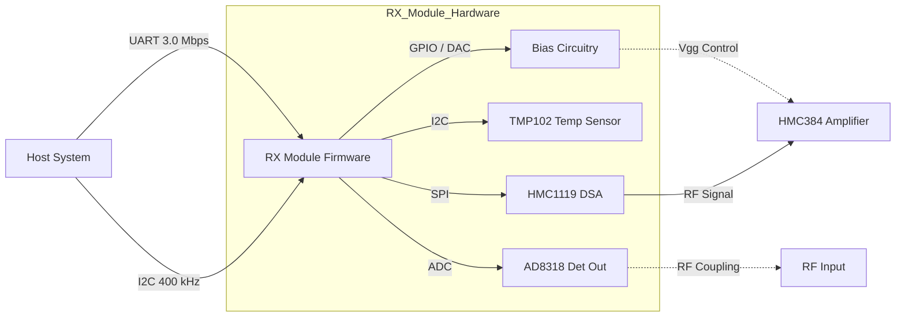
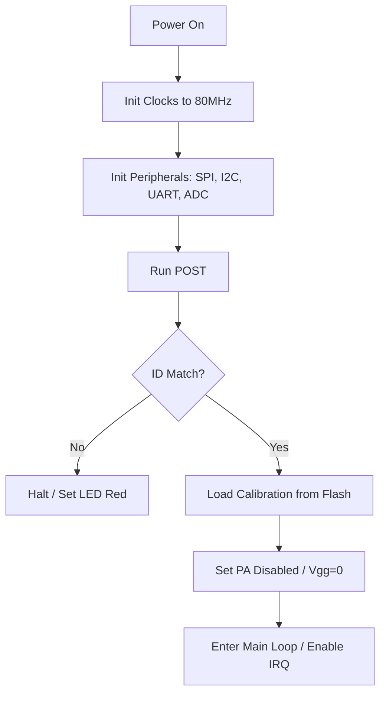
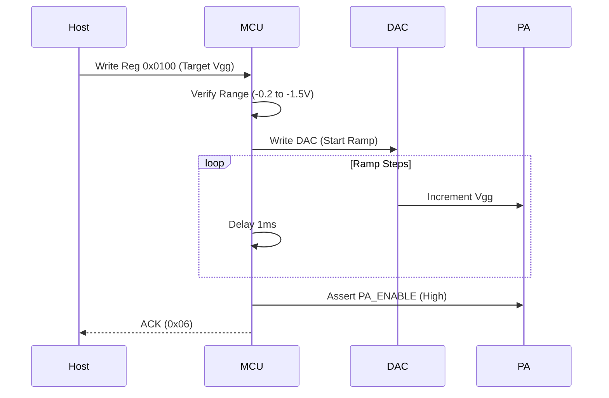
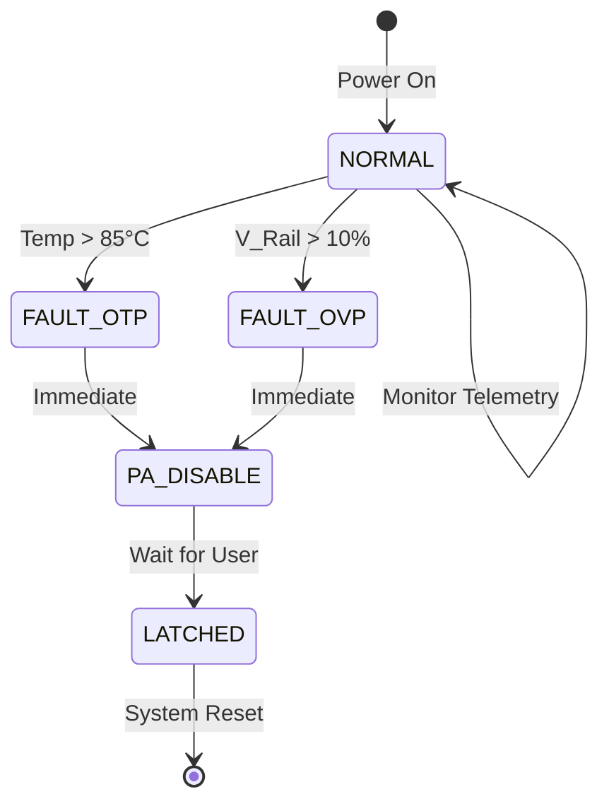
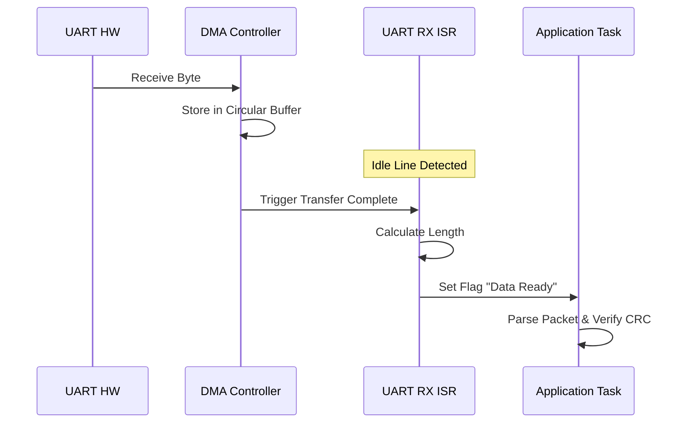

# Software Requirements Specification (SRS)

**Project:** RX Module (RX-MOD-001)  
**Version:** 1.0  
**Date:** 14 April 2026  
**Author:** Senior Software Architect (AI-Generated)

---

## Document Control

| Version | Date | Author | Changes |
|---------|------|--------|---------|
| 1.0 | 14 April 2026 | AI-Architect | Initial Release compliant with IEEE 29148:2018 |

---

# 1. Introduction

## 1.1 Purpose
This Software Requirements Specification (SRS) describes the functional and non-functional requirements for the embedded firmware running on the **STM32L433CBT6** microcontroller within the **RX Module (RX-MOD-001)**. This document is intended for:
1.  **Firmware Engineers:** As the definitive implementation guide.
2.  **Test Engineers:** As the basis for software verification and validation planning.
3.  **System Integrators:** To define the external communication behavior and interfaces.

The SRS ensures the software correctly controls the RF signal chain (HMC1119 DSA, HMC384 Amp), manages power protection (OVP/OTP), and interfaces with host systems via UART and I2C.

## 1.2 Scope
The software is responsible for the complete digital control of the RX Module. This includes:
*   **Configuration:** Serial Peripheral Interface (SPI) control of the HMC1119 Digital Step Attenuator.
*   **Bias Control:** Generating the Gate Voltage (Vgg) and PA Enable signals via GPIO to drive the external MOSFET circuitry (DMG3406L-7).
*   **Telemetry:** Monitoring Forward Power via the AD8318 (Internal MCU ADC) and Temperature via the TMP102 (I2C).
*   **Protection:** Implementing deterministic safety logic for Overvoltage (OVP) and Overtemperature (OTP) protection.
*   **Communication:** Handling Register Read/Write commands and Telemetry streaming via UART.

**Exclusions:** This software does not implement high-level modulation/demodulation schemes (handled by host), nor does it implement mechanical enclosure control.

## 1.3 Definitions, Acronyms, and Abbreviations

| Acronym | Definition |
| :--- | :--- |
| **API** | Application Programming Interface |
| **BSP** | Board Support Package |
| **CRC** | Cyclic Redundancy Check |
| **DAC** | Digital-to-Analog Converter |
| **DSA** | Digital Step Attenuator |
| **EOF** | End of Frame (UART Protocol) |
| **FIFO** | First-In, First-Out Buffer |
| **GPIO** | General Purpose Input/Output |
| **HAL** | Hardware Abstraction Layer |
| **HRS** | Hardware Requirements Specification |
| **I2C** | Inter-Integrated Circuit |
| **IRQ** | Interrupt Request |
| **ISR** | Interrupt Service Routine |
| **LDO** | Low Dropout Regulator |
| **MCU** | Microcontroller Unit |
| **MISRA** | Motor Industry Software Reliability Association (C Coding Standard) |
| **NVIC** | Nested Vectored Interrupt Controller |
| **OVP** | Overvoltage Protection |
| **OTP** | Overtemperature Protection |
| **PA** | Power Amplifier (RF Amp) |
| **PCB** | Printed Circuit Board |
| **PLL** | Phase-Locked Loop |
| **POST** | Power-On Self Test |
| **RF** | Radio Frequency |
| **RTOS** | Real-Time Operating System |
| **RX** | Receiver |
| **SDD** | Software Design Document |
| **SRS** | Software Requirements Specification |
| **SPI** | Serial Peripheral Interface |
| **UART** | Universal Asynchronous Receiver-Transmitter |
| **Vgg** | Gate Grid Voltage (Bias Control) |

## 1.4 References
1.  **IEEE Std 830-1998:** Recommended Practice for Software Requirements Specifications.
2.  **IEEE Std 29148-2018:** Systems and software engineering — Life cycle processes — Requirements engineering.
3.  **MISRA C:2012:** Guidelines for the use of the C language in critical systems.
4.  **RX-MOD-001-HRS:** Hardware Requirements Specification (Rev A), 14 April 2026.
5.  **RX-MOD-001-GLR:** Glue Logic Requirements (Rev 0V01), 14 April 2026.
6.  **STM32L433CB Datasheet:** STMicroelectronics, DocID026998 Rev 5.
7.  **HMC1119LP4E Datasheet:** Analog Devices, 0.25 dB LSB GaAs Digital Step Attenuator.
8.  **AD8318 Datasheet:** Analog Devices, RF Logarithmic Detector/Controller.

## 1.5 Overview
The remainder of this document is organized as follows:
*   **Section 2:** Overall description of the product context, functions, and constraints.
*   **Section 3:** Detailed specific requirements, including external interfaces and 50+ functional requirements.
*   **Section 4:** Verification and validation criteria.
*   **Section 5:** Requirements traceability matrix mapping Software Requirements to Hardware Requirements.

---

# 2. Overall Description

## 2.1 Product Perspective

### 2.1.1 System Context
The RX Module Firmware operates as a subsystem controller. It acts as a slave device to a Host System (e.g., SDR or Baseband Processor) while acting as the master to the RF peripherals (DSA, Temp Sensor, Amp).



### 2.1.2 Software Stack
*   **Layer 1 (Hardware):** STM32L433CB (Cortex-M4F), Peripherals (SPI, I2C, USART, ADC, DAC).
*   **Layer 2 (HAL/Driver):** MISRA-compliant C drivers for register manipulation and ISR handling.
*   **Layer 3 (Core Logic):** State machine for RF control, command parser, protection logic.
*   **Layer 4 (Interface):** Binary protocol handler for UART/I2C commands.

## 2.2 Product Functions
1.  **RF Path Control:** Configure attenuation (0.5 dB steps) via SPI.
2.  **Bias Generation:** Set PA Vgg voltage using internal DAC + Op-Amp buffer.
3.  **Gain/Flatness Calibration:** Store correction factors in non-volatile memory (Flash).
4.  **Power Telemetry:** Sample AD8318 output, convert linear voltage to dBm.
5.  **Thermal Management:** Read TMP102, implement hysteresis-based thermal shutdown.
6.  **Voltage Monitoring:** Monitor 5V and 3.3V LDO outputs via ADC.
7.  **Fault Management:** Handle OVP/OTP interrupts, force safe state (PA_OFF).
8.  **Configuration Management:** Handle Get/Set requests for system parameters.
9.  **Bootloader Support:** Allow firmware updates via UART (IAP - In Application Programming).
10. **Diagnostics:** Execute POST and report status via LED indicators.

## 2.3 User Characteristics
*   **Firmware Developers:** Require C99/MISRA C compliant code, detailed register maps, and clear API boundaries.
*   **Integration Engineers:** Require a stable binary protocol over UART for automated testing.
*   **Field Technicians:** Use LED status codes for simple "Go/No-Go" health checks.

## 2.4 Constraints
1.  **MISRA Compliance:** All code shall adhere to MISRA C:2012 standards.
2.  **Memory:** MCU has 48KB Flash and 32KB SRAM. Dynamic memory allocation (`malloc`) is prohibited.
3.  **Real-Time:** Protection logic (OVP/OTP) must execute within 10µs of hardware interrupt.
4.  **Clock Source:** Utilize internal 16MHz RC oscillator (HSE optional).
5.  **Environment:** Firmware must operate in industrial temperature range (-40°C to +85°C).
6.  **Toolchain:** Compilation shall be performed using GCC ARM Embedded or IAR EWARM.

## 2.5 Assumptions and Dependencies
1.  **Hardware Stability:** The 5V and 3.3V LDOs (AMS1117) are assumed to be stable within 2% tolerance.
2.  **Glue Logic:** The logic level shifters (if any) between MCU 3.3V IO and DSA 5V IO are functional per GLR.
3.  **Host Protocol:** The Host system strictly adheres to the defined UART packet format (no malformed bytes).

---

# 3. Specific Requirements

## 3.1 External Interface Requirements

### 3.1.1 Hardware Interfaces

**3.1.1.1 SPI Interface (DSA Control)**
Interface to the HMC1119LP4E Digital Step Attenuator.
*   **Protocol:** SPI Mode 0 (CPOL=0, CPHA=0).
*   **Clock Speed:** Max 10 MHz.
*   **Frame Size:** 8-bit.
*   **Chip Select:** Active Low GPIO.

```c
// HMC1119 DSA Interface Definition
#define DSA_SPI_CS_LOW()   HAL_GPIO_WritePin(DSA_CS_GPIO_Port, DSA_CS_Pin, GPIO_PIN_RESET)
#define DSA_SPI_CS_HIGH()  HAL_GPIO_WritePin(DSA_CS_GPIO_Port, DSA_CS_Pin, GPIO_PIN_SET)

typedef struct {
    uint8_t table_index; // 0 to 31 (0dB to 15.5dB attenuation)
    uint8_t raw_byte;    // The 8-bit payload: [0x0 | A5 A4 A3 A2 A1 A0]
} DSA_Attn_t;

// Driver API
int32_t DSA_Init(void);
int32_t DSA_SetAttenuation(float attenuation_db);
int32_t DSA_GetAttenuation(float *attenuation_db);
```

**3.1.1.2 ADC Interface (Power & Voltage Monitoring)**
Internal STM32 ADC1 reading the AD8318 output and voltage dividers.
*   **Resolution:** 12-bit.
*   **Sampling Time:** 480 cycles (for high impedance sources).
*   **Channels:**
    *   `ADC_CH_RF_PWR`: Connected to AD8318 V_OUT.
    *   `ADC_CH_V_5V`: Connected to 5V rail divider.
    *   `ADC_CH_V_3V3`: Connected to 3.3V rail divider.

```c
typedef struct {
    uint16_t raw_rf_pwr;    // 0-4095
    float    rf_pwr_dbm;    // Calculated
    uint16_t raw_v_5v;      // 0-4095
    float    v_5v;          // Calculated
    uint16_t raw_v_3v3;     // 0-4095
    float    v_3v3;         // Calculated
} Telemetry_Data_t;

// Driver API
int32_t ADC_Init(void);
int32_t TEL_UpdateReadings(Telemetry_Data_t *data);
int32_t TEL_ConvertTodBm(uint16_t adc_val, float *dbm);
```

**3.1.1.3 DAC Interface (Vgg Bias Control)**
Internal DAC Channel 1 (PA4) generating the reference voltage for the PA Gate bias.
*   **Resolution:** 12-bit.
*   **Output Range:** 0V to 3.3V. (External op-amp scales this to -2V to 0V for GaAs FET).

```c
// Driver API
int32_t BIAS_Init(void);
int32_t BIAS_SetVoltage(float target_vgg); // e.g., -0.5V
int32_t BIAS_Enable(void);  // Assert PA_ENABLE
int32_t BIAS_Disable(void); // De-assert PA_ENABLE
```

### 3.1.2 Software Interfaces
*   **CMSIS-Core:** ARM Cortex-M4 core access.
*   **STM32L4 HAL:** Hardware abstraction layer for peripheral initialization.

### 3.1.3 Communication Interfaces

**UART Protocol Specification (Host <-> RX Mod)**
*   **Baud Rate:** 3,000,000 bps (3.0 Mbps).
*   **Data Bits:** 8.
*   **Parity:** None.
*   **Stop Bits:** 1.

**Packet Structure:**
| Byte 0 (CMD) | Byte 1 (ADDR_H) | Byte 2 (ADDR_L) | Byte 3 (LEN) | Byte 4...N (DATA) | Byte N+1 (CRC8) |
| :--- | :--- | :--- | :--- | :--- | :--- |

*   **CMD 0x57 (WRITE):** Write `LEN` bytes to register `ADDR`.
*   **CMD 0x52 (READ):** Host requests read. Firmware responds with `LEN` bytes.
*   **CRC8:** Polynomial 0x07 (Dallas/Maxim).

**I2C Protocol Specification**
*   **Address:** 0x22 (7-bit).
*   **Speed:** 400 kHz.
*   **Register Map:** Same addressing as UART, mapped over I2C Write/Read byte streams.

---

## 3.2 Functional Requirements

### 3.2.1 System Initialization (REQ-SW-001 to REQ-SW-010)

| ID | Requirement | Traceability |
| :--- | :--- | :--- |
| **REQ-SW-001** | The software SHALL complete the Power-On Self-Test (POST) within 200ms of VDD stabilization. | REQ-HW-001 |
| **REQ-SW-002** | The software SHALL verify the "Board ID" register (0x0000) reads 0xA5A5 during POST; failure shall trigger a fatal error halt. | REQ-HW-002 |
| **REQ-SW-003** | The software SHALL initialize the system clock to 80MHz using the internal PLL within 50ms of boot. | GLR 4.0 |
| **REQ-SW-004** | The software SHALL configure the SPI peripheral for 10MHz, Mode 0, MSB First before attempting DSA communication. | GLR 5.0 |
| **REQ-SW-005** | The software SHALL initialize the I2C peripheral to 400kHz (Fast Mode) before accessing the TMP102 sensor. | GLR 5.0 |
| **REQ-SW-006** | The software SHALL set the default attenuation of the HMC1119 DSA to 0.0dB (Bypass) on startup. | REQ-HW-003 |
| **REQ-SW-007** | The software SHALL disable the PA (PA_ENABLE = LOW) and set DAC output to 0V on startup to ensure safe state. | REQ-HW-004 |
| **REQ-SW-008** | The software SHALL load calibration constants from non-volatile memory (Flash Page 63) into SRAM. | REQ-HW-010 |
| **REQ-SW-009** | The software SHALL enable the Watchdog Timer (IWDG) with a 100ms timeout before entering the main loop. | REQ-HW-009 |
| **REQ-SW-010** | The software SHALL configure the ADC to sample at a rate > 10kSps to ensure accurate power detection. | REQ-HW-008 |

### 3.2.2 UART Communication Driver (REQ-SW-011 to REQ-SW-020)

| ID | Requirement | Traceability |
| :--- | :--- | :--- |
| **REQ-SW-011** | The UART driver SHALL support a fixed baud rate of 3,000,000 bps. | GLR 5.0 |
| **REQ-SW-012** | The driver SHALL implement a circular DMA buffer for RX to prevent data loss at high throughput. | GLR 5.0 |
| **REQ-SW-013** | The software SHALL validate the CRC8 byte of every incoming packet; mismatched packets SHALL be discarded (NACK). | GLR 5.0 |
| **REQ-SW-014** | The software SHALL respond to a valid WRITE command with an ACK byte (0x06) within 1ms. | GLR 5.0 |
| **REQ-SW-015** | The software SHALL respond to a valid READ command with the data payload followed by a CRC8 byte within 2ms. | GLR 5.0 |
| **REQ-SW-016** | The software SHALL ignore register addresses outside the range 0x0000 - 0xFFFF (Return ERROR). | GLR 5.0 |
| **REQ-SW-017** | The software SHALL implement the "Flush FIFO" command (0xFF) by resetting the DMA pointers. | GLR 5.0 |
| **REQ-SW-018** | The driver SHALL detect a framing error (USART_ISR_FE) and clear the flag immediately. | STM32 Datasheet |
| **REQ-SW-019** | The driver SHALL support a "Bootloader Entry" command (0x5A) to jump to system memory. | REQ-HW-011 |
| **REQ-SW-020** | The software SHALL echo a diagnostic message string "\r\nRX-MOD-001 READY\r\n" upon initialization completion. | GLR 5.0 |

### 3.2.3 Bias and Amplifier Control (REQ-SW-021 to REQ-SW-030)

| ID | Requirement | Traceability |
| :--- | :--- | :--- |
| **REQ-SW-021** | The software SHALL control the PA_ENABLE pin (PA0) using a GPIO output. | GLR 4.0 |
| **REQ-SW-022** | The software SHALL assert PA_ENABLE (HIGH) only if the requested Bias Voltage (Vgg) is within -0.2V to -1.5V range. | REQ-HW-005 |
| **REQ-SW-023** | The software SHALL utilize the internal DAC (Channel 1) to set the Vgg reference voltage. | GLR 4.0 |
| **REQ-SW-024** | The software SHALL implement a ramp-up sequence for Vgg: 0V -> Target over 10ms steps to prevent current surge. | REQ-HW-006 |
| **REQ-SW-025** | The software SHALL implement a ramp-down sequence for Vgg immediately upon receiving a "Disable RF" command. | REQ-HW-006 |
| **REQ-SW-026** | The software SHALL verify the Vgg voltage via ADC feedback before asserting PA_ENABLE. | REQ-HW-007 |
| **REQ-SW-027** | The software SHALL prevent PA_ENABLE if the AD8318 detected power exceeds +10dBm (Indication of fault). | REQ-HW-008 |
| **REQ-SW-028** | The software SHALL allow the Host to write the Vgg setpoint to Register 0x0100. | GLR 5.0 |
| **REQ-SW-029** | The software SHALL store the Vgg setpoint as a 16-bit integer representing DAC counts (0-4095). | GLR 5.0 |
| **REQ-SW-030** | The software SHALL bypass the ramp sequence if the "Emergency Shutdown" bit (Reg 0x0200, Bit 0) is set. | REQ-HW-009 |

### 3.2.4 DSA and RF Path Control (REQ-SW-031 to REQ-SW-040)

| ID | Requirement | Traceability |
| :--- | :--- | :--- |
| **REQ-SW-031** | The software SHALL control the HMC1119 DSA via the SPI interface at 10MHz. | GLR 4.0 |
| **REQ-SW-032** | The DSA driver SHALL accept attenuation values in 0.5dB steps from 0.0dB to 31.5dB. | HMC1119 Datasheet |
| **REQ-SW-033** | The software SHALL calculate the 8-bit DSA latch word based on the formula: `Byte = (0 << 7) | (Attenuation * 2)`. | HMC1119 Datasheet |
| **REQ-SW-034** | The software shall assert the SPI Chip Select line low for at least 20ns before data transmission. | HMC1119 Datasheet |
| **REQ-SW-035** | The software SHALL support a "Bulk Attenuation Update" command to update frequency-dependent gain tables. | GLR 5.0 |
| **REQ-SW-036** | The software SHALL store the current attenuation setting in SRAM register 0x0101 for Host retrieval. | GLR 5.0 |
| **REQ-SW-037** | The software SHALL verify the SPI write by reading back the "Latch" status if the "Verify" flag is set in the control byte. | REQ-HW-012 |
| **REQ-SW-038** | The software SHALL interpret Register 0x0102 as the "RF Enable" bit; writing 0 disables the path, 1 enables. | GLR 5.0 |
| **REQ-SW-039** | The software SHALL maintain a Look-Up Table (LUT) in Flash for Temperature Compensation of the DSA. | REQ-HW-010 |
| **REQ-SW-040** | The software SHALL apply temperature compensation to the attenuation value automatically if "AutoComp" bit is enabled. | REQ-HW-010 |

### 3.2.5 Temperature and Power Telemetry (REQ-SW-041 to REQ-SW-050)

| ID | Requirement | Traceability |
| :--- | :--- | :--- |
| **REQ-SW-041** | The software SHALL read the TMP102 temperature sensor via I2C every 500ms. | GLR 4.0 |
| **REQ-SW-042** | The software SHALL convert the TMP102 12-bit data to Celsius using the formula in the datasheet. | TMP102 Datasheet |
| **REQ-SW-043** | The software SHALL trigger an OTP (Overtemperature Protection) event if temperature > +85°C. | REQ-HW-005 |
| **REQ-SW-044** | The software SHALL clear the OTP event only when temperature falls below +75°C (Hysteresis). | REQ-HW-005 |
| **REQ-SW-045** | The software SHALL sample the RF Power Detector (AD8318) via ADC1 Channel 4 every 100ms. | GLR 4.0 |
| **REQ-SW-046** | The software SHALL average 16 consecutive ADC samples to reduce noise before reporting power. | GLR 4.0 |
| **REQ-SW-047** | The software SHALL implement a log-linear conversion function to map ADC volts to dBm (Slope ~ -25mV/dB). | AD8318 Datasheet |
| **REQ-SW-048** | The software SHALL update the "Current Power" register (0x0103) with the latest calculated dBm value. | GLR 5.0 |
| **REQ-SW-049** | The software SHALL monitor the 3.3V and 5.0V rails; deviation of >10% shall trigger a UVLO fault. | REQ-HW-009 |
| **REQ-SW-050** | The software SHALL provide a "Health Status Byte" at Register 0x0001 indicating flags for OTP, OVP, and UVLO. | GLR 5.0 |

### 3.2.6 System Protection (REQ-SW-051 to REQ-SW-055)

| ID | Requirement | Traceability |
| :--- | :--- | :--- |
| **REQ-SW-051** | The software SHALL prioritize the OTP ISR (Interrupt Service Routine) above all other tasks. | REQ-HW-005 |
| **REQ-SW-052** | Upon OTP trigger, the software SHALL force PA_ENABLE to LOW and DAC output to 0V within 10µs. | REQ-HW-005 |
| **REQ-SW-053** | The software SHALL disable the SPI clock to the DSA when the RF path is disabled to save power. | REQ-HW-006 |
| **REQ-SW-054** | The software SHALL implement a "Latch Lock" mode where a fault requires a hardware reset to clear. | REQ-HW-009 |
| **REQ-SW-055** | The software SHALL set a dedicated "FAULT" GPIO pin (PA1) HIGH upon any protection circuit trip. | REQ-HW-009 |

---

## 3.3 Performance Requirements

| ID | Metric | Value | Unit |
| :--- | :--- | :--- | :--- |
| **REQ-PERF-001** | Boot Time (Power to Ready) | < 200 | ms |
| **REQ-PERF-002** | UART Command Latency | < 2 | ms |
| **REQ-PERF-003** | DSA Update Rate | > 100 | kHz |
| **REQ-PERF-004** | Vgg Settling Time (Step) | < 10 | ms |
| **REQ-PERF-005** | OTP Reaction Time | < 10 | µs |
| **REQ-PERF-006** | Temperature Read Cycle | 500 | ms |
| **REQ-PERF-007** | Power Measurement Refresh | 100 | ms |
| **REQ-PERF-008** | SPI Clock Frequency | 10 | MHz |
| **REQ-PERF-009** | I2C Clock Frequency | 400 | kHz |
| **REQ-PERF-010** | Main Loop Jitter | < 5 | µs |

## 3.4 Design Constraints
1.  **Language:** ISO C99 (No C++ extensions).
2.  **Compiler:** GCC 10.3.1 or IAR V8.50+.
3.  **Architecture:** Bare-metal (No RTOS to minimize latency/overhead).
4.  **Stack:** Total stack usage SHALL not exceed 4KB.
5.  **Interrupts:** Maximum nesting level of 2.
6.  **Float:** Floating point operations SHALL be minimized in ISRs; use fixed-point where possible.

## 3.5 Software System Attributes
1.  **Reliability:** Firmware shall run 24/7 for 5 years without reboot (MTBF target).
2.  **Availability:** 99.9% uptime.
3.  **Security:** Unauthorized memory writes via UART must be blocked by address whitelisting.
4.  **Maintainability:** Code shall be modular; One .c/.h pair per hardware peripheral.

---

# 4. Verification and Validation

## 4.1 Unit Test Requirements
*   **DSA Driver:** Test SPI bit-banging / DMA transmission against a logic analyzer.
*   **CRC Module:** Verify all 256 possible byte values.
*   **I2C Wrapper:** Mock the I2C lines to verify ACK/NACK handling for TMP102.
*   **ADC Filter:** Unit test the moving average filter with static inputs.

## 4.2 Integration Test Requirements
*   **RF Path Verification:** Host commands attenuation; Spectrum Analyzer verifies step size.
*   **Bias Loopback:** Host sets Vgg; Multimeter measures Gate voltage.
*   **Thermal Chamber:** Heat module to 90°C; verify UART reports Fault and PA shuts down.
*   **UART Stress:** Send 1 million random packets; verify CRC error count is zero.

---

# 5. Requirements Traceability Matrix

| REQ-SW ID | Description | Traces To (REQ-HW / GLR) |
| :--- | :--- | :--- |
| REQ-SW-001 | POST < 200ms | REQ-HW-001 |
| REQ-SW-002 | Board ID Check | REQ-HW-002 |
| REQ-SW-003 | Init 80MHz Clock | GLR 4.0 |
| REQ-SW-004 | SPI 10MHz Init | GLR 4.0 |
| REQ-SW-006 | Default Atten 0dB | REQ-HW-003 |
| REQ-SW-007 | Default PA Safe State | REQ-HW-004 |
| REQ-SW-011 | UART 3Mbps | GLR 5.0 |
| REQ-SW-021 | PA_ENABLE Control | GLR 4.0 |
| REQ-SW-022 | Vgg Range Check | REQ-HW-005 |
| REQ-SW-024 | Vgg Ramp Up | REQ-HW-006 |
| REQ-SW-026 | Vgg Verify | REQ-HW-007 |
| REQ-SW-027 | Power Limit Check | REQ-HW-008 |
| REQ-SW-031 | DSA SPI Interface | GLR 4.0 |
| REQ-SW-032 | DSA Step Resolution | HMC1119 Spec |
| REQ-SW-041 | Temp Polling | GLR 4.0 |
| REQ-SW-043 | OTP Threshold | REQ-HW-005 |
| REQ-SW-045 | ADC Sampling | GLR 4.0 |
| REQ-SW-049 | Rail Monitoring | REQ-HW-009 |
| REQ-SW-051 | OTP Priority | REQ-HW-009 |
| REQ-SW-052 | OTP Reaction | REQ-HW-009 |

---

# 6. Appendices

## Appendix A — Register Map Summary
| Address | Name | Access | Description |
| :--- | :--- | :--- | :--- |
| 0x0000 | BOARD_ID | R | 0xA5A5 |
| 0x0001 | HEALTH_STATUS | R | Bit0:OTP, Bit1:OVP, Bit2:UVLO |
| 0x0100 | VGG_SETPOINT | RW | DAC Counts (0-4095) |
| 0x0101 | DSA_ATTENUATION | RW | 0-63 (0 to 31.5dB) |
| 0x0102 | RF_ENABLE | RW | 0=Off, 1=On |
| 0x0103 | RF_POWER_DBM | R | Current RF Power (int16) |
| 0x0104 | BOARD_TEMP_C | R | Board Temp (int16) |
| 0x0200 | SYS_CONTROL | RW | System flags (Bit 0: Latch Lock) |

## Appendix B — Error Codes

```c
typedef enum {
    ERR_OK = 0x00,
    ERR_TIMEOUT = 0x01,   // I2C/SPI timeout
    ERR_CRC = 0x02,       // UART CRC mismatch
    ERR_PARAM = 0x03,     // Invalid parameter range
    ERR_OTP = 0x04,       // Overtemperature trip
    ERR_OVP = 0x05,       // Overvoltage trip
    ERR_HW_FAIL = 0xFF    // Generic hardware fault
} SystemErrorCode_t;
```

## Appendix C — Mermaid Diagrams

### System Initialization Flow


### Vgg Control Sequence


### Fault Handling State Machine


### UART Receive Handler


### Telemetry Loop Timing

```mermaid
gantt
    title Main Loop Timing (100ms Cycle)
    dateFormat s
    axisFormat %L
    
    section RF Tasks
    Update DSA           :0, 1ms
    Check Power Limit    :1, 2ms
    
    section Telemetry
    Sample ADC (Avg)     :5, 10ms
    Read Temp (I2C)      :20, 5ms
    
    section Comms
    Process UART CMD     :crit, 50, 10ms
    
    section Housekeeping
    Feed Watchdog        :90, 1ms
```
