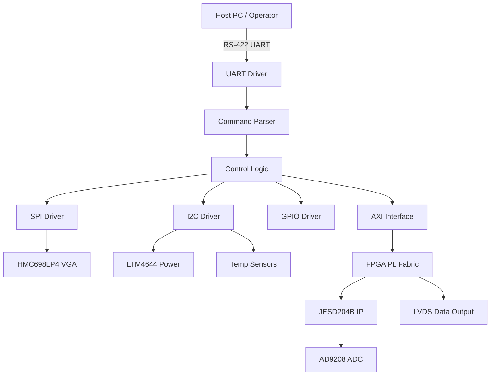
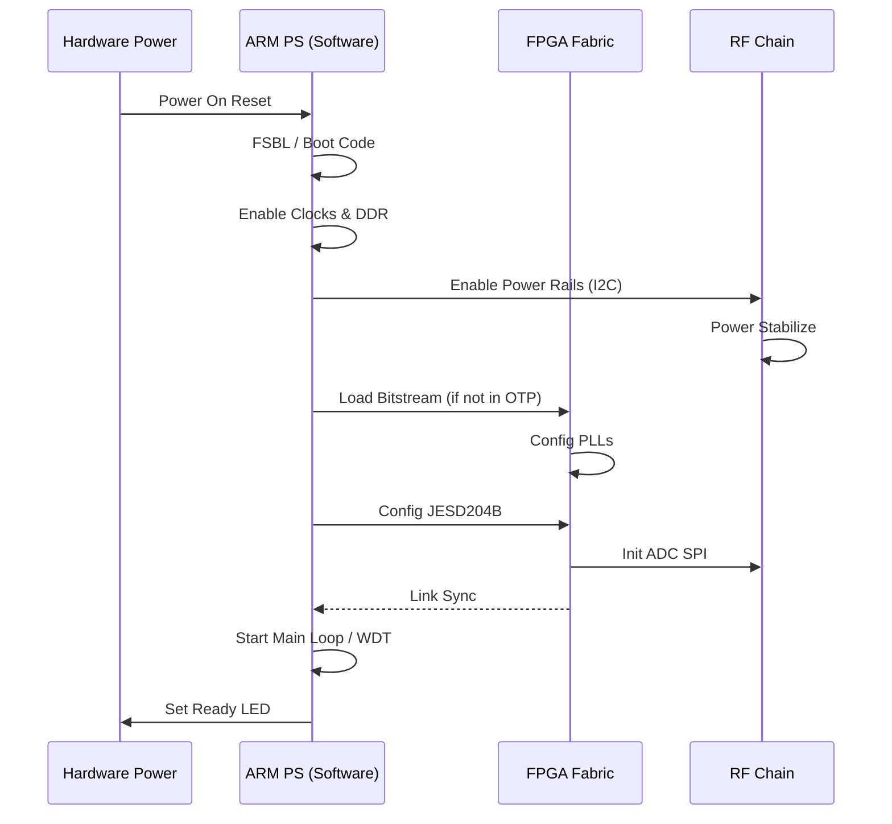
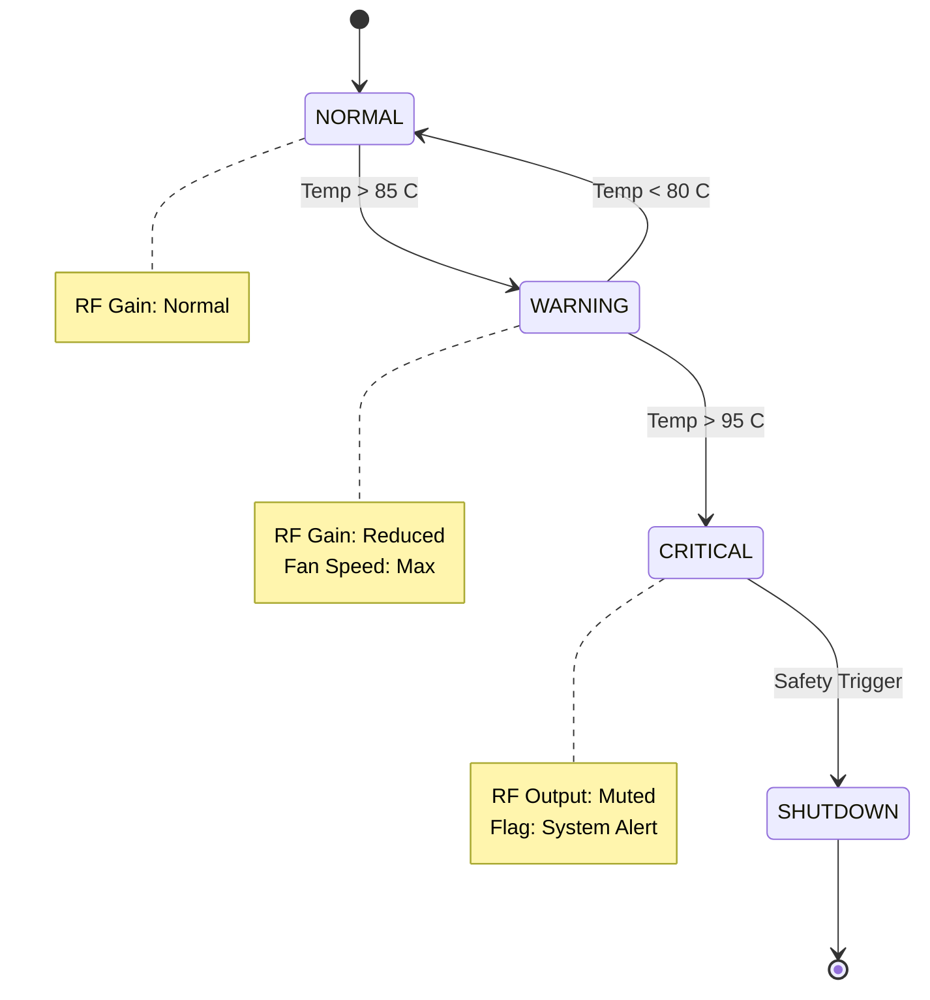
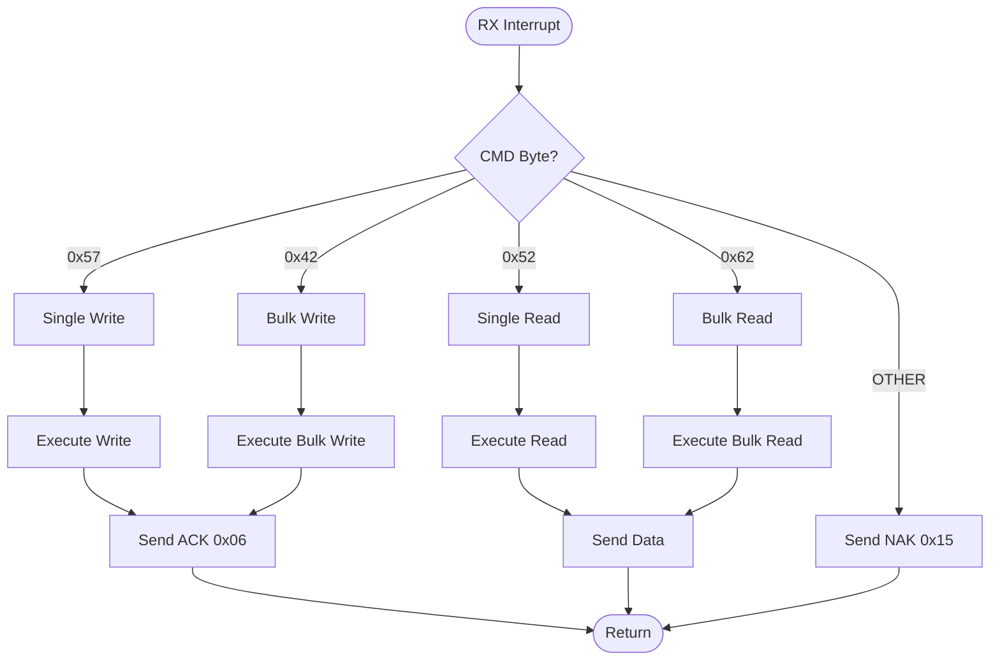

# Software Requirements Specification (SRS)

**Project:** rx_module
**Version:** 1.0
**Date:** 17 April 2026

---

## Document Control
| Version | Date | Author | Changes |
|---------|------|--------|---------|
| 1.0 | 17 April 2026 | System Architect | Initial Release based on HRS P2 & GLR P6 |

---

# 1. Introduction

## 1.1 Purpose
This Software Requirements Specification (SRS) documents the software and firmware requirements for the **rx_module** embedded controller. This software executes on the Xilinx Zynq UltraScale+ MPSoC (XCZU9EG) and is responsible for the initialization, configuration, control, and health monitoring of the RF analog front end and the ADC data path.

This document defines the requirements at **Level 3 (Software Requirements)** as defined by IEEE 29148:2018. It translates the hardware capabilities and constraints defined in the Hardware Requirements Specification (HRS) and Glue Logic Requirements (GLR) into concrete, testable software behaviors. This document is intended for firmware engineers, test engineers, and system integrators.

## 1.2 Scope
The software scope includes:
1.  **Processing System (PS) Firmware:** Bare-metal/RTOS control logic running on the ARM Cortex-A53 cores.
2.  **Hardware Abstraction Layer (HAL):** Drivers for UART, SPI, I2C, GPIO, and JESD204B configuration.
3.  **RF Control Logic:** State machines for Gain Control (VGA), LO configuration, and safety interlocks.
4.  **Power Management:** Initialization sequence for the LTM4644 power supplies.
5.  **Data Path Management:** Configuration of the AD9208 ADC and JESD204B lanes.

The software does not include the high-level DSP algorithms implemented in the FPGA PL fabric (e.g., FFTs, filtering) other than the configuration required to enable them.

## 1.3 Definitions, Acronyms, and Abbreviations

| Term / Acronym | Definition |
| :--- | :--- |
| **ADC** | Analog-to-Digital Converter (AD9208) |
| **BIST** | Built-In Self-Test |
| **COTS** | Commercial Off-The-Shelf |
| **CPU** | Central Processing Unit (ARM Cortex-A53) |
| **DAC** | Digital-to-Analog Converter (Internal to VGA control) |
| **DMA** | Direct Memory Access |
| **EOF** | End of Frame |
| **FIFO** | First-In-First-Out memory buffer |
| **FPGA** | Field-Programmable Gate Array (Xilinx XCZU9EG) |
| **FSBL** | First Stage Boot Loader |
| **GLR** | Glue Logic Requirements document |
| **GPIO** | General Purpose Input/Output |
| **HAL** | Hardware Abstraction Layer |
| **HRS** | Hardware Requirements Specification document |
| **I2C** | Inter-Integrated Circuit serial bus |
| **IP** | Intellectual Property (FPGA logic cores) |
| **ISR** | Interrupt Service Routine |
| **JESD** | JESD204B high-speed data converter interface standard |
| **LoL** | Loss of Lock (PLL status) |
| **LNA** | Low Noise Amplifier |
| **LVDS** | Low-Voltage Differential Signaling |
| **MMCM** | Mixed-Mode Clock Manager (Xilinx primitive) |
| **NVM** | Non-Volatile Memory (QSPI Flash) |
| **PLL** | Phase-Locked Loop |
| **POST** | Power-On Self-Test |
| **QSPI** | Quad Serial Peripheral Interface |
| **RF** | Radio Frequency (5-18 GHz) |
| **RS-422** | Recommended Standard 422 (Electrical interface for UART) |
| **RTC** | Real-Time Clock |
| **RTOS** | Real-Time Operating System (if applicable) |
| **RX** | Receive / Receiver |
| **SMA** | SubMiniature version A (RF connector) |
| **SPI** | Serial Peripheral Interface |
| **SW** | Software |
| **SysMon** | System Monitor (Xilinx IP) |
| **UART** | Universal Asynchronous Receiver/Transmitter |
| **VGA** | Variable Gain Amplifier (HMC698LP4) |
| **WDT** | Watchdog Timer |

## 1.4 References

| ID | Document Title | Version/Date |
| :--- | :--- | :--- |
| **HRS** | rx_module Hardware Requirements Specification | P2 |
| **GLR** | rx_module Glue Logic Requirements | P6 |
| **IEEE 830** | IEEE Recommended Practice for Software Requirements Specifications | 1998 |
| **IEEE 29148** | Systems and Software Engineering — Life Cycle Processes — Requirements Engineering | 2018 |
| **MISRA C** | Guidelines for the Use of the C Language in Critical Systems | 2012 |
| **JESD204B** | JEDEC Standard: Serial Interface for Data Converters | - |
| **AD9208** | AD9208 Datasheet (Dual, 14-Bit, 3 GSPS ADC) | Rev. 0 |
| **XCZU9EG** | Xilinx Zynq UltraScale+ MPSoC Datasheet | v2.3 |
| **HMC698LP4** | HMC698LP4 VGA Datasheet | Rev. A |
| **LTM4644** | LTM4644 Quad DC/DC Regulator Datasheet | - |

## 1.5 Overview
The remainder of this document is organized as follows:
*   **Section 2 (Overall Description):** Describes the product perspective, functions, and constraints. It details the hardware interfaces and the operating environment.
*   **Section 3 (Specific Requirements):** Contains the detailed Software Requirements (REQ-SW-xxx). This section includes external interfaces, functional requirements (numbered sequentially), performance requirements, design constraints, and software attributes (reliability, security).
*   **Section 4 (Verification & Validation):** Defines the testing strategy.
*   **Section 5 (Traceability):** Maps software requirements to Hardware Requirements (HRS) and Glue Logic (GLR).
*   **Appendices:** Provides error codes, register maps, and sequence diagrams.

---

# 2. Overall Description

## 2.1 Product Perspective
The **rx_module** software operates as the control plane for a high-frequency RF receiver. The system is embedded, utilizing the Xilinx Zynq UltraScale+ MPSoC which integrates hard processor cores (ARM Cortex-A53) with programmable logic (FPGA fabric).

The software is partitioned into two domains:
1.  **PS (Processing System):** Runs the C-based control firmware (this SRS). It handles serial communication (UART), peripheral management (I2C/SPI), and system health.
2.  **PL (Programmable Logic):** Contains the IP cores for JESD204B interfacing and high-speed data streaming. The PS configures the PL registers via the AXI-GP bus.



## 2.2 Product Functions
The software performs the following major functions:
1.  **System Initialization:** Configures clocks, DDR memory, and brings up the PS and PL peripherals.
2.  **Power Sequencing:** Controls the LTM4644 via I2C to ensure voltage sequencing (1.0V Core, 1.8V IO, 3.3V RF).
3.  **RF Calibration:** Configures the HMC698LP4 VGA gain based on host commands.
4.  **Data Path Setup:** Configures the AD9208 ADC and JESD204B PHY (lane rates, scrambling, test patterns).
5.  **Health Monitoring:** Polls temperature sensors (I2C) and FPGA internal XADC (SysMon).
6.  **Communication:** Implements the GLR-defined UART protocol for register read/write and bulk commands.
7.  **Fault Management:** Handles over-temperature, PLL loss-of-lock, and communication errors.

## 2.3 User Characteristics
*   **System Integrators:** Use the UART interface to configure the module for specific frequency bands.
*   **Maintenance Technicians:** Use diagnostic commands to read voltages and temperatures.
*   **Host Control Software:** Automates gain control loops and data acquisition via the UART protocol.

## 2.4 Constraints
1.  **Standards Compliance:** Code shall comply with MISRA-C:2012 guidelines.
2.  **Boot Time:** The system must be ready to accept commands within 2 seconds of power application.
3.  **Determinism:** Interrupt handlers (ISRs) must execute to completion within 50µs.
4.  **Memory:** Software utilizes the 512KB On-Chip Memory (OCM) for critical data; DDR is available for buffering if necessary.
5.  **Concurrency:** The software must handle asynchronous UART reception while performing periodic monitoring tasks.
6.  **Safety:** The software must enforce RF power limits (Gain clamp) to prevent damage to downstream mixers or ADCs.

## 2.5 Assumptions and Dependencies
1.  The **FPGA Bitstream** is pre-loaded in QSPI Flash or loaded by the First Stage Boot Loader (FSBL).
2.  The **Host System** implements the RS-422 physical layer and adheres to the UART frame timing (50ms inter-byte gap).
3.  The **12V DC supply** is stable and capable of delivering the required current per the HRS.
4.  The **JESD204B IP** in the PL fabric provides a standard register map for status and control (Xilinx IP core).

---

# 3. Specific Requirements

## 3.1 External Interface Requirements

### 3.1.1 Hardware Interfaces

#### 3.1.1.1 UART Interface (Control)
The physical interface is RS-422. The logical protocol is defined in GLR P6.

```c
// Register Map definition for Glue Logic Registers
typedef struct {
    volatile uint32_t CTRL;      // 0x0000: Control Register
    volatile uint32_t STATUS;    // 0x0004: Status Register
    volatile uint32_t TX_COUNT;  // 0x0008: TX FIFO Count
    volatile uint32_t RX_COUNT;  // 0x000C: RX FIFO Count
    volatile uint32_t BAUD_DIV; // 0x0010: Baud Rate Divisor
} UART_RegMap_t;

// Driver API
/**
 * @brief Initialize the UART controller
 * @param baud_rate Target baud rate (e.g., 115200)
 * @return 0 on success, error code on failure
 */
int32_t UART_Init(uint32_t baud_rate);

/**
 * @brief Send a single byte via UART
 * @param data Byte to send
 * @return 0 on success, negative on timeout
 */
int32_t UART_SendByte(uint8_t data);

/**
 * @brief Read a single byte from UART (blocking)
 * @param data Pointer to store received byte
 * @return 0 on success, negative on timeout
 */
int32_t UART_ReadByte(uint8_t *data);
```

#### 3.1.1.2 SPI Interface (VGA Control)
Connected to the HMC698LP4 VGA. Uses SPI Mode 0 (CPOL=0, CPHA=0), Max Clock 20 MHz.

```c
typedef struct {
    volatile uint32_t SPI_CTRL;  // Control: Enable, Polarity
    volatile uint32_t SPI_STATUS;// Status: TX Empty, RX Full
    volatile uint32_t SPI_TX;    // Transmit FIFO
    volatile uint32_t SPI_RX;    // Receive FIFO
} SPI_RegMap_t;

// HMC698LP4 Specific Driver
/**
 * @brief Write gain setting to VGA
 * @param gain_db Gain value in dB (0 to 50)
 * @return 0 on success, negative on error
 */
int32_t VGA_SetGain(float gain_db);

/**
 * @brief Read current gain setting from VGA
 * @param gain_db Pointer to store gain value
 * @return 0 on success
 */
int32_t VGA_GetGain(float *gain_db);
```

#### 3.1.1.3 I2C Interface (Power & Temp)
Standard I2C (100 kHz standard mode). Connected to LTM4644 (PMIC) and Temperature Sensors.

```c
typedef struct {
    volatile uint32_t I2C_CTRL;  // Control Register
    volatile uint32_t I2C_STATUS;// Status Register
    volatile uint32_t I2C_TX_FIFO;
    volatile uint32_t I2C_RX_FIFO;
} I2C_RegMap_t;

// Power Driver API
int32_t PMIC_Init(void);
int32_t PMIC_SetVoltage(uint8_t rail_id, float voltage);
int32_t PMIC_ReadVoltage(uint8_t rail_id, float *voltage);

// Temperature Driver API
int32_t Temp_Read(uint8_t sensor_id, float *temp_c);
```

### 3.1.2 Software Interfaces
*   **Xilinx Standalone OS:** For hardware abstraction (xil_printf, xil_cache).
*   **XADC Driver:** For reading FPGA internal temperature and voltage rails.

### 3.1.3 Communication Interfaces
The software implements the command protocol defined in GLR P6.

**UART Frame Formats:**

| Command | CMD Byte | Frame Structure | Response |
|---------|----------|-----------------|----------|
| Single Write | 0x57 ('W') | `[0x57][ADDR_H][ADDR_L][DATA_H][DATA_L]` | `[0x06]` ACK |
| Single Read  | 0x52 ('R') | `[0x52][ADDR_H\|0x80][ADDR_L]` | `[DATA_H][DATA_L]` |
| Bulk Write   | 0x42 ('B') | `[0x42][ADDR_H][ADDR_L][N][D0_H][D0_L]...` | `[0x06]` ACK |
| Bulk Read    | 0x62 ('b') | `[0x62][ADDR_H\|0x80][ADDR_L][N]` | `[D0_H][D0_L]...[Dn_H][Dn_L]` |
| Error NAK    | 0x15 | Sent by FPGA on invalid command/address | — |

*   **Addressing:** 16-bit address space. Read addresses require Bit 15 set (OR with 0x8000).
*   **Timeouts:** Inter-byte timeout is 50ms. Transaction timeout is 10ms.
*   **Bulk Count:** Max N = 64 registers.

## 3.2 Functional Requirements

### 3.2.1 System Initialization (REQ-SW-001 to REQ-SW-010)

| ID | Requirement Statement | Source | Priority | Verification |
|----|-----------------------|--------|----------|--------------|
| REQ-SW-001 | The software SHALL initialize the Xilinx PS (DDR, OCM, Clocks) within 500ms of power-on reset. | HRS 1.0 | M | T |
| REQ-SW-002 | The software SHALL configure the LTM4644 power sequencer via I2C to enable 1.0V, 1.8V, and 3.3V rails in the correct order. | GLR 4.0 | M | T |
| REQ-SW-003 | The software SHALL verify that the FPGA Bitstream is loaded and the PL is ready before attempting to configure ADCs. | GLR 6.0 | M | D |
| REQ-SW-004 | The software SHALL configure the JESD204B PHY IP to a line rate of 3.0 Gbps with Subclass 1 deterministic latency. | GLR 6.0 / AD9208 Datasheet | M | A |
| REQ-SW-005 | The software SHALL perform a CODEC sync routine to align the JESD204B lanes (AD9208 to FPGA) on startup. | AD9208 Datasheet | M | T |
| REQ-SW-006 | The software SHALL initialize the UART interface to 115200 baud, 8N1 format by default. | GLR 6.0 | M | I |
| REQ-SW-007 | The software SHALL initialize the VGA (HMC698LP4) to 0dB gain (mid-range) or the last saved value from NVM on startup. | HRS REQ-HW-005 | M | T |
| REQ-SW-008 | The software SHALL enable the Watchdog Timer (WDT) with a 100ms timeout after successful initialization. | HRS REQ-HW-008 | M | T |
| REQ-SW-009 | The software SHALL set the System Status Register `SYS_STATUS` bit `READY` to 1 upon completion of all POST routines. | GLR 4.0 | M | D |
| REQ-SW-010 | The software SHALL blink the System LED at 2Hz during initialization and turn it solid upon success. | HRS 1.0 | D | D |

### 3.2.2 UART Communication Driver (REQ-SW-011 to REQ-SW-020)

| ID | Requirement Statement | Source | Priority | Verification |
|----|-----------------------|--------|----------|--------------|
| REQ-SW-011 | The software SHALL implement the UART Command Parser supporting opcodes 0x57, 0x52, 0x42, and 0x62. | GLR 6.0 | M | T |
| REQ-SW-012 | The software SHALL respond to a Single Write command (0x57) with an ACK byte (0x06) within 1ms of receiving the final data byte. | GLR 6.0 | M | T |
| REQ-SW-013 | The software SHALL treat the MSB of the address byte in Read commands as an address space indicator (Bit 15). | GLR 6.0 | M | T |
| REQ-SW-014 | The software SHALL respond to a Bulk Read command (0x62) with N consecutive data words. | GLR 6.0 | M | T |
| REQ-SW-015 | The software SHALL transmit a NAK byte (0x15) if the received command byte is not 0x57, 0x52, 0x42, or 0x62. | GLR 6.0 | M | T |
| REQ-SW-016 | The software SHALL implement a 50ms inter-byte timeout; if exceeded, the UART driver shall flush the RX buffer and reset the parser state. | GLR 6.0 | M | T |
| REQ-SW-017 | The software SHALL verify the calculated CRC (if enabled in Config Reg) before executing Write commands; failure shall result in NAK. | GLR 6.0 | D | T |
| REQ-SW-018 | The software SHALL allow reading of the BOARD_ID register via UART Single Read command. | GLR 6.0 | M | T |
| REQ-SW-019 | The software SHALL provide a loopback mode where written data to address 0x0001 is reflected to the read buffer for test purposes. | HRS REQ-HW-003 | O | T |
| REQ-SW-020 | The UART driver SHALL use DMA (if available) or interrupt-driven FIFO buffers to prevent data loss at 115200 baud. | GLR 6.0 | M | I |

### 3.2.3 RF Gain Control (REQ-SW-021 to REQ-SW-030)

| ID | Requirement Statement | Source | Priority | Verification |
|----|-----------------------|--------|----------|--------------|
| REQ-SW-021 | The software SHALL map the 16-bit gain value written to the VGA register to a 0-50dB gain range on the HMC698LP4. | HRS REQ-HW-005 | M | T |
| REQ-SW-022 | The software shall perform the gain write operation via SPI to the HMC698LP4 within 1ms of receiving the command. | HMC698 Datasheet | M | T |
| REQ-SW-023 | The software SHALL clamp the gain value to a maximum of 50dB if a value > 50dB is requested. | HRS REQ-HW-011 | M | T |
| REQ-SW-024 | The software SHALL support coarse gain steps (approx 5dB) and fine gain steps (< 1dB) as defined in the HMC698 lookup table. | HMC698 Datasheet | M | T |
| REQ-SW-025 | The software SHALL store the last applied gain setting in non-volatile QSPI Flash. | HRS REQ-HW-008 | D | T |
| REQ-SW-026 | The software SHALL apply the gain setting from Flash on startup only if the Power-On Self-Test passes. | REQ-SW-025 | D | T |
| REQ-SW-027 | The software SHALL provide a "Gain Freeze" mode where further SPI writes to the VGA are ignored until unlocked. | HRS REQ-HW-008 | O | T |
| REQ-SW-028 | The software SHALL log any gain change requests to a circular buffer in RAM (max 64 entries). | HRS REQ-HW-008 | D | I |
| REQ-SW-029 | The software SHALL verify the SPI write to the VGA by reading back the register value. | HRS REQ-HW-009 | M | T |
| REQ-SW-030 | The software SHALL set the gain to 0dB (safe state) if the FPGA temperature exceeds 85°C. | HRS REQ-HW-008 | M | T |

### 3.2.4 JESD204B / ADC Interface (REQ-SW-031 to REQ-SW-040)

| ID | Requirement Statement | Source | Priority | Verification |
|----|-----------------------|--------|----------|--------------|
| REQ-SW-031 | The software SHALL configure the AD9208 ADC for Dual-channel, 3 GSPS operation via SPI. | AD9208 Datasheet | M | T |
| REQ-SW-032 | The software SHALL enable JESD204B Subclass 1 to ensure deterministic latency for beam synchronization. | AD9208 Datasheet | M | T |
| REQ-SW-033 | The software SHALL monitor the JESD204B IP `SYNC~` status bit and report it in the STATUS register (Bit 0). | GLR 4.0 | M | T |
| REQ-SW-034 | The software SHALL initiate a JESD204B Link re-initialization sequence if the `SYNC~` signal is lost for more than 100ms. | GLR 4.0 | M | T |
| REQ-SW-035 | The software SHALL disable the ADC outputs (put them in standby) before changing the sampling rate or decimation settings. | AD9208 Datasheet | M | T |
| REQ-SW-036 | The software SHALL assert the PL reset signal for the JESD204B RX core if the lane alignment error count exceeds 1000 per second. | GLR 4.0 | M | T |
| REQ-SW-037 | The software SHALL report the number of detected JESD204B lanes in the STATUS register (Bits 4-7). | GLR 4.0 | M | I |
| REQ-SW-038 | The software SHALL configure the JESD204B scrambling (SCR) bit to match the ADC setting (default: Enabled). | AD9208 Datasheet | M | I |
| REQ-SW-039 | The software SHALL calculate and set the correct LMF (L, M, F) parameters based on the configured ADC sample rate. | AD9208 Datasheet | M | A |
| REQ-SW-040 | The software SHALL map the received I/Q data to the LVDS output pins defined in the FPGA Constraints file. | GLR 4.0 | M | I |

### 3.2.5 Health Monitoring & Diagnostics (REQ-SW-041 to REQ-SW-050)

| ID | Requirement Statement | Source | Priority | Verification |
|----|-----------------------|--------|----------|--------------|
| REQ-SW-041 | The software SHALL poll the XADC (System Monitor) for FPGA Die Temperature every 500ms. | HRS REQ-HW-008 | M | T |
| REQ-SW-042 | The software SHALL poll the external I2C temperature sensor (U12) every 1 second. | HRS REQ-HW-008 | M | T |
| REQ-SW-043 | The software SHALL assert the `ALERT` bit in the STATUS register if the internal temperature exceeds 85°C. | HRS REQ-HW-008 | M | T |
| REQ-SW-044 | The software SHALL assert the `ALERT` bit in the STATUS register if the 1.0V core rail deviates by >5%. | LTM4644 Datasheet | M | T |
| REQ-SW-045 | The software SHALL implement a cyclic redundancy check (CRC-16) on the firmware image in Flash during POST. | HRS REQ-HW-008 | D | I |
| REQ-SW-046 | The software SHALL count the number of UART NAKs transmitted and store it in Register 0x0050. | GLR 6.0 | O | I |
| REQ-SW-047 | The software SHALL provide a "Heartbeat" counter in Register 0x00FF that increments every 10ms. | GLR 6.0 | D | D |
| REQ-SW-048 | The software SHALL log the timestamp of the last watchdog reset to a non-volatile register. | HRS REQ-HW-008 | M | T |
| REQ-SW-049 | The software SHALL support a factory reset command (via Magic Word write) to restore all EEPROM settings to defaults. | HRS REQ-HW-008 | D | T |
| REQ-SW-050 | The software SHALL measure and report the internal PLL lock status of the FPGA MMCMs in the STATUS register. | GLR 6.0 | M | T |

### 3.2.6 LVDS Data Output (REQ-SW-051 to REQ-SW-060)

| ID | Requirement Statement | Source | Priority | Verification |
|----|-----------------------|--------|----------|--------------|
| REQ-SW-051 | The software SHALL route the demodulated I/Q data from the PL to the LVDS output buffers. | HRS REQ-HW-006 | M | I |
| REQ-SW-052 | The software shall control the LVDS output enables via the GPIO mapped to the Enable control pins. | HRS REQ-HW-006 | M | T |
| REQ-SW-053 | The software SHALL support an LVDS test pattern generation mode (PRBS9) controlled via Register 0x0100. | HRS REQ-HW-006 | D | T |
| REQ-SW-054 | The software SHALL verify that the LVDS output frequency is within the specified range (GSPS class). | HRS REQ-HW-006 | M | A |
| REQ-SW-055 | The software shall configure the LVDS pins to the voltage standard defined in GLR 1.8V or 2.5V. | GLR 4.0 | M | I |

### 3.2.7 Calibration & Configuration (REQ-SW-061 to REQ-SW-075)

| ID | Requirement Statement | Source | Priority | Verification |
|----|-----------------------|--------|----------|--------------|
| REQ-SW-061 | The software SHALL load calibration coefficients from the QSPI Flash into the PL DSP slices. | HRS REQ-HW-009 | D | T |
| REQ-SW-062 | The software SHALL allow the host to write new calibration coefficients via the UART Bulk Write command. | HRS REQ-HW-009 | D | T |
| REQ-SW-063 | The software SHALL store the Board Serial Number and Revision in Register 0x0000 and 0x0001. | GLR 6.0 | M | T |
| REQ-SW-064 | The software SHALL check the Board ID on startup and halt if the ID is 0xFFFF (Unprogrammed). | GLR 6.0 | M | I |
| REQ-SW-065 | The software SHALL calculate the Gain Flatness correction factors based on the loaded frequency table. | HRS REQ-HW-004 | O | A |
| REQ-SW-066 | The software SHALL verify the integrity of the QSPI Flash contents via CRC before launching the Soft-Core (if used) or loading config. | HRS REQ-HW-008 | M | I |
| REQ-SW-067 | The software SHALL update the firmware version register (0x0002) with the current build number. | GLR 6.0 | M | I |
| REQ-SW-068 | The software SHALL implement a write protection lock bit to prevent accidental erasure of the calibration sector in Flash. | HRS REQ-HW-008 | M | T |
| REQ-SW-069 | The software SHALL log the number of power cycles since manufacture in the EEPROM. | HRS REQ-HW-008 | D | T |
| REQ-SW-070 | The software SHALL support a low-power sleep mode where the RF chains are powered down but the UART remains active. | HRS REQ-HW-008 | O | T |
| REQ-SW-071 | The software SHALL monitor the 12V input rail via an ADC channel and trigger an undervoltage lockout if < 10.5V. | HRS REQ-HW-007 | M | T |
| REQ-SW-072 | The software SHALL initialize the PLLs for the JESD204B reference clock (typically 122.88MHz or 10MHz based on design). | GLR 4.0 | M | T |
| REQ-SW-073 | The software SHALL respond to a broadcast query command (0xFF) with the module's MAC/IP address if applicable. | GLR 6.0 | O | D |
| REQ-SW-074 | The software SHALL implement a diagnostic mode where the VGA is swept from min to max gain. | HRS REQ-HW-005 | O | D |
| REQ-SW-075 | The software SHALL perform a memory BIST on the external DDR upon initialization. | HRS REQ-HW-008 | D | T |

## 3.3 Performance Requirements

| ID | Description | Target | Verification |
|----|-------------|--------|--------------|
| REQ-PERF-001 | Boot Time | < 2.0 Seconds (Power to UART Ready) | T |
| REQ-PERF-002 | UART Command Latency | < 5ms (End of Frame to ACK) | T |
| REQ-PERF-003 | JESD204B Link Lock Time | < 100ms (After Init Command) | T |
| REQ-PERF-004 | SPI Write Speed | > 1 MHz (Effective throughput to VGA) | T |
| REQ-PERF-005 | Temperature Polling Rate | 1 Hz (Periodic) | I |
| REQ-PERF-006 | GPIO Latency | < 1 µs (Alert assertion) | T |
| REQ-PERF-007 | Memory Footprint | < 256KB RAM (Excluding buffers) | A |
| REQ-PERF-008 | Task Scheduling Jitter | < 10 µs (Periodic tasks) | T |
| REQ-PERF-009 | Flash Write Endurance | Handle 10,000 write cycles to config sector | I |
| REQ-PERF-010 | Watchdog Pet Interval | < 50ms (Max time between WDT refresh) | I |

## 3.4 Design Constraints
1.  **Language:** C99 (Strict ISO C). No C++ exceptions or RTTI.
2.  **Compiler:** Xilinx Vitis GNU Toolchain (arm-none-eabi-gcc).
3.  **Static Analysis:** Code must pass PC-Lint Plus with zero errors.
4.  **Dynamic Memory:** Heap usage prohibited. All structures must be statically allocated or use stack memory only.
5.  **Interrupts:** Maximum nesting depth of 3.
6.  **Concurrency:** Shared data access between ISR and Main Loop must use volatile variables and critical sections (disable interrupts).

## 3.5 Software System Attributes

### 3.5.1 Reliability
The software MTBF target is 10,000 hours. The system must recover from a single-event upset (SEU) in the configuration memory via periodic scrubbing (if supported by HW). The system must detect and log all WDT resets.

### 3.5.2 Availability
The system shall be operational 99.9% of the time (excluding scheduled maintenance). The UART control interface shall always respond regardless of RF chain status (Graceful Degradation).

### 3.5.3 Security
1.  Write access to the `FIRMWARE_UPDATE` register (0xA000) shall require a specific 32-bit unlock key sequence.
2.  The software shall reject commands that attempt to write to Reserved or Read-Only registers with a NAK (0x15).

### 3.5.4 Maintainability
All functions shall have a maximum Cyclomatic Complexity of 10. All driver modules shall be documented in Doxygen format. The code shall be modularized such that the RF chain is independent of the specific JESD204B IP core version.

---

# 4. Verification and Validation

## 4.1 Unit Test Requirements
*   **UART Driver:** Test with loopback connector; verify checksum and frame parsing logic.
*   **SPI Driver:** Mock the SPI bus; verify clock polarity and chip select timing using logic analyzer simulation.
*   **VGA Driver:** Verify gain clamp logic (0-50dB) and lookup table accuracy.
*   **CRC Module:** Verify calculation against standard test vectors (CRC-16-CCITT).

## 4.2 Integration Test Requirements
1.  **ADC Link Test:** Verify data integrity from AD9208 through FPGA to LVDS output using PRBS patterns.
2.  **Control Loop Test:** Host sends Gain command -> Measure SPI lines -> Verify Gain change.
3.  **Power Cycle Test:** Cycle 12V power 100 times; verify UART response every time.

## 4.3 System Test Requirements
1.  **RF Performance Test:** Inject -60dBm signal at 5GHz and 18GHz. Verify Gain settings result in expected ADC levels (via link dump).
2.  **Environmental Test:** Operate module in chamber at -40°C and +85°C (MIL-STD-810). Verify UART stability.
3.  **EMC Test:** Verify robust operation with RF noise injected on the 12V line.

---

# 5. Requirements Traceability Matrix

| REQ-SW ID | Description | Source (REQ-HW or GLR) | Priority | Verification |
|-----------|-------------|-------------------------|----------|--------------|
| REQ-SW-001 | Init Xilinx PS | HRS Overview | M | T |
| REQ-SW-002 | LTM4644 Power Seq | GLR 4.0 | M | T |
| REQ-SW-003 | FPGA Bitstream Load | GLR 6.0 | M | D |
| REQ-SW-004 | JESD204B PHY Config | GLR 6.0 | M | A |
| REQ-SW-005 | JESD204B Codec Sync | AD9208 DS | M | T |
| REQ-SW-006 | UART Init | GLR 6.0 | M | I |
| REQ-SW-007 | VGA Init Gain | HRS REQ-HW-005 | M | T |
| REQ-SW-008 | Watchdog Enable | HRS REQ-HW-008 | M | T |
| REQ-SW-009 | Status Ready Bit | GLR 6.0 | M | D |
| REQ-SW-010 | LED Blink | HRS Overview | D | D |
| REQ-SW-011 | UART Parser | GLR 6.0 | M | T |
| REQ-SW-012 | Single Write ACK | GLR 6.0 | M | T |
| REQ-SW-013 | Read Address Bit | GLR 6.0 | M | T |
| REQ-SW-014 | Bulk Read | GLR 6.0 | M | T |
| REQ-SW-015 | NAK Invalid | GLR 6.0 | M | T |
| REQ-SW-016 | Inter-byte Timeout | GLR 6.0 | M | T |
| REQ-SW-017 | CRC Verify | GLR 6.0 | D | T |
| REQ-SW-018 | Board ID Read | GLR 6.0 | M | T |
| REQ-SW-019 | Loopback Mode | HRS REQ-HW-003 | O | T |
| REQ-SW-020 | UART DMA/FIFO | GLR 6.0 | M | I |
| REQ-SW-021 | VGA Gain Map | HRS REQ-HW-005 | M | T |
| REQ-SW-022 | SPI Write Speed | HMC698 DS | M | T |
| REQ-SW-023 | Gain Clamp | HRS REQ-HW-011 | M | T |
| REQ-SW-024 | Gain Steps | HMC698 DS | M | T |
| REQ-SW-025 | Store Gain NVM | HRS REQ-HW-008 | D | T |
| REQ-SW-026 | Load Gain NVM | REQ-SW-025 | D | T |
| REQ-SW-027 | Gain Freeze | HRS REQ-HW-008 | O | T |
| REQ-SW-028 | Gain Log | HRS REQ-HW-008 | D | I |
| REQ-SW-029 | Verify SPI Write | HRS REQ-HW-009 | M | T |
| REQ-SW-030 | Thermal Shutdown | HRS REQ-HW-008 | M | T |
| REQ-SW-031 | ADC Config | AD9208 DS | M | T |
| REQ-SW-032 | Subclass 1 | AD9208 DS | M | T |
| REQ-SW-033 | Sync Status | GLR 4.0 | M | T |
| REQ-SW-034 | Link Re-init | GLR 4.0 | M | T |
| REQ-SW-035 | ADC Standby | AD9208 DS | M | T |
| REQ-SW-036 | Lane Error Reset | GLR 4.0 | M | T |
| REQ-SW-037 | Lane Count | GLR 4.0 | M | I |
| REQ-SW-038 | Scrambling | AD9208 DS | M | I |
| REQ-SW-039 | LMF Params | AD9208 DS | M | A |
| REQ-SW-040 | LVDS Mapping | GLR 4.0 | M | I |
| REQ-SW-041 | XADC Poll | HRS REQ-HW-008 | M | T |
| REQ-SW-042 | I2C Temp Poll | HRS REQ-HW-008 | M | T |
| REQ-SW-043 | Temp Alert | HRS REQ-HW-008 | M | T |
| REQ-SW-044 | Volt Alert | LTM4644 DS | M | T |
| REQ-SW-045 | Flash CRC | HRS REQ-HW-008 | D | I |
| REQ-SW-046 | NAK Counter | GLR 6.0 | O | I |
| REQ-SW-047 | Heartbeat | GLR 6.0 | D | D |
| REQ-SW-048 | WDT Log | HRS REQ-HW-008 | M | T |
| REQ-SW-049 | Factory Reset | HRS REQ-HW-008 | D | T |
| REQ-SW-050 | PLL Lock Status | GLR 6.0 | M | T |
| REQ-SW-051 | LVDS Route | HRS REQ-HW-006 | M | I |
| REQ-SW-052 | LVDS Enable | HRS REQ-HW-006 | M | T |
| REQ-SW-053 | PRBS Mode | HRS REQ-HW-006 | D | T |
| REQ-SW-054 | LVDS Freq | HRS REQ-HW-006 | M | A |
| REQ-SW-055 | LVDS Std | GLR 4.0 | M | I |
| REQ-SW-061 | Load Cal | HRS REQ-HW-009 | D | T |
| REQ-SW-062 | Write Cal | HRS REQ-HW-009 | D | T |
| REQ-SW-063 | Serial Numbers | GLR 6.0 | M | T |
| REQ-SW-064 | ID Check | GLR 6.0 | M | I |
| REQ-SW-065 | Flatness Corr | HRS REQ-HW-004 | O | A |
| REQ-SW-066 | Flash Integrity | HRS REQ-HW-008 | M | I |
| REQ-SW-067 | Version Reg | GLR 6.0 | M | I |
| REQ-SW-068 | Write Protect | HRS REQ-HW-008 | M | T |
| REQ-SW-069 | Cycle Count | HRS REQ-HW-008 | D | T |
| REQ-SW-070 | Sleep Mode | HRS REQ-HW-008 | O | T |
| REQ-SW-071 | UVLO | HRS REQ-HW-007 | M | T |
| REQ-SW-072 | Ref Clock Init | GLR 4.0 | M | T |
| REQ-SW-073 | Broadcast Query | GLR 6.0 | O | D |
| REQ-SW-074 | Sweep Mode | HRS REQ-HW-005 | O | D |
| REQ-SW-075 | DDR BIST | HRS REQ-HW-008 | D | T |

---

# 6. Appendices

## Appendix A: Error Codes

```c
typedef enum {
    ERR_OK           = 0x00, // No error
    ERR_TIMEOUT      = 0x01, // UART or SPI timeout
    ERR_CHECKSUM     = 0x02, // CRC mismatch
    ERR_PARAM        = 0x03, // Invalid parameter
    ERR_NOT_INIT     = 0x04, // Driver not initialized
    ERR_HARDWARE     = 0x05, // HW fault detected
   ERR_COMM         = 0x06, // Generic comm failure
    ERR_OVERFLOW     = 0x07, // FIFO Overflow
    ERR_NAK          = 0x15, // NAK received
    ERR_FLASH_WRITE  = 0x0A, // Flash write failed
    ERR_PLL          = 0x0D, // PLL Lock lost
    ERR_TEMP_ALERT   = 0x0E, // Over temperature
    ERR_VOLT_FAULT   = 0x0F, // Voltage fault
} ErrorCode_t;
```

## Appendix B: Register Map (FPGA SW View)

| Base Address | Block | Offset | Register Name | Width | R/W | Reset | Description |
|-------------|-------|--------|--------------|-------|-----|-------|-------------|
| 0x0000 | SYS | 0x00 | BOARD_ID | 16 | R | 0xRX01 | Board Identifier |
| 0x0000 | SYS | 0x01 | FW_VERSION | 16 | R | 0x0100 | Firmware Version |
| 0x0000 | SYS | 0x02 | STATUS | 16 | R | 0x0001 | Status Flags (Bit 0: Ready) |
| 0x0000 | SYS | 0x03 | CONTROL | 16 | R/W | 0x0000 | Control Reg (Bit 0: Reset) |
| 0x1000 | RF | 0x00 | GAIN_MSB | 16 | R/W | 0x0000 | VGA Gain High Byte |
| 0x1000 | RF | 0x01 | GAIN_LSB | 16 | R/W | 0x0000 | VGA Gain Low Byte |
| 0x2000 | ADC | 0x00 | JESD_CTRL | 16 | R/W | 0x0000 | JESD204B Control |
| 0x2000 | ADC | 0x01 | JESD_STATUS | 16 | R | 0x0000 | Link Status |
| 0x3000 | PMIC | 0x00 | VIN_12V | 16 | R | VAR | 12V Input (ADC) |
| 0x3000 | PMIC | 0x01 | TEMP_FPGA | 16 | R | VAR | FPGA Temp |

## Appendix C: Mermaid Diagrams

### Initialization Sequence


### Temperature Alert State Machine


### UART Command Handler
