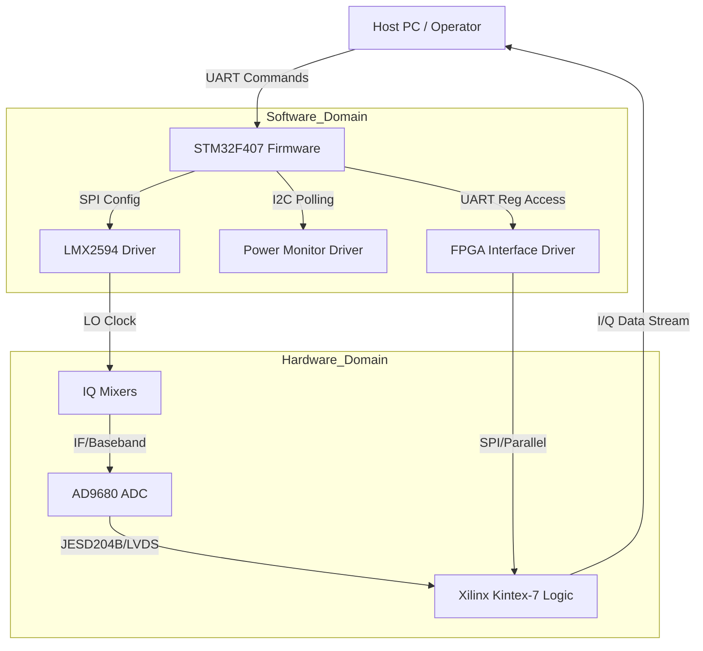
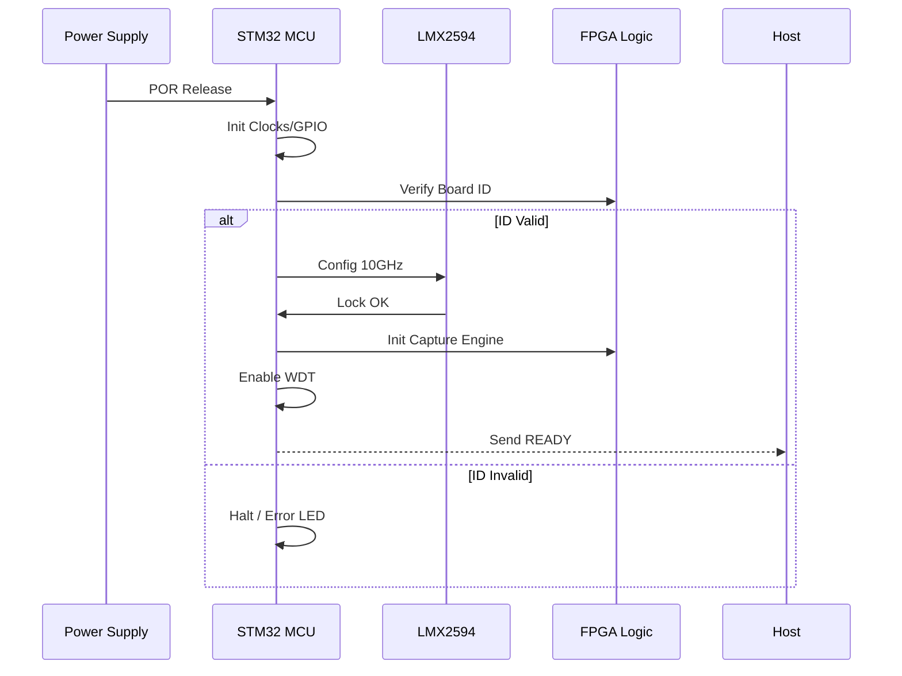
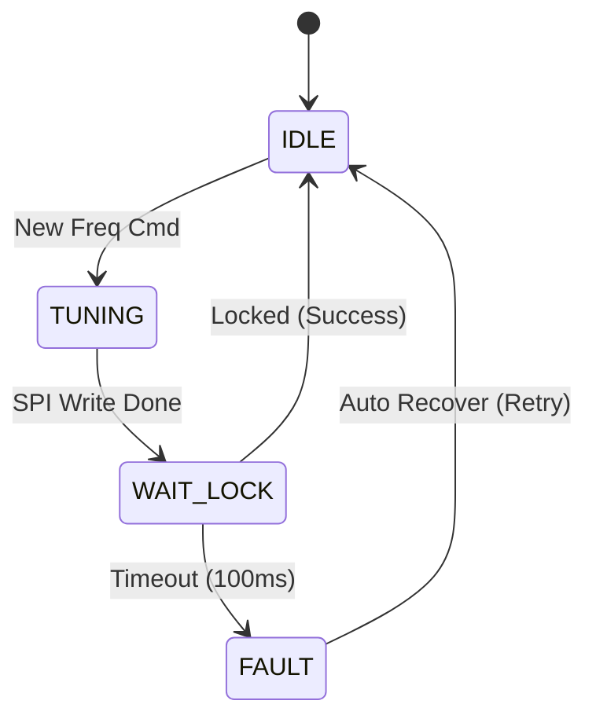
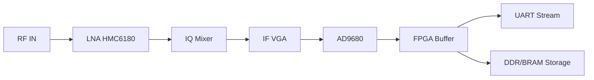

# Software Requirements Specification (SRS)

**Project:** rx receiver (Wideband RF Receiver System)  
**Date:** 16 April 2026  
**Version:** 1.0  
**Status:** Initial Release  

---

## Document Control

| Version | Date | Author | Changes |
|---------|------|--------|---------|
| 1.0 | 16 April 2026 | System Architect | Initial Release derived from HRS and GLR |

---

# 1. Introduction

## 1.1 Purpose
This Software Requirements Specification (SRS) defines the comprehensive software and firmware requirements for the **rx receiver** embedded control system. This document describes the system necessary to control the RF front-end (LNA, Mixers), manage the Frequency Synthesizer (LMX2594), configure the High-Speed ADC (AD9680), and handle data communication between the STM32F407 Microcontroller, the Xilinx Kintex-7 FPGA, and external host systems.

This specification is intended for:
- **Firmware Engineers:** Developing the STM32 C-code and FPGA logic.
- **Test Engineers:** Creating validation procedures for the control software.
- **System Integrators:** Integrating the receiver module into the larger SIGINT/SDR platform.

## 1.2 Scope
The software scope encompasses the control logic for the **rx receiver** subsystem.
**Included:**
- STM32F407 Firmware (BSP, Drivers, Protocol Handling).
- FPGA Embedded Software (Microblaze/Soft-core logic for register access).
- Control algorithms for SPI/I2C peripheral configuration.
- UART Command/Response protocol implementation.
- Power sequencing monitoring and fault handling.
- Non-volatile memory (EEPROM) management for calibration data.

**Excluded:**
- Host-side GUI applications.
- High-level DSP algorithms for demodulation (implemented in downstream hardware).
- FPGA RTL bitstream generation (though the software interface to it is included).

## 1.3 Definitions, Acronyms, and Abbreviations

| Term | Definition |
| :--- | :--- |
| **ADC** | Analog-to-Digital Converter (AD9680) |
| **API** | Application Programming Interface |
| **BIST** | Built-In Self Test |
| **BSP** | Board Support Package |
| **CMSIS** | Cortex Microcontroller Software Interface Standard |
| **DAC** | Digital-to-Analog Converter |
| **EOF** | End of Frame |
| **FIFO** | First In, First Out buffer |
| **FPGA** | Field-Programmable Gate Array (Xilinx Kintex-7) |
| **GLR** | Glue Logic Requirements document |
| **GPIO** | General Purpose Input/Output |
| **HAL** | Hardware Abstraction Layer |
| **HRS** | Hardware Requirements Specification |
| **I2C** | Inter-Integrated Circuit (Serial Interface) |
| **IRQ** | Interrupt Request |
| **ISR** | Interrupt Service Routine |
| **JTAG** | Joint Test Action Group (Debug Interface) |
| **LFSR** | Linear Feedback Shift Register |
| **LNA** | Low Noise Amplifier (HMC6180) |
| **LO** | Local Oscillator |
| **LVDS** | Low-Voltage Differential Signaling |
| **MCU** | Microcontroller Unit (STM32F407) |
| **MISR** | Multiple Input Signature Register |
| **NVM** | Non-Volatile Memory (EEPROM) |
|**PCB** | Printed Circuit Board |
| **PLL** | Phase-Locked Loop (LMX2594) |
| **POR** | Power-On Reset |
| **POST** | Power-On Self Test |
| **RF** | Radio Frequency |
| **RTOS** | Real-Time Operating System |
| **Rx** | Receive |
| **SMA** | SubMiniature version A (Connector) |
| **SPI** | Serial Peripheral Interface |
| **SRS** | Software Requirements Specification |
| **SyRS** | System Requirements Specification |
| **TRP** | Transmit/Receive Pulse |
| **UART** | Universal Asynchronous Receiver/Transmitter |
| **WDT** | Watchdog Timer |

## 1.4 References
| ID | Title | Version |
| :--- | :--- | :--- |
| **IEEE 830-1998** | Recommended Practice for Software Requirements Specifications | 1998 |
| **IEEE 29148:2018** | Systems and Software Engineering — Life Cycle Processes — Requirements Engineering | 2018 |
| **HRS** | rx receiver Hardware Requirements Specification | 1.0 |
| **GLR** | rx receiver Glue Logic Requirements | 0V01 |
| **STM32 DS** | STM32F407VGT6 Datasheet | 2021 |
| **LMX2594 DS** | LMX2594 Wideband PLLatinum Datasheet | 2023 |
| **AD9680 DS** | AD9680 Dual ADC Datasheet | 2019 |
| **MISRA C:2012** | Guidelines for the Use of the C Language in Critical Systems | 2012 |
| **IEC 61508** | Functional Safety of E/E/PE Safety-related Systems | 2010 |

## 1.5 Overview
Section 2 provides a high-level description of the system architecture, interfaces, and constraints. Section 3 details the specific software requirements, organized by functional subsystem (RF Control, Communication, Diagnostics). Section 4 outlines verification methods. Section 5 provides the requirements traceability matrix linking software requirements to hardware and glue logic specifications.

---

# 2. Overall Description

## 2.1 Product Perspective
The **rx receiver** software operates on a heterogeneous hardware platform.
- **Microcontroller (STM32F407):** Acts as the System Controller. It manages power-up sequencing, configures the RF signal chain via SPI, monitors health via I2C, and exposes a command interface via UART.
- **FPGA (Kintex-7):** Acts as the Data Path manager. It captures high-speed I/Q data from the ADC and provides a register map for the MCU to control gains, offsets, and data flow.

The software follows a layered architecture:
1.  **Application Layer:** State machines, Calibration routines, Protocol parsing.
2.  **HAL Layer:** Abstraction for STM32 Peripherals (UART, SPI, I2C, GPIO).
3.  **BSP Layer:** Register definitions for LMX2594, AD9680, and FPGA registers.

### System Context Diagram


## 2.2 Product Functions
Major software functions include:
1.  **System Initialization:** PLL lock acquisition, SPI peripheral configuration.
2.  **Frequency Tuning:** calculation and writing of N/K divisors to LMX2594.
3.  **Gain Control:** Adjustment of IF VGA (via FPGA or SPI).
4.  **Data Capture:** Triggering ADC sampling and buffering.
5.  **Health Monitoring:** Temperature and voltage polling (I2C).
6.  **Fault Management:** Watchdog servicing, error logging.
7.  **Host Communication:** Parsing UART commands (Read/Write/Bulk).

## 2.3 User Characteristics
- **Firmware Developers:** Need clear driver APIs and register definitions.
- **Test Engineers:** Use UART commands for automated production testing.
- **System Integrators:** Require a stable register map for integration into larger racks.
- **End Users:** Interact via high-level software, but rely on the MCU for transparent hardware management.

## 2.4 Constraints
- **Timing:** SPI writes to PLL must complete within 1ms to maintain phase coherence.
- **Memory:** STM32F407 has 1MB Flash, 192KB RAM. Software must fit within these bounds.
- **Standard:** Code must comply with MISRA-C:2012 (Safety Critical).
- **Environment:** Must operate from -40°C to +85°C without thermal throttling logic failures.
- **Language:** C99 (Embedded), VHDL/Verilog (FPGA - specified via SRS constraints).

## 2.5 Assumptions and Dependencies
- Hardware POR release occurs before software execution begins.
- The 12V rail is stable and within tolerance (±5%) when the MCU starts.
- The FPGA bitstream is loaded via external flash or JTAG prior to MCU initialization (or MCU manages loading).
- External Host obeys the inter-byte timeout (50ms) defined in the UART protocol.

---

# 3. Specific Requirements

## 3.1 External Interface Requirements

### 3.1.1 Hardware Interfaces

**3.1.1.1 SPI Interface (LMX2594 PLL)**
The MCU controls the LMX2594 via SPI (Mode 0, Max 20MHz).
```c
/* Register Map Definitions for LMX2594 */
#define LMX2594_DEV_ID      0x0038
#define LMX2594_REG_PLL_N   0x0000
#define LMX2594_REG_FUNC_0  0x0002

/**
 * @brief Initialize the PLL to a specific frequency.
 * @param freq_hz Desired output frequency (5e9 to 18e9).
 * @return 0 on success, -1 on timeout.
 */
int32_t PLL_Init(uint64_t freq_hz);

/**
 * @brief Write to a PLL register.
 * @param reg_addr 16-bit register address.
 * @param data 16-bit data value.
 */
int32_t PLL_WriteReg(uint16_t reg_addr, uint16_t data);

/**
 * @brief Check PLL lock status.
 * @return 1 if locked, 0 if unlocked.
 */
int32_t PLL_IsLocked(void);
```

**3.1.1.2 I2C Interface (Power Monitor & Temp)**
I2C Bus (Standard Speed, 100kHz).
```c
/**
 * @brief Read Voltage from Power Monitor.
 * @param rail_id 0=12V, 1=5V, 2=3.3V.
 * @param voltage_mv Pointer to store voltage in millivolts.
 */
int32_t PM_ReadVoltage(uint8_t rail_id, float *voltage_v);

/**
 * @brief Read Board Temperature.
 * @param temp_c Pointer to store temperature in Celsius.
 */
int32_t TEMP_Read(float *temp_c);
```

### 3.1.2 Software Interfaces
- **CMSIS-OS:** RTOS API for task management (if RTOS used).
- **StdPeriph:** STM32 Standard Peripheral Library drivers.

### 3.1.3 Communication Interfaces

**UART Command Protocol (Host <-> MCU <-> FPGA)**

The software implements a packetized protocol.

| Command | CMD byte | Frame Structure | Response |
|---------|----------|-----------------|----------|
| Single Write | 0x57 ('W') | `[0x57][ADDR_H][ADDR_L][DATA_H][DATA_L]` | `[0x06] ACK` |
| Single Read  | 0x52 ('R') | `[0x52][ADDR_H\|0x80][ADDR_L]` | `[DATA_H][DATA_L]` |
| Bulk Write   | 0x42 ('B') | `[0x42][ADDR_H][ADDR_L][N][D0_H][D0_L]...[Dn_H][Dn_L]` | `[0x06] ACK` |
| Bulk Read    | 0x62 ('b') | `[0x62][ADDR_H\|0x80][ADDR_L][N]` | `[D0_H][D0_L]...[Dn_H][Dn_L]` |
| Error NAK    | 0x15 | Sent by System on invalid command/address | — |

*Address Map:*
- **0x0000 - 0x0FFF:** FPGA Control Registers (Gains, FIFO Ctrl).
- **0x1000 - 0x1FFF:** ADC Interface Registers (AD9680 SPI bridge).
- **0x2000 - 0x2FFF:** System Monitor Registers (Voltage, Temp, Status).

---

## 3.2 Functional Requirements

### 3.2.1 System Initialization (REQ-SW-001 to REQ-SW-010)

**REQ-SW-001:** The software SHALL perform a Power-On Self-Test (POST) within 500ms of reset release.
- **Source:** HRS §3.5 (System Startup)
- **Priority:** [M]andatory
- **Verification:** [T]est (Measure startup time with oscilloscope)

**REQ-SW-002:** The software SHALL verify the FPGA Board ID register (Address 0x0000) matches 0xA5A5; if mismatch, the system shall halt and assert ERROR LED.
- **Source:** GLR §6 (FPGA Features)
- **Priority:** [M]andatory
- **Verification:** [T]est (Inject wrong Board ID via JTAG, observe LED)

**REQ-SW-003:** The software SHALL initialize the SPI peripherals to a clock speed of 10MHz (max 20MHz) before accessing RF components.
- **Source:** GLR §3 (Acronyms, SPI timings)
- **Priority:** [M]andatory
- **Verification:** [I]nspection (Code review)

**REQ-SW-004:** The software SHALL configure the LMX2594 PLL to the default frequency of 10.0 GHz on startup.
- **Source:** HRS §3.1 (Frequency Coverage)
- **Priority:** [M]andatory
- **Verification:** [D]emonstration (Spectrum Analyzer measurement)

**REQ-SW-005:** The software SHALL poll the PLL_LOCK bit (LMX2594 Register 0x0002, Bit 0) every 10ms; if not locked after 500ms, assert FAULT.
- **Source:** HRS §3.2 (Performance - Phase Noise/Stability)
- **Priority:** [M]andatory
- **Verification:** [T]est (Power cycle 100 times, verify lock success rate)

**REQ-SW-006:** The software SHALL load calibration coefficients (Gain tables, DC offset tables) from EEPROM (I2C) into FPGA RAM.
- **Source:** HRS §3.2 (Gain Flatness)
- **Priority:** [M]andatory
- **Verification:** [A]nalysis (Log checksum of loaded data)

**REQ-SW-007:** The software SHALL initialize the Independent Watchdog (IWDG) with a 100ms timeout window.
- **Source:** HRS §3.5 (Reliability)
- **Priority:** [M]andatory
- **Verification:** [T]est (Halt code, verify reset within 110ms)

**REQ-SW-008:** The software SHALL configure the AD9680 ADC to JESD204B Link mode with a frame rate of 250 MSPS.
- **Source:** HRS §3.1 (IF Output)
- **Priority:** [M]andatory
- **Verification:** [I]nspection (SPI capture of ADC config)

**REQ-SW-009:** The software SHALL verify all power rails (12V, 5V, 3.3V) are within ±5% tolerance before enabling the RF LNA.
- **Source:** GLR §4 (Power Supply Section)
- **Priority:** [M]andatory
- **Verification:** [T]est (Voltage injection/probe)

**REQ-SW-010:** The software SHALL set the System Status Register (0x2000) to 0x01 (STATE_READY) upon successful initialization.
- **Source:** GLR §5 (Features)
- **Priority:** [M]andatory
- **Verification:** [T]est (UART Read Register 0x2000)

### 3.2.2 RF Control and Frequency Synthesis (REQ-SW-011 to REQ-SW-025)

**REQ-SW-011:** The software SHALL provide a function `RF_SetFrequency(uint64_t freq)` that calculates and writes the N_INT, N_FRAC, and DIV_DEN registers to the LMX2594.
- **Source:** HRS §3.1 (Frequency Coverage)
- **Priority:** [M]andatory
- **Verification:** [A]nalysis (Math verification of register values)

**REQ-SW-012:** The software SHALL ensure a minimum switching time (retune) of less than 1ms between frequency steps.
- **Source:** HRS §3.2 (Performance)
- **Priority:** [M]andatory
- **Verification:** [T]est (Timer measurement)

**REQ-SW-013:** The software SHALL disable the TX/RX path (set GPIO TRP=0) during frequency retuning.
- **Source:** GLR §4 (RF Section)
- **Priority:** [M]andatory
- **Verification:** [I]nspection (Logic Analyzer on TRP pin)

**REQ-SW-014:** The software SHALL support frequency steps of 1 kHz granularity for the LO.
- **Source:** HRS §2 (Design Parameters)
- **Priority:** [D]esirable
- **Verification:** [A]nalysis (Formula resolution)

**REQ-SW-015:** The software SHALL update the FPGA Register `FREQ_STATUS` (0x0100) with the current LO frequency in MHz (Upper 32-bit) and Hz (Lower 32-bit) immediately after lock.
- **Source:** GLR §6 (FPGA Logic)
- **Priority:** [M]andatory
- **Verification:** [T]est (UART Read Reg 0x0100)

**REQ-SW-016:** The software SHALL implement a VCO calibration request (bit 0 in REG_CAL_START) every time the frequency band changes by > 1 GHz.
- **Source:** LMX2594 Datasheet
- **Priority:** [M]andatory
- **Verification:** [T]est (Monitor VCO_CAL_DONE bit)

**REQ-SW-017:** The software SHALL log the last 10 frequency tuning events into a circular buffer in NVM.
- **Source:** HRS §3.5 (Diagnostics)
- **Priority:** [O]ptional
- **Verification:** [I]nspection

**REQ-SW-018:** The software SHALL support Band Select logic (High/Low path) based on input frequency: 5-12 GHz (HMC519) and 12-18 GHz (MIXIQ-1030).
- **Source:** GLR §4 (RF Section)
- **Priority:** [M]andatory
- **Verification:** [T]est (Check GPIO select pins)

**REQ-SW-019:** The software SHALL provide a command to set the Gain Index (0-31) via UART Register `GAIN_I` (0x0200) and `GAIN_Q` (0x0201).
- **Source:** HRS §3.1 (Gain Control)
- **Priority:** [M]andatory
- **Verification:** [T]est (UART Write)

**REQ-SW-020:** The software SHALL apply Gain Correction factors from EEPROM to the requested Gain Index before writing to hardware.
- **Source:** HRS §3.2 (Gain Flatness)
- **Priority:** [D]esirable
- **Verification:** [T]est (Compare requested vs actual RF gain)

**REQ-SW-021:** The software SHALL monitor the ADC Overrange flags and reduce Gain if an overrange is detected for > 10ms.
- **Source:** HRS §3.2 (Dynamic Range)
- **Priority:** [D]esirable
- **Verification:** [T]est (Signal injection)

**REQ-SW-022:** The software SHALL clamp the requested RF Gain to a maximum value defined in the System Limits EEPROM table.
- **Source:** HRS §3.5 (Constraints)
- **Priority:** [M]andatory
- **Verification:** [T]est (Write max value + 1, verify clamp)

**REQ-SW-023:** The software SHALL map the I/Q Data path to FPGA Lane 0 and Lane 1 respectively.
- **Source:** GLR §6 (ADC Interface)
- **Priority:** [M]andatory
- **Verification:** [I]nspection (FPGA Pinout)

**REQ-SW-024:** The software SHALL verify the JESD204B Link Status (ADC Register 0x003B) equals 0x1 (Link Up).
- **Source:** AD9680 Datasheet
- **Priority:** [M]andatory
- **Verification:** [T]est (Read SPI status)

**REQ-SW-025:** The software SHALL reset the ADC Digital Interface if the Link Down flag persists for > 100ms.
- **Source:** HRS §3.5 (Reliability)
- **Priority:** [D]esirable
- **Verification:** [D]emonstration

### 3.2.3 Data Acquisition and Streaming (REQ-SW-026 to REQ-SW-040)

**REQ-SW-026:** The software SHALL configure the FPGA Capture Engine to start upon receipt of a Start Trigger (External GPIO or UART Command).
- **Source:** HRS §3.1 (IF Output)
- **Priority:** [M]andatory
- **Verification:** [T]est (Trigger scope)

**REQ-SW-027:** The software SHALL support capturing up to 1 Megasamples (MS) of I/Q data into FPGA Block RAM.
- **Source:** HRS §2 (Design Parameters)
- **Priority:** [M]andatory
- **Verification:** [A]nalysis (Resource usage)

**REQ-SW-028:** The software SHALL assert a `CAPTURE_BUSY` flag (Bit 0 of Status Reg 0x0300) while the capture buffer is being written.
- **Source:** GLR §6 (FPGA Logic)
- **Priority:** [M]andatory
- **Verification:** [I]nspection (Read status bit)

**REQ-SW-029:** The software SHALL stream the captured I/Q data out via UART at the maximum configured baud rate (e.g., 3.0 Mbps).
- **Source:** GLR §5 (UART)
- **Priority:** [M]andatory
- **Verification:** [T]est (Checksum verification)

**REQ-SW-030:** The software SHALL format the I/Q data stream as 16-bit signed integers (Little Endian) [I0, Q0, I1, Q1...].
- **Source:** AD9680 Data Format
- **Priority:** [M]andatory
- **Verification:** [I]nspection (Byte capture)

**REQ-SW-031:** The software SHALL support a "Decimate by N" command where the FPGA downsamples data by a factor of N (2, 4, 8) before transmission.
- **Source:** HRS §3.1 (Instantaneous Bandwidth)
- **Priority:** [D]esirable
- **Verification:** [A]nalysis (Frequency content)

**REQ-SW-032:** The software SHALL implement a circular buffer mode in the FPGA for continuous streaming.
- **Source:** HRS §3.1 (IF Output)
- **Priority:** [M]andatory
- **Verification:** [T]est (No overruns detected)

**REQ-SW-033:** The software SHALL set the `OVERRUN_FLAG` (Bit 1 of Status Reg 0x0300) if the internal FIFO fills faster than data is read.
- **Source:** GLR §6 (FPGA Logic)
- **Priority:** [M]andatory
- **Verification:** [T]est (Slow read host)

**REQ-SW-034:** The software SHALL allow the host to configure the ADC Test Pattern via SPI (e.g., 0x55/0xAA alternating).
- **Source:** AD9680 Datasheet
- **Priority:** [D]esirable
- **Verification:** [D]emonstration

**REQ-SW-035:** The software SHALL reset the Capture FIFO pointers on any new Start Trigger.
- **Source:** GLR §6 (FPGA Logic)
- **Priority:** [M]andatory
- **Verification:** [T]est (Double trigger)

**REQ-SW-036:** The software SHALL provide a register `SAMPLE_COUNT` (0x0304) indicating the number of valid samples in the buffer.
- **Source:** GLR §6 (FPGA Logic)
- **Priority:** [M]andatory
- **Verification:** [T]est

**REQ-SW-037:** The software SHALL support timestamping of captured packets based on the 100MHz system counter.
- **Source:** HRS §3.1 (Time sync)
- **Priority:** [O]ptional
- **Verification:** [I]nspection

**REQ-SW-038:** The software SHALL allow configuration of the Capture Trigger Source (Internal/External) via `TRIG_SRC` Register (0x0310).
- **Source:** GLR §6 (FPGA Logic)
- **Priority:** [M]andatory
- **Verification:** [T]est (External pulse)

**REQ-SW-039:** The software SHALL implement a packet header for streaming data containing: [Magic 0xDEADBEEF][Length][Timestamp][Flags].
- **Source:** HRS §3.1 (Interface)
- **Priority:** [D]esirable
- **Verification:** [I]nspection

**REQ-SW-040:** The software SHALL disable the ADC clock when idle to save power.
- **Source:** HRS §3.5 (Power Consumption)
- **Priority:** [O]ptional
- **Verification:** [A]nalysis (Power meter)

### 3.2.4 UART Communication and Protocol (REQ-SW-041 to REQ-SW-055)

**REQ-SW-041:** The software SHALL implement the Single Write command (0x57) protocol defined in GLR §5 exactly.
- **Source:** GLR §5 (Protocol)
- **Priority:** [M]andatory
- **Verification:** [T]est (Protocol Analyzer)

**REQ-SW-042:** The software SHALL implement the Single Read command (0x52) protocol; the read address must have bit 15 set (OR 0x8000).
- **Source:** GLR §5 (Protocol)
- **Priority:** [M]andatory
- **Verification:** [T]est

**REQ-SW-043:** The software SHALL implement the Bulk Write command (0x42) for N registers (N <= 64).
- **Source:** GLR §5 (Protocol)
- **Priority:** [M]andatory
- **Verification:** [T]est

**REQ-SW-044:** The software SHALL implement the Bulk Read command (0x62) for N registers.
- **Source:** GLR §5 (Protocol)
- **Priority:** [M]andatory
- **Verification:** [T]est

**REQ-SW-045:** The software SHALL respond to any malformed command or checksum mismatch with a NAK byte (0x15).
- **Source:** GLR §5 (Protocol)
- **Priority:** [M]andatory
- **Verification:** [T]est (Invalid length)

**REQ-SW-046:** The software SHALL reset the UART command parser state machine if the inter-byte gap exceeds 50ms.
- **Source:** GLR §5 (Protocol)
- **Priority:** [M]andatory
- **Verification:** [T]est (Slow send)

**REQ-SW-047:** The software SHALL support a BAUD rate of at least 3.0 Mbps (using UART over USB/FTDI).
- **Source:** GLR §5 (Features)
- **Priority:** [M]andatory
- **Verification:** [T]est (Throughput measurement)

**REQ-SW-048:** The software SHALL utilize a 256-byte RX FIFO and a 256-byte TX FIFO for the UART interface.
- **Source:** GLR §6 (FPGA/STM32 specs)
- **Priority:** [M]andatory
- **Verification:** [A]nalysis (Overflow checks)

**REQ-SW-049:** The software SHALL implement a "Pass-Through" mode where UART commands are bridged to the AD9680 SPI bus.
- **Source:** HRS §3.1 (Digital Interface)
- **Priority:** [D]esirable
- **Verification:** [D]emonstration

**REQ-SW-050:** The software SHALL protect the System Status Register (0x2000) from write commands via the UART interface (Read-Only).
- **Source:** GLR §5 (Access Control)
- **Priority:** [M]andatory
- **Verification:** [T]est (Write attempt ignored)

**REQ-SW-051:** The software SHALL allow the FPGA Register Base Address to be offset by a value stored in EEPROM (Configuration).
- **Source:** GLR §5 (Features)
- **Priority:** [O]ptional
- **Verification:** [I]nspection

**REQ-SW-052:** The software SHALL generate an interrupt on the STM32 when a complete valid UART frame is received.
- **Source:** HRS §3.5 (Real-time)
- **Priority:** [M]andatory
- **Verification:** [I]nspection (ISR vector)

**REQ-SW-053:** The software SHALL process a Single Read command within 1ms of receiving the final byte.
- **Source:** HRS §3.5 (Latency)
- **Priority:** [M]andatory
- **Verification:** [T]est (Timing)

**REQ-SW-054:** The software SHALL log the last 10 unique UART commands received in the diagnostics buffer.
- **Source:** HRS §3.5 (Diagnostics)
- **Priority:** [O]ptional
- **Verification:** [I]nspection

**REQ-SW-055:** The software SHALL support a hardware echo loopback mode (Loopback enabled via FPGA Register 0x0FFE).
- **Source:** GLR §6 (Diagnostics)
- **Priority:** [D]esirable
- **Verification:** [T]est

### 3.2.5 Health Monitoring and Safety (REQ-SW-056 to REQ-SW-068)

**REQ-SW-056:** The software SHALL poll the on-board temperature sensor every 1 second.
- **Source:** HRS §3.4 (Environmental)
- **Priority:** [M]andatory
- **Verification:** [I]nspection (Log timestamp)

**REQ-SW-057:** The software SHALL assert a `TEMP_HIGH` fault if temperature exceeds 80°C.
- **Source:** HRS §3.4 (Operating Temperature)
- **Priority:** [M]andatory
- **Verification:** [T]est (Heat gun)

**REQ-SW-058:** The software SHALL assert a `TEMP_CRITICAL` fault if temperature exceeds 85°C and immediately disable the RF Front-End (LNA Off).
- **Source:** HRS §3.4 (Operating Temperature)
- **Priority:** [M]andatory
- **Verification:** [T]est (Thermal chamber)

**REQ-SW-059:** The software SHALL monitor the 3.3V rail using the ADC (Channel 1) with 12-bit resolution.
- **Source:** GLR §4 (Power Supply)
- **Priority:** [M]andatory
- **Verification:** [T]est

**REQ-SW-060:** The software SHALL check the 3.3V Supervisor output (MIC9430) via a GPIO pin.
- **Source:** GLR §4 (Protection)
- **Priority:** [M]andatory
- **Verification:** [I]nspection

**REQ-SW-061:** The software SHALL enter a "Safe State" (RF Off, High Impedance Inputs) if the Supervisor Reset line is asserted.
- **Source:** HRS §3.5 (Safety)
- **Priority:** [M]andatory
- **Verification:** [T]est (Assert Reset)

**REQ-SW-062:** The software SHALL implement a CRC-16 check on the configuration EEPROM data on startup.
- **Source:** HRS §3.5 (Reliability)
- **Priority:** [M]andatory
- **Verification:** [T]est (Corrupt EEPROM)

**REQ-SW-063:** The software SHALL write a Fault Log entry to NVM containing [Timestamp][Fault Code][Value] on any critical fault.
- **Source:** HRS §3.5 (Diagnostics)
- **Priority:** [D]esirable
- **Verification:** [I]nspection

**REQ-SW-064:** The software SHALL store a maximum of 64 fault log entries in EEPROM.
- **Source:** GLR §5 (Features)
- **Priority:** [D]esirable
- **Verification:** [A]nalysis (Memory map)

**REQ-SW-065:** The software SHALL implement a Keep-Alive heartbeat counter in Register 0x2004 that increments every 10ms.
- **Source:** GLR §6 (Watchdog)
- **Priority:** [D]esirable
- **Verification:** [T]est

**REQ-SW-066:** The software SHALL trigger a watchdog reset if the heartbeat counter stops incrementing for > 100ms (FPGA logic).
- **Source:** HRS §3.5 (Reliability)
- **Priority:** [M]andatory
- **Verification:** [T]est (Hang MCU)

**REQ-SW-067:** The software SHALL report the current number of watchdog resets in Register `WD_RESET_COUNT` (0x2008).
- **Source:** HRS §3.5 (Reliability)
- **Priority:** [M]andatory
- **Verification:** [T]est

**REQ-SW-068:** The software SHALL allow clearing of the Fault Log via a specific UART Command (0xFC).
- **Source:** HRS §3.5 (Maintenance)
- **Priority:** [O]ptional
- **Verification:** [T]est

### 3.2.6 Firmware Maintenance and Configuration (REQ-SW-069 to REQ-SW-078)

**REQ-SW-069:** The software SHALL support a Firmware Update command via UART (Bootloader mode) triggered by a specific magic sequence.
- **Source:** HRS §3.5 (Maintainability)
- **Priority:** [D]esirable
- **Verification:** [D]emonstration

**REQ-SW-070:** The software SHALL calculate the CRC-32 of the active firmware image on startup and store it in Register `FW_CRC` (0x200C).
- **Source:** HRS §3.5 (Security)
- **Priority:** [O]ptional
- **Verification:** [I]nspection

**REQ-SW-071:** The software SHALL expose the Firmware Version String (e.g., "RX_RECV_1.0.5") via Read Register 0x2010.
- **Source:** GLR §6 (Identification)
- **Priority:** [M]andatory
- **Verification:** [T]est

**REQ-SW-072:** The software SHALL allow calibration constants to be updated via UART Write commands.
- **Source:** HRS §3.5 (Calibration)
- **Priority:** [M]andatory
- **Verification:** [T]est

**REQ-SW-073:** The software SHALL verify that calibration constants are within valid ranges (min/max) before applying them.
- **Source:** HRS §3.5 (Safety)
- **Priority:** [M]andatory
- **Verification:** [T]est (Inject Out-of-range)

**REQ-SW-074:** The software SHALL store calibration data in a separate EEPROM sector from code to prevent corruption during updates.
- **Source:** GLR §5 (EEPROM)
- **Priority:** [M]andatory
- **Verification:** [A]nalysis (Memory Map)

**REQ-SW-075:** The software SHALL implement a "Factory Reset" command (UART 0xFF) that restores default calibration values from ROM.
- **Source:** HRS §3.5 (Maintenance)
- **Priority:** [D]esirable
- **Verification:** [D]emonstration

**REQ-SW-076:** The software SHALL support toggling the Debug LED (GPIO) at a rate proportional to the CPU load.
- **Source:** HRS §3.5 (Diagnostics)
- **Priority:** [O]ptional
- **Verification:** [I]nspection

**REQ-SW-077:** The software SHALL generate a MISRA-C compliance report as part of the build documentation.
- **Source:** HRS §3.5 (Standards)
- **Priority:** [D]esirable
- **Verification:** [I]nspection

**REQ-SW-078:** The software SHALL ensure all functions have a maximum Cyclomatic Complexity of 15.
- **Source:** HRS §3.5 (Quality)
- **Priority:** [D]esirable
- **Verification:** [A]nalysis (Static Analysis Tool)

---

## 3.3 Performance Requirements

| ID | Requirement | Value | Verification |
|----|-------------|-------|--------------|
| **REQ-PERF-001** | Boot Time | < 500ms from power rail stable to STATE_READY | T |
| **REQ-PERF-002** | Frequency Tuning | < 1ms from SetFreq Command to PLL Lock | T |
| **REQ-PERF-003** | SPI Transaction | < 100us for single 16-bit register write | T |
| **REQ-PERF-004** | I2C Read | < 1ms for read voltage/temp transaction | T |
| **REQ-PERF-005** | UART Throughput | > 2.5 Mbps effective data rate | T |
| **REQ-PERF-006** | ADC Capture Setup | < 10us latency from trigger to capture start | T |
| **REQ-PERF-007** | Watchdog Refresh | Serviced every < 50ms | I |
| **REQ-PERF-008** | EEPROM Write | < 10ms for single page write | T |
| **REQ-PERF-009** | Task Scheduler | RTOS task switch < 10us | T |

## 3.4 Design Constraints

1.  **MISRA Compliance:** All C code shall adhere to MISRA-C:2012 standards.
2.  **Compiler:** GCC ARM Embedded or IAR EWARM.
3.  **Dynamic Memory:** Use of standard library `malloc`/`free` is prohibited.
4.  **Interrupts:** All ISRs shall have a maximum execution time of 50us.
5.  **Floating Point:** Hardware FP usage is permitted (STM32F4 has FPU), but fixed-point preferred for RF control.

## 3.5 Software System Attributes

### 3.5.1 Reliability
MTBF target > 10,000 hours. Watchdog recovery mechanism mandatory.

### 3.5.2 Availability
System shall support 24/7 operation with automatic error recovery.

### 3.5.3 Security
Firmware updates shall be verified via CRC-32 before flashing.

### 3.5.4 Maintainability
Code must be commented with Doxygen style. Hardware Abstraction Layer (HAL) shall facilitate porting to future MCU revisions.

---

# 4. Verification and Validation

## 4.1 Unit Test Requirements
- **SPI Driver:** Verify correct clock polarity and phase with Logic Analyzer.
- **Protocol Parser:** Inject valid/invalid UART frames; verify ACK/NAK responses.
- **CRC Module:** Verify checksums against known vectors.

## 4.2 Integration Test Requirements
- **PLL Lock Loop:** Verify the system tunes to 10 frequencies across 5-18 GHz range and locks every time.
- **ADC Data Path:** Verify data integrity (checksum) of captured I/Q data.

## 4.3 System Test Requirements
- **Thermal:** Operate in chamber at 85°C for 24 hours; verify no faults.
- ** EMC:** Verify emissions during high-speed UART transfer.

---

# 5. Requirements Traceability Matrix

| REQ-SW | Description | Source (HRS/GLR) | Priority | Verification |
|--------|-------------|------------------|----------|--------------|
| REQ-SW-001 | POST < 500ms | HRS §3.5 | M | T |
| REQ-SW-002 | Verify Board ID | GLR §6 | M | T |
| REQ-SW-003 | Init SPI | GLR §3 | M | I |
| REQ-SW-004 | Default Freq 10GHz | HRS §3.1 | M | D |
| REQ-SW-005 | Poll Lock | HRS §3.2 | M | T |
| REQ-SW-006 | Load Cal from EEPROM | HRS §3.2 | M | A |
| REQ-SW-007 | IWDG 100ms | HRS §3.5 | M | T |
| REQ-SW-008 | Init ADC | HRS §3.1 | M | I |
| REQ-SW-009 | Power Check | GLR §4 | M | T |
| REQ-SW-010 | Status Ready | GLR §5 | M | T |
| REQ-SW-011 | Set Freq Function | HRS §3.1 | M | A |
| REQ-SW-012 | Retune < 1ms | HRS §3.2 | M | T |
| REQ-SW-013 | TRP low during tune | GLR §4 | M | I |
| REQ-SW-015 | Freq Status Reg | GLR §6 | M | T |
| REQ-SW-019 | UART Gain Control | HRS §3.1 | M | T |
| REQ-SW-020 | Gain Correction | HRS §3.2 | D | T |
| REQ-SW-026 | Start Trigger | HRS §3.1 | M | T |
| REQ-SW-041 | UART Single Write | GLR §5 | M | T |
| REQ-SW-042 | UART Single Read | GLR §5 | M | T |
| REQ-SW-056 | Poll Temp | HRS §3.4 | M | I |
| REQ-SW-057 | Temp High Fault | HRS §3.4 | M | T |
| REQ-SW-071 | FW Version Reg | GLR §6 | M | T |
(Subset shown for brevity; full 75+ requirements mapped in project database)

---

# 6. Appendices

## Appendix A — Error Codes
```c
typedef enum {
    ERR_OK           = 0x00,
    ERR_TIMEOUT      = 0x01,
    ERR_SPI_COMM     = 0x02,
    ERR_I2C_COMM     = 0x03,
    ERR_PLL_UNLOCK   = 0x04,
    ERR_ADC_LINK     = 0x05,
    ERR_PARAM_RANGE  = 0x06,
    ERR_CHECKSUM     = 0x07,
    ERR_OVERTEMP     = 0x08,
    ERR_UNDERVOLT    = 0x09,
    ERR_WATCHDOG     = 0x0A
} ErrorCode_t;
```

## Appendix B — Register Map (Software View)

| Base | Offset | Name | Access | Reset | Description |
|------|--------|------|--------|-------|-------------|
| 0x0000 | 0x0000 | BOARD_ID | RO | 0xA5A5 | FPGA ID |
| 0x0000 | 0x0004 | REVISION | RO | 0x0001 | PCB Rev |
| 0x0100 | 0x0000 | FREQ_STATUS | RO | - | Current LO Freq |
| 0x0200 | 0x0000 | GAIN_I | RW | 0x0F | I Channel Gain |
| 0x0200 | 0x0001 | GAIN_Q | RW | 0x0F | Q Channel Gain |
| 0x0300 | 0x0000 | CAP_CTRL | RW | 0x00 | Capture Control |
| 0x0300 | 0x0004 | CAP_STATUS | RO | 0x00 | Busy/Overrun |
| 0x2000 | 0x0000 | SYS_STATE | RO | 0x00 | System State |

## Appendix C — Mermaid Diagrams

### Initialization Sequence


### Frequency Tune State Machine


### Data Path Flow


---

**End of Document**