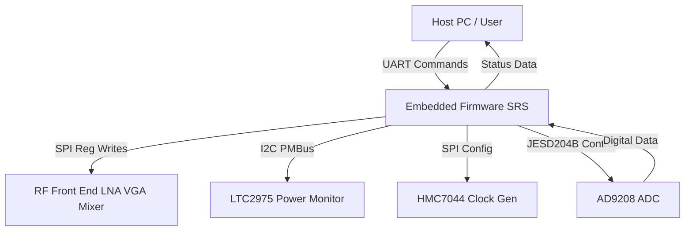
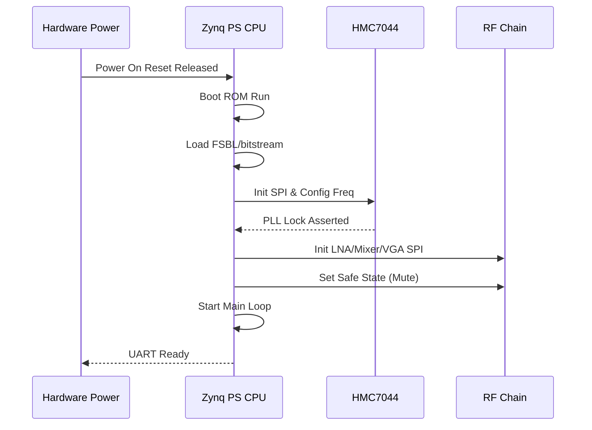
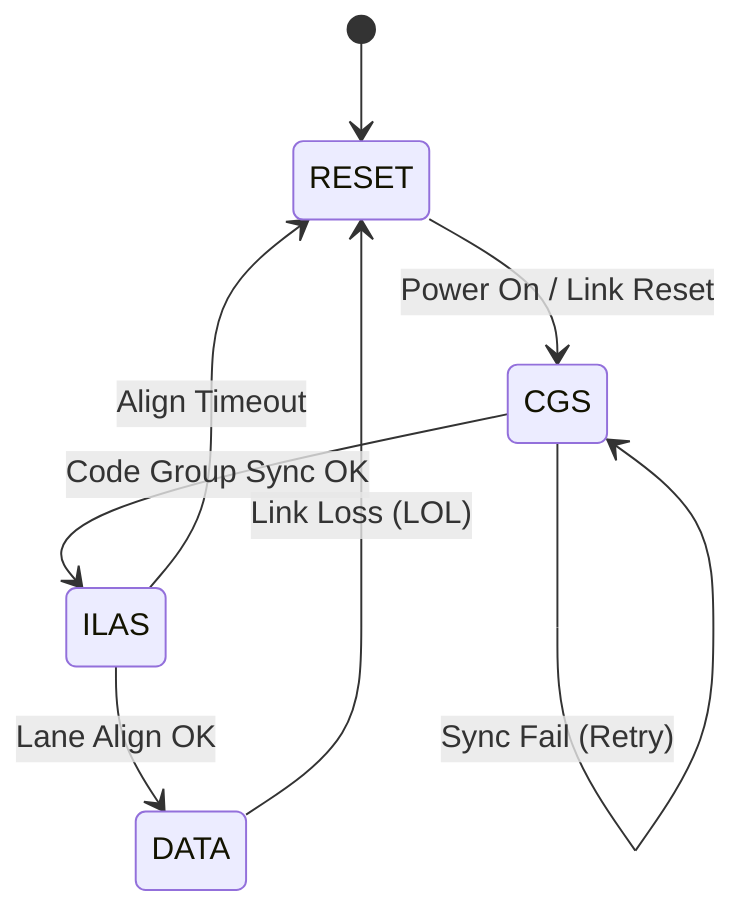
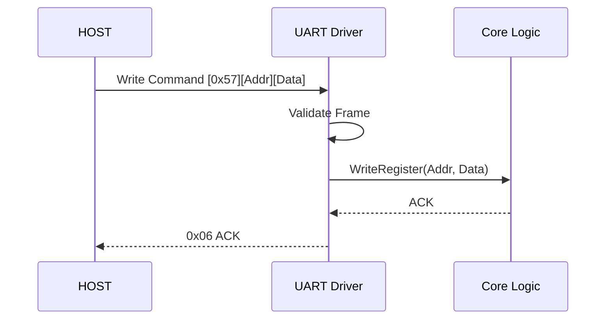
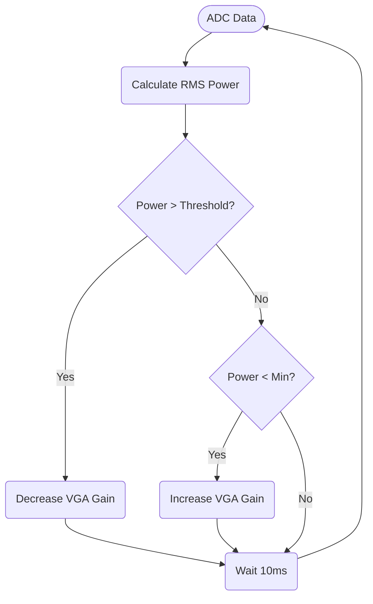
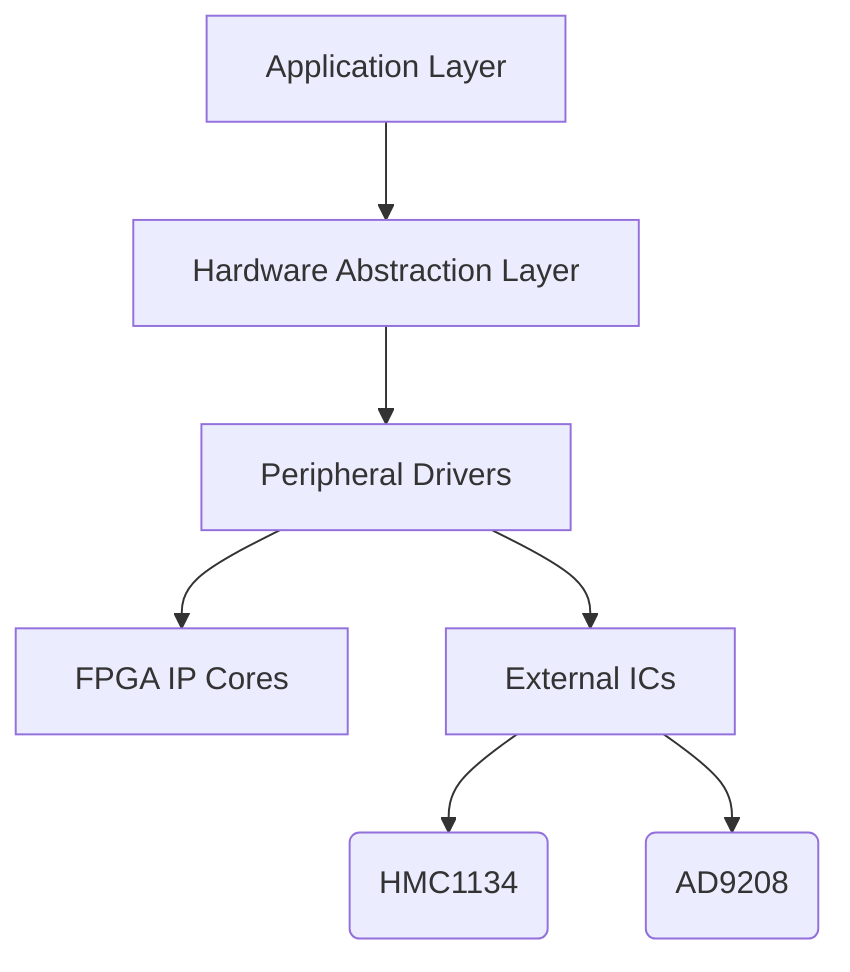

# Software Requirements Specification (SRS)

**Project:** Wideband RF Receiver System (sample)  
**Document ID:** SRS-001  
**Version:** 1.0  
**Date:** 16 April 2026  
**Author:** System Architecture Team  

---

## Document Control
| Version | Date | Author | Changes |
|---------|------|--------|---------|
| 1.0 | 16 April 2026 | Lead Architect | Initial Release derived from HRS P2 and GLR P6 |

---

# 1. Introduction

## 1.1 Purpose
This Software Requirements Specification (SRS) defines the comprehensive software and firmware requirements for the **Wideband RF Receiver System**. This document specifies the requirements for the embedded firmware running on the Xilinx Zynq UltraScale+ FPGA (XCZU2CG-1SFVC784E) and the associated microcontroller software (if applicable) responsible for system initialization, control loop execution, and data path management.

The purpose of this SRS is to:
*   Define the behavioral and functional requirements of the firmware.
*   Serve as the baseline for software design, coding, and unit testing.
*   Establish traceability between high-level system requirements and low-level software implementation.
*   Ensure compliance with IEEE 830-1998 and ISO/IEC/IEEE 29148:2018 standards.

This document is intended for firmware engineers, system integrators, test engineers, and quality assurance personnel.

## 1.2 Scope
The software scope encompasses the control and management of the RF receiver hardware. Key functional areas include:
*   **System Initialization:** Power sequencing, clock tree stabilization (HMC7044), and FPGA configuration.
*   **RF Path Control:** SPI-based configuration of the LNA (HMC1134), Mixer (HMC559), and VGA (AD8376).
*   **Data Acquisition:** Management of the JESD204B interface between the AD9208 ADC and the FPGA GTY transceivers.
*   **Environmental Monitoring:** I2C-based polling of the LTC2975 power controller for voltage, current, and thermal data.
*   **Host Communication:** UART command interface for register access and status reporting per the Glue Logic Requirements (GLR).
*   **Fault Management:** Watchdog timer servicing and error logging to non-volatile memory.

**Exclusions:** This specification does not cover the RTL design for the JESD204B IP core (treated as a black-box hardware component) or the host PC application software.

## 1.3 Definitions, Acronyms, and Abbreviations

| Term | Definition |
| :--- | :--- |
| **ADC** | Analog-to-Digital Converter |
| **AGC** | Automatic Gain Control |
| **API** | Application Programming Interface |
| **BER** | Bit Error Rate |
| **BIST** | Built-In Self-Test |
| **BSP** | Board Support Package |
| **CE RED** | Radio Equipment Directive (Compliance) |
| **CRC** | Cyclic Redundancy Check |
| **DAC** | Digital-to-Analog Converter |
| **DMA** | Direct Memory Access |
| **DSP** | Digital Signal Processing |
| **EMC** | Electromagnetic Compatibility |
| **EEPROM** | Electrically Erasable Programmable Read-Only Memory |
| **ENOB** | Effective Number of Bits |
| **FIFO** | First-In, First-Out Buffer |
| **FPGA** | Field Programmable Gate Array |
| **GLR** | Glue Logic Requirements |
| **GPIO** | General Purpose Input/Output |
| **GSPS** | Giga-Samples Per Second |
| **GTY** | Xilinx High-Performance Transceiver |
| **HAL** | Hardware Abstraction Layer |
| **HRS** | Hardware Requirements Specification |
| **I2C** | Inter-Integrated Circuit (Serial Bus) |
| **IPC** | Inter-Process Communication |
| **ISR** | Interrupt Service Routine |
| **JESD** | JESD204 Standard (High-speed data converter interface) |
| **JTAG** | Joint Test Action Group |
| **LNA** | Low Noise Amplifier |
| **LVDS** | Low-Voltage Differential Signaling |
| **MCU** | Microcontroller Unit |
| **MISRA** | Motor Industry Software Reliability Association (Coding Standard) |
| **NVM** | Non-Volatile Memory |
| **PLL** | Phase-Locked Loop |
| **POST** | Power-On Self-Test |
| **PMBus** | Power Management Bus |
| **RF** | Radio Frequency |
| **RTL** | Register Transfer Level |
| **RTOS** | Real-Time Operating System |
| **SFDR** | Spurious-Free Dynamic Range |
| **SIL** | Safety Integrity Level |
| **SNR** | Signal-to-Noise Ratio |
| **SPI** | Serial Peripheral Interface |
| **StRS** | Stakeholder Requirements Specification |
| **SyRS** | System Requirements Specification |
| **TRP** | Transmit/Receive Point (RF Control) |
| **UART** | Universal Asynchronous Receiver-Transmitter |
| **VGA** | Variable Gain Amplifier |
| **WDT** | Watchdog Timer |

## 1.4 References
1.  **IEEE Std 830-1998:** Recommended Practice for Software Requirements Specifications.
2.  **ISO/IEC/IEEE 29148:2018:** Systems and Software Engineering — Life Cycle Processes — Requirements Engineering.
3.  **IEEE 1016-2009:** Standard for Software Design Descriptions.
4.  **MISRA C:2012:** Guidelines for the Use of the C Language in Critical Systems.
5.  **HRS P2:** Hardware Requirements Specification (Project: sample), 16 April 2026.
6.  **GLR P6:** Glue Logic Requirements (Project: sample), 16 April 2026.
7.  **AD9208 Datasheet:** Dual, 12-Bit, 3 GSPS ADC, JESD204B/C, Analog Devices.
8.  **HMC7044 Datasheet:** Ultra-Low Phase Noise Fractional-N PLL, Analog Devices.
9.  **LTC2975 Datasheet:** Power Controller (PMBus), Analog Devices.
10. **XCZU2CG Datasheet:** Zynq UltraScale+ CG SoC, Xilinx/AMD.
11. **JESD204B Standard:** JEDEC Solid State Technology Association.

## 1.5 Overview
The remainder of this document is organized as follows:
*   **Section 2 (Overall Description)**: Describes the product perspective, functions, and operational context. It defines the software stack layers (Application, HAL, Drivers).
*   **Section 3 (Specific Requirements)**: Contains the detailed external interface requirements and the functional requirements (REQ-SW-001 to REQ-SW-075+).
*   **Section 4 (Verification and Validation)**: Outlines the testing strategy for unit, integration, and system levels.
*   **Section 5 (Traceability Matrix)**: Maps software requirements to hardware requirements and GLR sources.
*   **Appendices**: Provides register maps, error codes, and state machine diagrams.

---

# 2. Overall Description

## 2.1 Product Perspective
The Wideband RF Receiver System is a hierarchical embedded system. The software acts as the control logic bridging the Host System (User) and the Analog/Digital Hardware.

**System Context:**


**Software Stack Layers:**
1.  **Application Layer:** Implements main control loop, AGC algorithms, and UART command parsing.
2.  **HAL Layer:** Provides standardized APIs for SPI, I2C, UART, and GPIO.
3.  **BSP/Driver Layer:** Xilinx Standalone drivers or bare-metal drivers for Zynq PS/PL interfaces.

## 2.2 Product Functions
1.  **System Initialization:** Execute POST, configure PLLs, bring up JESD204B link.
2.  **UART Command Handler:** Parse host commands (Read/Write) to access FPGA registers and peripheral parameters.
3.  **AGC Control Loop:** Adjust AD8376 VGA gain based on ADC signal power to prevent saturation.
4.  **Frequency Tuning:** Set HMC7044 PLL frequency and HMC1118 band selection based on user input.
5.  **Health Monitoring:** Poll LTC2975 via I2C for over-current/temperature faults.
6.  **JESD204B Link Management:** Monitor lane alignment and lane status.
7.  **NVM Management:** Store calibration constants and last known configuration in EEPROM.
8.  **Error Handling:** Log fatal errors to a dedicated register map accessible via UART.
9.  **Watchdog Management:** Kick the watchdog timer periodically.
10. **LED Control:** Indicate system status (Boot, Locked, Fault).

## 2.3 User Characteristics
*   **Firmware Engineers:** Develop code using this SRS and the provided Hardware Abstraction Layer (HAL).
*   **Test Engineers:** Use the UART command interface to automate RF performance testing.
*   **System Integrators:** Configure the system for specific frequency bands within the 5-18 GHz range.
*   **Field Engineers:** Diagnose hardware faults using UART status queries.

## 2.4 Constraints
1.  **MISRA-C Compliance:** All C code shall adhere to MISRA C:2012 guidelines.
2.  **Real-Time Processing:** The AGC loop must execute within the symbol period defined by the signal bandwidth.
3.  **Memory Limits:** FPGA Block RAM utilization for data buffers must not exceed 80% of available resources.
4.  **Clock Speed:** System runs on Zynq PS CPU frequency (e.g., 500MHz typical for CG series).
5.  **Interrupt Latency:** All ISRs must complete within 50 microseconds.
6.  **Toolchain:** Xilinx Vitis/Vivado tools (2023.1 or later).
7.  **Concurrency:** Protection against race conditions in shared register access (critical sections).

## 2.5 Assumptions and Dependencies
1.  The Hardware Design (Vivado project) is frozen and the bitstream is accessible.
2.  Power supply rails (+5V, +3.3V, +1.25V) stabilize within 20ms of power-on.
3.  The Reference Clock (CLK_REF_IN) is stable and within jitter specifications (HRS REQ-HW-014).
4.  The Host UART operates at standard baud rates (9600, 115200) with 8-N-1 formatting.

---

# 3. Specific Requirements

## 3.1 External Interface Requirements

### 3.1.1 Hardware Interfaces

#### 3.1.1.1 UART Interface (Host Control)
**Description:** The primary control interface for register access and system monitoring.
**Protocol:** Asynchronous, 8-bit data, No parity, 1 stop bit (8N1).
**Speeds:** 115200 bps default (configurable via compile-time macro).

**C Struct Definition:**
```c
/**
 * @struct UART_RegMap_t
 * @brief Memory-mapped structure for UART Controller Registers in FPGA PL.
 * Note: This structure represents the hardware interface logic defined in GLR.
 */
typedef struct {
    volatile uint16_t BAUD_DIV;    /**< Offset 0x00: Baud rate divisor */
    volatile uint16_t CTRL;        /**< Offset 0x02: Control register (Enable, Loopback) */
    volatile uint16_t STATUS;      /**< Offset 0x04: Status register (RX_EMPTY, TX_FULL) */
    volatile uint16_t TX_COUNT;    /**< Offset 0x06: TX FIFO occupancy count */
    volatile uint16_t RX_COUNT;    /**< Offset 0x08: RX FIFO occupancy count */
    volatile uint16_t RX_DATA;     /**< Offset 0x0A: RX Data Read Port */
    volatile uint16_t TX_DATA;     /**< Offset 0x0C: TX Data Write Port */
    volatile uint16_t IRQ_EN;      /**< Offset 0x0E: Interrupt Enable Mask */
    volatile uint16_t IRQ_FLAGS;   /**< Offset 0x10: Interrupt Flags (Write 1 to Clear) */
} UART_RegMap_t;

#define UART_BASE_ADDR 0x80010000 /**< Example Base Address in PS Address Map */
```

**Driver API:**
```c
/**
 * @brief Initialize the UART controller.
 * @param baud_rate Desired baud rate (e.g., 115200).
 * @return 0 on success, -1 on timeout/error.
 */
int32_t UART_Init(uint32_t baud_rate);

/**
 * @brief Write data to UART TX FIFO.
 * @param data Pointer to data buffer.
 * @param len Number of bytes to write.
 * @return Number of bytes written, or negative error code.
 */
int32_t UART_Write(const uint8_t *data, uint32_t len);

/**
 * @brief Read data from UART RX FIFO.
 * @param data Pointer to buffer to store read data.
 * @param len Max number of bytes to read.
 * @return Number of bytes read.
 */
int32_t UART_Read(uint8_t *data, uint32_t len);

/**
 * @brief Process incoming command bytes and execute register read/write.
 * This implements the state machine for GLR §6 protocol.
 */
void UART_ProcessCommands(void);
```

#### 3.1.1.2 SPI Interface (RF Front-End)
**Description:** 3-wire SPI (MOSI, MISO, SCK) running at up to 20 MHz to control RF components.

**C Struct Definition:**
```c
typedef struct {
    volatile uint32_t CTRL;    /**< Control: Start, CPHA, CPOL */
    volatile uint32_t STATUS;  /**< Status: TX FIFO Empty, RX FIFO Full */
    volatile uint32_t TX_DATA; /**< Transmit Data Register */
    volatile uint32_t RX_DATA; /**< Receive Data Register */
    volatile uint32_t BAUD;    /**< Clock Divisor */
    volatile uint32_t SS;      /**< Slave Select (One-hot per peripheral) */
} SPI_RegMap_t;

/* Slave Select Mapping */
#define SPI_SS_LNA   0x01 /**< HMC1134 */
#define SPI_SS_MIXER 0x02 /**< HMC559 */
#define SPI_SS_VGA   0x04 /**< AD8376 */
#define SPI_SS_CLK   0x08 /**< HMC7044 */
```

**Driver API:**
```c
/**
 * @brief Initialize SPI Controller.
 * @return Status code.
 */
int32_t SPI_Init(void);

/**
 * @brief Write to a specific SPI device.
 * @param slave_select Slave ID (e.g., SPI_SS_LNA).
 * @param reg_addr Register address (often 8-bit or 16-bit).
 * @param data Data to write.
 * @return 0 on success.
 */
int32_t SPI_WriteReg(uint8_t slave_select, uint16_t reg_addr, uint16_t data);

/**
 * @brief Read from a specific SPI device.
 * @param slave_select Slave ID.
 * @param reg_addr Register address.
 * @param data Pointer to store read data.
 * @return 0 on success.
 */
int32_t SPI_ReadReg(uint8_t slave_select, uint16_t reg_addr, uint16_t *data);
```

#### 3.1.1.3 I2C Interface (Power Monitor)
**Description:** Standard I2C (100kHz) for PMBus communication with LTC2975.

**Driver API:**
```c
/**
 * @brief Initialize I2C Controller.
 */
int32_t I2C_Init(void);

/**
 * @brief Read byte from I2C device.
 * @param dev_addr 7-bit device address (shifted left).
 * @param reg Internal register address.
 * @param data Pointer to store data.
 */
int32_t I2C_ReadByte(uint8_t dev_addr, uint8_t reg, uint8_t *data);

/**
 * @brief Write byte to I2C device.
 */
int32_t I2C_WriteByte(uint8_t dev_addr, uint8_t reg, uint8_t data);
```

### 3.1.2 Software Interfaces
*   **Xilinx Standalone OS:** For PS (Processing System) drivers (Gpio, Spi, I2c, Uart, ScuGic).
*   **JESD204B IP Core:** Xilinx IP core configured for 8 lanes, 32-bit per lane.

### 3.1.3 Communication Interfaces
**UART Protocol (GLR Compliant):**

| Command | CMD byte | Frame Structure | Response |
|---------|----------|-----------------|----------|
| Single Write | 0x57 ('W') | [0x57][ADDR_H][ADDR_L][DATA_H][DATA_L] | [0x06] ACK |
| Single Read  | 0x52 ('R') | [0x52][ADDR_H\|0x80][ADDR_L] | [DATA_H][DATA_L] |
| Bulk Write   | 0x42 ('B') | [0x42][ADDR_H][ADDR_L][N][D0_H][D0_L]...[Dn_H][Dn_L] | [0x06] ACK |
| Bulk Read    | 0x62 ('b') | [0x62][ADDR_H\|0x80][ADDR_L][N] | [D0_H][D0_L]...[Dn_H][Dn_L] |
| Error NAK    | 0x15 | Sent by FPGA on invalid command/address | — |

*   **Address Space:** 16-bit (0x0000–0xFFFF).
*   **Read Flag:** Bit 15 set (OR 0x8000).
*   **Max Bulk Count (N):** 64 registers.
*   **Timeout:** Inter-byte gap of 50ms resets the state machine.

## 3.2 Functional Requirements

### 3.2.1 System Initialization (REQ-SW-001 to REQ-SW-010)
REQ-SW-001: The software SHALL complete power-on self-test (POST) within 500ms of reset de-assertion.
*   **Source:** HRS REQ-HW-010 (Form Factor/Startup)
*   **Priority:** [M]andatory
*   **Verification:** [T]est (Measure boot time with oscilloscope)

REQ-SW-002: The software SHALL verify the BOARD_ID register at 0x0000 matches expected value 0xA5A5 on startup.
*   **Source:** GLR §8 (Pinout)
*   **Priority:** [M]andatory
*   **Verification:** [A]nalysis (Code review of initialization sequence)

REQ-SW-003: The software SHALL configure the PLL (HMC7044) to the target frequency stored in EEPROM within 100ms.
*   **Source:** HRS REQ-HW-014 (Clock Generation)
*   **Priority:** [M]andatory
*   **Verification:** [D]emonstration (Check lock indicator via UART)

REQ-SW-004: The software SHALL poll the PLL_STATUS.LOCKED bit with a 100ms timeout; assert ERROR flag if timeout.
*   **Source:** HRS REQ-HW-014
*   **Priority:** [M]andatory
*   **Verification:** [T]est (Inject fault: remove clock source)

REQ-SW-005: The software SHALL initialize all SPI peripherals (LNA, Mixer, VGA, PLL) before enabling the RF path.
*   **Source:** GLR §4 (Module Overview)
*   **Priority:** [M]andatory
*   **Verification:** [I]nspection (Sequence diagram check)

REQ-SW-006: The software SHALL load calibration data (Gain tables, Frequency offsets) from EEPROM into RAM on startup.
*   **Source:** HRS REQ-HW-002 (Noise Figure Performance - implied need for cal)
*   **Priority:** [M]andatory
*   **Verification:** [T]est (Read back RAM contents)

REQ-SW-007: The software SHALL initialize the Watchdog Timer (WDT) with a 1 second timeout before entering the main loop.
*   **Source:** HRS REQ-HW-008 (Reliability)
*   **Priority:** [M]andatory
*   **Verification:** [T]est (Disable WDT kick, observe reset)

REQ-SW-008: The software SHALL log firmware version (Major.Minor.Patch) to UART on startup using a specific text format (e.g., "BOOT_FW_V1.0.2").
*   **Source:** GLR §2 (Internal Docs)
*   **Priority:** [D]esirable
*   **Verification:** [I]nspection (UART log capture)

REQ-SW-009: The software SHALL verify JESD204B lane alignment (Code Group Sync) before declaring data valid.
*   **Source:** GLR §4 (JESD Interface)
*   **Priority:** [M]andatory
*   **Verification:** [T]est (Check status register 0x0010)

REQ-SW-010: The software SHALL set the STATUS_LED to BLINKING at 2Hz during successful initialization.
*   **Source:** HRS REQ-HW-010
*   **Priority:** [O]ptional
*   **Verification:** [D]emonstration (Visual check)

### 3.2.2 UART Communication Driver (REQ-SW-011 to REQ-SW-020)
REQ-SW-011: The UART driver SHALL support baud rates of 9600, 57600, and 115200 bps.
*   **Source:** GLR §6 (Pinout)
*   **Priority:** [M]andatory
*   **Verification:** [T]est (Loopback at all speeds)

REQ-SW-012: The driver SHALL implement the Single Write command (0x57) as defined in GLR §8 frame format.
*   **Source:** GLR §8
*   **Priority:** [M]andatory
*   **Verification:** [T]est (Send packet, verify ACK 0x06)

REQ-SW-013: The driver SHALL implement the Single Read command (0x52) with ADDR bit15 set to 1.
*   **Source:** GLR §8
*   **Priority:** [M]andatory
*   **Verification:** [T]est (Read known register, verify data)

REQ-SW-014: The driver SHALL implement the Bulk Write command (0x42) for up to 64 consecutive registers.
*   **Source:** GLR §8
*   **Priority:** [M]andatory
*   **Verification:** [T]est (Write 64 values, read back)

REQ-SW-015: The driver SHALL implement the Bulk Read command (0x62) for up to 64 consecutive registers.
*   **Source:** GLR §8
*   **Priority:** [M]andatory
*   **Verification:** [T]est (Read block, verify checksum)

REQ-SW-016: The driver SHALL respond to an invalid command byte with NAK (0x15) within 1ms.
*   **Source:** GLR §8
*   **Priority:** [M]andatory
*   **Verification:** [T]est (Send 0xFF, verify response)

REQ-SW-017: The driver SHALL support a TX FIFO of at least 256 bytes to prevent blocking during bulk writes.
*   **Source:** GLR §5 (FPGA Features)
*   **Priority:** [D]esirable
*   **Verification:** [A]nalysis (Review HDL FIFO depth)

REQ-SW-018: The driver SHALL support an RX FIFO of at least 256 bytes.
*   **Source:** GLR §5
*   **Priority:** [D]esirable
*   **Verification:** [A]nalysis (Review HDL FIFO depth)

REQ-SW-019: The driver SHALL clear the UART_STATUS.FRAME_ERR flag on read.
*   **Source:** Standard driver design
*   **Priority:** [D]esirable
*   **Verification:** [I]nspection (Code review)

REQ-SW-020: The driver SHALL recover from framing errors without requiring a hardware reset.
*   **Source:** HRS REQ-HW-009 (Reliability)
*   **Priority:** [M]andatory
*   **Verification:** [T]est (Send corrupt byte, send valid byte, verify ACK)

### 3.2.3 RF Front-End Control (REQ-SW-021 to REQ-SW-030)
REQ-SW-021: The software SHALL set the LNA (HMC1134) gain state based on the requested Gain Index (0-7).
*   **Source:** HRS REQ-HW-002 (Noise Figure)
*   **Priority:** [M]andatory
*   **Verification:** [T]est (SPI readback)

REQ-SW-022: The software SHALL control the RF Switch (HMC1118) to select the appropriate discrete band.
*   **Source:** HRS REQ-HW-011 (Band Selection)
*   **Priority:** [M]andatory
*   **Verification:** [T]est (Measure continuity)

REQ-SW-023: The software SHALL configure the Mixer (HMC559) LO bias voltage to optimal setting (e.g., 0x1F).
*   **Source:** HMC559 Datasheet
*   **Priority:** [D]esirable
*   **Verification:** [I]nspection

REQ-SW-024: The software SHALL set the VGA (AD8376) gain via SPI command.
*   **Source:** HRS REQ-HW-003 (Dynamic Range)
*   **Priority:** [M]andatory
*   **Verification:** [T]est (Check ADC levels)

REQ-SW-025: The software SHALL ensure the RF path is disabled (gain = min) during frequency switching.
*   **Source:** HRS REQ-HW-010 (Glitch prevention)
*   **Priority:** [M]andatory
*   **Verification:** [T]est

REQ-SW-026: The software SHALL implement a "Mute" function that sets the VGA to minimum attenuation.
*   **Source:** HRS REQ-HW-003
*   **Priority:** [M]andatory
*   **Verification:** [D]emonstration

REQ-SW-027: The software SHALL verify SPI write to the Mixer by reading back the status register.
*   **Source:** Safety Critical
*   **Priority:** [D]esirable
*   **Verification:** [T]est

REQ-SW-028: The software SHALL limit the maximum gain setting to prevent saturation of the ADC (Full scale > -10dBm).
*   **Source:** HRS REQ-HW-003
*   **Priority:** [M]andatory
*   **Verification:** [A]nalysis (Gain budget calculation)

REQ-SW-029: The software SHALL update the AGC loop every 10ms.
*   **Source:** HRS REQ-HW-003
*   **Priority:** [D]esirable
*   **Verification:** [T]est (Timing analysis)

REQ-SW-030: The software SHALL log the last 10 AGC gain settings to a history buffer.
*   **Source:** Diagnostics requirement
*   **Priority:** [O]ptional
*   **Verification:** [I]nspection

### 3.2.4 Temperature and Power Monitoring (REQ-SW-031 to REQ-SW-040)
REQ-SW-031: The software SHALL read temperature from the LTC2975 (via I2C) every 1 second.
*   **Source:** HRS REQ-HW-007 (Operating Temp)
*   **Priority:** [M]andatory
*   **Verification:** [T]est (Heating chamber)

REQ-SW-032: The software SHALL generate a TEMP_ALERT flag if temperature exceeds +85°C.
*   **Source:** HRS REQ-HW-007
*   **Priority:** [M]andatory
*   **Verification:** [T]est

REQ-SW-033: The software SHALL disable RF output (VGA min) if temperature exceeds +85°C.
*   **Source:** HRS REQ-HW-007
*   **Priority:** [M]andatory
*   **Verification:** [T]est

REQ-SW-034: The software SHALL monitor +5V, +3.3V, and +1.25V rails via PMBus.
*   **Source:** GLR §4 (Power Supply)
*   **Priority:** [M]andatory
*   **Verification:** [T]est (Voltage margining)

REQ-SW-035: The software SHALL assert a VOLTAGE_FAULT flag if any rail deviates by >5%.
*   **Source:** HRS REQ-HW-008 (Power Quality)
*   **Priority:** [M]andatory
*   **Verification:** [T]est

REQ-SW-036: The software SHALL read current consumption from the LTC2975.
*   **Source:** HRS REQ-HW-008
*   **Priority:** [D]esirable
*   **Verification:** [T]est

REQ-SW-037: The software SHALL report total power consumption (Watts) via UART register 0x0020.
*   **Source:** HRS REQ-HW-008
*   **Priority:** [D]esirable
*   **Verification:** [I]nspection (Math calculation)

REQ-SW-038: The software SHALL utilize the PMBus ALERT signal to trigger an interrupt.
*   **Source:** LTC2975 Datasheet
*   **Priority:** [D]esirable
*   **Verification:** [T]est

REQ-SW-039: The software SHALL log the timestamp of the first power fault event.
*   **Source:** Diagnostics
*   **Priority:** [O]ptional
*   **Verification:** [I]nspection

REQ-SW-040: The software SHALL clear the fault history only via explicit Write command.
*   **Source:** Safety
*   **Priority:** [D]esirable
*   **Verification:** [T]est

### 3.2.5 Clock Management (REQ-SW-041 to REQ-SW-045)
REQ-SW-041: The software SHALL configure the HMC7044 PLL frequency based on the desired RF Band.
*   **Source:** HRS REQ-HW-014
*   **Priority:** [M]andatory
*   **Verification:** [T]est (Frequency counter)

REQ-SW-042: The software SHALL wait for PLL Lock indication before enabling the Mixer.
*   **Source:** HRS REQ-HW-014
*   **Priority:** [M]andatory
*   **Verification:** [D]emonstration

REQ-SW-043: The software SHALL read the HMC7044 register 0x10 to verify frequency divider N.
*   **Source:** Internal verification
*   **Priority:** [D]esirable
*   **Verification:** [I]nspection

REQ-SW-044: The software SHALL detect Loss of Lock (LOL) and switch RF path to MUTE.
*   **Source:** HRS REQ-HW-014
*   **Priority:** [M]andatory
*   **Verification:** [T]est (Remove reference clock)

REQ-SW-045: The software SHALL not write to the HMC7044 SPI registers if the PLL is currently locked (unless changing frequency).
*   **Source:** Safety
*   **Priority:** [O]ptional
*   **Verification:** [A]nalysis

### 3.2.6 JESD204B Interface (REQ-SW-046 to REQ-SW-055)
REQ-SW-046: The software SHALL configure the AD9208 ADC for 8-lane JESD204B operation.
*   **Source:** GLR §4 (ADC Interface)
*   **Priority:** [M]andatory
*   **Verification:** [I]nspection (Link Up)

REQ-SW-047: The software SHALL monitor the JESD204B IP Core for Code Group Sync (CGS) completion.
*   **Source:** AD9208 Datasheet
*   **Priority:** [M]andatory
*   **Verification:** [D]emonstration

REQ-SW-048: The software SHALL monitor the JESD204B IP Core for Initialization Lane Synchronization (ILAS).
*   **Source:** AD9208 Datasheet
*   **Priority:** [M]andatory
*   **Verification:** [D]emonstration

REQ-SW-049: The software SHALL report the Lane Status (0x0010 register) via UART.
*   **Source:** Diagnostics
*   **Priority:** [D]esirable
*   **Verification:** [T]est

REQ-SW-050: The software SHALL reset the JESD204B link if synchronization is lost for >100ms.
*   **Source:** Reliability
*   **Priority:** [M]andatory
*   **Verification:** [T]est (Unplug cable)

REQ-SW-051: The software SHALL configure the ADC Sample Rate (1.0 - 2.0 GSPS).
*   **Source:** HRS REQ-HW-004
*   **Priority:** [M]andatory
*   **Verification:** [A]nalysis (Clock config)

REQ-SW-052: The software SHALL enable the ADC test pattern (e.g., ramp or custom word) during BIST.
*   **Source:** Manufacturing
*   **Priority:** [D]esirable
*   **Verification:** [T]est

REQ-SW-053: The software SHALL disable the ADC digital down-conversion (DDC) if configured for bypass mode.
*   **Source:** Application specific
*   **Priority:** [O]ptional
*   **Verification:** [I]nspection

REQ-SW-054: The software SHALL monitor the ADC overflow flag in the status register.
*   **Source:** HRS REQ-HW-003 (Signal Integrity)
*   **Priority:** [M]andatory
*   **Verification:** [T]est

REQ-SW-055: The software SHALL map Lane 0-3 to FPGA Bank 120 and Lane 4-7 to Bank 121.
*   **Source:** GLR §8 (Pinout)
*   **Priority:** [M]andatory
*   **Verification:** [I]nspection (Constraints file)

### 3.2.7 NVM and EEPROM Management (REQ-SW-056 to REQ-SW-065)
REQ-SW-056: The software SHALL store configuration data in the on-board EEPROM (I2C).
*   **Source:** HRS REQ-HW-010
*   **Priority:** [M]andatory
*   **Verification:** [T]est (Power cycle verify)

REQ-SW-057: The software SHALL save the last selected RF Band and Frequency to EEPROM.
*   **Source:** User convenience
*   **Priority:** [D]esirable
*   **Verification:** [T]est

REQ-SW-058: The software SHALL implement a CRC-16 check on EEPROM data contents.
*   **Source:** Data Integrity
*   **Priority:** [M]andatory
*   **Verification:** [T]est (Corrupt data)

REQ-SW-059: The software SHALL reload default factory settings if EEPROM CRC fails.
*   **Source:** Robustness
*   **Priority:** [M]andatory
*   **Verification:** [D]emonstration

REQ-SW-060: The software SHALL limit EEPROM writes to a maximum of 10 per second (wear leveling).
*   **Source:** EEPROM Endurance
*   **Priority:** [M]andatory
*   **Verification:** [A]nalysis

REQ-SW-061: The software SHALL store the serial number (MAC ID equivalent) at address 0xF000.
*   **Source:** Asset Management
*   **Priority:** [M]andatory
*   **Verification:** [I]nspection

REQ-SW-062: The software SHALL implement a "Commit" command to save volatile settings to NVM.
*   **Source:** User Workflow
*   **Priority:** [D]esirable
*   **Verification:** [T]est

REQ-SW-063: The software SHALL not write to EEPROM during the critical boot phase (first 100ms).
*   **Source:** Stability
*   **Priority:** [M]andatory
*   **Verification:** [A]nalysis

REQ-SW-064: The software SHALL expose the EEPROM contents via a Bulk Read command window.
*   **Source:** Debugging
*   **Priority:** [O]ptional
*   **Verification:** [T]est

REQ-SW-065: The software SHALL lock the EEPROM write capability via a software unlock sequence.
*   **Source:** Security
*   **Priority:** [O]ptional
*   **Verification:** [T]est

### 3.2.8 Diagnostics and BIST (REQ-SW-066 to REQ-SW-075)
REQ-SW-066: The software SHALL implement RAM BIST (March C-) on PS DDR at startup.
*   **Source:** Safety
*   **Priority:** [D]esirable
*   **Verification:** [D]emonstration

REQ-SW-067: The software SHALL implement a UART Loopback test (internal) for the TX/RX path.
*   **Source:** POST
*   **Priority:** [M]andatory
*   **Verification:** [D]emonstration

REQ-SW-068: The software SHALL log all faults to a Fault Log buffer (64 entries deep).
*   **Source:** Diagnostics
*   **Priority:** [M]andatory
*   **Verification:** [T]est (Generate faults)

REQ-SW-069: The software SHALL assign a unique Error Code to each fault type (Temp, Volt, PLL, JESD).
*   **Source:** Diagnostics
*   **Priority:** [M]andatory
*   **Verification:** [I]nspection

REQ-SW-070: The software SHALL support a "Get Log" command (0xD0) to dump the Fault Log.
*   **Source:** GLR §8
*   **Priority:** [M]andatory
*   **Verification:** [T]est

REQ-SW-071: The software SHALL calculate system uptime in seconds (stored in 32-bit register).
*   **Source:** Usage stats
*   **Priority:** [O]ptional
*   **Verification:** [I]nspection

REQ-SW-072: The software SHALL monitor the CPU load of the Zynq PS.
*   **Source:** Performance
*   **Priority:** [D]esirable
*   **Verification:** [A]nalysis

REQ-SW-073: The software SHALL generate a heartbeat pulse on GPIO every 1 second.
*   **Source:** Hardware monitor
*   **Priority:** [D]esirable
*   **Verification:** [D]emonstration

REQ-SW-074: The software SHALL disable the watchdog timer if the system is in "Bootloader" mode.
*   **Source:** Update capability
*   **Priority:** [O]ptional
*   **Verification:** [T]est

REQ-SW-075: The software SHALL output the firmware build date string on request.
*   **Source:** CM
*   **Priority:** [O]ptional
*   **Verification:** [I]nspection

## 3.3 Performance Requirements
REQ-PERF-001: The main control loop SHALL execute within 10ms.
*   **Verification:** [A]nalysis (Profiler)
REQ-PERF-002: The UART SPI transaction for LNA gain change SHALL complete within 1ms.
*   **Verification:** [T]est (Logic Analyzer)
REQ-PERF-003: The JESD204B link SHALL achieve lock within 100ms of reset release.
*   **Verification:** [T]est
REQ-PERF-004: The I2C read of LTC2975 SHALL complete within 5ms.
*   **Verification:** [T]est
REQ-PERF-005: System boot time (Power Good to UART Ready) SHALL be < 500ms.
*   **Verification:** [T]est
REQ-PERF-006: Interrupt latency for SPI RX SHALL be < 10us.
*   **Verification:** [A]nalysis
REQ-PERF-007: Watchdog timeout SHALL be 1000ms (+/- 5%).
*   **Verification:** [T]est
REQ-PERF-008: RAM usage SHALL not exceed 80% of PS DDR available memory.
*   **Verification:** [A]nalysis (Map file)
REQ-PERF-009: CPU utilization SHALL be < 50% during idle state.
*   **Verification:** [A]nalysis
REQ-PERF-010: JESD204B Lane bit error rate (BER) SHALL be < 10^-12.
*   **Verification:** [T]est (Long run)

## 3.4 Design Constraints
1.  **MISRA C:** All code shall comply with MISRA C:2012.
2.  **No Malloc:** Dynamic memory allocation is forbidden.
3.  **Compiler:** GCC (cross-compiler) or Xilinx ARM GCC.
4.  **Stack Size:** Stack size per task shall be defined at compile time; static analysis required.
5.  **Register Access:** All hardware accesses must be volatile-qualified.
6.  **Endianess:** The system is Little Endian (ARM). JESD data is Big Endian; software must handle swap.

## 3.5 Software System Attributes
### 3.5.1 Reliability
The system shall operate continuously for 72 hours without restart (MTBF target). Error detection code coverage > 90%.

### 3.5.2 Availability
System restart time < 500ms.

### 3.5.3 Security
Write access to critical PLL registers is protected by a write-enable sequence.

### 3.5.4 Maintainability
Cyclomatic complexity < 15 per function. Doxygen comments mandatory.

---

# 4. Verification and Validation

## 4.1 Unit Test Requirements
*   **SPI Driver:** Test read/write to known dummy registers. Verify bit-banging if hardware unavailable.
*   **UART Parser:** Feed frames with varying byte order, invalid CRC (if used), and partial packets.
*   **AGC Loop:** Simulate ADC input ramp; verify gain steps down.

## 4.2 Integration Test Requirements
*   **Full Chain:** Inject RF tone -> Verify digital capture in FPGA memory.
*   **Thermal:** Heat gun on sensor -> Verify MUTE command sent to VGA.
*   **Comms:** Python script sending all GLR command types.

## 4.3 System Test Requirements
*   **Burn-in:** 72h operation at max temperature (85C).
*   **Compliance:** Verify EMC/EMI emissions (software contributes via clock harmonics - use spread spectrum if available).

---

# 5. Requirements Traceability Matrix

| REQ-SW-xxx | Description | Traces To (REQ-HW-xxx / GLR Section) | Priority | Verification |
|-----------|-------------|--------------------------------------|----------|-------------|
| REQ-SW-001 | Boot < 500ms | HRS REQ-HW-010 | M | T |
| REQ-SW-002 | Board ID Check | GLR §8 | M | A |
| REQ-SW-003 | PLL Config | HRS REQ-HW-014 | M | D |
| REQ-SW-004 | PLL Lock Poll | HRS REQ-HW-014 | M | T |
| REQ-SW-005 | SPI Init Order | GLR §4 | M | I |
| REQ-SW-006 | Cal Load | HRS REQ-HW-002 | M | T |
| REQ-SW-007 | WDT Init | HRS REQ-HW-008 | M | T |
| REQ-SW-011 | UART Baud Rates | GLR §6 | M | T |
| REQ-SW-012 | Single Write | GLR §8 | M | T |
| REQ-SW-013 | Single Read | GLR §8 | M | T |
| REQ-SW-014 | Bulk Write | GLR §8 | M | T |
| REQ-SW-015 | Bulk Read | GLR §8 | M | T |
| REQ-SW-016 | NAK Response | GLR §8 | M | T |
| REQ-SW-021 | LNA Gain | HRS REQ-HW-002 | M | T |
| REQ-SW-022 | RF Switch | HRS REQ-HW-011 | M | T |
| REQ-SW-024 | VGA Gain | HRS REQ-HW-003 | M | T |
| REQ-SW-031 | Temp Monitor | HRS REQ-HW-007 | M | T |
| REQ-SW-032 | Temp Alert | HRS REQ-HW-007 | M | T |
| REQ-SW-034 | Rail Monitor | GLR §4 | M | T |
| REQ-SW-041 | Freq Config | HRS REQ-HW-011 | M | T |
| REQ-SW-044 | LOL Detect | HRS REQ-HW-014 | M | T |
| REQ-SW-046 | JESD Config | GLR §4 | M | I |
| REQ-SW-051 | ADC Sample Rate | HRS REQ-HW-004 | M | A |
| REQ-SW-056 | EEPROM Save | HRS REQ-HW-010 | M | T |
| REQ-SW-068 | Fault Log | - | M | T |

---

# 6. Appendices

## Appendix A — Error Codes
```c
typedef enum {
    ERR_OK           = 0x00,
    ERR_TIMEOUT      = 0x01,
    ERR_COMM         = 0x02,
    ERR_CHECKSUM     = 0x03,
    ERR_PARAM        = 0x04,
    ERR_NOT_INIT     = 0x05,
    ERR_RESOURCE     = 0x06,
    ERR_HARDWARE     = 0x07,
    ERR_OVERFLOW     = 0x08,
    ERR_UNDERFLOW    = 0x09,
    ERR_FLASH_WRITE  = 0x0A,
    ERR_FLASH_ERASE  = 0x0B,
    ERR_EEPROM       = 0x0C,
    ERR_PLL          = 0x0D,
    ERR_TEMP_ALERT   = 0x0E,
    ERR_VOLT_FAULT   = 0x0F,
    ERR_JESD_LINK    = 0x10,
    ERR_POST_FAIL    = 0x11,
    ERR_WATCHDOG     = 0x12,
    ERR_ADDR_RANGE   = 0x13
} ErrorCode_t;
```

## Appendix B — Register Map Summary

| Base Address | Block | Offset | Register Name | Width | R/W | Reset Value | Description |
|-------------|-------|--------|--------------|-------|-----|-------------|-------------|
| 0x8000_0000 | UART | 0x00 | BAUD_DIV | 16 | RW | 0x0000 | Baud Divisor |
| 0x8000_0000 | UART | 0x04 | STATUS | 16 | R | 0x0000 | Flags |
| 0x8001_0000 | SPI | 0x00 | CTRL | 32 | RW | 0x00 | Enable |
| 0x8002_0000 | SYS | 0x00 | BOARD_ID | 16 | R | 0xA5A5 | ID |
| 0x8002_0000 | SYS | 0x10 | JESD_STATUS | 32 | R | 0x00 | Link Status |
| 0x8002_0000 | SYS | 0x20 | POWER_W | 32 | R | 0x00 | Watts |
| 0x8002_0000 | SYS | 0x30 | FAULT_LOG | 32 | R | 0x00 | Last Error |

## Appendix C — Mermaid Diagrams

### System Initialization Sequence


### JESD204B Link State Machine


### UART Command Flow


### AGC Control Loop


### Software Layer Architecture
