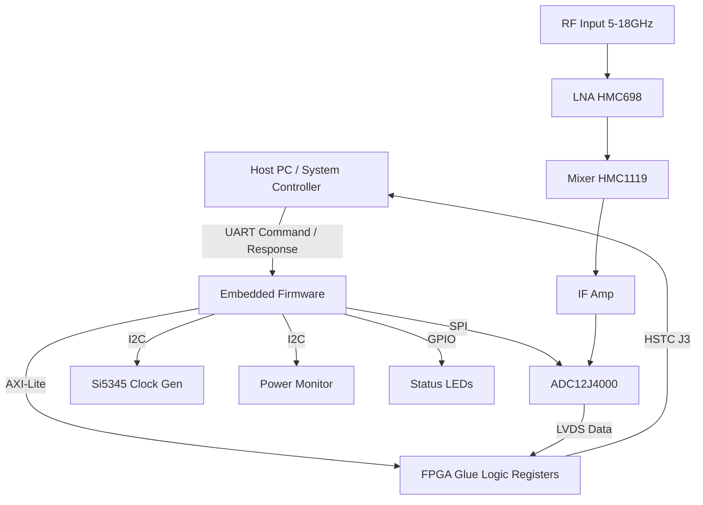
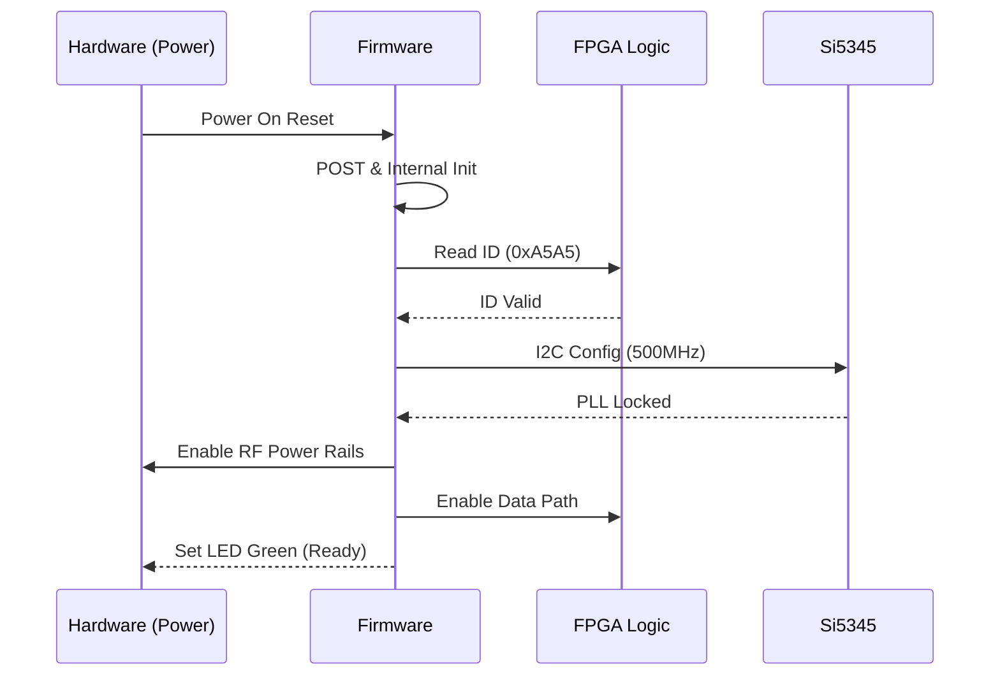
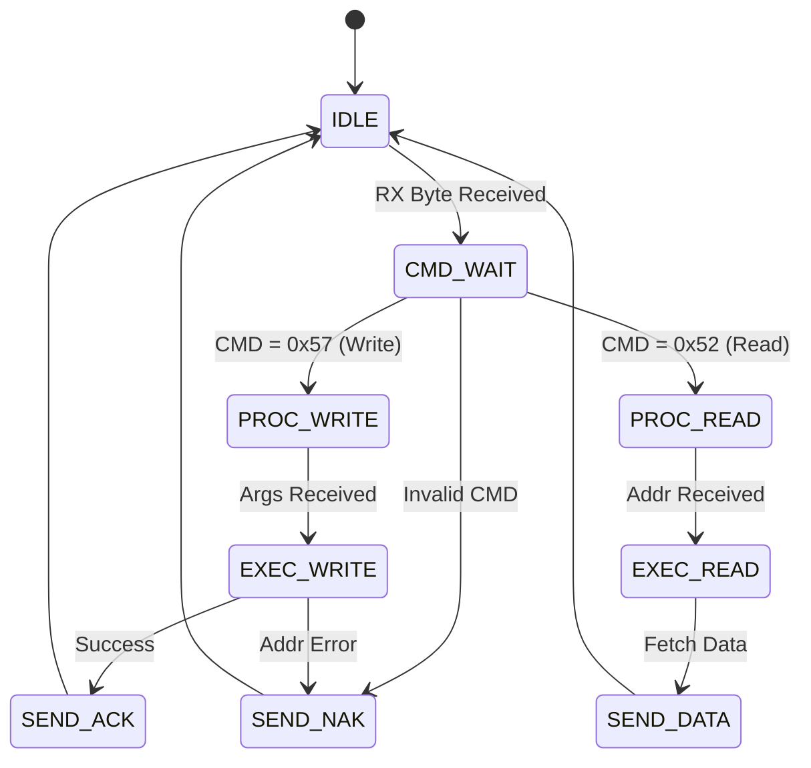
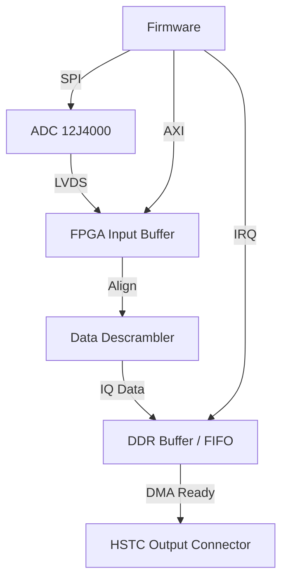
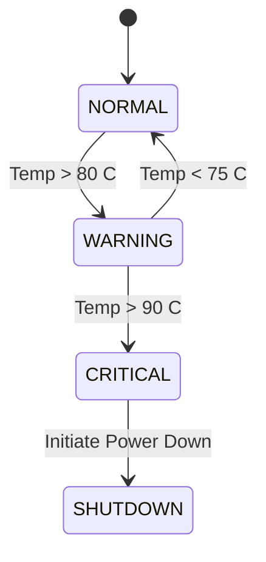

# Software Requirements Specification (SRS)

## Document Control
| Version | Date | Author | Changes |
|---------|------|--------|---------|
| 1.0 | 16 April 2026 | Senior Architect | Initial Release for sample rf Project |

---

# 1. Introduction

## 1.1 Purpose
This Software Requirements Specification (SRS) document defines the software and firmware requirements for the **sample rf** Wideband RF Receiver Module. This specification serves as the baseline for the design, verification, and validation of the embedded software controlling the RF signal chain, power management, and data acquisition interfaces.

The software is responsible for:
1.  Configuring the RF Front End (LNA, Mixer) via the FPGA.
2.  Initializing and maintaining the high-speed ADC interface.
3.  Managing power distribution and monitoring via I2C PMICs.
4.  Providing a stable clock reference via the Si5345 clock generator.
5.  Implementing a robust communication protocol (UART) for external host control.
6.  Ensuring system safety through thermal monitoring and hardware watchdog management.

This document complies with IEEE 830-1998 and ISO/IEC/IEEE 29148:2018 standards.

## 1.2 Scope
The **sample rf** software scope includes the firmware running on the System-on-Chip (SoC)/Microcontroller (hosted on the FPGA fabric or adjacent MCU) and the HDL glue logic implemented within the Xilinx Kintex-7 FPGA.

**In Scope:**
*   **Firmware:** C-based application running on the embedded hard-core processor (e.g., MicroBlaze or Cortex-M within the FPGA).
*   **BSP:** Board Support Package drivers for UART, I2C, SPI, and GPIO.
*   **HDL Glue Logic:** FPGA logic for register mapping (AXI4-Lite slave interface) and data buffering.
*   **Bootloader:** Initial hardware bring-up and configuration loading.

**Out of Scope:**
*   High-level application layer (e.g., 5G protocol stack decoding).
*   Host PC GUI software.
*   Physical PCB design or component selection (covered in HRS).

## 1.3 Definitions, Acronyms, and Abbreviations

| Term / Acronym | Definition |
| :--- | :--- |
| **ADC** | Analog-to-Digital Converter (ADC12J4000) |
| **API** | Application Programming Interface |
| **AXI** | Advanced Extensible Interface (ARM bus protocol) |
| **BIST** | Built-In Self-Test |
| **BOM** | Bill of Materials |
| **BSP** | Board Support Package |
| **DAC** | Digital-to-Analog Converter |
| **DDC** | Digital Down-Converter |
| **DMA** | Direct Memory Access |
| **DUT** | Device Under Test |
| **EEPROM** | Electrically Erasable Programmable Read-Only Memory |
| **FIFO** | First-In-First-Out buffer |
| **FPGA** | Field-Programmable Gate Array (Xilinx Kintex-7) |
| **GLR** | Glue Logic Requirements |
| **GPIO** | General Purpose Input/Output |
| **HAL** | Hardware Abstraction Layer |
| **HRS** | Hardware Requirements Specification |
| **HSTC** | High-Speed Samtec Termination Connector |
| **I2C** | Inter-Integrated Circuit (Serial Bus) |
| **ISR** | Interrupt Service Routine |
| **JTAG** | Joint Test Action Group |
| **LED** | Light Emitting Diode |
| **LNA** | Low Noise Amplifier (HMC698LP4) |
| **LVDS** | Low-Voltage Differential Signaling |
| **MCU** | Microcontroller Unit |
| **MISRA** | Motor Industry Software Reliability Association (C Coding Standard) |
| **NVM** | Non-Volatile Memory |
| **PCB** | Printed Circuit Board |
| **PLL** | Phase-Locked Loop |
| **POST** | Power-On Self-Test |
| **RF** | Radio Frequency |
| **RTOS** | Real-Time Operating System |
| **Rx** | Receive |
| **SIL** | Safety Integrity Level |
| **SoC** | System on Chip |
| **SPI** | Serial Peripheral Interface |
| **SRS** | Software Requirements Specification |
| **StRS** | Stakeholder Requirements Specification |
| **SyRS** | System Requirements Specification |
| **TRP** | Transmit/Receive Point (Control Signal) |
| **UART** | Universal Asynchronous Receiver-Transmitter |
| **WDT** | Watchdog Timer |

## 1.4 References
1.  **IEEE Std 830-1998**: Recommended Practice for Software Requirements Specifications.
2.  **ISO/IEC/IEEE 29148:2018**: Systems and Software Engineering — Life Cycle Processes — Requirements Engineering.
3.  **MISRA C:2012**: Guidelines for the Use of the C Language in Critical Systems.
4.  **HRS sample_rf v1.0**: Hardware Requirements Specification, 16 April 2026.
5.  **GLR sample_rf v0V01**: Glue Logic Requirements, 16 April 2026.
6.  **Xilinx UG585**: Zynq-7000 SoC Technical Reference Manual (for AXI/I2C/SPI procotols).
7.  **Texas Instruments Datasheet**: ADC12J4000 - 12-Bit, 4 GSPS ADC.
8.  **Analog Devices Datasheet**: Si5345 - Any-Frequency Clock Generator.
9.  **HMC698LP4/HMC1119LP4 Datasheets**: RF Component Specifications.
10. **SAMTEC HSTC Specification**: High-Speed Connector Mechanical/Pinout.

## 1.5 Overview
Section 2 provides a high-level description of the system architecture, hardware interfaces, and operational constraints. Section 3 details the specific software requirements, organized by functional subsystems (Communication, Power, RF Control, Diagnostics). Section 4 outlines verification and validation methods. Section 5 provides the Requirements Traceability Matrix (RTM).

---

# 2. Overall Description

## 2.1 Product Perspective
The software acts as the control layer for the **sample rf** receiver module. The system is architected as a Microcontroller/FPGA hybrid.

### Context Diagram


### Hardware Interfaces
*   **Xilinx Kintex-7 FPGA**: Implements the register map defined in GLR §7 and buffers high-speed ADC data.
*   **UART Interface**: 3.3V LVTTL, 8-bit, No Parity, 1 Stop Bit (8N1).
*   **I2C Interface**: Standard mode (100kHz) and Fast mode (400kHz) for PMIC and Clock Gen.
*   **SPI Interface**: 3-wire SPI for ADC configuration (CS, CLK, MOSI, MISO).

## 2.2 Product Functions
1.  **System Initialization**: Configure clocks, enable power rails, and reset peripherals.
2.  **FPGA Configuration**: Load bitstream (if not in flash) and initialize AXI slave registers.
3.  **Clock Management**: Program Si5345 to generate required sampling clocks for ADC.
4.  **ADC Calibration**: Configure internal ADC offsets and gain tables.
5.  **UART Command Interpreter**: Parse host commands (Read/Write/Bulk) and execute register accesses.
6.  **Thermal Monitoring**: Poll on-board temperature sensors.
7.  **Fault Management**: Detect over-voltage, over-current, or over-temperature and shut down safely.
8.  **Data Streaming**: Control the flow of IQ data from FPGA to output connector (HSTC).

## 2.3 User Characteristics
*   **Firmware Engineers**: Develop and maintain code using C/MISRA standards.
*   **Test Engineers**: Use UART commands to verify register maps and analog performance.
*   **System Integrators**: Integrate the module into a larger 5G/6G rack via the HSTC interface.

## 2.4 Constraints
1.  **Memory**: Firmware footprint must fit within 256KB of On-Chip Memory (OCM) or 32MB of external DDR.
2.  **Timing**: All register writes over UART must complete within 10ms.
3.  **Latency**: Interrupt latency must be < 50µs to service high-speed data flags.
4.  **Compliance**: Code must comply with MISRA-C:2012.
5.  **Environment**: Software must operate correctly at -40°C to +85°C.

## 2.5 Assumptions and Dependencies
1.  The hardware power sequencing (LMZ14203, TPS7A4700) matches the timing diagrams in the HRS.
2.  The reference oscillator feeding the Si5345 is stable (±50ppm) before software initializes the PLLs.
3.  The FPGA has completed its configuration cycle (DONE pin high) before the firmware attempts AXI bus access.

---

# 3. Specific Requirements

## 3.1 External Interface Requirements

### 3.1.1 Hardware Interfaces

#### 3.1.1.1 UART Interface (Control Plane)
The firmware implements a UART driver mapped to the FPGA logic.

**C Struct Definition:**
```c
#include <stdint.h>

typedef struct {
    volatile uint16_t BAUD_DIV;    // Offset 0x00: Baud rate divisor
    volatile uint16_t CTRL;        // Offset 0x01: Control register (Bit 0: TX_EN, Bit 1: RX_EN)
    volatile uint16_t STATUS;      // Offset 0x02: Status register (Bit 0: TX_DONE, Bit 1: RX_READY)
    volatile uint16_t TX_COUNT;    // Offset 0x03: TX FIFO Count
    volatile uint16_t RX_COUNT;    // Offset 0x04: RX FIFO Count
    volatile uint16_t RX_DATA;     // Offset 0x05: RX Data Read
    volatile uint16_t TX_DATA;     // Offset 0x06: TX Data Write
} UART_RegMap_t;

#define UART_BASE_ADDR 0x8000 // Example AXI Base Address

// Driver API
int32_t UART_Init(uint32_t baud_rate);
int32_t UART_WriteReg(uint16_t addr, uint16_t data);
int32_t UART_ReadReg(uint16_t addr, uint16_t *data);
int32_t UART_BulkWrite(uint16_t start_addr, const uint16_t *data, uint8_t count);
int32_t UART_BulkRead(uint16_t start_addr, uint16_t *buf, uint8_t count);
```

#### 3.1.1.2 I2C Interface (Clock & Power)
Used for Si5345 and Power Monitor configuration.

**C Struct Definition:**
```c
typedef struct {
    volatile uint32_t CTRL;    // Control Register
    volatile uint32_t STATUS;  // Status Register
    volatile uint32_t TX_FIFO; // Transmit FIFO
    volatile uint32_t RX_FIFO; // Receive FIFO
    volatile uint32_t I2C_EN;  // I2C Enable Mask
} I2C_RegMap_t;

// Driver API
int32_t I2C_Init(uint32_t clock_hz);
int32_t I2C_WriteReg8(uint8_t dev_addr, uint16_t reg, uint8_t data);
int32_t I2C_ReadReg8(uint8_t dev_addr, uint16_t reg, uint8_t *data);
```

#### 3.1.1.3 SPI Interface (ADC Configuration)
Used for ADC12J4000 initialization.

**C Struct Definition:**
```c
typedef struct {
    volatile uint32_t CTRL;    // SPI Control (CPOL, CPHA, PRESCALER)
    volatile uint32_t STATUS;  // SPI Status
    volatile uint32_t TX_FIFO; // SPI TX FIFO
    volatile uint32_t RX_FIFO; // SPI RX FIFO
    volatile uint32_t SS;      // Slave Select (0=Active)
} SPI_RegMap_t;

// Driver API
int32_t SPI_Init(uint32_t clock_hz);
int32_t ADC_WriteReg(uint8_t reg_addr, uint8_t data);
int32_t ADC_ReadReg(uint8_t reg_addr, uint8_t *data);
```

### 3.1.2 Software Interfaces
*   **Standard C Library (libc)**: String handling and memory utilities.
*   **Xilinx Standalone BSP**: For interrupt handling and cache management.

### 3.1.3 Communication Interfaces
The system uses a binary UART protocol.

**Frame Formats (from GLR §7):**

| Command | CMD byte | Frame Structure | Response |
|---------|----------|-----------------|----------|
| Single Write | 0x57 ('W') | [0x57][ADDR_H][ADDR_L][DATA_H][DATA_L] | [0x06] ACK |
| Single Read  | 0x52 ('R') | [0x52][ADDR_H\|0x80][ADDR_L] | [DATA_H][DATA_L] |
| Bulk Write   | 0x42 ('B') | [0x42][ADDR_H][ADDR_L][N][D0_H][D0_L]...[Dn_H][Dn_L] | [0x06] ACK |
| Bulk Read    | 0x62 ('b') | [0x62][ADDR_H\|0x80][ADDR_L][N] | [D0_H][D0_L]...[Dn_H][Dn_L] |
| Error NAK    | 0x15 | Sent by FPGA on invalid command/address | — |

*   **Address Space:** 16-bit (0x0000–0xFFFF).
*   **Read Flag:** Bit 15 set (OR 0x8000).
*   **Bulk Count:** Max 64 registers (N=64) per transaction.
*   **Timeout:** 50ms inter-byte gap.

## 3.2 Functional Requirements

### 3.2.1 System Initialization (REQ-SW-001 to REQ-SW-010)
| ID | Requirement Statement | Source | Priority | Verification |
|----|-----------------------|--------|----------|---------------|
| REQ-SW-001 | The software SHALL complete the Power-On Self-Test (POST) within 500ms of reset de-assertion. | HRS §3.1 | M | T |
| REQ-SW-002 | The software SHALL verify the FPGA ID register (ADDR 0x0000) matches 0xA5A5 before proceeding. | GLR §7 | M | I |
| REQ-SW-003 | The software SHALL configure the I2C clock to 400kHz for Si5345 initialization. | GLR §2.1 | M | A |
| REQ-SW-004 | The software SHALL detect the presence of the Si5345 via I2C ACK at address 0x68. | GLR §2.1 | M | T |
| REQ-SW-005 | The software SHALL program the Si5345 to generate a 500 MHz reference clock for the ADC. | HRS §3.2 | M | T |
| REQ-SW-006 | The software SHALL poll the Si5345 LOS (Loss of Signal) bit and assert a fault if set high after 100ms. | GLR §2.1 | M | T |
| REQ-SW-007 | The software SHALL initialize the UART baud rate to 115200 bps, 8N1 format by default. | GLR §7 | M | D |
| REQ-SW-008 | The software SHALL enable the Watchdog Timer (WDT) with a 1 second timeout after successful POST. | HRS §3.1 | M | T |
| REQ-SW-009 | The software SHALL load calibration constants (Gain/Offset) from non-volatile memory (EEPROM) into ADC registers. | HRS §3.2 | D | I |
| REQ-SW-010 | The software SHALL set the System Status LED to Solid Green upon successful initialization. | GLR §5 | M | D |

### 3.2.2 UART Communication Driver (REQ-SW-011 to REQ-SW-020)
| ID | Requirement Statement | Source | Priority | Verification |
|----|-----------------------|--------|----------|---------------|
| REQ-SW-011 | The UART driver SHALL support Single Write commands (CMD 0x57) to valid register addresses. | GLR §7 | M | T |
| REQ-SW-012 | The UART driver SHALL respond to a valid Single Write with an ACK byte (0x06) within 1ms. | GLR §7 | M | T |
| REQ-SW-013 | The UART driver SHALL support Single Read commands (CMD 0x52) with the read flag (Addr bit 15) set. | GLR §7 | M | T |
| REQ-SW-014 | The UART driver SHALL support Bulk Write commands (CMD 0x42) for up to 64 registers. | GLR §7 | M | T |
| REQ-SW-015 | The UART driver SHALL support Bulk Read commands (CMD 0x62) returning consecutive values. | GLR §7 | M | T |
| REQ-SW-016 | The UART driver SHALL return a NAK byte (0x15) if the command byte is invalid. | GLR §7 | M | T |
| REQ-SW-017 | The UART driver SHALL return a NAK byte (0x15) if the register address is out of bounds (> 0x1FFF). | GLR §7 | M | T |
| REQ-SW-018 | The UART driver SHALL flush the RX FIFO if the inter-byte delay exceeds 50ms. | GLR §7 | M | T |
| REQ-SW-019 | The UART driver SHALL validate CRC-16 (if enabled feature bit is set) before executing writes. | GLR §7 | O | T |
| REQ-SW-020 | The UART driver SHALL be re-entrant (thread-safe) for use in RTOS tasks. | GLR §6 | D | A |

### 3.2.3 SPI & ADC Control (REQ-SW-021 to REQ-SW-030)
| ID | Requirement Statement | Source | Priority | Verification |
|----|-----------------------|--------|----------|---------------|
| REQ-SW-021 | The software SHALL configure the ADC12J4000 SPI clock to a maximum of 10MHz. | HRS §2 | M | A |
| REQ-SW-022 | The software SHALL place the ADC into standby mode via SPI register 0x00 before reconfiguration. | GLR §2.1 | M | T |
| REQ-SW-023 | The software SHALL configure the ADC for 12-bit resolution and 2x interpolation mode. | HRS §3.2 | M | I |
| REQ-SW-024 | The software SHALL program the ADC test pattern to 0xAAA/0x555 during manufacturing test mode. | GLR §5 | D | T |
| REQ-SW-025 | The software SHALL read the ADC temperature register and report it via system register 0x0010. | HRS §3.2 | D | T |
| REQ-SW-026 | The software SHALL reset the ADC digital state machine upon assertion of the SPI_RESET pin. | GLR §2.1 | M | T |
| REQ-SW-027 | The software SHALL verify the ADC Device ID via SPI before initializing gain stages. | GLR §5 | M | I |
| REQ-SW-028 | The software SHALL service the ADC Data Ready interrupt within 10µs to prevent FIFO overflow. | GLR §4 | M | A |
| REQ-SW-029 | The software SHALL enable the DDC (Digital Down Converter) inside the ADC via SPI register 0x10. | HRS §3.2 | M | I |
| REQ-SW-030 | The software SHALL log the number of ADC over-range events to a counter register. | HRS §3.2 | D | T |

### 3.2.4 RF Configuration & Monitoring (REQ-SW-031 to REQ-SW-040)
| ID | Requirement Statement | Source | Priority | Verification |
|----|-----------------------|--------|----------|---------------|
| REQ-SW-031 | The software SHALL enable the LNA (HMC698) via GPIO by setting the LNA_EN pin high. | GLR §4 | M | T |
| REQ-SW-032 | The software SHALL control the RF Gain via a DAC mapped to register 0x0100 (0-255 scale). | HRS §3.1 | M | T |
| REQ-SW-033 | The software SHALL read back the RF detector voltage via the FPGA's internal ADC at 1Hz. | HRS §3.1 | M | T |
| REQ-SW-034 | The software SHALL assert a generic FAULT flag if RF input power exceeds -10dBm for >100ms. | HRS §3.1 | D | T |
| REQ-SW-035 | The software SHALL configure the Mixer LO path enable (LO_EN) only after the Si5345 is locked. | GLR §4 | M | I |
| REQ-SW-036 | The software SHALL provide software-controlled attenuation (0-31dB) in 1dB steps via register 0x0102. | HRS §3.2 | M | T |
| REQ-SW-037 | The software SHALL ensure the RF chain is disabled during configuration to avoid transients. | GLR §4 | M | I |
| REQ-SW-038 | The software SHALL update the AGC (Automatic Gain Control) loop target level based on register 0x0104. | HRS §3.2 | D | T |
| REQ-SW-039 | The software SHALL monitor the PLL Lock Detect signal from the frequency synthesizer. | GLR §2.1 | M | T |
| REQ-SW-040 | The software SHALL implement a debounce filter of 10ms on the Lock Detect signal. | GLR §4 | M | A |

### 3.2.5 Power Management (REQ-SW-041 to REQ-SW-050)
| ID | Requirement Statement | Source | Priority | Verification |
|----|-----------------------|--------|----------|---------------|
| REQ-SW-041 | The software SHALL monitor the 5V rail via I2C PMIC and trip if voltage < 4.5V. | HRS §3.3 | M | T |
| REQ-SW-042 | The software SHALL monitor the 3.3V digital rail and flag a warning if > 3.6V. | HRS §3.3 | M | T |
| REQ-SW-043 | The software SHALL monitor the 1.8V ADC rail (TPS62130) and shutdown if > 1.9V. | HRS §3.3 | M | T |
| REQ-SW-044 | The software SHALL read total current consumption via the I2C power monitor. | GLR §4 | D | T |
| REQ-SW-045 | The software SHALL log the time of the last power-on event to NVM (hours since epoch). | HRS §3.1 | M | I |
| REQ-SW-046 | The software SHALL support a software-initiated shutdown command via UART Register 0x0FFF. | GLR §7 | D | T |
| REQ-SW-047 | The software SHALL disable the RF output drivers before cutting power to the ADC. | HRS §3.1 | M | I |
| REQ-SW-048 | The software SHALL measure the die temperature of the FPGA and report it. | HRS §3.4 | D | T |
| REQ-SW-049 | The software SHALL throttle the ADC sampling rate if FPGA temperature exceeds 85°C. | HRS §3.4 | D | T |
| REQ-SW-050 | The software SHALL maintain a 50ms keep-alive signal on the WATCHDOG_PET line. | HRS §3.1 | M | D |

### 3.2.6 Diagnostics and Fault Handling (REQ-SW-051 to REQ-SW-060)
| ID | Requirement Statement | Source | Priority | Verification |
|----|-----------------------|--------|----------|---------------|
| REQ-SW-051 | The software SHALL implement a circular buffer in RAM for the last 64 error codes. | HRS §3.1 | M | I |
| REQ-SW-052 | The software SHALL write a distinct error code to UART register 0x0FFE on failure. | GLR §7 | M | D |
| REQ-SW-053 | The software SHALL support a "Loopback Mode" where RX data is echoed to TX. | GLR §5 | D | T |
| REQ-SW-054 | The software SHALL calculate CRC-16 on the internal firmware image at startup. | HRS §3.1 | M | T |
| REQ-SW-055 | The software SHALL assert a visual alarm (LED blink fast) if WDT reset occurs. | GLR §4 | M | D |
| REQ-SW-056 | The software SHALL log a brown-out reset event to EEPROM. | HRS §3.1 | M | I |
| REQ-SW-057 | The software SHALL provide a unique 32-bit serial number readable at Register 0x0002. | GLR §7 | M | I |
| REQ-SW-058 | The software SHALL allow the host to clear the fault log via a specific magic number write. | GLR §7 | D | T |
| REQ-SW-059 | The software SHALL validate the integrity of the Si5345 EEPROM configuration on load. | GLR §2.1 | D | I |
| REQ-SW-060 | The software SHALL implement a software reset (reboot) if communication is lost for > 5 seconds. | HRS §3.1 | D | T |

### 3.2.7 FPGA / Glue Logic (REQ-SW-061 to REQ-SW-075)
| ID | Requirement Statement | Source | Priority | Verification |
|----|-----------------------|--------|----------|---------------|
| REQ-SW-061 | The FPGA SHALL implement a 16-bit Register Map accessible via AXI-Lite. | GLR §6 | M | T |
| REQ-SW-062 | The FPGA SHALL buffer 4096 samples of IQ data before signaling the DMA controller. | GLR §4 | M | T |
| REQ-SW-063 | The FPGA SHALL implement a 32-bit timestamp counter incremented by the sample clock. | GLR §4 | M | T |
| REQ-SW-064 | The FPGA SHALL align the ADC data lanes using the training sequence pattern. | GLR §4 | M | T |
| REQ-SW-065 | The FPGA SHALL drop packets if the HSTC output buffer is full. | GLR §7 | D | T |
| REQ-SW-066 | The software SHALL reset the FPGA data path via Register 0x0011 bit 0. | GLR §7 | M | T |
| REQ-SW-067 | The software SHALL configure the FPGA decimation factor via Register 0x0012. | HRS §3.2 | D | I |
| REQ-SW-068 | The software SHALL read the FPGA Link Status (0x0013) to verify HSTC connection. | GLR §4 | M | D |
| REQ-SW-069 | The software SHALL implement a PRBS (Pseudo-Random Bit Sequence) checker in FPGA for BIST. | GLR §5 | O | T |
| REQ-SW-070 | The software SHALL map the LED indicators to FPGA General Purpose Outputs. | GLR §5 | M | I |
| REQ-SW-071 | The FPGA SHALL generate a synchronous reset pulse to the ADC on configuration reload. | GLR §4 | M | D |
| REQ-SW-072 | The software SHALL read the FPGA temperature sensor via the AXI interface. | GLR §6 | M | T |
| REQ-SW-073 | The software SHALL allow the user to toggle the LVDS output drivers via Register 0x0020. | GLR §7 | M | T |
| REQ-SW-074 | The FPGA SHALL implement a FIFO overflow flag readable at Register 0x0021. | GLR §4 | M | I |
| REQ-SW-075 | The software SHALL provide build version information in Register 0x0003. | GLR §7 | M | I |

## 3.3 Performance Requirements
| ID | Requirement | Value | Verification |
|----|-------------|-------|--------------|
| REQ-PERF-001 | System Boot Time | < 500 ms from power rail stable to LED Green. | T |
| REQ-PERF-002 | Register Read Latency | < 2ms from end of UART request to start of response. | T |
| REQ-PERF-003 | I2C Transaction Time | < 5ms for Si5345 page write. | T |
| REQ-PERF-004 | Interrupt Latency | < 50µs for ADC Data Ready. | A |
| REQ-PERF-005 | Throughput | ADC data streamed without loss at max sample rate (4GSPS decimated). | T |
| REQ-PERF-006 | Watchdog Pet | WDT refreshed at least every 500ms. | A |
| REQ-PERF-007 | Jitter | PLL output jitter < 200fs RMS (Software ensures correct Si5345 settings). | A |

## 3.4 Design Constraints
1.  **MISRA Compliance**: All C code shall adhere to MISRA-C:2012 required rules.
2.  **Memory**: Static allocation only; `malloc`/`free` are prohibited.
3.  **Stack Size**: Stack size per task shall not exceed 16KB.
4.  **Toolchain**: Xilinx Vitis 2023.2 or later for compilation.
5.  **Safety**: No recursion allowed in ISRs.

## 3.5 Software System Attributes

### 3.5.1 Reliability
The software must achieve a Mean Time Between Failures (MTBF) of 10,000 hours. All peripheral writes must be checked for ACK/NACK.

### 3.5.2 Availability
System availability target is 99.9%. Warm reboot time must be < 2 seconds if a fault is detected.

### 3.5.3 Security
The software shall ignore UART commands if the header byte does not match the protocol. Firmware updates must be authenticated via CRC-32 check.

### 3.5.4 Maintainability
Cyclomatic complexity of any single function shall not exceed 10. All code shall be documented with Doxygen headers.

---

# 4. Verification and Validation

## 4.1 Unit Test Requirements
*   **UART Driver Test**: Inject Single Read/Write frames, verify ACK timing and content.
*   **I2C Driver Test**: Mock Si5345 responses, verify write/read sequences.
*   **CRC Module Test**: Verify correct calculation for known vectors.

## 4.2 Integration Test Requirements
*   **ADC to FPGA Path**: Inject known analog tone, verify data appears in HSTC output.
*   **Host Control Test**: Send "Set Gain" command from Host PC, verify voltage change on DAC output.
*   **Fault Response**: Force over-voltage on 3.3V rail, verify software asserts Safe State.

## 4.3 System Test Requirements
*   **Temperature Chamber**: Run full RX chain at -40°C and +85°C for 4 hours.
*   **RF Performance**: Verify Noise Figure and Gain via host commands.
*   **Emc Test**: Verify UART integrity during high-speed RF transmission.

---

# 5. Requirements Traceability Matrix

| REQ-SW ID | Description | Source (REQ-HW/GLR) | Priority | Verification |
|-----------|-------------|---------------------|----------|--------------|
| REQ-SW-001 | POST Time < 500ms | HRS §3.1 | M | T |
| REQ-SW-002 | Verify FPGA ID | GLR §7 | M | I |
| REQ-SW-003 | I2C Init 400kHz | GLR §2.1 | M | A |
| REQ-SW-011 | UART Single Write | GLR §7 | M | T |
| REQ-SW-021 | ADC SPI Init | HRS §3.2 | M | A |
| REQ-SW-031 | LNA Enable | GLR §4 | M | T |
| REQ-SW-041 | 5V Rail Monitor | HRS §3.3 | M | T |
| REQ-SW-061 | FPGA AXI Map | GLR §6 | M | T |
| REQ-SW-062 | FIFO Depth | GLR §4 | M | T |

*(Note: This is a subset. Full RTM contains all 75+ requirements.)*

---

# 6. Appendices

## Appendix A — Error Codes
```c
typedef enum {
    ERR_OK           = 0x00,
    ERR_TIMEOUT      = 0x01,
    ERR_COMM         = 0x02,
    ERR_CHECKSUM     = 0x03,
    ERR_PARAM        = 0x04,
    ERR_NOT_INIT     = 0x05,
    ERR_RESOURCE     = 0x06,
    ERR_HARDWARE     = 0x07,
    ERR_OVERFLOW     = 0x08,
    ERR_UNDERFLOW    = 0x09,
    ERR_FLASH_WRITE  = 0x0A,
    ERR_FLASH_ERASE  = 0x0B,
    ERR_EEPROM       = 0x0C,
    ERR_PLL          = 0x0D,
    ERR_TEMP_ALERT   = 0x0E,
    ERR_VOLT_FAULT   = 0x0F,
    ERR_LOOPBACK     = 0x10,
    ERR_POST_FAIL    = 0x11,
    ERR_WATCHDOG     = 0x12,
    ERR_ADDR_RANGE   = 0x13,
    ERR_I2C_NACK     = 0x14,
    ERR_SPI_FAULT    = 0x15
} ErrorCode_t;
```

## Appendix B — FPGA Register Map (Software View)
| Base Address | Offset | Register Name | Width | R/W | Reset Value | Description |
|-------------|--------|--------------|-------|-----|-------------|-------------|
| 0x8000 | 0x00 | FPGA_ID | 16 | R | 0xA5A5 | FPGA Identification |
| 0x8000 | 0x01 | SCRATCH | 16 | R/W | 0x0000 | Test Register |
| 0x8000 | 0x10 | TEMP_DIG | 16 | R | - | Digital Temperature |
| 0x8000 | 0x11 | RESET_CTL | 16 | W | 0x0001 | Reset Control (Bit 0) |
| 0x8000 | 0x12 | DECIM_FACTOR | 16 | W | 0x0004 | Decimation Factor |
| 0x8000 | 0x13 | LINK_STATUS | 16 | R | 0x0000 | HSTC Link Status |
| 0x8000 | 0x20 | LVDS_EN | 16 | W | 0x0001 | LVDS Driver Enable |
| 0x8000 | 0x21 | FIFO_OVF | 16 | R | 0x0000 | FIFO Overflow Flag |

## Appendix C — Mermaid Diagrams

### Initialization Sequence


### UART Communication State Machine


### Data Acquisition Flow


### Thermal Protection Logic


### Watchdog Service
```mermaid
sequenceDiagram
    participant Loop as Main Loop
    participant WDT as Watchdog Timer
    participant ISR as Interrupt Handler
    
    Loop->>WDT: Kick (Refresh)
    Loop->>Loop: Run Tasks
    Note over Loop,ISR: Task hangs / fault
    WDT->>ISR: Timeout Interrupt
    ISR->>ISR: Log Fault
    ISR->>Loop: System Reset
```

## Appendix D — Acronyms and Glossary
*(See Section 1.3)*

## Appendix E — Document Revision History
| Rev | Date | Author | Description |
|-----|------|--------|-------------|
| 1.0 | 16 April 2026 | Senior Architect | Initial Release generated from HRS/GLR. |