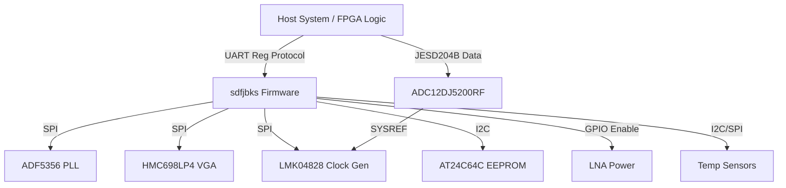
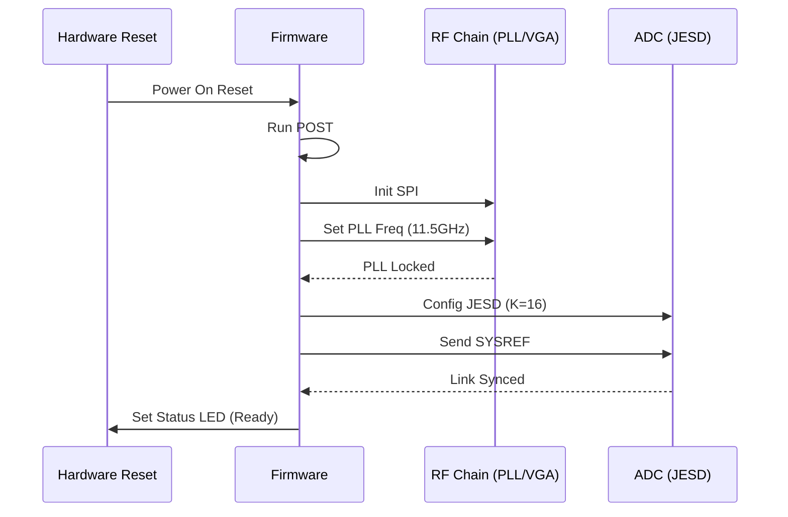
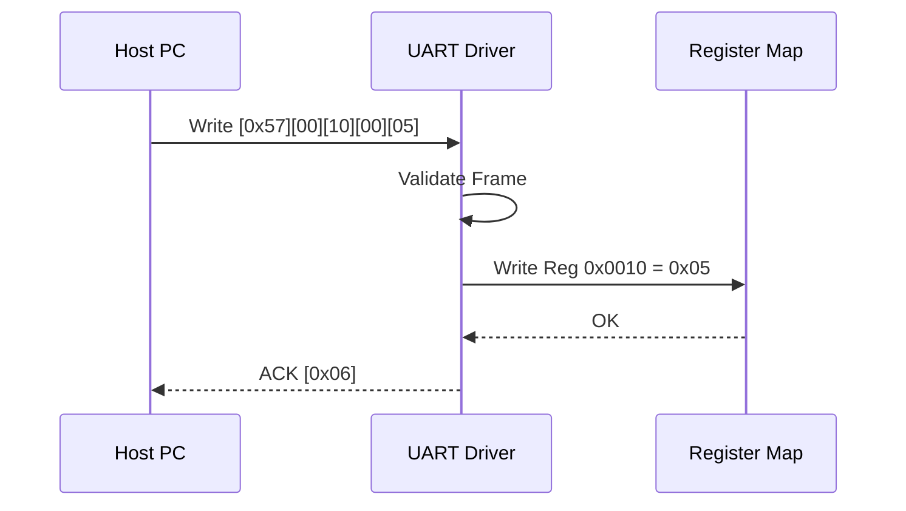
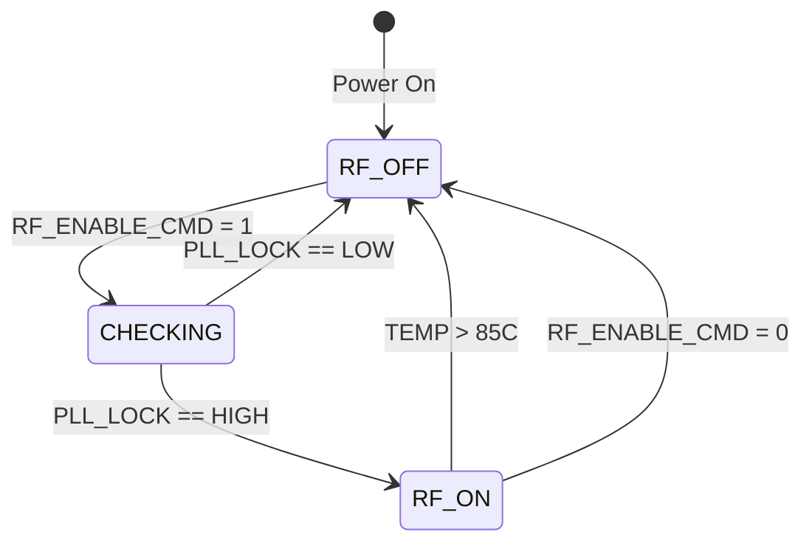
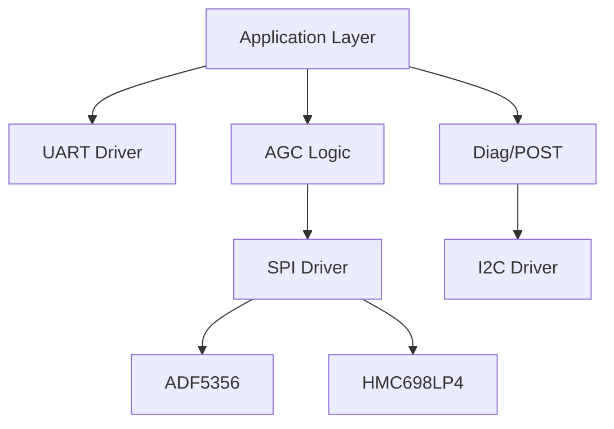
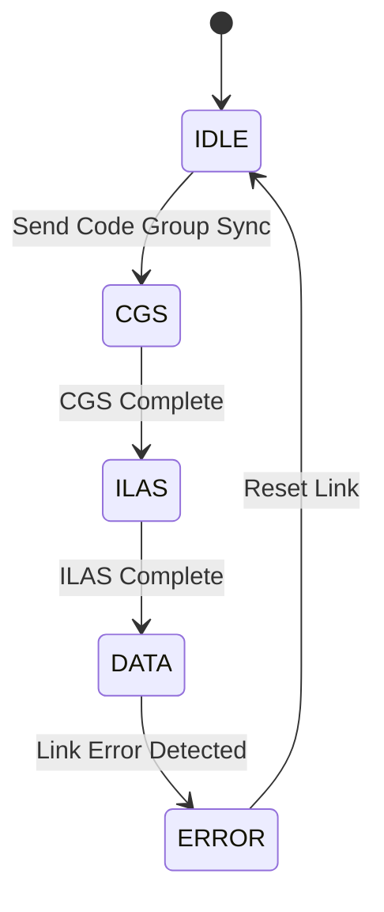

# Software Requirements Specification (SRS)

**Project:** sdfjbks Wideband RF Receiver Firmware
**Version:** 1.0
**Date:** 16 April 2026
**Author:** Senior Software Architect

---

## Document Control
| Version | Date | Author | Changes |
|---------|------|--------|---------|
| 1.0 | 16 Apr 2026 | System Architect | Initial Release compliant with IEEE 29148:2018 |

---

# 1. Introduction

## 1.1 Purpose
This Software Requirements Specification (SRS) defines the software and firmware behavioral requirements for the **sdfjbks Wideband RF Receiver Module**. This document specifies the requirements for the embedded control software running on the Host Interface Controller (FPGA/MCU). The software is responsible for the initialization, configuration, and health monitoring of the RF chain (LNA, Mixer, VGA, PLL) and the High-Speed Data Path (ADC, Clock Generator). It provides a deterministic register-based communication interface (UART) and high-speed data offload (JESD204B) to external systems.

## 1.2 Scope
The software system comprises the firmware executing on the FPGA logic fabric and/or embedded MCU responsible for board management. This includes:
1.  **Board Support Package (BSP):** HAL for SPI, I2C, GPIO, and UART peripherals.
2.  **RF Control Logic:** State machines for gain control (AGC), frequency synthesis (PLL lock), and power sequencing.
3.  **Driver Layer:** Specific device drivers for ADF5356 (PLL), HMC698LP4 (VGA), ADC12DJ5200RF, and LMK04828 (Clock Gen).
4.  **Communication Protocol:** Implementation of the UART Register Protocol as defined in the Glue Logic Requirements (GLR).
5.  **Safety & Diagnostics:** Watchdog management, temperature monitoring, and error logging.

**Exclusions:** High-speed DSP algorithms applied to the JESD204B data stream (decimation, filtering) are implemented in the downstream FPGA logic and are outside the scope of this control firmware SRS.

## 1.3 Definitions, Acronyms, and Abbreviations

| Term | Definition |
| :--- | :--- |
| **ADC** | Analog-to-Digital Converter (TI ADC12DJ5200RF) |
| **AGC** | Automatic Gain Control algorithm executed by firmware |
| **API** | Application Programming Interface |
| **BER** | Bit Error Rate |
| **BIST** | Built-In Self-Test |
| **BSP** | Board Support Package |
| **C** | Programming Language (ISO C99/C11) |
| **DMA** | Direct Memory Access |
| **EMC** | Electromagnetic Compatibility |
| **FCC** | Federal Communications Commission |
| **FIFO** | First-In, First-Out data buffer |
| **FMC** | FPGA Mezzanine Card |
| **FSM** | Finite State Machine |
| **GPIO** | General Purpose Input/Output |
| **HAL** | Hardware Abstraction Layer |
| **HRS** | Hardware Requirements Specification |
| **I2C** | Inter-Integrated Circuit (Serial Interface) |
| **ISR** | Interrupt Service Routine |
| **JESD** | JESD204B High-Speed Data Converter Interface |
| **LEB** | Little Endian Byte ordering |
| **LDO** | Low Dropout Regulator |
| **LNA** | Low Noise Amplifier |
| **LO** | Local Oscillator |
| **MCU** | Microcontroller Unit |
| **MISRA** | Motor Industry Software Reliability Association (C Coding Standard) |
| **NCO** | Numerically Controlled Oscillator |
| **NVM** | Non-Volatile Memory |
| **PCB** | Printed Circuit Board |
| **PLL** | Phase-Locked Loop |
| **POST** | Power-On Self-Test |
| **RF** | Radio Frequency |
| **RTOS** | Real-Time Operating System |
| **RX** | Receive |
| **SRS** | Software Requirements Specification |
| **SyRS** | System Requirements Specification |
| **TRP** | Transmit/Receive Protection (RF Enable) |
| **UART** | Universal Asynchronous Receiver/Transmitter |
| **VGA** | Variable Gain Amplifier |

## 1.4 References
1.  **IEEE Std 830-1998:** Recommended Practice for Software Requirements Specifications.
2.  **ISO/IEC/IEEE 29148:2018:** Systems and software engineering — Life cycle processes — Requirements engineering.
3.  **MISRA-C:2012:** Guidelines for the Use of the C Language in Critical Systems.
4.  **JESD204B Standard (JEDEC):** Serial Interface for Data Converters.
5.  **HRS sdfjbks v1.0 (2023):** Hardware Requirements Specification.
6.  **GLR sdfjbks v0V01 (2026):** Glue Logic Requirements.
7.  **ADC12DJ5200RF Datasheet (SBAS880C):** TI RF-Sampling ADC.
8.  **ADF5356 Datasheet:** Analog Devices Microwave Synthesizer.
9.  **LMK04828 Datasheet:** TI JESD204B Clock Jitter Cleaner.
10. **HMC698LP4 Datasheet:** Analog Devices Digital VGA.

## 1.5 Overview
The remainder of this document is organized as follows:
*   **Section 2 (Overall Description):** Describes the product perspective, functions, and constraints.
*   **Section 3 (Specific Requirements):** Details the external interfaces and the functional requirements (REQ-SW-001 to REQ-SW-090).
*   **Section 4 (Verification & Validation):** Defines test cases.
*   **Section 5 (Traceability):** Maps software requirements to hardware and glue logic requirements.
*   **Appendices:** Contains data structures, register maps, and state diagrams.

---

# 2. Overall Description

## 2.1 Product Perspective
The sdfjbks firmware operates as the control layer between the external Host System and the sdfjbks RF Hardware.



**Software Stack Layers:**
1.  **Application Layer:** Command parsing (UART), AGC state machine, Error handling.
2.  **Driver Layer:** Device drivers for PLL, VGA, ADC, Clock Gen.
3.  **HAL Layer:** SPI, I2C, UART, GPIO abstraction.
4.  **Hardware:** MCU/FPGA Fabric.

## 2.2 Product Functions
1.  **System Initialization:** Configure power rails (via enables), clocks, and peripherals on boot.
2.  **RF Configuration:** Set PLL frequency (LO), set VGA gain index.
3.  **Data Path Control:** Configure ADC (JESD204B lanes) and Clock Generator (SYSREF alignment).
4.  **Health Monitoring:** Monitor ADC temperature, board current, and PLL lock status.
5.  **Interface:** Process UART register Read/Write commands from host.
6.  **Non-Volatile Storage:** Read/Write calibration data to EEPROM.
7.  **Safety:** Watchdog kick and fault handling.

## 2.3 User Characteristics
*   **Firmware Engineers:** Utilize this SRS to implement drivers in C.
*   **Test Engineers:** Use the "Verification" columns to develop test plans.
*   **System Integrators:** Interact via the defined UART protocol to control the receiver.

## 2.4 Constraints
1.  **MISRA-C Compliance:** All C code shall adhere to MISRA-C:2012 mandatory rules.
2.  **Real-Time:** SPI transactions to the PLL must complete within 500µs to maintain lock.
3.  **Memory:** Firmware footprint must fit within 128KB Flash and 32KB RAM (typical MCU constraints).
4.  **Determinism:** UART command response time shall not exceed 10ms under nominal load.
5.  **Environment:** Software must operate in -40°C to +85°C ambient (HRS REQ-HW-010).

## 2.5 Assumptions and Dependencies
1.  Hardware supplies a stable 10MHz reference clock to the LMK04828 at startup.
2.  The 5V supply is stable and within ±5% tolerance before software initializes.
3.  The Host UART operates at 115200 baud, 8N1.

---

# 3. Specific Requirements

## 3.1 External Interface Requirements

### 3.1.1 Hardware Interfaces

**1. SPI Interface (RF Control)**
Used to configure the ADF5356 PLL, HMC698LP4 VGA, and ADC12DJ5200RF.
*   **Protocol:** Mode 0 (CPOL=0, CPHA=0).
*   **Max Speed:** 20 MHz.
*   **Bit Order:** MSB First.

```c
/* SPI Register Map Structure for PLD/VGA */
typedef struct {
    volatile uint8_t REG_ADDR;
    volatile uint8_t DATA_H;
    volatile uint8_t DATA_L;
    volatile uint8_t DUMMY; // Padding for 32-bit alignment
} SPI_Frame_t;

/* Driver API */
int32_t RF_SPI_Init(uint32_t clock_hz);
int32_t RF_SPI_Write(uint8_t chip_select, const uint8_t *data, uint16_t len);
int32_t RF_SPI_Read(uint8_t chip_select, uint8_t *data, uint16_t len);
```

**2. I2C Interface (EEPROM/Sensors)**
*   **Protocol:** Standard I2C (100kHz) and Fast Mode (400kHz).
*   **Addressing:** 7-bit addressing.
*   **Devices:** AT24C64C (0x50), Temp Sensors (0x4F).

```c
/* I2C Driver API */
int32_t I2C_Init(uint32_t speed_khz);
int32_t EEPROM_Write(uint16_t addr, const uint8_t *data, uint16_t len);
int32_t EEPROM_Read(uint16_t addr, uint8_t *data, uint16_t len);
int32_t TempSensor_Read(int8_t *temp_c);
```

**3. GPIO Interface**
*   **RF_ENABLE (Output):** Enables LNA/Mixer power rail.
*   **PLL_LOCK (Input):** Status of PLL lock detect.
*   **ADC_RESET (Output):** Reset control for ADC.

```c
/* GPIO Control API */
void GPIO_SetRF_Enable(bool state);
bool GPIO_GetPLL_Lock(void);
void GPIO_ResetADC(bool state);
```

### 3.1.2 Software Interfaces
The firmware implements a command dispatcher based on the incoming UART frame.

```c
/* Command Handler Prototype */
typedef void (*CommandHandler)(uint16_t addr, uint16_t data);

/* Firmware API Table (Internal View) */
typedef struct {
    uint16_t reg_addr;
    uint16_t *data_ptr;      /* Pointer to RAM variable */
    uint8_t  permissions;    /* R/W */
    CommandHandler handler;  /* Optional callback on write */
} RegisterMap_t;
```

### 3.1.3 Communication Interfaces

**UART Frame Format (GLR §6)**

| Command | CMD Byte | Frame Structure | Response |
|---------|----------|-----------------|----------|
| **Single Write** | 0x57 ('W') | `[0x57][ADDR_H][ADDR_L][DATA_H][DATA_L]` | `[0x06]` (ACK) |
| **Single Read** | 0x52 ('R') | `[0x52][ADDR_H\|0x80][ADDR_L]` | `[DATA_H][DATA_L]` |
| **Bulk Write** | 0x42 ('B') | `[0x42][ADDR_H][ADDR_L][N][D0_H][D0_L]...[Dn_H][Dn_L]` | `[0x06]` (ACK) |
| **Bulk Read** | 0x62 ('b') | `[0x62][ADDR_H\|0x80][ADDR_L][N]` | `[D0_H][D0_L]...[Dn_H][Dn_L]` |
| **Error NAK** | 0x15 | Sent by firmware on invalid command/address | — |

*   **Address Map:** 16-bit (0x0000–0xFFFF). Read requests require Bit 15 set.
*   **Bulk Limit:** N = 64 registers max per transaction.
*   **Timeout:** Inter-byte gap > 50ms aborts transaction.

---

## 3.2 Functional Requirements

### 3.2.1 System Initialization (REQ-SW-001 to REQ-SW-010)

| ID | Requirement | Source | Priority | Verification |
|:---|:---|:---|:---|:---|
| **REQ-SW-001** | The software SHALL complete the Power-On Self-Test (POST) within 500ms of reset de-assertion. | HRS 2.0 | M | T |
| **REQ-SW-002** | The software SHALL verify the BOARD_ID register (0x0000) reads 0xA5A5; failure shall set ERROR flag. | GLR 8.2 | M | T |
| **REQ-SW-003** | The software SHALL configure the Main PLL to 11500 MHz (Center Freq) ±1 ppm at startup. | HRS 2.0 | M | A |
| **REQ-SW-004** | The software SHALL poll the PLL_LOCK GPIO pin; if not locked within 100ms, assert FAULT_LED. | HRS 3.5 | M | D |
| **REQ-SW-005** | The software SHALL initialize the UART peripheral to 115200 baud, 8-bit data, no parity, 1 stop bit. | GLR 8.0 | M | I |
| **REQ-SW-006** | The software SHALL load calibration coefficients (Gain Slope, Offset) from EEPROM (Addr 0x0100) into SRAM. | HRS 3.5 | M | T |
| **REQ-SW-007** | The software SHALL initialize the Watchdog Timer (WDT) to 100ms timeout before entering the main loop. | HRS 3.9 | M | T |
| **REQ-SW-008** | The software SHALL log the Firmware Version string to UART (Reg 0x0002) on successful boot. | HRS 3.5 | D | I |
| **REQ-SW-009** | The software SHALL perform a RAM BIST (March C-) on the internal SRAM stack area. | HRS 3.5 | D | T |
| **REQ-SW-010** | The software SHALL configure the LMK04828 Clock Gen to output SYSREF at 1 MHz rate. | GLR 4.0 | M | T |

### 3.2.2 RF Control & AGC (REQ-SW-011 to REQ-SW-025)

| ID | Requirement | Source | Priority | Verification |
|:---|:---|:---|:---|:---|
| **REQ-SW-011** | The software SHALL map Register 0x0010 to the HMC698LP4 VGA Gain Index (0-31). | HRS 3.1 | M | T |
| **REQ-SW-012** | Writing to VGA Gain Register (0x0010) SHALL immediately assert the SPI CS line to the VGA and clock out the 24-bit shift register. | GLR 5.0 | M | D |
| **REQ-SW-013** | The software SHALL implement a hysteresis check: if Write Value == Current Value, SPI transaction is skipped. | GLR 5.0 | D | A |
| **REQ-SW-014** | The software SHALL provide a Register 0x0011 (RF_ENABLE) that controls the LNA Power Rail GPIO. | HRS 3.1 | M | T |
| **REQ-SW-015** | The software SHALL enable RF output (Reg 0x0011 = 1) ONLY if PLL_LOCK is high. | HRS 3.9 | M | T |
| **REQ-SW-016** | The software SHALL disable RF output (Reg 0x0011 = 0) immediately if ADC internal temperature > 85°C. | HRS 3.5 | M | T |
| **REQ-SW-017** | The software SHALL implement a software AGC mode that adjusts Reg 0x0010 based on ADC RSSI input. | HRS 3.1 | D | D |
| **REQ-SW-018** | The AGC algorithm SHALL target an ADC level of -10 dBFS (Full Scale Range). | HRS 3.2 | D | A |
| **REQ-SW-019** | The software SHALL update the ADF5356 PLL frequency via SPI when Register 0x0020 (FREQ_MHZ) is written. | HRS 3.1 | M | T |
| **REQ-SW-020** | The software SHALL calculate the ADF5356 Integer-N and Fractional registers based on the 122.88 MHz PFD frequency. | Datasheet | M | A |
| **REQ-SW-021** | The software SHALL assert a 1ms delay after writing to the ADF5356 to allow VCO settling. | Datasheet | M | A |
| **REQ-SW-022** | The software SHALL read back the ADF5356 MUXOUT pin via GPIO to verify VCO calibration before enabling RF. | Datasheet | D | T |
| **REQ-SW-023** | The software SHALL store the last 4 frequency settings in a history buffer in EEPROM. | GLR 4.0 | O | I |
| **REQ-SW-024** | The software SHALL limit the writable frequency range to 5000 MHz to 18000 MHz in software. | HRS 3.1 | M | T |
| **REQ-SW-025** | The software SHALL provide a 'Profile Save' command (UART Byte 0x53) to save current Gain/Freq to EEPROM slot. | GLR 4.0 | O | D |

### 3.2.3 Data Path & JESD204B (REQ-SW-026 to REQ-SW-035)

| ID | Requirement | Source | Priority | Verification |
|:---|:---|:---|:---|:---|
| **REQ-SW-026** | The software SHALL configure the ADC12DJ5200RF for JESD204B Subclass 1 operation via SPI. | HRS 3.3 | M | I |
| **REQ-SW-027** | The software SHALL set the ADC K-factor (LMFC_K) to 16 in the ADC configuration register. | Datasheet | M | T |
| **REQ-SW-028** | The software SHALL enable the ADC lanes only after the LMK04828 SYSREF signal is stable. | GLR 4.0 | M | T |
| **REQ-SW-029** | The software SHALL monitor the ADC Lane 0 Digital Reset bit in the STATUS register. | Datasheet | M | T |
| **REQ-SW-030** | The software SHALL report a JESD204B Link Error (CODE_GRP_SYNC error) via Register 0x0030. | HRS 3.3 | M | T |
| **REQ-SW-031** | The software SHALL perform a JESD204B Link Initialization sequence (CGS -> ILAS) on boot. | Datasheet | M | D |
| **REQ-SW-032** | The software SHALL allow the host to trigger a JESD204B link re-sync via Register 0x0031 Bit 0. | GLR 7.0 | D | T |
| **REQ-SW-033** | The software SHALL verify that the Lane Rate is 3.072 Gbps before declaring the link UP. | HRS 3.3 | M | A |
| **REQ-SW-034** | The software SHALL expose the JESD204B Lane 0 FIFO Overflow status in Register 0x0032. | Datasheet | M | I |
| **REQ-SW-035** | The software SHALL generate a SYSREF pulse upon reception of a Broadcast SYNC~ signal from the Host. | GLR 7.0 | M | D |

### 3.2.4 UART Communication Driver (REQ-SW-036 to REQ-SW-045)

| ID | Requirement | Source | Priority | Verification |
|:---|:---|:---|:---|:---|
| **REQ-SW-036** | The UART driver SHALL implement the Single Write command (0x57) as defined in GLR §6. | GLR 6.0 | M | T |
| **REQ-SW-037** | The UART driver SHALL implement the Single Read command (0x52) with Bit 15 logic. | GLR 6.0 | M | T |
| **REQ-SW-038** | The UART driver SHALL implement the Bulk Write command (0x42) for N=1 to 64 registers. | GLR 6.0 | M | T |
| **REQ-SW-039** | The UART driver SHALL implement the Bulk Read command (0x62) for N=1 to 64 registers. | GLR 6.0 | M | T |
| **REQ-SW-040** | The UART driver SHALL respond to an invalid command byte with NAK (0x15) within 100µs. | GLR 6.0 | M | T |
| **REQ-SW-041** | The UART driver SHALL support a RX FIFO of at least 128 bytes to handle bulk writes. | GLR 6.0 | D | I |
| **REQ-SW-042** | The UART driver SHALL clear the OVERRUN error flag on read of the STATUS register. | Datasheet | M | I |
| **REQ-SW-043** | The UART driver SHALL validate the address range (0x0000-0xFFFF) before writing; return NAK if out of bounds. | GLR 8.0 | M | T |
| **REQ-SW-044** | The UART driver SHALL utilize interrupt-driven reception for the RX line. | HRS 3.5 | M | I |
| **REQ-SW-045** | The UART driver SHALL implement a 50ms inter-byte timer to reset the state machine on timeout. | GLR 6.0 | M | T |

### 3.2.5 Temperature & Power Monitoring (REQ-SW-046 to REQ-SW-055)

| ID | Requirement | Source | Priority | Verification |
|:---|:---|:---|:---|:---|
| **REQ-SW-046** | The software SHALL read the internal temperature of the ADC12DJ5200RF via SPI every 1 second. | HRS 3.5 | M | T |
| **REQ-SW-047** | The software SHALL read the external board temperature sensor via I2C every 5 seconds. | HRS 3.5 | D | T |
| **REQ-SW-048** | The software SHALL generate a TEMP_WARNING flag if Board Temp > 80°C. | HRS 3.5 | M | T |
| **REQ-SW-049** | The software SHALL disable the 5V RF rail if Board Temp > 90°C (Latch-up protection). | HRS 3.9 | M | T |
| **REQ-SW-050** | The software SHALL make the latest temperature reading available at Register 0x0040 (int16_t, 0.1°C units). | GLR 8.0 | M | T |
| **REQ-SW-051** | The software SHALL monitor the 1.2V and 3.3V rail voltages via the ADC's internal aux ADC. | HRS 3.4 | D | T |
| **REQ-SW-052** | The software SHALL assert a VOLTAGE_FAULT flag if 1.2V rail deviates by >5%. | HRS 3.4 | M | T |
| **REQ-SW-053** | The software SHALL calculate the total power consumption based on current sense ADC readings. | HRS 3.4 | D | A |
| **REQ-SW-054** | The software SHALL log the timestamp of any Power Fault event to the EEPROM log. | GLR 4.0 | M | I |
| **REQ-SW-055** | The software SHALL average the temperature readings over 5 samples to reduce noise in the reported value. | HRS 3.5 | D | A |

### 3.2.6 EEPROM & NVM (REQ-SW-056 to REQ-SW-065)

| ID | Requirement | Source | Priority | Verification |
|:---|:---|:---|:---|:---|
| **REQ-SW-056** | The software SHALL implement a write delay of 5ms after EEPROM page writes. | Datasheet | M | I |
| **REQ-SW-057** | The software SHALL verify written EEPROM data by reading back the byte (compare). | HRS 3.5 | M | T |
| **REQ-SW-058** | The software SHALL map the first 64 bytes of EEPROM to the "Manufacturing Info" block (Read-only via UART). | GLR 4.0 | M | T |
| **REQ-SW-059** | The software SHALL implement a wear-leveling algorithm if EEPROM write cycles exceed 10k. | HRS 3.5 | D | A |
| **REQ-SW-060** | The software SHALL store the default PLL Frequency at address 0x0200 in EEPROM. | GLR 4.0 | M | I |
| **REQ-SW-061** | The software SHALL load the default PLL Frequency from EEPROM if the configuration register is 0xFFFF on cold boot. | GLR 4.0 | M | T |
| **REQ-SW-062** | The software SHALL protect the "Boot Sector" (0x0000-0x00FF) from accidental host writes via UART. | HRS 3.9 | M | T |
| **REQ-SW-063** | The software SHALL calculate a CRC-8 checksum for the EEPROM configuration block. | HRS 3.5 | M | T |
| **REQ-SW-064** | The software SHALL restore factory defaults if CRC-8 check fails on boot. | HRS 3.5 | M | T |
| **REQ-SW-065** | The software SHALL provide a command to Erase the EEPROM calibration block (Host Write 0xDEAD to 0x00FF). | GLR 4.0 | O | D |

### 3.2.7 Diagnostics and POST (REQ-SW-066 to REQ-SW-075)

| ID | Requirement | Source | Priority | Verification |
|:---|:---|:---|:---|:---|
| **REQ-SW-066** | The software SHALL execute POST sequence: RAM -> EEPROM -> GPIO -> SPI. | HRS 3.5 | M | T |
| **REQ-SW-067** | The software SHALL report POST Result in Register 0x0001 (0x00=Pass, 0x01=Fail). | GLR 8.0 | M | T |
| **REQ-SW-068** | The software SHALL blink the Status LED at 2Hz if POST passes. | HRS 3.1 | D | D |
| **REQ-SW-069** | The software SHALL blink the Status LED at 10Hz (solid) if POST fails. | HRS 3.1 | M | D |
| **REQ-SW-070** | The software SHALL implement a loopback test on UART TX/RX (short externally or internal) if bit 0 of Reg 0x00FF is set. | HRS 3.5 | O | T |
| **REQ-SW-071** | The software SHALL log all NAK events (UART errors) to a circular buffer (max 16 entries). | GLR 6.0 | D | T |
| **REQ-SW-072** | The software SHALL calculate the system uptime in seconds and store it in Register 0x0050 (32-bit). | GLR 8.0 | M | T |
| **REQ-SW-073** | The software SHALL implement a software watchdog reset if the Main Loop does not execute within 100ms. | HRS 3.9 | M | T |
| **REQ-SW-074** | The software SHALL support a Firmware Upgrade mode via UART (XMODEM protocol) if triggered by specific magic sequence. | GLR 6.0 | O | D |
| **REQ-SW-075** | The software SHALL assert a GLOBAL_ALM output GPIO if any Safety Critical fault (Temp/Voltage) occurs. | HRS 3.9 | M | T |

## 3.3 Performance Requirements

| ID | Requirement | Value | Verification |
|:---|:---|:---|:---|
| **REQ-PERF-001** | Main Loop Execution Cycle | Max 10ms | A |
| **REQ-PERF-002** | UART Register Write Latency (Ack) | < 2ms end-to-end | T |
| **REQ-PERF-003** | SPI Transaction Frequency (PLL Update) | < 500µs | T |
| **REQ-PERF-004** | EEPROM Read Cycle | < 1ms | T |
| **REQ-PERF-005** | RF Enable Response Time | < 5ms from command | T |
| **REQ-PERF-006** | AGC Settling Time | < 50ms (requires ADC settle) | T |
| **REQ-PERF-007** | Boot Time | < 500ms to UART Ready | T |
| **REQ-PERF-008** | JESD204B Link Init | < 100ms | T |
| **REQ-PERF-009** | Interrupt Latency (SPI) | < 10µs | A |
| **REQ-PERF-010** | Watchdog Pet Interval | 50ms max | T |

## 3.4 Design Constraints
*   **C99 Standard:** Code shall be compiled with a C99 compliant compiler (GCC/ARMCC).
*   **MISRA-C:** No dynamic memory allocation (malloc/free) is permitted.
*   **Stack Size:** Main stack shall be configured to minimum 4KB.
*   **Endian:** The software shall assume Little Endian architecture for ARM/SoftCore.
*   **Concurrency:** Shared registers (SPI) must be protected by mutex/semaphore if using an RTOS.
*   **Clocking:** All SPI clocks derived from system clock (no external oscillator for logic).

## 3.5 Software System Attributes
*   **Reliability:** MTBF > 10,000 hours.
*   **Availability:** 99.9% uptime.
*   **Maintainability:** Code must be commented with Doxygen style comments.

---

# 4. Verification and Validation

## 4.1 Unit Test Requirements
*   **HAL Tests:** Verify SPI/I2C/GPIO reads/writes using a mock hardware simulator.
*   **Driver Tests:** Verify ADF5356 register calculation math with known frequency inputs (5GHz, 10GHz, 18GHz).
*   **Protocol Tests:** Inject UART frames (Single/Bulk) and verify memory updates and ACK/NAK responses.

## 4.2 Integration Test Requirements
*   **RF Chain:** Command a frequency sweep (5-18 GHz) via UART; verify PLL lock bit toggles appropriately.
*   **Data Path:** Initialize JESD204B link; verify ADC Status registers indicate "Synced".
*   **Safety:** Force temperature sensor reading > 90°C; verify RF_ENABLE GPIO goes Low.

## 4.3 System Test Requirements
*   **Endurance:** Run continuous UART traffic (random read/write) for 72 hours.
*   **Thermal:** Place module in chamber at -40°C and +85°C; verify successful POST and UART communication.

---

# 5. Requirements Traceability Matrix

| REQ-SW-xxx | Description | Source (HRS/GLR §) | Priority | Verification |
|:---|:---|:---|:---|:---|
| REQ-SW-001 | POST Time < 500ms | HRS 2.0 | M | T |
| REQ-SW-002 | BOARD_ID Check | GLR 8.2 | M | T |
| REQ-SW-003 | PLL Freq Init | HRS 2.0 | M | A |
| REQ-SW-004 | PLL Lock Timeout | HRS 3.5 | M | D |
| REQ-SW-005 | UART Init | GLR 8.0 | M | I |
| REQ-SW-006 | EEPROM Cal Load | HRS 3.5 | M | T |
| REQ-SW-007 | WDT Init | HRS 3.9 | M | T |
| REQ-SW-008 | FW Version Log | HRS 3.5 | D | I |
| REQ-SW-009 | RAM BIST | HRS 3.5 | D | T |
| REQ-SW-010 | LMK04828 Init | GLR 4.0 | M | T |
| REQ-SW-011 | VGA Gain Map | HRS 3.1 | M | T |
| REQ-SW-012 | VGA SPI Write | GLR 5.0 | M | D |
| REQ-SW-013 | Gain Hysteresis | GLR 5.0 | D | A |
| REQ-SW-014 | RF Enable Map | HRS 3.1 | M | T |
| REQ-SW-015 | RF Enable Safety | HRS 3.9 | M | T |
| REQ-SW-016 | Overtemp Cutoff | HRS 3.5 | M | T |
| REQ-SW-017 | AGC Mode | HRS 3.1 | D | D |
| REQ-SW-018 | AGC Target | HRS 3.2 | D | A |
| REQ-SW-019 | PLL Freq Write | HRS 3.1 | M | T |
| REQ-SW-020 | PLL Calc | Datasheet | M | A |
| REQ-SW-021 | PLL Settle Delay | Datasheet | M | A |
| REQ-SW-022 | VCO Cal Check | Datasheet | D | T |
| REQ-SW-023 | Freq History | GLR 4.0 | O | I |
| REQ-SW-024 | Freq Limit | HRS 3.1 | M | T |
| REQ-SW-025 | Profile Save | GLR 4.0 | O | D |
| REQ-SW-026 | JESD Config | HRS 3.3 | M | I |
| REQ-SW-027 | K-Factor Set | Datasheet | M | T |
| REQ-SW-028 | Link Enable Seq | GLR 4.0 | M | T |
| REQ-SW-029 | Lane Monitor | Datasheet | M | T |
| REQ-SW-030 | Link Error Rep | HRS 3.3 | M | T |
| REQ-SW-031 | Link Init | Datasheet | M | D |
| REQ-SW-032 | Resync Cmd | GLR 7.0 | D | T |
| REQ-SW-033 | Lane Rate | HRS 3.3 | M | A |
| REQ-SW-034 | FIFO Status | Datasheet | M | I |
| REQ-SW-035 | Sync Broadcast | GLR 7.0 | M | D |
| REQ-SW-036 | UART Write | GLR 6.0 | M | T |
| REQ-SW-037 | UART Read | GLR 6.0 | M | T |
| REQ-SW-038 | Bulk Write | GLR 6.0 | M | T |
| REQ-SW-039 | Bulk Read | GLR 6.0 | M | T |
| REQ-SW-040 | NAK Response | GLR 6.0 | M | T |
| REQ-SW-041 | FIFO Depth | GLR 6.0 | D | I |
| REQ-SW-042 | Err Clr | Datasheet | M | I |
| REQ-SW-043 | Addr Valid | GLR 8.0 | M | T |
| REQ-SW-044 | IRQ Driven | HRS 3.5 | M | I |
| REQ-SW-045 | Inter-byte Timer | GLR 6.0 | M | T |
| REQ-SW-046 | Temp Read 1s | HRS 3.5 | M | T |
| REQ-SW-047 | Ext Temp Read | HRS 3.5 | D | T |
| REQ-SW-048 | Temp Warn | HRS 3.5 | M | T |
| REQ-SW-049 | Temp Cutoff | HRS 3.9 | M | T |
| REQ-SW-050 | Temp Reg Map | GLR 8.0 | M | T |
| REQ-SW-051 | Volt Mon | HRS 3.4 | D | T |
| REQ-SW-052 | Volt Fault | HRS 3.4 | M | T |
| REQ-SW-053 | Power Calc | HRS 3.4 | D | A |
| REQ-SW-054 | Log Fault | GLR 4.0 | M | I |
| REQ-SW-055 | Temp Avg | HRS 3.5 | D | A |
| REQ-SW-056 | EEPROM Delay | Datasheet | M | I |
| REQ-SW-057 | EEPROM Verif | HRS 3.5 | M | T |
| REQ-SW-058 | Mfg Block | GLR 4.0 | M | T |
| REQ-SW-059 | Wear Level | HRS 3.5 | D | A |
| REQ-SW-060 | Freq Store | GLR 4.0 | M | I |
| REQ-SW-061 | Freq Load | GLR 4.0 | M | T |
| REQ-SW-062 | Boot Prot | HRS 3.9 | M | T |
| REQ-SW-063 | CRC-8 | HRS 3.5 | M | T |
| REQ-SW-064 | CRC Restore | HRS 3.5 | M | T |
| REQ-SW-065 | Factory Reset | GLR 4.0 | O | D |
| REQ-SW-066 | POST Seq | HRS 3.5 | M | T |
| REQ-SW-067 | POST Reg | GLR 8.0 | M | T |
| REQ-SW-068 | LED Pass | HRS 3.1 | D | D |
| REQ-SW-069 | LED Fail | HRS 3.1 | M | D |
| REQ-SW-070 | Loopback | HRS 3.5 | O | T |
| REQ-SW-071 | NAK Log | GLR 6.0 | D | T |
| REQ-SW-072 | Uptime | GLR 8.0 | M | T |
| REQ-SW-073 | SW WDT | HRS 3.9 | M | T |
| REQ-SW-074 | Upgrade Mode | GLR 6.0 | O | D |
| REQ-SW-075 | Global ALM | HRS 3.9 | M | T |

---

# 6. Appendices

## Appendix A — Error Codes

```c
typedef enum {
    ERR_OK           = 0x00, // No Error
    ERR_TIMEOUT      = 0x01, // Timeout waiting for HW
    ERR_COMM_UART    = 0x02, // UART Frame Error
    ERR_COMM_SPI     = 0x03, // SPI Fault
    ERR_CHECKSUM     = 0x04, // Data Integrity Fail
    ERR_PARAM        = 0x05, // Invalid Parameter
    ERR_NOT_INIT     = 0x06, // Driver not initialized
    ERR_HARDWARE     = 0x07, // HW Failure Detected
    ERR_OVERFLOW     = 0x08, // FIFO Overflow
    ERR_UNDERFLOW    = 0x09, // FIFO Underflow
    ERR_NVM          = 0x0A, // EEPROM Failure
    ERR_PLL_UNLOCK   = 0x0B, // PLL Lost Lock
    ERR_TEMP_HIGH    = 0x0C, // Over Temperature
    ERR_VOLT_LOW     = 0x0D, // Under Voltage
    ERR_LINK_DOWN    = 0x0E, // JESD204B Link Down
    ERR_WDT          = 0x0F, // Watchdog Reset Occurred
} ErrorCode_t;
```

## Appendix B — Register Map Summary

| Base | Offset | Register Name | Width | R/W | Reset | Description |
|:-----|:-------|:--------------|:-----|:----|:-----|:------------|
| 0x00 | 0x0000 | BOARD_ID | 16 | R | 0xA5A5 | ID Register |
| 0x00 | 0x0001 | POST_RESULT | 8 | R | 0x01 | Power On Self Test (1=Fail) |
| 0x00 | 0x0002 | FW_VERSION | 32 | R | 0x0100 | Firmware Version |
| 0x00 | 0x0010 | VGA_GAIN_IDX | 8 | R/W | 0x00 | VGA Gain (0-31) |
| 0x00 | 0x0011 | RF_ENABLE | 8 | R/W | 0x00 | RF Enable (1=On) |
| 0x00 | 0x0020 | PLL_FREQ_MHZ | 32 | R/W | 11500 | PLL Frequency in MHz |
| 0x00 | 0x0030 | JESD_STATUS | 8 | R | 0x00 | JESD204B Status (0=Sync) |
| 0x00 | 0x0040 | BOARD_TEMP | 16 | R | - | Temperature (0.1 degC) |
| 0x00 | 0x0050 | Uptime | 32 | R | 0 | Seconds since boot |

## Appendix C — Mermaid Diagrams

### System Initialization Sequence



### UART Transaction Flow



### RF Enable Safety State Machine



### Software Layer Architecture



### JESD204B Startup State Machine

