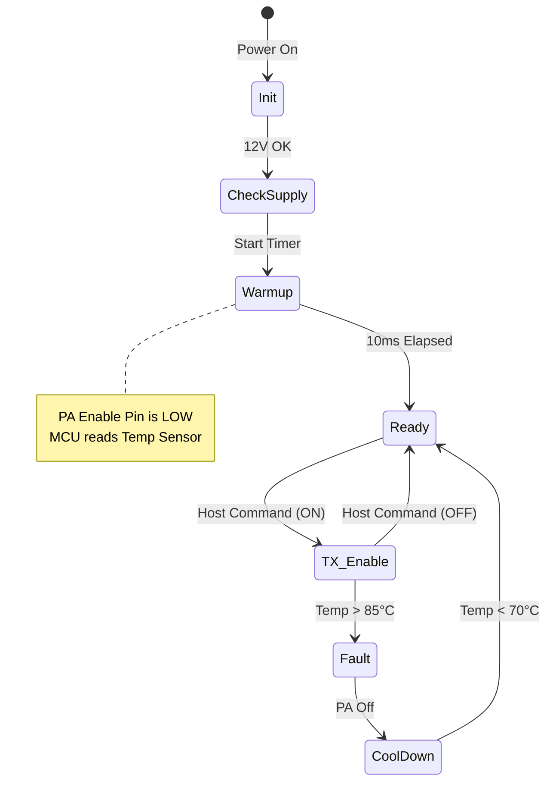

```markdown
# Software Requirements Specification (SRS) for tf PA Controller

## Document Information
*   **Project ID:** tf
*   **Document Version:** 1.0
*   **Date:** 2026-04-04
*   **Author:** Senior Software Architect
*   **Status:** Preliminary

---

# 1. Introduction

## 1.1 Purpose
The purpose of this document is to specify the software and firmware requirements for the **tf Power Amplifier (PA) Digital Control Module**. While the primary function of the tf device is analog RF amplification (as defined in the Hardware Requirements Specification), this SRS defines the embedded control system responsible for power management, bias sequencing, thermal protection, and digital telemetry.

## 1.2 Scope
This specification covers the firmware running on the microcontroller (MCU) managing the **tf** PA module.
*   **In Scope:** Bias controller logic, thermal monitoring via SPI sensor, enable sequencing, fault handling, and communication with the host system via UART/SPI.
*   **Out of Scope:** The RF signal path itself, mechanical design, and host application software.

## 1.3 Definitions, Acronyms, and Abbreviations

| Term | Definition |
| :--- | :--- |
| **GLR** | Glue Logic Requirements |
| **PAE** | Power Added Efficiency |
| **VSWR** | Voltage Standing Wave Ratio |
| **GPIO** | General Purpose Input/Output |
| **SPI** | Serial Peripheral Interface |
| **MCU** | Microcontroller Unit |
| **TTL** | Transistor-Transistor Logic |
| **Thermal Foldback** | Reducing output power to prevent overheating |

## 1.4 References
1.  **tf Hardware Requirements Specification (P2)**, Rev A.
2.  **tf Glue Logic Requirements (GLR)**, Rev 1.0.
3.  IEEE Std 830-1998: IEEE Recommended Practice for Software Requirements Specifications.
4.  QPA2211 Datasheet (Qorvo).

## 1.5 Overview
Section 2 describes the system architecture and constraints. Section 3 details the specific software requirements, including timing, interfaces, and error handling. Section 4 covers verification.

---

# 2. Overall Description

## 2.1 Product Perspective
The **tf** system consists of a High-Power RF PA chain controlled by a low-power MCU (e.g., STM32G0 or equivalent). The MCU acts as a safety manager, ensuring the GaN amplifier is not powered until safe operating conditions (voltage, temperature) are met.

```mermaid
blockDiagram
    block Host
    block MCU["MCU (Controller)"]
    block PA["RF PA Stage (GaN)"]
    block PS["12V Power Supply"]
    block Sensor["Temp Sensor (SPI)"]

    Host -- UART/SPI --> MCU
    MCU -- GPIO (Enable) --> PA
    MCU -- SPI --> Sensor
    PS -- 12V --> PA
    PA -- Thermal Coupling --> Sensor
```

## 2.2 Product Functions
1.  **Sequencing:** Control the timing of the PA Enable signal relative to the 12V supply rail.
2.  **Monitoring:** Read temperature sensors via the SPI interface defined in the GLR.
3.  **Protection:** Immediately shut down the PA if temperature exceeds safety thresholds.
4.  **Telemetry:** Report status (Temp, VSWR fault if applicable, Uptime) to the host.

## 2.3 User Characteristics
The primary user is an embedded systems integrator connecting the **tf** module to a host SDR or transmitter. The interface is programmatic (C API / Serial commands), not human-facing.

## 2.4 Constraints
*   **Hardware Limitations:** The MCU must not drive the PA Enable pin high until the 12V supply is stable (as per QPA2211 requirements).
*   **Timing:** Enable signal timing must be precise (< 1µs jitter) to prevent gate lag damage.
*   **Power:** The control circuitry must consume < 100mA from the 3.3V rail.

## 2.5 Assumptions and Dependencies
*   The 12V supply ramps up within 5ms of system startup.
*   The host system provides a 3.3V logic level interface.
*   An external 32.768 kHz crystal or internal RC oscillator is available for RTC.

---

# 3. Specific Requirements

## 3.1 External Interface Requirements

### 3.1.1 Hardware Interfaces (Map from HRS/GLR)
The firmware shall abstract the physical GPIO and SPI registers into C-Structs to ensure type safety and direct memory mapping where applicable.

**GLR to C Struct Mapping (SPI Sensor)**

```c
// Register Map Definitions derived from GLR Section 2
#define TEMP_SENSOR_BASE_ADDR  0x48 // Example I2C/SPI address

typedef struct __attribute__((packed)) {
    uint8_t  REG_TEMP_H;     // 0x00: Temperature MSB
    uint8_t  REG_TEMP_L;     // 0x01: Temperature LSB
    uint8_t  REG_CONFIG;     // 0x02: Configuration
    uint8_t  REG_THYST_H;    // 0x03: Hysteresis MSB
    uint8_t  REG_THYST_L;    // 0x04: Hysteresis LSB
} TempSensor_t;

// Hardware GPIO Map
typedef struct {
    volatile uint32_t MODER;    // Mode Register
    volatile uint32_t OTYPER;   // Output Type
    volatile uint32_t OSPEEDR;  // Speed
    volatile uint32_t PUPDR;    // Pull-up/pull-down
    volatile uint32_t IDR;      // Input Data
    volatile uint32_t ODR;      // Output Data
} GPIO_Port_t;

#define PA_ENABLE_PORT  ((GPIO_Port_t *) 0x48000000) // GPIOA Base
#define PA_ENABLE_PIN   (1UL << 5)                   // Pin 5
```

### 3.1.2 Software Interfaces

**Driver API Signatures**

```c
/**
 * @brief Initialize the PA Controller hardware
 * @retval 0 on success, -1 on SPI failure
 */
int TF_PA_Init(void);

/**
 * @brief Enable the RF Power Amplifier
 * @param state 1 = Enable, 0 = Disable
 * @retval 0 on success, -1 if Thermal Lockout is active
 */
int TF_PA_SetState(uint8_t state);

/**
 * @brief Read current die temperature
 * @retval Temperature in Celsius
 */
float TF_PA_GetTemperature(void);

/**
 * @brief Check if thermal shutdown occurred
 * @retval 1 if tripped, 0 if OK
 */
int TF_PA_IsFault(void);
```

### 3.1.3 Communication Interfaces
Communication with the host occurs over a UART interface (DEBUG/CTRL port) at 115200 baud, 8N1.
*   **REQ-SW-005:** The system shall respond to a "STATUS?" query with a JSON packet.
    *   Format: `{"temp": 45.2, "pa_state": 1, "fault": 0}`

## 3.2 Functional Requirements

| ID | Title | Description | Traceability (REQ-HW) |
|---|---|---|---|
| **REQ-SW-001** | Startup Sequencing | Upon power-on, the MCU shall hold the PA Enable pin LOW for at least 10ms to allow the 12V rail to stabilize before bringing the PA out of standby. | REQ-HW-009, REQ-HW-004 |
| **REQ-SW-002** | Thermal Monitoring | The MCU shall read the temperature sensor via SPI at a 10Hz rate. | REQ-HW-006 |
| **REQ-SW-003** | Over-Temperature Protection | If the temperature reading exceeds +85°C, the MCU shall immediately force the PA Enable pin LOW. It shall not re-enable until temperature drops below +70°C (Hysteresis). | REQ-HW-006 |
| **REQ-SW-004** | Watchdog Timer | The MCU shall implement an independent windowed watchdog (IWDG) with a 10ms timeout. If the firmware hangs, the watchdog reset must force the PA Enable pin LOW via the hardware reset configuration (Backup Registers). | REQ-HW-015 |
| **REQ-SW-005** | Host Telemetry | The MCU shall maintain a rolling average of the last 10 temperature readings to provide to the host system. | REQ-HW-002 |

## 3.3 Performance Requirements

| ID | Metric | Value | Rationale |
|---|---|---|---|
| **PERF-SW-001** | SPI Transaction Time | < 100 µs | Ensure thermal loop latency is negligible compared to thermal time constant of the heatsink. |
| **PERF-SW-002** | Enable Response Time | < 10 µs | Time required for GPIO toggle after function call. Matches REQ-HW-009. |
| **PERF-SW-003** | CPU Load | < 20% | Reserve cycles for future modulation envelope tracking. |

## 3.4 Design Constraints

*   **Compiler:** GCC ARM Embedded (minimum version 10.2).
*   **Standard:** MISRA C:2012 compliance required for all safety-critical logic (Thermal, Enable).
*   **Memory:** Firmware footprint must fit within 64KB Flash, 8KB RAM.

## 3.5 Software System Attributes

### 3.5.1 Reliability
The firmware shall utilize a triple-read redundant check for the temperature sensor before triggering a shutdown to mitigate single-event upsets (SEU) or noise on the SPI bus.

### 3.5.2 Availability
The PA enable control loop must run in a high-priority ISR (Interrupt Service Routine) or DMA transfer context to ensure timing is not jittered by lower priority UART communication tasks.

### 3.5.3 Security
*   **REQ-SW-006:** The firmware shall verify the integrity of the flash memory using a CRC check on boot.
*   **REQ-SW-007:** Debug interfaces (JTAG/SWD) shall be disabled (fused) after production programming to prevent IP theft or accidental register modification.

### 3.5.4 Maintainability
The software shall support a Field Upgrade Mode via the Bootloader, accessible by forcing a specific GPIO pattern during reset.

---

# 4. Verification and Validation

## 4.1 Unit Test Requirements
*   **UTC-001:** Verify `TF_PA_SetState` logic by injecting mock GPIO states.
*   **UTC-002:** Verify thermal hysteresis logic by simulating temperature values crossing the 85°C -> 70°C threshold.
*   **UTC-003:** Verify SPI protocol timing using a logic analyzer (Confirm 10MHz max speed and 10ns setup/hold times defined in GLR).

## 4.2 Integration Test Requirements
*   **ITC-001:** Connect MCU to a resistive load simulator (dummy PA) and verify the 10ms startup delay on an oscilloscope.
*   **ITC-002:** Heat the sensor using a heat gun; verify MCU toggles PA Enable to LOW exactly when threshold is reached.

## 4.3 System Test Requirements
*   **STC-001:** Run the PA at +40 dBm (10W) for 60 minutes. Verify thermal protection does not trigger falsely at max operating temp (+85°C ambient).

---

# 5. Traceability Matrix

| Software Req ID | Description | Traceability to HW Req |
| :--- | :--- | :--- |
| **REQ-SW-001** | Startup Sequencing | REQ-HW-009 (Enable Control) |
| **REQ-SW-002** | Thermal Monitoring | REQ-HW-006 (Operating Temp) |
| **REQ-SW-003** | Over-Temperature Protection | REQ-HW-006, REQ-HW-001 (Reliability) |
| **REQ-SW-004** | Watchdog Timer | REQ-HW-015 (Isolation/Safety) |
| **REQ-SW-005** | Telemetry | REQ-HW-002 (Monitoring) |
| **PERF-SW-002** | Enable Response Time | REQ-HW-009 (Turn-on/off time) |

---

# 6. Appendices

## Appendix A: State Machine Diagram



## Appendix B: Error Codes

| Code | Name | Description |
| :--- | :--- | :--- |
| **E_OK** | 0x00 | Operation Successful |
| **E_BUS** | 0x01 | SPI/I2C Communication Failure |
| **E_TEMP** | 0x02 | Over-Temperature Fault |
| **E_TIMEOUT** | 0x03 | Watchdog Reset Occurred |
| **E_VOLT** | 0x04 | Under-voltage Lockout (UVLO) |

## Appendix C: GLR Timing Analysis
Based on GLR constraints (SPI Clock 10MHz max), the bit period is 100ns. Reading a 16-bit temperature value requires approximately 2µs. The thermal loop (10Hz) easily fits within the performance budget, leaving 90% CPU idle time for communication tasks.
```