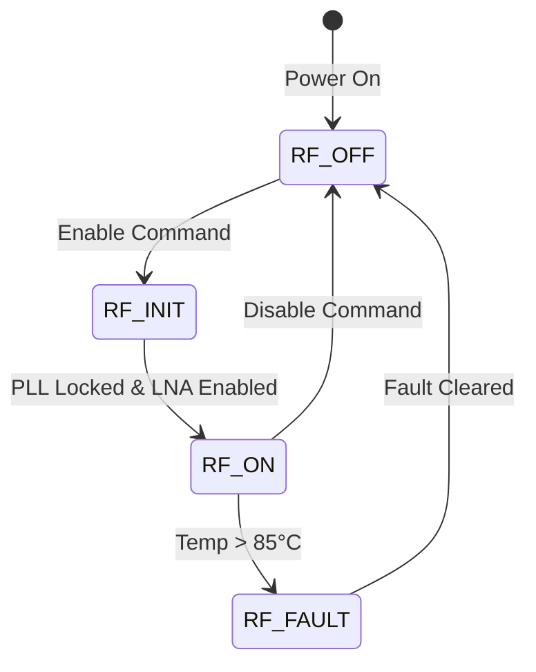
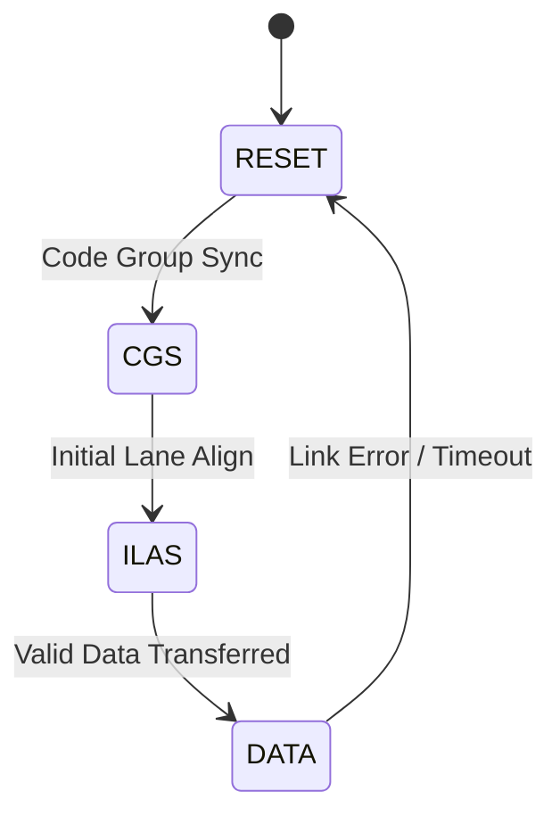
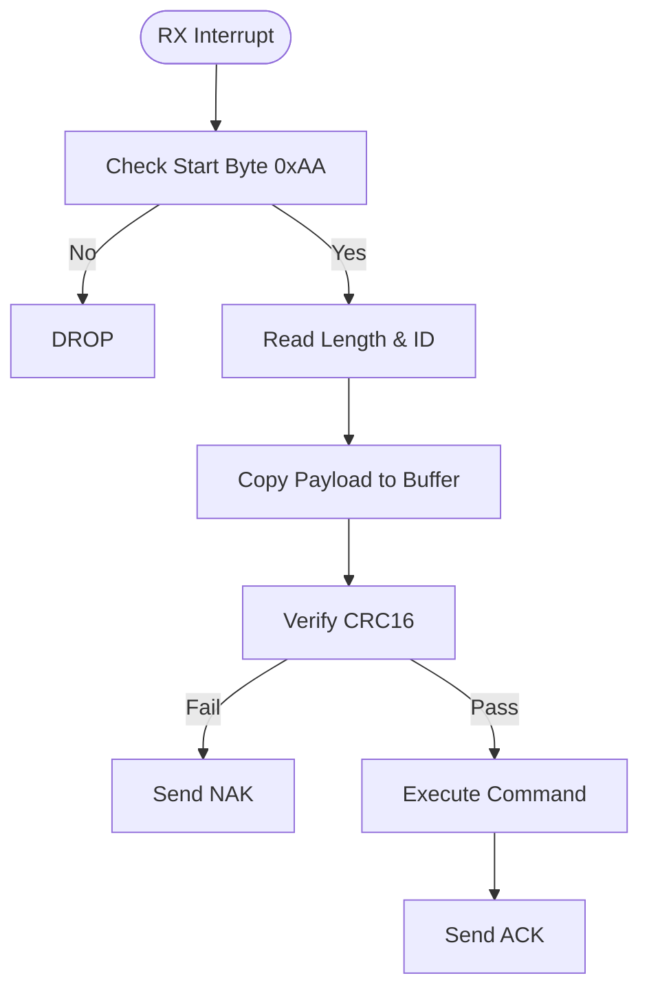
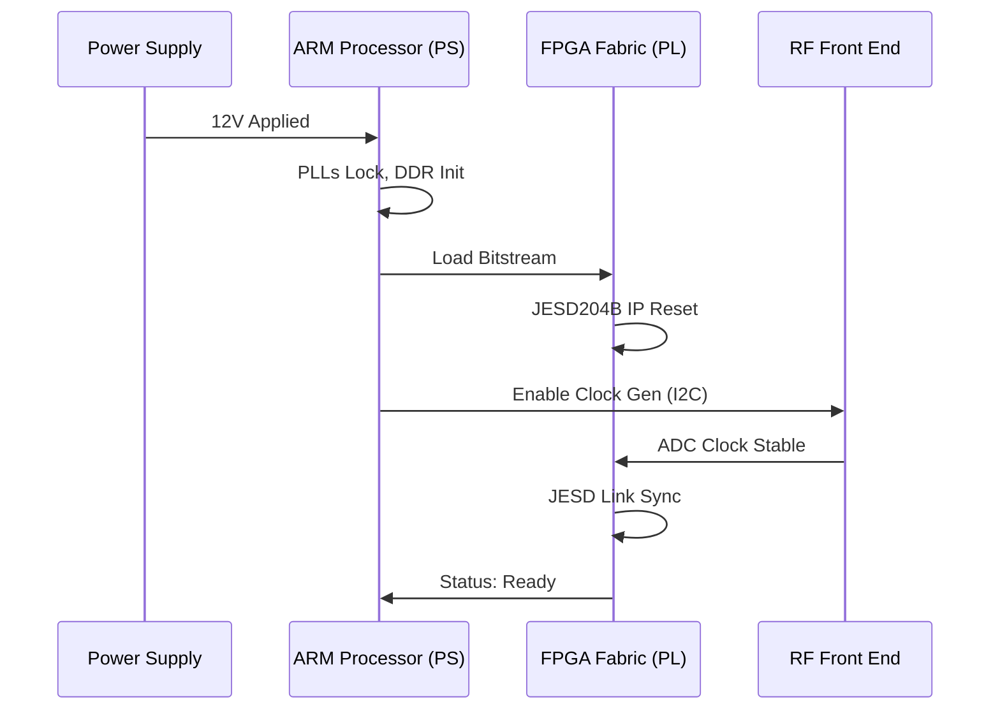

# Software Requirements Specification (SRS)

**Project:** uyj Wideband RF Receiver System
**Version:** 1.0
**Date:** 15 April 2026

---

## Document Control
| Version | Date | Author | Changes |
|---------|------|--------|---------|
| 1.0 | 15 April 2026 | System Architect | Initial Release for uyj Development |

---

# 1. Introduction

## 1.1 Purpose
This Software Requirements Specification (SRS) defines the comprehensive software and firmware requirements for the **uyj** Wideband RF Receiver System. The purpose of this document is to establish a complete, measurable, and testable baseline for the development of the FPGA logic, embedded control software, and host communication interfaces.

This specification details the behavior of the software running on the Xilinx Zynq UltraScale+ (XCZU9EG) Processing System (PS) and Programmable Logic (PL). It encompasses the management of the RF front-end (LNA/VGA), the high-speed JESD204B data link from the ADC, digital signal processing (DDC), and the control interface exposed to the host system via UART.

## 1.2 Scope
The software system scope includes:
1.  **FPGA Firmware:** VHDL/Verilog code for the PL, including JESD204B IP cores, Digital Down-Converters (DDC), and packetizing DMA engines.
2.  **Embedded Software:** C code running on the ARM Cortex-A53 (PS), responsible for hardware initialization, temperature monitoring, SPI/SMBus device control, and UART packet handling.
3.  **Bootloader:** Software to initialize the DDR4 memory, load the FPGA bitstream from QSPI Flash, and boot the main application.
4.  **Host Interface:** A command/response protocol allowing an external host to configure frequency, gain, bandwidth, and retrieve status.

**Exclusions:** This specification does not cover the design of the PCB schematic or the physical RF components themselves, which are defined in the HRS. It also excludes the design of the Host PC GUI software, focusing only on the *uyj* response to commands.

## 1.3 Definitions, Acronyms, and Abbreviations

| Term | Definition |
| :--- | :--- |
| **ADC** | Analog-to-Digital Converter (TI ADC12DJ5200RF) |
| **API** | Application Programming Interface |
| **ARM** | Advanced RISC Machines (Processor Architecture) |
| **BIST** | Built-In Self-Test |
| **BSP** | Board Support Package |
| **CDDL** | Common Data Link Layer (Part of JESD204B standard) |
| **CRC** | Cyclic Redundancy Check |
| **DAC** | Digital-to-Analog Converter |
| **DDR4** | Double Data Rate 4 SDRAM |
| **DDC** | Digital Down-Converter |
| **DMA** | Direct Memory Access |
| **EMC** | Electromagnetic Compatibility |
| **ENOB** | Effective Number Of Bits |
| **FIFO** | First-In-First-Out memory buffer |
| **FPGA** | Field-Programmable Gate Array |
| **FSBL** | First Stage Bootloader |
| **GPIO** | General Purpose Input/Output |
| **HAL** | Hardware Abstraction Layer |
| **HRS** | Hardware Requirements Specification |
| **I2C** | Inter-Integrated Circuit (Serial Interface) |
| **IP** | Intellectual Property (Logic Core) |
| **ISR** | Interrupt Service Routine |
| **JESD** | Joint Electron Device Engineering Council Standard for Data Converters |
| **LANE** | Physical serial data lane in JESD204B |
| **LFSR** | Linear Feedback Shift Register |
| **LNA** | Low Noise Amplifier (HMC1099LP5DE) |
| **LSB** | Least Significant Bit |
| **MSB** | Most Significant Bit |
| **MTBF** | Mean Time Between Failures |
| **NCO** | Numerically Controlled Oscillator |
| **NF** | Noise Figure |
| **NVM** | Non-Volatile Memory |
| **PCB** | Printed Circuit Board |
| **PLL** | Phase-Locked Loop |
| **PS** | Processing System (ARM side of Zynq) |
| **PL** | Programmable Logic (FPGA fabric side of Zynq) |
| **RAM** | Random Access Memory |
| **RF** | Radio Frequency |
| **ROM** | Read-Only Memory |
| **RTL** | Register Transfer Level |
| **SPI** | Serial Peripheral Interface |
| **SRS** | Software Requirements Specification |
| **UART** | Universal Asynchronous Receiver/Transmitter |
| **VGA** | Variable Gain Amplifier (HMC698LP4) |
| **WDT** | Watchdog Timer |

## 1.4 References
1.  **IEEE Std 830-1998**: Recommended Practice for Software Requirements Specifications.
2.  **IEEE Std 29148-2018**: Systems and software engineering — Life cycle processes — Requirements engineering.
3.  **MISRA C:2012**: Guidelines for the use of the C language in critical systems.
4.  **HRS (uyj)**: Hardware Requirements Specification, Rev 1.0, 15 April 2026.
5.  **GLR (uyj)**: Glue Logic Requirements, Rev 0V01, 15 April 2026.
6.  **Xilinx UG1085**: Zynq UltraScale+ Device Register Reference.
7.  **TI ADC12DJ5200RF Datasheet**: SBAS974B, November 2019.
8.  **Analog Devices HMC698LP4 Datasheet**: 6-18 GHz Digital VGA.

## 1.5 Overview
Section 2 describes the overall product perspective, functions, and constraints. Section 3 details specific external interfaces and provides the numbered functional requirements (REQ-SW-001 to REQ-SW-060+). Section 4 defines verification methods. Section 5 provides the traceability matrix mapping software requirements to hardware and glue logic specifications.

---

# 2. Overall Description

## 2.1 Product Perspective

The **uyj** software is embedded entirely within the **uyj** hardware assembly. The software acts as the control and processing engine for the RF hardware.

### System Context
```mermaid
flowchart TD
    Host[Host PC / Controller] -->|UART Commands / Config| UART[UART Driver]
    Host -->|Ethernet (Optional Mgmt)| ETH[Ethernet Stack]

    subgraph Embedded SW (PS)
        UART --> APP[Control Application]
        APP --> SPI[SPI Driver]
        APP --> I2C[I2C Driver]
        APP --> MON[Status Monitor]
    end

    subgraph FPGA PL Logic
        APP --> JESD[JESD204B IP]
        APP --> REG[Register Map]
        JESD --> DDC[DDC / DSP Chain]
        DDC --> DMA[Packet DMA]
        DMA --> DDR[DDR4 Buffer]
    end

    SPI --> VGA[HMC698LP4 VGA]
    I2C --> CLK[LMK04828B Clock Gen]
    
    RF_IN[RF Input 5-18GHz] --> LNA[HMC1099 LNA]
    LNA --> VGA
    VGA --> ADC[ADC12DJ5200RF]
    ADC -->|JESD204B Lanes| JESD
```

The software consists of two primary domains:
1.  **Control Plane (PS - ARM Cortex-A53):** Handles serial communication, configuration of the RF chain via SPI/I2C, and health monitoring.
2.  **Data Plane (PL - FPGA Fabric):** Handles the high-speed JESD204B link, real-time DSP (DDC), and buffering of data into DDR4 memory.

## 2.2 Product Functions
1.  **System Initialization:** Configure clocks, power rails, and load FPGA bitstream.
2.  **RF Chain Configuration:** Set LNA enable, VGA attenuation (via SPI).
3.  **Clock Synthesis:** Program the LMK04828B for specific sample rates and device clocks.
4.  **ADC Link Management:** Bring up the JESD204B link (Code Group Sync, Lane Sync) and monitor for errors.
5.  **Signal Processing:** Perform Digital Down-Conversion (DDC) on raw ADC data to select a sub-band of interest.
6.  **Data Handling:** Packetize processed I/Q data and buffer it for retrieval.
7.  **Host Communication:** Respond to register read/write commands over UART.
8.  **Health Monitoring:** Monitor board temperature, voltage rails, and RF levels.
9.  **Fault Management:** Automatic gain control (AGC) or shutdown to protect the LNA/ADC from over-voltage.
10. **Watchdog:** Reset the system if the software hangs.

## 2.3 User Characteristics
*   **System Integrators:** Configure the **uyj** unit for specific frequency bands and gain settings via the host interface.
*   **Firmware Engineers:** Maintain the C code on the ARM core and the VHDL/Verilog code in the FPGA.
*   **Test Engineers:** Validate performance using the built-in test modes (loopback, PRBS generation).

## 2.4 Constraints
1.  **Timing:** The JESD204B interface must meet the setup/hold times specified by the ADC for 5.2 GSPS operation.
2.  **Memory:** DSP logic must fit within the DSP48E2 slices of the XCZU9EG.
3.  **Power:** Total system power consumption must not exceed 50W (REQ-HW-009).
4.  **Environment:** The software must enable the watchdog timer and thermal throttling to survive -40°C to +85°C ambient temperatures (HRS Section 2).
5.  **Standards:** Code must comply with MISRA-C:2012 guidelines for safety and reliability.

## 2.5 Assumptions and Dependencies
1.  The HMC1061 Limiter and HMC1099 LNA are powered via the LTC7891 supply sequence before the FPGA attempts to drive their enable pins.
2.  The 12V supply is stable and within regulation limits before software boot.
3.  The Host system uses a 3-wire UART interface (TX, RX, GND).
4.  The ADC requires a stable reference clock from the LMK04828B before the JESD204B link can be established.

---

# 3. Specific Requirements

## 3.1 External Interface Requirements

### 3.1.1 Hardware Interfaces

#### 3.1.1.1 UART Control Interface
The primary control interface is a UART operating at 115200 baud, 8N1.

**C Struct Definition:**
```c
#include <stdint.h>

/**
 * @brief UART Packet Frame Definition
 */
typedef struct __attribute__((packed)) {
    uint8_t  START_BYTE;      // Must be 0xAA
    uint8_t  MESSAGE_ID;      // CMD or RESP type
    uint16_t LENGTH;          // Payload length
    uint32_t ADDR;            // Register Address
    uint8_t  PAYLOAD[256];    // Data Payload (Max 256 bytes)
    uint16_t CRC16;           // CRC-16-CCITT Checksum
} UART_Packet_t;
```

**Driver API:**
```c
/**
 * @brief Initialize UART controller
 * @param baud_rate Baud rate (e.g., 115200)
 * @return 0 on success, negative error code on failure
 */
int32_t UART_Init(uint32_t baud_rate);

/**
 * @brief Receive and decode a command packet
 * @param pkt Pointer to store decoded packet
 * @param timeout_ms Timeout in milliseconds
 * @return ERR_OK if valid packet received, ERR_TIMEOUT otherwise
 */
int32_t_UART_ReceivePacket(UART_Packet_t *pkt, uint32_t timeout_ms);

/**
 * @brief Send a response packet
 * @param pkt Pointer to packet struct to send
 * @return ERR_OK on success
 */
int32_t UART_SendPacket(const UART_Packet_t *pkt);
```

#### 3.1.1.2 SPI Interface (RF Control)
Used to configure the HMC698LP4 VGA and potentially other SPI-based RF components.

**C Struct Definition:**
```c
typedef struct {
    uint8_t bus_id;       // SPI Bus 0
    uint8_t chip_select;  // GPIO CS pin
    uint32_t max_speed_hz; // Max 10 MHz
} SPI_Config_t;

// HMC698LP4 Register Map (Simplified)
#define HMC698_REG_CTRL 0x00
#define HMC698_REG_GAIN 0x01
```

**Driver API:**
```c
/**
 * @brief Initialize SPI master interface
 * @param config Configuration struct
 * @return 0 on success
 */
int32_t SPI_Init(const SPI_Config_t *config);

/**
 * @brief Write to HMC698 VGA
 * @param reg_addr 8-bit register address
 * @param data 8-bit data
 * @return 0 on success
 */
int32_t RF_VGA_Write(uint8_t reg_addr, uint8_t data);

/**
 * @brief Read from HMC698 VGA
 * @param reg_addr 8-bit register address
 * @param data Pointer to store read data
 * @return 0 on success
 */
int32_t RF_VGA_Read(uint8_t reg_addr, uint8_t *data);
```

#### 3.1.1.3 I2C Interface (Clock Gen & Temp)
Used for the LMK04828B Clock Generator and TMP464 Temperature Sensor (if present).

**C Struct Definition:**
```c
typedef struct {
    uint32_t clock_hz; // Standard 100kHz or Fast 400kHz
} I2C_Config_t;
```

**Driver API:**
```c
int32_t I2C_Init(const I2C_Config_t *config);

/**
 * @brief Write register to LMK04828B
 */
int32_t ClkGen_WriteReg(uint8_t dev_addr, uint16_t reg_addr, uint8_t data);

/**
 * @brief Read temperature from sensor
 * @return Temperature in degrees Celsius
 */
float TempSensor_ReadCelsius(void);
```

### 3.1.2 Software Interfaces

The FPGA logic exposes a memory-mapped register space to the ARM PS via the AXI-GP interface.
**Base Address:** 0xA000_0000 (Defined in Vivado design)

```c
// FPGA Register Map Offsets
#define FPGA_REG_MAGIC      0x0000 // Read-only: 0xDEADBEEF
#define FPGA_REG_CONTROL    0x0004 // R/W: Global control bits
#define FPGA_REG_STATUS     0x0008 // R/O: JESD Link status
#define FPGA_REG_DDR_ADDR   0x0010 // R/W: DDR DMA Write Address
#define FPGA_REG_DDR_SIZE   0x0014 // R/W: Transfer Size
#define FPGA_REG_DDC_FREQ   0x0018 // R/W: NCO Tuning Word
#define FPGA_REG_DDC_CFG    0x001C // R/W: Decimation Rate

// Bitmasks for CONTROL
#define CTRL_RST_DSP    (1 << 0)
#define CTRL_RST_JESD   (1 << 1)
#define CTRL_ENABLE_DMA (1 << 2)

// Bitmasks for STATUS
#define STATUS_JESD_LOCK (1 << 0)
#define STATUS_PLL_LOCK  (1 << 1)
```

### 3.1.3 Communication Protocols
The UART protocol acts as the transport for Register Read/Write commands.
*   **Command Format:** `[0xAA][MSG_ID][LEN][ADDR][PAYLOAD][CRC16]`
*   **Write Command:** MSG_ID = 0x01. Payload contains data to write to `ADDR`.
*   **Read Command:** MSG_ID = 0x02. Payload is empty.
*   **Response Format:** `[0xAA][MSG_ID_RESP][LEN][ADDR][DATA][CRC16]`

## 3.2 Functional Requirements

### 3.2.1 System Initialization (REQ-SW-001 to REQ-SW-010)

| ID | Requirement | Traceability |
|----|-------------|--------------|
| **REQ-SW-001** | The software SHALL initialize the Xilinx PS-CR (Clock, Reset, GPIO) within 50ms of power-on. | HRS: Boot |
| **REQ-SW-002** | The software SHALL load the FPGA Bitstream from non-volatile QSPI Flash into the PL. | GLR: FPGA Config |
| **REQ-SW-003** | The software SHALL initialize the external DDR4 memory and run a calibration routine. | GLR: Memory Interface |
| **REQ-SW-004** | The software SHALL configure the LMK04828B clock generator via I2C to produce the ADC sampling clock (e.g., 4915.2 MHz for 5.2 GSPS). | HRS: Clocking |
| **REQ-SW-005** | The software SHALL verify the HMC1099 LNA enable pin state is LOW at startup. | GLR: RF Control |
| **REQ-SW-006** | The software SHALL wait for the JESD204B PHY to report Code Group Sync (CGS) and IP Alignment before signaling readiness. | GLR: JESD204B Interface |
| **REQ-SW-007** | The software SHALL configure the HMC698LP4 VGA to a default attenuation value (e.g., 10dB) stored in EEPROM. | HRS: Gain Range |
| **REQ-SW-008** | The software SHALL start the Watchdog Timer (WDT) with a 1-second timeout after initialization completes. | HRS: Reliability |
| **REQ-SW-009** | The software SHALL perform a BIST on the internal PL-PS AXI bus by writing to FPGA_REG_MAGIC and reading back the echo. | GLR: Testability |
| **REQ-SW-010** | The software SHALL log the Firmware Version and Build Date to the UART interface upon successful boot. | HRS: Diagnostics |

### 3.2.2 RF Control & Gain Management (REQ-SW-011 to REQ-SW-020)

| ID | Requirement | Traceability |
|----|-------------|--------------|
| **REQ-SW-011** | The software SHALL provide a command to set the RF Center Frequency by reprogramming the NCO in the DDC logic. | HRS: Tuning Range |
| **REQ-SW-012** | The software SHALL allow the host to set the HMC698 attenuation in 0.5 dB steps via SPI. | HRS: Gain Control |
| **REQ-SW-013** | The software SHALL calculate the 32-bit NCO tuning word based on the requested frequency and ADC sample rate using the formula: $FTW = (Freq \times 2^{32}) / F_{sample}$. | HRS: Frequency Resolution |
| **REQ-SW-014** | The software SHALL clamp the requested VGA attenuation between 0 dB and 31.5 dB, returning an error code if out of bounds. | HRS: Constraints |
| **REQ-SW-015** | The software SHALL support a "RF Enable" command that asserts the LNA enable pin. | GLR: RF Enable |
| **REQ-SW-016** | The software SHALL implement a debounce timer on the RF Enable command to prevent rapid toggling (min 1ms). | HRS: Safety |
| **REQ-SW-017** | The software SHALL read back the temperature of the LNA/VGA section via the internal sensor. | HRS: Operating Temp |
| **REQ-SW-018** | The software SHALL automatically force VGA attenuation to maximum (31.5 dB) if the RF input power exceeds +10 dBm (as detected by ADC envelope or external detector). | HRS: Protection |
| **REQ-SW-019** | The software SHALL allow the host to configure the Decimation Factor of the DDC to set the instantaneous bandwidth (1 to 4 GHz). | HRS: Bandwidth |
| **REQ-SW-020** | The software SHALL apply correction factors to the VGA gain setting based on lookup table (LUT) data to flatten frequency response. | HRS: Performance |

### 3.2.3 JESD204B & Data Acquisition (REQ-SW-021 to REQ-SW-030)

| ID | Requirement | Traceability |
|----|-------------|--------------|
| **REQ-SW-021** | The software SHALL monitor the JESD204B link status register (FPGA_REG_STATUS) for loss of sync. | GLR: ADC Interface |
| **REQ-SW-022** | The software SHALL increment a "Link Error Counter" if the JESD204B discrete error indicator is asserted. | HRS: Reliability |
| **REQ-SW-023** | The software SHALL reset the JESD204B PHY if the link remains unsynchronized for more than 100ms. | HRS: Recovery |
| **REQ-SW-024** | The software SHALL configure the ADC subsystem (via SPI to LMK/ADC) to operate in Dual-Channel mode (for I/Q demodulation) or Single-Channel mode. | HRS: ADC Config |
| **REQ-SW-025** | The software SHALL verify the ADC Test Pattern (e.g., 0xFF00 custom ramp) is received correctly by the FPGA during startup BIST. | GLR: Verification |
| **REQ-SW-026** | The software SHALL ensure the JESD204B lane bit rate matches the configured clock (e.g., 10.4 Gbps for 5.2 GSPS). | HRS: Speed |
| **REQ-SW-027** | The software SHALL disable the ADC outputs (high impedance) when the system is in "Sleep" mode to save power. | HRS: Power Consumption |
| **REQ-SW-028** | The software SHALL log the Lane FIFO overflow flags to a status register readable by the host. | GLR: Diagnostics |
| **REQ-SW-029** | The software SHALL support Subclass 1 deterministic latency requirements if configured for synchronized multi-board operation. | HRS: Timing |
| **REQ-SW-030** | The software SHALL calculate and display the current Link Latency based on the configured lane rate and subclass. | HRS: Performance |

### 3.2.4 Signal Processing (FPGA Logic) (REQ-SW-031 to REQ-SW-040)

| ID | Requirement | Traceability |
|----|-------------|--------------|
| **REQ-SW-031** | The FPGA logic SHALL implement a Digital Down Converter (DDC) consisting of an NCO mixer followed by a Cascaded Integrator-Comb (CIC) filter. | HRS: FPGA Processing |
| **REQ-SW-032** | The DDC SHALL support a programmable decimation rate between 4x and 16x. | HRS: Bandwidth |
| **REQ-SW-033** | The CIC filter SHALL compensate for the passband droop inherent in the CIC structure. | HRS: Performance |
| **REQ-SW-034** | The output data SHALL be formatted as 16-bit I and 16-bit Q complex samples. | HRS: Resolution |
| **REQ-SW-035** | The FPGA SHALL buffer the processed I/Q data into DDR4 memory using a DMA engine. | HRS: Buffering |
| **REQ-SW-036** | The DMA SHALL utilize circular buffering in DDR4 to prevent data loss during transfers. | HRS: Real-time |
| **REQ-SW-037** | The FPGA SHALL insert a packet header containing a Timestamp and Sample Counter before the data payload. | HRS: Data Format |
| **REQ-SW-038** | The FPGA SHALL detect over-range samples (ADC saturation) and set a flag in the packet header. | HRS: Dynamic Range |
| **REQ-SW-039** | The FPGA logic SHALL be capable of processing 2 complex channels simultaneously. | HRS: Channels |
| **REQ-SW-040** | The FPGA SHALL implement a programmable FIR filter after the CIC for final channel shaping. | HRS: Filtering |

### 3.2.5 Communication & Protocol (REQ-SW-041 to REQ-SW-050)

| ID | Requirement | Traceability |
|----|-------------|--------------|
| **REQ-SW-041** | The software SHALL respond to a Write Register command within 5ms of receipt. | HRS: Responsiveness |
| **REQ-SW-042** | The software SHALL ignore commands with invalid CRC16 checksums and generate an error response. | HRS: Integrity |
| **REQ-SW-043** | The software SHALL support a "Bulk Read" command to read consecutive FPGA registers in a single transaction. | GLR: Efficiency |
| **REQ-SW-044** | The software SHALL provide a "Get Status" command that returns packed status bytes (Temp, Link Status, Lock). | HRS: Monitoring |
| **REQ-SW-045** | The software SHALL verify that register write addresses do not overlap with protected system addresses. | HRS: Security |
| **REQ-SW-046** | The software SHALL echo back the written data in a write response packet to confirm the action. | HRS: Confirmation |
| **REQ-SW-047** | The software SHALL support a firmware upgrade command that writes a new bitstream to QSPI Flash and resets the system. | HRS: Maintenance |
| **REQ-SW-048** | The UART driver SHALL implement a 100ms receive timeout for partial packets. | GLR: Robustness |
| **REQ-SW-049** | The software SHALL support a "Factory Reset" command that restores all EEPROM/Flash config variables to defaults. | HRS: Usability |
| **REQ-SW-050** | The software SHALL utilize Little-Endian byte ordering for all multi-byte register values. | GLR: Standard |

### 3.2.6 Power & Thermal Management (REQ-SW-051 to REQ-SW-060)

| ID | Requirement | Traceability |
|----|-------------|--------------|
| **REQ-SW-051** | The software SHALL monitor the internal FPGA temperature via the Xilinx SYSMON block every 500ms. | HRS: Temp Range |
| **REQ-SW-052** | The software SHALL assert a THROTTLING warning if the FPGA junction temperature exceeds 85°C. | HRS: Safety |
| **REQ-SW-053** | The software SHALL automatically disable the RF Output (LNA) if the PCB temperature exceeds +80°C. | HRS: Limits |
| **REQ-SW-054** | The software SHALL utilize the Xilinx PMU (Power Management Unit) to put unused PS peripherals into retention mode. | HRS: Power |
| **REQ-SW-055** | The software SHALL track the current 12V rail current via the LTC7891 monitor ADC. | GLR: Power Mon |
| **REQ-SW-056** | The software SHALL assert a CRITICAL FAULT flag if the total power consumption exceeds 50W for >5s. | HRS: Max Power |
| **REQ-SW-057** | The software SHALL implement a software-controlled hysteresis of 5°C for thermal alerts (Alert at 80°C, Clear at 75°C). | HRS: Logic |
| **REQ-SW-058** | The software SHALL log thermal events to a circular buffer in non-volatile memory for later retrieval. | HRS: Logging |
| **REQ-SW-059** | The software shall allow the host to read the cumulative "Uptime" counter in seconds. | HRS: Diagnostics |
| **REQ-SW-060** | The software SHALL force a system reset if the Watchdog Timer is not refreshed within 1 second. | HRS: Watchdog |

## 3.3 Performance Requirements
1.  **REQ-PERF-001:** The time from a Host "Set Frequency" command to the DDC locking to the new frequency (NCO update) shall be ≤ 10ms.
2.  **REQ-PERF-002:** The JESD204B link initialization (power-on to valid data) shall complete within 500ms.
3.  **REQ-PERF-003:** The Host-to-FPGA register write latency shall be ≤ 1ms (excluding UART transmission time).
4.  **REQ-PERF-004:** The software shall sustain continuous DDR4 writes for the full 4 GHz instantaneous bandwidth without underflow.
5.  **REQ-PERF-005:** The temperature monitoring loop shall not consume more than 1% of CPU cycles.
6.  **REQ-PERF-006:** The FPGA logic shall implement a pipeline latency of no more than 20 clock cycles for the DDC path.
7.  **REQ-PERF-007:** The Watchdog timer accuracy shall be ±10%.
8.  **REQ-PERF-008:** The SPI frequency for configuring the VGA shall be 10 MHz.
9.  **REQ-PERF-009:** The I2C frequency for configuring the Clock Gen shall be 400 kHz (Fast Mode).
10. **REQ-PERF-010:** The Boot time (Power-on to UART ready) shall not exceed 2 seconds.

## 3.4 Design Constraints
1.  **Language:** The embedded software shall be written in C (C99 standard).
2.  **Compliance:** The code shall comply with MISRA-C:2012 standards.
3.  **Memory:** Dynamic memory allocation (`malloc`, `free`) is strictly prohibited in the interrupt service routines and high-speed data paths.
4.  **Stack Size:** The main task stack size shall be configured to a minimum of 64KB.
5.  **Concurrency:** Access to shared registers (FPGA_AXI) shall be protected by mutexes or atomic operations.
6.  **Hardware:** The design utilizes the XCZU9EG-FFVB1156 FPGA; DSP logic must not exceed 80% resource utilization to allow for future expansion.
7.  **Power:** The Logic voltage rails (1.8V, 1.0V) must be sequenced correctly by the PS PMU before the PL is enabled.
8.  **Tools:** Software shall be built using Xilinx Vitis 2024.1 or later toolchain.

## 3.5 Software System Attributes

### 3.5.1 Reliability
The system shall achieve a Mean Time Between Failures (MTBF) of 10,000 hours. All error conditions (UART CRC error, JESD Link loss, SPI ACK timeout) shall be logged and reported to the host rather than causing a silent hang.

### 3.5.2 Availability
System uptime availability shall be > 99.9%. The firmware shall support a "Safe Mode" where the RF chain is disabled but the control interface remains active for diagnosis.

### 3.5.3 Security
1.  Write access to critical FPGA registers (FPGA_REG_CONTROL) shall require a specific unlock sequence (Write 0x5A, then 0xA5).
2.  Firmware updates over UART shall be authenticated via a digital signature or checksum.

### 3.5.4 Maintainability
Code modules shall be separated logically (UART Driver, HAL, Application). Cyclomatic complexity per function shall not exceed 10.

---

# 4. Verification and Validation

## 4.1 Unit Test Requirements
*   **UART Driver:** Verify correct packet parsing and CRC generation using mocked inputs.
*   **SPI/I2C Drivers:** Verify timing of waveforms using a logic analyzer.
*   **Register Map:** Verify read/write access to all AXI Lite registers in the FPGA.

## 4.2 Integration Test Requirements
*   **RF Loopback:** Inject a known CW tone into the RF input and verify the digital I/Q output frequency matches the expected DDC down-converted frequency.
*   **JESD204B Stress:** Test with random data and PRBS patterns from the ADC to verify bit error rate (BER < 10^-12).
*   **Thermal:** Place the unit in a thermal chamber; verify the system reduces gain and alerts at +85°C.

## 4.3 System Test Requirements
*   **Full Band Sweep:** Command the unit to sweep from 5 GHz to 18 GHz in 100 MHz steps; verify no lock drop.
*   **Max Throughput:** Saturate the ADC input and verify DDR4 buffers handle the data rate without overflow flags.

---

# 5. Requirements Traceability Matrix

| REQ-SW ID | Description | Traceability To |
|-----------|-------------|-----------------|
| REQ-SW-001 | PS-CR Init | HRS: Boot Sequence |
| REQ-SW-002 | FPGA Bitstream Load | GLR: XCZU9EG Config |
| REQ-SW-006 | JESD204B Sync | GLR: ADC12DJ5200RF Interface |
| REQ-SW-007 | VGA Config | HRS: HMC698LP4 Control |
| REQ-SW-012 | VGA Attenuation | HRS: Gain Range |
| REQ-SW-013 | NCO Calculation | HRS: Tuning Range |
| REQ-SW-031 | DDC Implementation | HRS: FPGA Signal Processing |
| REQ-SW-035 | DDR4 DMA | HRS: Memory Buffering |
| REQ-SW-041 | UART Response | HRS: UART Interface |
| REQ-SW-052 | Thermal Throttling | HRS: Operating Temp (-40 to +85C) |
| REQ-SW-056 | Power Limit | HRS: Max Power 50W |
| REQ-PERF-001 | Frequency Agility | HRS: Tuning Speed |

---

# 6. Appendices

## Appendix A — Error Codes
```c
typedef enum {
    ERR_OK           = 0x00,
    ERR_TIMEOUT      = 0x01,  // SPI/I2C Timeout
    ERR_COMM_CRC     = 0x02,  // UART CRC Fail
    ERR_PARAM        = 0x03,  // Invalid Parameter
    ERR_HARDWARE     = 0x04,  // SPI NACK
    ERR_LINK_DOWN    = 0x05,  // JESD204B Link Lost
    ERR_OVERFLOW     = 0x06,  // DDR4 DMA Overflow
    ERR_OVER_TEMP    = 0x07,  // Thermal Shutdown
    ERR_POWER_LIMIT  = 0x08,  // 50W Limit Exceeded
    ERR_LOCK_FAIL    = 0x09   // PLL Failed to Lock
} ErrorCode_t;
```

## Appendix B — Register Map Summary
| Offset | Name | Access | Description |
|--------|------|--------|-------------|
| 0x00 | MAGIC | RO | 0xDEADBEEF |
| 0x04 | CTRL | RW | Control Bits (Reset, Enable) |
| 0x08 | STATUS | RO | Link Status, PLL Lock |
| 0x10 | DDR_ADDR | RW | DMA Target Address |
| 0x18 | DDC_FREQ | RW | NCO Tuning Word (32-bit) |

## Appendix C — State Diagrams

### RF Enable Sequence


### JESD204B Link State Machine


### Command Processing Flow


### Initialization Sequence
