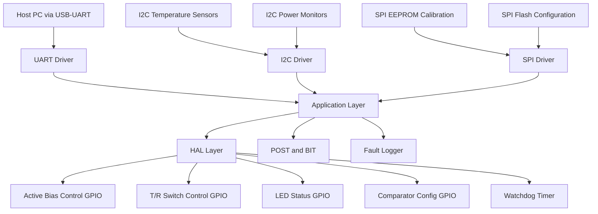
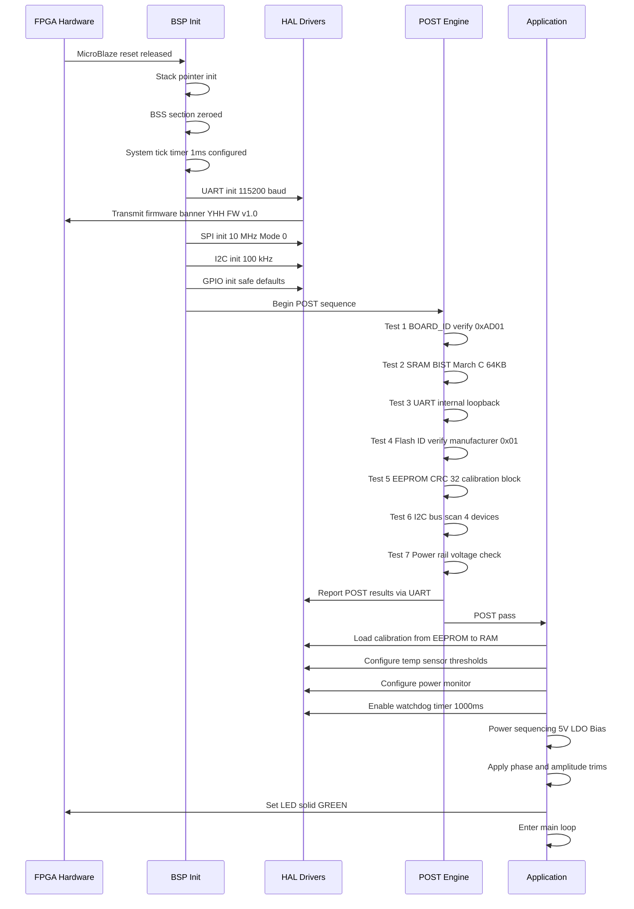
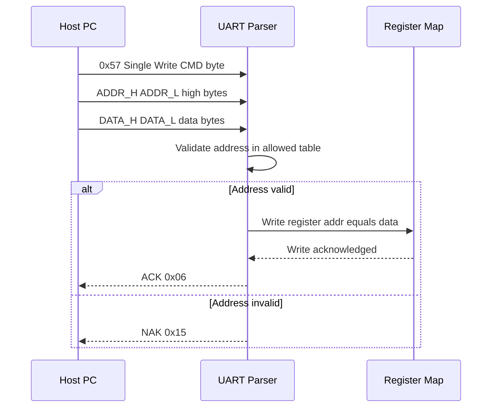
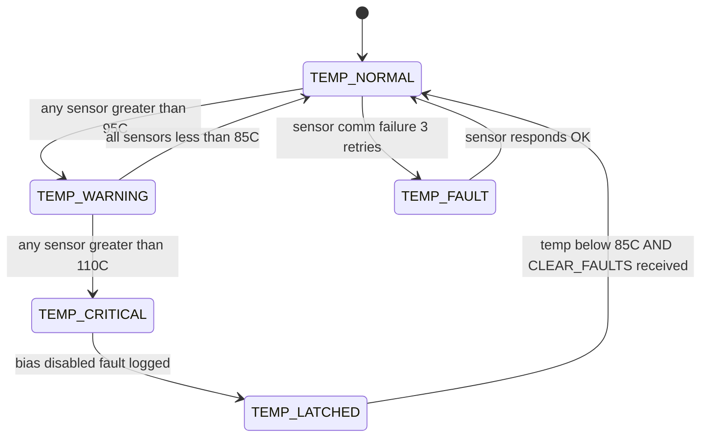
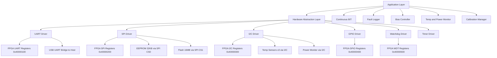
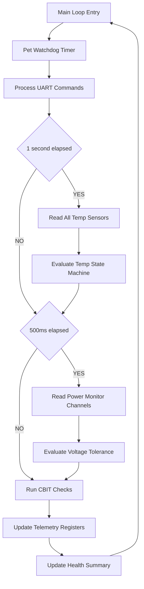

# Software Requirements Specification (SRS)

## Document Control
| Version | Date | Author | Changes |
|---------|------|--------|---------|
| 1.0 | 24 April 2026 | Systems Engineering | Initial Release |

---

# 1. Introduction

## 1.1 Purpose
This Software Requirements Specification (SRS) defines the complete set of software and firmware requirements for the **yhh** 4-channel monopulse radar RF front-end control system. The software executes within the Artix-7 XC7A200T-1FBG676I FPGA soft-processor architecture (MicroBlaze) and is responsible for system initialization, UART register command processing, I2C sensor polling, SPI memory management, RF chain bias control, monopulse comparator configuration, fault detection, and Built-In Test (BIT) execution. 

This document serves as the binding Level 3 specification per ISO/IEC/IEEE 29148:2018. It traces directly to the Hardware Requirements Specification (HRS) and Glue Logic Requirements (GLR) documents. Firmware engineers shall implement strictly from this SRS. Test engineers shall derive test procedures from the verification criteria specified herein.

## 1.2 Scope

**Product Name:** yhh Monopulse Radar RF Front-End Control Firmware  
**Product Identifier:** YHH-FW-SRS-001  

**In-Scope Software Functions:**
- Power-On Self-Test (POST) and hardware verification sequence
- UART command/response protocol handler (register read/write)
- SPI driver for EEPROM (calibration data) and Flash (FPGA configuration)
- I2C driver for temperature sensors and power monitors
- Active bias control for all LNA and gain block MMICs across 4 channels
- T/R switch control and timing management
- Monopulse comparator channel selection and phase/amplitude calibration
- Temperature monitoring with thermal protection (RF mute on over-temperature)
- Voltage and current telemetry on all power rails
- Watchdog timer management
- LED status and GPIO control
- Fault logging to EEPROM circular buffer
- JTAG debug interface support

**Out-of-Scope Items:**
- Digital Signal Processing (DSP) algorithms for monopulse angle estimation
- Antenna array beamforming signal processing
- Downconverter and ADC driver software
- Host PC graphical user interface (GUI) application
- FPGA bitstream synthesis and place-and-route

**Objectives and Benefits:**
The firmware ensures reliable autonomous operation of the RF front-end in military environments (-55°C to +125°C). It provides real-time thermal and power supply protection, maximizing Mean Time Between Failures (MTBF). The UART register interface enables remote diagnostics and calibration updates without physical access to the enclosure.

## 1.3 Definitions, Acronyms, and Abbreviations

| Acronym / Term | Definition |
| :--- | :--- |
| **ADC** | Analog-to-Digital Converter |
| **API** | Application Programming Interface |
| **ASIL** | Automotive Safety Integrity Level |
| **BIST** | Built-In Self-Test |
| **BPF** | Bandpass Filter |
| **BSP** | Board Support Package |
| **CRC** | Cyclic Redundancy Check |
| **DAC** | Digital-to-Analog Converter |
| **DMA** | Direct Memory Access |
| **DUT** | Device Under Test |
| **EEPROM** | Electrically Erasable Programmable Read-Only Memory |
| **FIFO** | First-In, First-Out data buffer |
| **FPGA** | Field Programmable Gate Array |
| **GaAs pHEMT** | Gallium Arsenide Pseudomorphic High Electron Mobility Transistor |
| **GLR** | Glue Logic Requirements |
| **GPIO** | General Purpose Input/Output |
| **HAL** | Hardware Abstraction Layer |
| **HRS** | Hardware Requirements Specification |
| **I2C** | Inter-Integrated Circuit bus |
| **IBW** | Instantaneous Bandwidth |
| **IIP3** | Input Third-Order Intercept Point |
| **IPC** | Inter-Process Communication |
| **ISR** | Interrupt Service Routine |
| **JTAG** | Joint Test Action Group debug interface |
| **LNA** | Low Noise Amplifier |
| **LVTTL** | Low-Voltage Transistor-Transistor Logic |
| **MCU** | Microcontroller Unit |
| **MISRA** | Motor Industry Software Reliability Association |
| **MMIC** | Monolithic Microwave Integrated Circuit |
| **NVM** | Non-Volatile Memory |
| **OIP3** | Output Third-Order Intercept Point |
| **PLL** | Phase-Locked Loop |
| **POST** | Power-On Self-Test |
| **QSPI** | Quad Serial Peripheral Interface |
| **RAM** | Random Access Memory |
| **RF** | Radio Frequency |
| **RPC** | Remote Procedure Call |
| **RTOS** | Real-Time Operating System |
| **RTM** | Requirements Traceability Matrix |
| **SDD** | Software Design Description |
| **SIL** | Safety Integrity Level |
| **SPI** | Serial Peripheral Interface |
| **SPDT** | Single-Pole, Double-Throw switch |
| **StRS** | Stakeholder Requirements Specification |
| **SyRS** | System Requirements Specification |
| **TRL** | Transmit/Receive Limiting |
| **UART** | Universal Asynchronous Receiver-Transmitter |
| **WDT** | Watchdog Timer |

## 1.4 References

| Ref ID | Document ID | Title / Description | Relevance |
| :--- | :--- | :--- | :--- |
| [REF-1] | IEEE 830-1998 | IEEE Recommended Practice for Software Requirements Specifications | Defines SRS document structure mandated for this project |
| [REF-2] | ISO/IEC/IEEE 29148:2018 | Systems and software engineering — Life cycle processes — Requirements engineering | Four-level requirements hierarchy and traceability rules |
| [REF-3] | IEEE 1016-2009 | IEEE Standard for Software Design Descriptions | Governs the Software Design Description (SDD) derived from this SRS |
| [REF-4] | MISRA C:2012 | Guidelines for the Use of the C Language in Critical Systems | Mandatory coding standard for all firmware source files |
| [REF-5] | IEC 61508 | Functional Safety of Electrical/Electronic/Programmable Electronic Safety-related Systems | Safety lifecycle processes applicable to radar protection functions |
| [REF-6] | YHH-HRS-001 | yhh Hardware Requirements Specification (P2) | Primary hardware requirements input to this SRS |
| [REF-7] | YHH-GLR-001 | yhh Glue Logic Requirements (P6) | FPGA I/O pinout, UART protocol, module specifications |
| [REF-8] | DS-XC7A200T | Xilinx Artix-7 XC7A200T Datasheet (DS181) | FPGA electrical characteristics, memory maps, and configuration details |
| [REF-9] | MIL-STD-810H | Environmental Engineering Considerations and Laboratory Tests | Environmental constraints driving software monitoring limits |
| [REF-10] | MIL-STD-461G | Requirements for the Control of EMI Characteristics | EMI constraints affecting software switching timing and slew rates |

## 1.5 Overview
This document is structured per IEEE 830-1998 and IEEE 29148:2018 guidelines. Section 1 provides introductory context. Section 2 describes the overall product perspective, functional summary, user characteristics, constraints, and assumptions. Section 3 contains all specific requirements organized by external interfaces, functional requirements (minimum 75 individual requirements), performance requirements, design constraints, and quality attributes. Section 4 defines verification and validation methods. Section 5 provides the complete Requirements Traceability Matrix (RTM) mapping every software requirement to its hardware or glue logic source. Section 6 contains appendices including error codes, register maps, and Mermaid diagrams.

---

# 2. Overall Description

## 2.1 Product Perspective

The yhh firmware operates within the Artix-7 FPGA as a soft-processor (MicroBlaze) bare-metal application. It bridges the external host PC to the analog RF front-end hardware via digital control signals. The firmware is the sole software component executing on the FPGA's embedded processor subsystem.



**Software Stack Layers:**
1. **Hardware Registers:** FPGA fabric register map (memory-mapped at base 0x40000000)
2. **HAL Layer:** Peripheral drivers (UART, SPI, I2C, GPIO, WDT)
3. **Application Layer:** System manager, bias controller, monitor, BIT, fault logger
4. **Command Interface:** UART register protocol handler

## 2.2 Product Functions

The following 18 major software functions shall be implemented:

1. **System Initialization and Boot Sequence** — Orderly power-on bringing all subsystems to known state
2. **UART Command/Response Handler** — Register read/write protocol per GLR §9.1
3. **SPI EEPROM Driver** — Calibration data storage and retrieval
4. **SPI Flash Driver** — FPGA configuration bitstream storage and readback
5. **I2C Temperature Monitor** — Multi-sensor polling and alert generation
6. **I2C Power Monitor** — Voltage and current telemetry on all rails
7. **GPIO Driver** — General-purpose I/O for control and status signals
8. **Active Bias Controller** — Closed-loop MMIC bias current regulation over temperature
9. **T/R Switch Controller** — SPDT switch timing and state management
10. **Monopulse Comparator Manager** — Comparator channel phase/amplitude trim
11. **Watchdog Timer Manager** — System health supervision and recovery
12. **LED Status Controller** — Visual indication of system operating mode
13. **Power-On Self-Test (POST)** — Comprehensive hardware verification at startup
14. **Continuous Built-In Test (CBIT)** — Runtime fault detection during operation
15. **Fault Logger** — Non-volatile fault record storage in EEPROM
16. **Thermal Protection Manager** — Over-temperature detection and RF shutdown
17. **Voltage Protection Manager** — Power rail out-of-tolerance detection and response
18. **Calibration Data Manager** — Load, validate, and apply factory calibration data

## 2.3 User Characteristics

| User Class | Description | Technical Level |
| :--- | :--- | :--- |
| Firmware Engineer | Primary developer implementing this SRS | Expert in embedded C, FPGA soft processors, RF control |
| Test Engineer | Validates firmware against SRS requirements | Expert in lab test equipment, automated test scripting |
| Field Engineer | Performs on-site diagnostics and calibration | Moderate — uses UART terminal commands for diagnostics |
| System Integrator | Integrates RF front-end into larger radar system | Expert in radar system architecture, RF signal chains |

## 2.4 Constraints

| ID | Constraint | Rationale |
| :--- | :--- | :--- |
| CON-001 | All firmware shall be written in C (C99 standard) with MISRA-C:2012 compliance mandatory | Safety-critical military application requires certified coding practices |
| CON-002 | No dynamic memory allocation — malloc, calloc, realloc, and free are prohibited | Prevents heap fragmentation and non-deterministic timing in bare-metal system |
| CON-003 | Maximum Flash usage: 256 KB of Xilinx Artix-7 Block RAM for instruction memory | Available MicroBlaze addressable instruction space limited by FPGA BRAM |
| CON-004 | Maximum Data RAM usage: 64 KB of Xilinx Artix-7 Block RAM for data memory | Available MicroBlaze addressable data space limited by FPGA BRAM |
| CON-005 | MicroBlaze processor clock frequency: 100 MHz (derived from FPGA system clock) | Constrained by Artix-7 speed grade -1 timing closure |
| CON-006 | Bare-metal execution model — no RTOS, no operating system | Deterministic single-threaded execution required; no OS overhead permitted |
| CON-007 | Toolchain: Xilinx Vitis 2023.2 with MicroBlaze GCC cross-compiler | Mandated by FPGA vendor tool flow for Artix-7 |
| CON-008 | Hardware revision compatibility: YHH-PCB-Rev-A through Rev-C | Firmware must auto-detect board revision via BOARD_ID register |

## 2.5 Assumptions and Dependencies

| ID | Assumption / Dependency |
| :--- | :--- |
| ASM-001 | Power sequencing is complete and stable (+3.3V, +1.8V, +1.0V) before FPGA configuration completes and MicroBlaze begins execution |
| ASM-002 | FPGA configuration bitstream is loaded from SPI Flash by the Artix-7 internal configuration controller before MicroBlaze reset is released |
| ASM-003 | The +28V MIL-STD power input is present and within specification (+26V to +32V) before software executes |
| ASM-004 | All I2C temperature sensors and power monitors are populated and responsive at their configured addresses |
| ASM-005 | UART USB-UART bridge (FTDI FT232H or equivalent) provides a stable 115200 bps or 12 Mbps connection |
| ASM-006 | Operating temperature range of -55°C to +125°C is maintained by the mechanical enclosure and thermal management system |
| ASM-007 | SPI Flash contains a valid FPGA bitstream at address 0x000000 before power-on |
| ASM-008 | EEPROM contains valid calibration data written during factory calibration (checked by CRC-32 on startup) |

---

# 3. Specific Requirements

## 3.1 External Interface Requirements

### 3.1.1 Hardware Interfaces

All hardware interfaces are accessed via memory-mapped registers within the FPGA fabric. The MicroBlaze processor accesses these registers through the Processor Local Bus (PLB) or AXI4-Lite interface. Base address for all custom peripherals: `0x40000000`.

#### 3.1.1.1 UART Interface

The UART interface provides command and control communication between the host PC and the yhh RF front-end via a USB-UART bridge. The FPGA implements a UART peripheral with 16-byte TX and RX FIFOs.

**Timing Parameters:**
- Default baud rate: 115200 bps
- High-speed baud rate: 12000000 bps (12 Mbps)
- Frame format: 1 start bit, 8 data bits, 1 stop bit, no parity
- Inter-byte timeout for command framing: 50 ms
- Maximum response latency: 500 µs after complete command reception

**Register Map Structure:**

```c
/**
 * @file uart_hw.h
 * @brief UART Hardware Register Map for yhh FPGA
 *
 * Base Address: 0x40000100
 * All registers are 16-bit wide, aligned on 32-bit boundaries.
 */

#ifndef UART_HW_H
#define UART_HW_H

#include <stdint.h>

#define UART_BASE_ADDR          (0x40000100u)

typedef struct {
    volatile uint16_t BAUD_DIV;     /**< Offset 0x00: Baud rate divisor
                                         100MHz/(16 * BAUD_DIV) = baud rate
                                         115200 baud = DIV 54 */
    volatile uint16_t CTRL;         /**< Offset 0x02: Control register
                                         Bit 0: TX_EN, Bit 1: RX_EN
                                         Bit 2: TX_IE, Bit 3: RX_IE
                                         Bit 4: HIGH_SPEED_MODE */
    volatile uint16_t STATUS;       /**< Offset 0x04: Status register
                                         Bit 0: TX_FULL, Bit 1: RX_EMPTY
                                         Bit 2: FRAME_ERR, Bit 3: PARITY_ERR
                                         Bit 4: OVERFLOW, Bit 5: TX_BUSY */
    volatile uint16_t TX_DATA;      /**< Offset 0x06: TX data write port */
    volatile uint16_t RX_DATA;      /**< Offset 0x08: RX data read port */
    volatile uint16_t TX_COUNT;     /**< Offset 0x0A: TX FIFO fill level (0-16) */
    volatile uint16_t RX_COUNT;     /**< Offset 0x0C: RX FIFO fill level (0-16) */
} UART_RegMap_t;

#define UART_CTRL_TX_EN         (1u << 0)
#define UART_CTRL_RX_EN         (1u << 1)
#define UART_CTRL_TX_IE         (1u << 2)
#define UART_CTRL_RX_IE         (1u << 3)
#define UART_CTRL_HIGH_SPEED    (1u << 4)

#define UART_STATUS_TX_FULL     (1u << 0)
#define UART_STATUS_RX_EMPTY    (1u << 1)
#define UART_STATUS_FRAME_ERR   (1u << 2)
#define UART_STATUS_OVERFLOW    (1u << 4)
#define UART_STATUS_TX_BUSY     (1u << 5)

#define UART_BAUD_115200        (54u)
#define UART_BAUD_12M           (1u)    /* HIGH_SPEED_MODE bypasses divisor */

/**
 * @brief Initialize UART peripheral
 * @param baud_rate Target baud rate (115200 or 12000000)
 * @return ERR_OK on success, ERR_PARAM on invalid baud_rate
 */
int32_t UART_Init(uint32_t baud_rate);

/**
 * @brief Transmit single byte via UART (blocking)
 * @param data Byte to transmit (lower 8 bits used)
 * @return ERR_OK on success, ERR_TIMEOUT if TX FIFO stalls > 10ms
 */
int32_t UART_WriteByte(uint8_t data);

/**
 * @brief Receive single byte from UART (blocking)
 * @param data Pointer to store received byte
 * @param timeout_ms Maximum wait time in milliseconds
 * @return ERR_OK on success, ERR_TIMEOUT if no data within timeout
 */
int32_t UART_ReadByte(uint8_t *data, uint32_t timeout_ms);

/**
 * @brief Write to FPGA register via UART command protocol
 * @param addr 16-bit register address
 * @param data 16-bit data value to write
 * @return ERR_OK on success, ERR_COMM on NAK or timeout
 */
int32_t UART_WriteReg(uint16_t addr, uint16_t data);

/**
 * @brief Read from FPGA register via UART command protocol
 * @param addr 16-bit register address
 * @param data Pointer to store read data
 * @return ERR_OK on success, ERR_COMM on NAK or timeout
 */
int32_t UART_ReadReg(uint16_t addr, uint16_t *data);

/**
 * @brief Bulk write to consecutive FPGA registers
 * @param start_addr Starting register address
 * @param data Pointer to array of 16-bit values
 * @param count Number of registers to write (1-64)
 * @return ERR_OK on success, ERR_PARAM if count > 64
 */
int32_t UART_BulkWrite(uint16_t start_addr, const uint16_t *data, uint8_t count);

/**
 * @brief Bulk read from consecutive FPGA registers
 * @param start_addr Starting register address
 * @param buf Pointer to buffer for read data
 * @param count Number of registers to read (1-64)
 * @return ERR_OK on success, ERR_PARAM if count > 64
 */
int32_t UART_BulkRead(uint16_t start_addr, uint16_t *buf, uint8_t count);

#endif /* UART_HW_H */
```

#### 3.1.1.2 SPI Interface (EEPROM and Flash)

The SPI interface connects the FPGA to an EEPROM device (calibration data, 256 Kbit / 32 KB) and a Flash memory device (FPGA configuration bitstream storage, 128 Mbit / 16 MB). Both devices share the SPI bus with independent chip selects.

**Timing Parameters:**
- SPI Clock frequency: 10 MHz maximum for EEPROM, 50 MHz maximum for Flash
- SPI Mode: 0 (CPOL=0, CPHA=0)
- Chip select active: LOW
- Setup time: 5 ns minimum
- Hold time: 5 ns minimum

**Register Map Structure:**

```c
/**
 * @file spi_hw.h
 * @brief SPI Hardware Register Map for yhh FPGA
 *
 * Base Address: 0x40000200
 * Controls both EEPROM (CS0) and Flash (CS1) devices.
 */

#ifndef SPI_HW_H
#define SPI_HW_H

#include <stdint.h>

#define SPI_BASE_ADDR           (0x40000200u)

typedef struct {
    volatile uint16_t CTRL;     /**< Offset 0x00: Control register
                                     Bit 0: SPI_EN
                                     Bit 1: CS_SEL (0=EEPROM, 1=Flash)
                                     Bit 2: CPOL, Bit 3: CPHA
                                     Bit 4-7: CLK_DIV (0=100MHz/2, 1=/4...) */
    volatile uint16_t ADDR;     /**< Offset 0x02: Address for transfer */
    volatile uint16_t DATA;     /**< Offset 0x04: Data FIFO read/write port */
    volatile uint16_t STATUS;   /**< Offset 0x06: Status register
                                     Bit 0: BUSY, Bit 1: TX_EMPTY
                                     Bit 2: RX_FULL, Bit 3: FAULT */
    volatile uint16_t COUNT;    /**< Offset 0x08: Transfer byte count */
    volatile uint16_t CMD;      /**< Offset 0x0A: Device-specific command */
} SPI_RegMap_t;

#define SPI_CTRL_EN             (1u << 0)
#define SPI_CTRL_CS_FLASH       (1u << 1)
#define SPI_CTRL_CPOL           (1u << 2)
#define SPI_CTRL_CPHA           (1u << 3)
#define SPI_CTRL_CLK_DIV_SHIFT  (4u)

#define SPI_STATUS_BUSY         (1u << 0)
#define SPI_STATUS_TX_EMPTY     (1u << 1)
#define SPI_STATUS_RX_FULL      (1u << 2)
#define SPI_STATUS_FAULT        (1u << 3)

/* EEPROM Commands (AT25640B-equivalent) */
#define EEPROM_CMD_READ         (0x03u)
#define EEPROM_CMD_WRITE        (0x02u)
#define EEPROM_CMD_WR_EN        (0x06u)
#define EEPROM_CMD_RDSR         (0x05u)
#define EEPROM_CMD_WRSR         (0x01u)

/* Flash Commands (S25FL128S-equivalent) */
#define FLASH_CMD_READ          (0x03u)
#define FLASH_CMD_PP            (0x02u)  /* Page Program */
#define FLASH_CMD_SE            (0xD8u)  /* Sector Erase 64KB */
#define FLASH_CMD_BE            (0xC7u)  /* Bulk Erase */
#define FLASH_CMD_WREN          (0x06u)
#define FLASH_CMD_RDSR          (0x05u)
#define FLASH_CMD_RDID          (0x9Fu)

/* EEPROM memory organization */
#define EEPROM_SIZE_BYTES       (32768u)   /* 256 Kbit = 32 KB */
#define EEPROM_PAGE_SIZE        (64u)
#define EEPROM_CALIB_ADDR       (0x0000u)  /* Calibration data start */
#define EEPROM_FAULT_LOG_ADDR   (0x6000u)  /* Fault log start */
#define EEPROM_FAULT_LOG_SIZE   (0x1000u)  /* 4 KB fault log region */

/* Flash memory organization */
#define FLASH_SIZE_BYTES        (16777216u) /* 128 Mbit = 16 MB */
#define FLASH_PAGE_SIZE         (256u)
#define FLASH_SECTOR_SIZE       (65536u)    /* 64 KB sectors */
#define FLASH_BITSTREAM_ADDR    (0x000000u)

/**
 * @brief Initialize SPI peripheral
 * @param clock_hz SPI clock frequency in Hz (max 10000000 for EEPROM)
 * @param mode SPI mode (0-3), EEPROM uses mode 0
 * @return ERR_OK on success
 */
int32_t SPI_Init(uint32_t clock_hz, uint8_t mode);

/**
 * @brief Read single byte from EEPROM
 * @param addr 16-bit EEPROM address
 * @param data Pointer to store read byte
 * @return ERR_OK on success, ERR_TIMEOUT on SPI busy timeout
 */
int32_t EEPROM_ReadByte(uint16_t addr, uint8_t *data);

/**
 * @brief Write single byte to EEPROM
 * @param addr 16-bit EEPROM address
 * @param data Byte to write
 * @return ERR_OK on success, ERR_EEPROM on write verify failure
 */
int32_t EEPROM_WriteByte(uint16_t addr, uint8_t data);

/**
 * @brief Read block of bytes from EEPROM
 * @param addr Starting address
 * @param buf Buffer for read data
 * @param len Number of bytes to read (max 64 per call)
 * @return ERR_OK on success, ERR_PARAM if len > 64
 */
int32_t EEPROM_ReadBlock(uint16_t addr, uint8_t *buf, uint16_t len);

/**
 * @brief Write block of bytes to EEPROM (page-aligned)
 * @param addr Starting address (must be page-aligned for len > 1)
 * @param data Data to write
 * @param len Number of bytes to write (max 64 per page)
 * @return ERR_OK on success
 */
int32_t EEPROM_WriteBlock(uint16_t addr, const uint8_t *data, uint16_t len);

/**
 * @brief Read sector from Flash memory
 * @param addr 32-bit byte address (must be sector-aligned for erase)
 * @param buf Buffer for read data
 * @param len Number of bytes to read
 * @return ERR_OK on success
 */
int32_t Flash_ReadSector(uint32_t addr, uint8_t *buf, uint32_t len);

/**
 * @brief Write page to Flash memory
 * @param addr 32-bit byte address (must be page-aligned)
 * @param buf Data to write (up to 256 bytes)
 * @param len Number of bytes to write (1-256)
 * @return ERR_OK on success, ERR_FLASH_WRITE on failure
 */
int32_t Flash_WritePage(uint32_t addr, const uint8_t *buf, uint16_t len);

/**
 * @brief Erase 64KB sector of Flash memory
 * @param addr Address within the sector to erase
 * @return ERR_OK on success, ERR_FLASH_ERASE on timeout (>1000ms)
 */
int32_t Flash_EraseSector(uint32_t addr);

/**
 * @brief Read Flash device ID (manufacturer + device)
 * @param manufacturer Pointer to store manufacturer ID
 * @param device_id Pointer to store device ID
 * @return ERR_OK on success
 */
int32_t Flash_ReadID(uint8_t *manufacturer, uint8_t *device_id);

#endif /* SPI_HW_H */
```

#### 3.1.1.3 I2C Interface (Temperature and Power Monitoring)

The I2C interface connects the FPGA to temperature sensors and power monitoring ICs. The I2C bus operates at 100 kHz (standard mode) or 400 kHz (fast mode).

**Timing Parameters:**
- I2C Clock: 100 kHz standard mode, 400 kHz fast mode
- Setup time (SDA to SCL rising): 250 ns minimum (standard mode)
- Hold time (SCL falling to SDA change): 0 ns minimum
- Bus timeout: 25 ms per byte transfer

**Register Map Structure:**

```c
/**
 * @file i2c_hw.h
 * @brief I2C Hardware Register Map for yhh FPGA
 *
 * Base Address: 0x40000300
 * Connects to temperature sensors and power monitor ICs.
 */

#ifndef I2C_HW_H
#define I2C_HW_H

#include <stdint.h>

#define I2C_BASE_ADDR           (0x40000300u)

typedef struct {
    volatile uint16_t CTRL;     /**< Offset 0x00: Control register
                                     Bit 0: I2C_EN, Bit 1: START
                                     Bit 2: STOP, Bit 3: ACK */
    volatile uint16_t STATUS;   /**< Offset 0x02: Status register
                                     Bit 0: BUSY, Bit 1: ACK_RECEIVED
                                     Bit 2: ARBITRATION_LOST
                                     Bit 3: TIMEOUT */
    volatile uint16_t DATA;     /**< Offset 0x04: Data shift register */
    volatile uint16_t ADDR;     /**< Offset 0x06: Target device address */
    volatile uint16_t CLK_DIV;  /**< Offset 0x08: Clock divisor
                                     100MHz/(4*DIV) = SCL freq */
} I2C_RegMap_t;

/* Device addresses on I2C bus */
#define TEMP_SENSOR_1_ADDR      (0x48u)  /* Channel 1 & 2 temperature */
#define TEMP_SENSOR_2_ADDR      (0x49u)  /* Channel 3 & 4 temperature */
#define TEMP_SENSOR_3_ADDR      (0x4Au)  /* Internal ambient temperature */
#define POWER_MONITOR_ADDR      (0x58u)  /* Multi-channel power monitor */

/* Temperature sensor registers (LM75-compatible) */
#define TEMP_REG_TEMPERATURE    (0x00u)
#define TEMP_REG_CONFIG         (0x01u)
#define TEMP_REG_THYST          (0x02u)
#define TEMP_REG_TOS            (0x03u)

/* Power monitor registers (INA3221-equivalent) */
#define PMON_REG_CONFIG         (0x00u)
#define PMON_REG_CH1_VOLTAGE    (0x02u)
#define PMON_REG_CH1_CURRENT    (0x03u)
#define PMON_REG_CH2_VOLTAGE    (0x04u)
#define PMON_REG_CH2_CURRENT    (0x05u)
#define PMON_REG_CH3_VOLTAGE    (0x06u)
#define PMON_REG_CH3_CURRENT    (0x07u)

/* System constants */
#define TEMP_ALERT_THRESHOLD    (95.0f)    /* Degrees C - over-temperature alert */
#define TEMP_SHUTDOWN_THRESHOLD (110.0f)   /* Degrees C - critical shutdown */
#define TEMP_HYSTERESIS         (10.0f)    /* Degrees C - re-enable hysteresis */
#define TEMP_CHANNEL_COUNT      (3u)       /* 3 physical sensor ICs */
#define PMON_CHANNEL_COUNT      (3u)       /* 3 voltage/current channels */

/* Voltage rails monitored */
#define VOLTAGE_RAIL_28V_NOM    (28.0f)
#define VOLTAGE_RAIL_5V_NOM     (5.0f)
#define VOLTAGE_RAIL_3V3_NOM    (3.3f)
#define VOLTAGE_TOLERANCE_PCT   (5.0f)     /* +/- 5% tolerance window */

/**
 * @brief Initialize I2C peripheral
 * @param clock_hz I2C clock frequency (100000 or 400000)
 * @return ERR_OK on success
 */
int32_t I2C_Init(uint32_t clock_hz);

/**
 * @brief Read 8-bit register from I2C device
 * @param dev_addr 7-bit device address
 * @param reg 8-bit register address
 * @param data Pointer to store read data
 * @return ERR_OK on success, ERR_COMM on NACK
 */
int32_t I2C_ReadReg8(uint8_t dev_addr, uint8_t reg, uint8_t *data);

/**
 * @brief Write 8-bit register to I2C device
 * @param dev_addr 7-bit device address
 * @param reg 8-bit register address
 * @param data Data byte to write
 * @return ERR_OK on success, ERR_COMM on NACK
 */
int32_t I2C_WriteReg8(uint8_t dev_addr, uint8_t reg, uint8_t data);

/**
 * @brief Read 16-bit register from I2C device (big-endian)
 * @param dev_addr 7-bit device address
 * @param reg 8-bit register address
 * @param data Pointer to store 16-bit value
 * @return ERR_OK on success
 */
int32_t I2C_ReadReg16(uint8_t dev_addr, uint8_t reg, uint16_t *data);

/**
 * @brief Read temperature from specified sensor
 * @param sensor_id Sensor index (0-2: TEMP_SENSOR_1 through TEMP_SENSOR_3)
 * @param temp_degC Pointer to store temperature in degrees Celsius
 * @return ERR_OK on success, ERR_COMM on I2C failure
 */
int32_t TempSensor_ReadTemp(uint8_t sensor_id, float *temp_degC);

/**
 * @brief Configure temperature alert threshold on sensor
 * @param sensor_id Sensor index (0-2)
 * @param threshold_degC Alert threshold in degrees Celsius
 * @return ERR_OK on success
 */
int32_t TempSensor_SetAlert(uint8_t sensor_id, float threshold_degC);

/**
 * @brief Read voltage from power monitor channel
 * @param channel Power monitor channel (0-2)
 * @param voltage_V Pointer to store voltage in Volts
 * @return ERR_OK on success
 */
int32_t PowerMon_ReadVoltage(uint8_t channel, float *voltage_V);

/**
 * @brief Read current from power monitor channel
 * @param channel Power monitor channel (0-2)
 * @param current_A Pointer to store current in Amps
 * @return ERR_OK on success
 */
int32_t PowerMon_ReadCurrent(uint8_t channel, float *current_A);

#endif /* I2C_HW_H */
```

### 3.1.2 Software Interfaces

| Interface | Description | Version |
| :--- | :--- | :--- |
| MicroBlaze BSP | Xilinx standalone Board Support Package providing processor initialization, cache management, and interrupt controller driver | Vitis 2023.2 |
| Standard C Library | libc subset provided by Xilinx newlib port — string.h, stdint.h, stdbool.h, math.h (limited) | C99 |
| Xilinx AXI IP Drivers | Auto-generated drivers for AXI UARTLite, AXI SPI, AXI IIC, AXI GPIO, and AXI Watchdog IP cores | 2023.2 |
| Logging Framework | Custom lightweight ring-buffer logger with severity levels (INFO, WARN, ERROR, CRITICAL) output via UART | 1.0 |

### 3.1.3 Communication Interfaces

**UART Register Command Protocol (per GLR §9.1):**

The host PC communicates with the yhh firmware by sending register read and write commands encapsulated in a binary frame protocol over the UART interface. The FPGA firmware parses incoming frames, executes register operations, and returns responses.

**Frame Format Definitions:**

| Command | CMD Byte | Frame Structure (Host to FPGA) | Response (FPGA to Host) |
| :--- | :--- | :--- | :--- |
| Single Write | 0x57 (W) | [0x57][ADDR_H][ADDR_L][DATA_H][DATA_L] | [0x06] ACK on success |
| Single Read | 0x52 (R) | [0x52][ADDR_H OR 0x80][ADDR_L] | [DATA_H][DATA_L] on success |
| Bulk Write | 0x42 (B) | [0x42][ADDR_H][ADDR_L][N][D0_H][D0_L]...[Dn_H][Dn_L] | [0x06] ACK on success |
| Bulk Read | 0x62 (b) | [0x62][ADDR_H OR 0x80][ADDR_L][N] | [D0_H][D0_L]...[Dn_H][Dn_L] |
| Error NAK | 0x15 | Sent by FPGA on any error condition | — |

**Protocol Rules:**
- Address space: 16-bit (0x0000 to 0xFFFF), mapped to FPGA register space
- Read addresses have bit 15 set (ADDR_H OR 0x80) to distinguish read direction
- Maximum bulk count N: 64 registers per transaction
- ACK byte: 0x06
- NAK byte: 0x15
- Inter-byte timeout: 50 ms — FPGA resets parser on any gap exceeding 50 ms between consecutive bytes
- Host response timeout: 10 ms — host must process response within 10 ms
- No CRC in baseline protocol; CRC-16 CCITT optional via feature flag in EEPROM configuration word at address 0x0010
- Byte order: Big-endian (ADDR_H transmitted before ADDR_L, DATA_H before DATA_L)

**Error Conditions Returning NAK (0x15):**
1. Invalid command byte (not 0x57, 0x52, 0x42, or 0x62)
2. Address out of valid register range
3. Bulk count N = 0 or N > 64
4. UART framing error detected during frame reception
5. Timeout waiting for remaining frame bytes

---

## 3.2 Functional Requirements

### 3.2.1 System Initialization (REQ-SW-001 to REQ-SW-012)

**REQ-SW-001:** The software SHALL complete the full Power-On Self-Test (POST) sequence within 500 ms of MicroBlaze processor reset de-assertion.
- **Source:** HRS §2 (System startup timing), GLR §6
- **Priority:** [M]andatory
- **Verification:** [T]est — Measure time from reset to UART startup banner with oscilloscope on LED_STATUS GPIO

**REQ-SW-002:** The software SHALL read the FPGA BOARD_ID register at address 0x0000 and verify it matches the expected value 0xAD01. If the value does not match, the software SHALL set the LED to SOLID RED and halt in an infinite loop without enabling any RF outputs.
- **Source:** HRS §3.1 (Hardware revision compatibility), GLR §6
- **Priority:** [M]andatory
- **Verification:** [T]est — Corrupt BOARD_ID via JTAG and verify halt behavior

**REQ-SW-003:** The software SHALL initialize the UART peripheral to 115200 baud (BAUD_DIV = 54) before any other peripheral initialization, and SHALL transmit the firmware version string "YHH FW v1.0.0\n" within 100 ms of reset.
- **Source:** GLR §9.1 (Serial Communication Interface)
- **Priority:** [M]andatory
- **Verification:** [T]est — Capture UART TX with logic analyzer, verify banner within 100 ms

**REQ-SW-004:** The software SHALL configure the MicroBlaze processor timer to generate a 1 ms system tick interrupt, which SHALL serve as the timebase for all software scheduling, timeouts, and watchdog management.
- **Source:** SyRS (System timing baseline)
- **Priority:** [M]andatory
- **Verification:** [I]nspection — Review timer configuration code and ISR implementation

**REQ-SW-005:** The software SHALL initialize the SPI peripheral to 10 MHz clock, Mode 0, before attempting any EEPROM or Flash operations.
- **Source:** GLR §5 (Flash Interfaces)
- **Priority:** [M]andatory
- **Verification:** [I]nspection — Review SPI CTRL register configuration

**REQ-SW-006:** The software SHALL initialize the I2C peripheral to 100 kHz standard mode and perform a bus scan to verify that all expected devices (addresses 0x48, 0x49, 0x4A, 0x58) are present and responsive within 200 ms.
- **Source:** GLR §5 (Temperature Monitoring)
- **Priority:** [M]andatory
- **Verification:** [T]est — Disconnect one I2C sensor and verify firmware reports fault

**REQ-SW-007:** The software SHALL initialize all GPIO control signals to their safe default states: T/R switches in RX mode (LOW), all MMIC bias enables OFF (LOW), comparator select lines to SUM channel (LOW), and LED_STATUS to BLINKING at 1 Hz.
- **Source:** REQ-HW-015 (T/R Protection Switch), REQ-HW-020 (Active Bias Control)
- **Priority:** [M]andatory
- **Verification:** [I]nspection — Verify GPIO register states after initialization sequence

**REQ-SW-008:** The software SHALL load calibration data from EEPROM starting at address EEPROM_CALIB_ADDR (0x0000) into RAM, validate the data using a CRC-32 checksum stored in the last 4 bytes of the calibration block, and log a calibration status message to UART.
- **Source:** REQ-HW-009 (Channel phase and amplitude matching ±5°, ±0.5 dB)
- **Priority:** [M]andatory
- **Verification:** [T]est — Corrupt EEPROM calibration data and verify CRC failure detection

**REQ-SW-009:** The software SHALL initialize the watchdog timer peripheral with a 1000 ms timeout and SHALL NOT enable it until POST completes successfully.
- **Source:** SyRS (System health supervision)
- **Priority:** [M]andatory
- **Verification:** [T]est — Block POST completion and verify watchdog does not trigger prematurely

**REQ-SW-010:** The software SHALL perform a SRAM BIST (Built-In Self-Test) on the MicroBlaze data memory (64 KB) using a March C- algorithm within 50 ms, testing for stuck-at, coupling, and address faults. If BIST fails, the software SHALL halt with LED SOLID RED.
- **Source:** REQ-HW-027 (High-Gain Stability — memory integrity for control)
- **Priority:** [M]andatory
- **Verification:** [A]nalysis — Review BIST algorithm coverage; [T]est — Inject RAM fault via JTAG

**REQ-SW-011:** The software SHALL configure all 3 temperature sensors with alert thresholds: T_OS (over-temperature shutdown) = 110°C and T_HYST (hysteresis) = 85°C via I2C writes to TEMP_REG_TOS and TEMP_REG_THYST registers.
- **Source:** HRS §2 (Military temperature range -55°C to +125°C)
- **Priority:** [M]andatory
- **Verification:** [T]est — Read back threshold registers and verify values match configured thresholds

**REQ-SW-012:** The software SHALL configure the power monitor IC with continuous conversion mode and 1 ms integration time via I2C write to PMON_REG_CONFIG register.
- **Source:** SyRS (Power rail monitoring)
- **Priority:** [M]andatory
- **Verification:** [I]nspection — Review I2C write to PMON_REG_CONFIG value

### 3.2.2 UART Communication Driver (REQ-SW-013 to REQ-SW-024)

**REQ-SW-013:** The UART driver SHALL support two baud rates: 115200 bps (default at startup) and 12000000 bps (high-speed mode), switchable via UART_CTRL register bit 4.
- **Source:** GLR §9.1 (Baud Rate: 115200 bps default or 12 Mbps high speed)
- **Priority:** [M]andatory
- **Verification:** [T]est — Communicate at both baud rates and verify data integrity

**REQ-SW-014:** The UART driver SHALL implement the Single Write command (CMD byte 0x57) parser that extracts 16-bit address and 16-bit data from the received frame, writes the data to the specified FPGA register address, and transmits ACK (0x06).
- **Source:** GLR §9.1, UART Protocol Frame Format
- **Priority:** [M]andatory
- **Verification:** [T]est — Send valid Single Write frame and verify ACK response and register value

**REQ-SW-015:** The UART driver SHALL implement the Single Read command (CMD byte 0x52) parser that extracts the 16-bit address (with bit 15 set), reads the FPGA register at that address, and transmits the 16-bit data value as [DATA_H][DATA_L].
- **Source:** GLR §9.1, UART Protocol Frame Format
- **Priority:** [M]andatory
- **Verification:** [T]est — Read a known register and verify returned data matches expected value

**REQ-SW-016:** The UART driver SHALL implement the Bulk Write command (CMD byte 0x42) parser that accepts N consecutive 16-bit data values and writes them to consecutive FPGA register addresses starting at the specified address. Maximum N = 64.
- **Source:** GLR §9.1, UART Protocol Frame Format
- **Priority:** [M]andatory
- **Verification:** [T]est — Bulk write 64 registers and verify all values via individual reads

**REQ-SW-017:** The UART driver SHALL implement the Bulk Read command (CMD byte 0x62) parser that reads N consecutive FPGA registers starting at the specified address and transmits N x [DATA_H][DATA_L] pairs. Maximum N = 64.
- **Source:** GLR §9.1, UART Protocol Frame Format
- **Priority:** [M]andatory
- **Verification:** [T]est — Bulk read 64 registers and verify frame length and data

**REQ-SW-018:** The UART driver SHALL respond to any invalid command byte (any byte other than 0x57, 0x52, 0x42, 0x62 received as first byte of a frame) with NAK (0x15) within 500 µs of receiving the invalid byte.
- **Source:** GLR §9.1, UART Protocol Frame Format
- **Priority:** [M]andatory
- **Verification:** [T]est — Send invalid command byte and measure NAK response time with logic analyzer

**REQ-SW-019:** The UART driver SHALL reset its frame parser state machine if the inter-byte gap exceeds 50 ms during reception of a multi-byte command frame. The driver SHALL discard all partially received bytes and return to idle state.
- **Source:** GLR §9.1 (Timeout: 50 ms inter-byte gap)
- **Priority:** [M]andatory
- **Verification:** [T]est — Send partial frame, wait 60 ms, send new valid frame, verify response

**REQ-SW-020:** The UART driver SHALL detect UART framing errors (UART_STATUS.FRAME_ERR = 1) by reading the UART STATUS register after each received byte and SHALL clear the error flag by writing 1 to the STATUS bit, followed by flushing the RX FIFO.
- **Source:** GLR §9.1 (Frame: 1 start + 8 data + 1 stop, no parity)
- **Priority:** [M]andatory
- **Verification:** [T]est — Inject framing error via mismatched baud rate and verify recovery

**REQ-SW-021:** The UART driver SHALL detect RX FIFO overflow (UART_STATUS.OVERFLOW = 1) and SHALL respond by flushing the RX FIFO, resetting the parser state machine, and transmitting NAK (0x15).
- **Source:** SyRS (UART fault handling)
- **Priority:** [M]andatory
- **Verification:** [T]est — Flood UART with data exceeding FIFO depth and verify NAK response

**REQ-SW-022:** The UART driver SHALL validate all register write addresses against a read-only allowed address table containing 64 entries. If the target address is not in the allowed table, the driver SHALL return NAK (0x15) and SHALL NOT modify any register.
- **Source:** SyRS (Security — no remote code execution paths)
- **Priority:** [M]andatory
- **Verification:** [T]est — Attempt write to address 0xFFFF (not in table) and verify NAK

**REQ-SW-023:** The UART driver SHALL implement an internal loopback self-test during POST by configuring the UART in internal loopback mode, transmitting 8 known bytes, receiving them back, and verifying data integrity. If loopback fails, POST SHALL report ERR_LOOPBACK.
- **Source:** REQ-HW-027 (High-Gain Stability requires verified communication)
- **Priority:** [D]esirable
- **Verification:** [T]est — Verify loopback test passes on power-on; force failure by disabling UART clock

**REQ-SW-024:** The UART driver SHALL process received command frames with a maximum end-to-end latency of 500 µs from reception of the final byte to transmission of the first response byte, measured at 115200 baud.
- **Source:** SyRS (Real-time response constraints)
- **Priority:** [M]andatory
- **Verification:** [A]nalysis — Worst-case execution time analysis of command processing path

### 3.2.3 Temperature Monitoring (REQ-SW-025 to REQ-SW-036)

**REQ-SW-025:** The software SHALL read temperature from all 3 configured I2C temperature sensors (addresses 0x48, 0x49, 0x4A) every 1000 ms using a 1 ms system tick-scheduled polling task.
- **Source:** HRS §2 (Military temperature range -55°C to +125°C), GLR §5 (Temperature Monitoring)
- **Priority:** [M]andatory
- **Verification:** [T]est — Measure polling interval with logic analyzer on I2C_SCL activity

**REQ-SW-026:** The software SHALL convert the raw 16-bit temperature register value from each sensor to degrees Celsius using the formula: temp_degC = ((int16_t)raw_value >> 5) * 0.125, and SHALL store the result in a global temperature array.
- **Source:** Temp sensor datasheet (LM75-compatible conversion)
- **Priority:** [M]andatory
- **Verification:** [A]nalysis — Verify conversion formula against known temperature values

**REQ-SW-027:** The software SHALL compare each temperature reading against the alert threshold of 95°C. If any sensor reports temperature above 95°C, the software SHALL log a TEMP_ALERT event to the fault log and set the STATUS register bit STATUS_OVERTEMP (bit 4).
- **Source:** HRS §2 (-55°C to +125°C operating range, protection at 95°C)
- **Priority:** [M]andatory
- **Verification:** [T]est — Heat sensor with heat gun to 96°C and verify fault log entry

**REQ-SW-028:** The software SHALL disable all RF signal path active bias (set all BIAS_EN signals LOW) when any temperature sensor reads above 110°C (critical shutdown threshold), effectively muting all LNAs and gain blocks.
- **Source:** REQ-HW-020 (Active Bias Control over temperature), REQ-HW-014 (Limiter Protection)
- **Priority:** [M]andatory
- **Verification:** [T]est — Force sensor reading to 111°C via I2C write and verify all bias enables go LOW

**REQ-SW-029:** The software SHALL NOT re-enable RF active bias after a critical temperature shutdown until the temperature drops below 85°C (95°C alert minus 10°C hysteresis) AND the host explicitly sends a CLEAR_FAULTS command (register write to address 0x0011 with data 0xA5A5).
- **Source:** REQ-HW-020 (Active bias settling and thermal management)
- **Priority:** [M]andatory
- **Verification:** [T]est — Verify bias remains off at 90°C without CLEAR_FAULTS; verify re-enable at 84°C with CLEAR_FAULTS

**REQ-SW-030:** The software SHALL store the last known good temperature reading for each sensor in FPGA registers (TEMP_CH1 at 0x0020, TEMP_CH2 at 0x0021, TEMP_CH3 at 0x0022) encoded as signed 16-bit integer in units of 0.1°C (e.g., 25.5°C = 255).
- **Source:** SyRS (Telemetry register interface)
- **Priority:** [M]andatory
- **Verification:** [T]est — Read temperature registers via UART and compare against measured temperature

**REQ-SW-031:** The software SHALL detect I2C communication failure with any temperature sensor (NACK or timeout on 3 consecutive read attempts) and SHALL log a SENSOR_FAIL fault with the sensor ID, set STATUS register bit STATUS_I2C_FAULT (bit 5), and continue reading remaining sensors.
- **Source:** SyRS (Graceful degradation — continue if non-critical peripheral fails)
- **Priority:** [M]andatory
- **Verification:** [T]est — Disconnect sensor SDA line and verify fault log and continued operation

**REQ-SW-032:** The software SHALL report the maximum temperature reading across all 3 sensors in register TEMP_MAX at address 0x0023, updated every polling cycle.
- **Source:** SyRS (System health telemetry)
- **Priority:** [M]andatory
- **Verification:** [T]est — Verify register holds maximum of all three sensor readings

**REQ-SW-033:** The software SHALL implement the temperature monitoring state machine with four states: TEMP_NORMAL, TEMP_WARNING (above 95°C), TEMP_CRITICAL (above 110°C), and TEMP_FAULT (sensor communication failure). State transitions SHALL complete within 1 ms of the triggering temperature reading.
- **Source:** REQ-HW-020 (Active Bias Control)
- **Priority:** [M]andatory
- **Verification:** [I]nspection — Review state machine implementation; [T]est — Verify transitions

**REQ-SW-034:** The software SHALL log the ambient temperature (sensor 3, address 0x4A) to the fault log EEPROM once every 60 seconds as a periodic health record, even when temperature is within normal range.
- **Source:** SyRS (Continuous Built-In Test recording)
- **Priority:** [D]esirable
- **Verification:** [T]est — Run system for 5 minutes and verify 5 ambient log entries in EEPROM

**REQ-SW-035:** The software SHALL track the lifetime maximum and minimum temperatures experienced by each sensor in EEPROM (written only when a new extreme is detected), readable via UART registers 0x0030-0x0035.
- **Source:** SyRS (Field reliability tracking)
- **Priority:** [O]ptional
- **Verification:** [T]est — Expose to extreme temperature, power cycle, verify retained extremes

**REQ-SW-036:** The software SHALL set the LED indicator to BLINKING YELLOW (1 Hz) when in TEMP_WARNING state and SOLID RED when in TEMP_CRITICAL state, overriding the normal GREEN blink pattern.
- **Source:** SyRS (Visual status indication)
- **Priority:** [M]andatory
- **Verification:** [T]est — Force temperature above thresholds and verify LED color/state

### 3.2.4 Flash and EEPROM Management (REQ-SW-037 to REQ-SW-048)

**REQ-SW-037:** The EEPROM driver SHALL read the calibration data block (256 bytes at address 0x0000) on every startup, compute CRC-32 over the first 252 bytes, and compare against the stored CRC-32 in bytes 252-255. If CRC mismatches, the software SHALL log ERR_CHECKSUM and use hardcoded default calibration values.
- **Source:** REQ-HW-009 (Phase tracking ±5°, amplitude tracking ±0.5 dB requires valid calibration)
- **Priority:** [M]andatory
- **Verification:** [T]est — Corrupt one byte in EEPROM calibration block and verify CRC failure detection

**REQ-SW-038:** The EEPROM driver SHALL support reading and writing individual bytes with a write-cycle verification: after writing, the driver SHALL read back the byte and compare. If readback fails after 3 retries, the driver SHALL return ERR_EEPROM.
- **Source:** SyRS (Non-volatile memory reliability)
- **Priority:** [M]andatory
- **Verification:** [T]est — Write and verify 256 consecutive bytes across EEPROM address range

**REQ-SW-039:** The EEPROM driver SHALL respect the device's page-write boundary constraint: write operations crossing a 64-byte page boundary SHALL be split into multiple page-write operations to prevent address wrap-around within the device.
- **Source:** EEPROM device datasheet (AT25640B-equivalent, 64-byte pages)
- **Priority:** [M]andatory
- **Verification:** [A]nalysis — Review write algorithm for correct page boundary handling

**REQ-SW-040:** The Flash driver SHALL implement a sector-erase operation that issues the FLASH_CMD_SE (0xD8) command to the target 64 KB sector, polls the Flash status register for completion, and returns ERR_FLASH_ERASE if the erase does not complete within 1000 ms.
- **Source:** SPI Flash datasheet (S25FL128S-equivalent sector erase timing)
- **Priority:** [M]andatory
- **Verification:** [T]est — Erase a sector, verify all bytes read as 0xFF, measure erase time < 1000 ms

**REQ-SW-041:** The Flash driver SHALL verify every page-write operation by reading back the written page and comparing byte-for-byte against the source data. If any byte mismatches, the driver SHALL return ERR_FLASH_WRITE.
- **Source:** SyRS (Configuration data integrity)
- **Priority:** [M]andatory
- **Verification:** [T]est — Write a page with known pattern, read back, and verify match

**REQ-SW-042:** The Flash driver SHALL compute and store a CRC-32 checksum in the last 4 bytes of each FPGA configuration bitstream region. On startup, the driver SHALL verify this CRC before permitting the FPGA reconfiguration command.
- **Source:** SyRS (Firmware update authentication — CRC-32 check)
- **Priority:** [M]andatory
- **Verification:** [T]est — Corrupt one bitstream byte and verify CRC failure prevents reconfiguration

**REQ-SW-043:** The EEPROM fault log SHALL be implemented as a circular buffer starting at address EEPROM_FAULT_LOG_ADDR (0x6000) with capacity for 64 fault entries of 32 bytes each (total 2048 bytes used of 4096 reserved). Each entry SHALL contain: timestamp (4 bytes), fault code (2 bytes), sensor ID (1 byte), data payload (19 bytes), entry CRC-16 (6 bytes padding to 32).
- **Source:** SyRS (Fault logging to EEPROM)
- **Priority:** [M]andatory
- **Verification:** [A]nalysis — Verify circular buffer logic; [T]est — Fill buffer to 64 entries, verify wrap

**REQ-SW-044:** The software SHALL maintain a fault log write pointer and entry count in EEPROM at address 0x5FFC (write pointer, 2 bytes) and 0x5FFE (entry count, 2 bytes). The entry count SHALL saturate at 64 and SHALL NOT roll over.
- **Source:** SyRS (Fault log management)
- **Priority:** [M]andatory
- **Verification:** [I]nspection — Review EEPROM pointer management code

**REQ-SW-045:** The software SHALL expose a UART diagnostic command (register write to address 0x0012 with data 0xD000) that triggers a dump of the entire fault log to the host via UART in human-readable ASCII format, with one entry per line.
- **Source:** SyRS (Diagnostics and Built-In Test)
- **Priority:** [D]esirable
- **Verification:** [T]est — Trigger fault log dump and verify output format and content

**REQ-SW-046:** The software SHALL support updating calibration data via UART by accepting a bulk write to register address range 0x0100-0x01FF (mapping to EEPROM addresses 0x0000-0x00FF). After receiving all 128 registers, the software SHALL compute and append CRC-32, then write the complete block to EEPROM.
- **Source:** REQ-HW-009 (Channel matching requires field-adjustable calibration)
- **Priority:** [M]andatory
- **Verification:** [T]est — Update calibration via UART, power cycle, verify new values loaded

**REQ-SW-047:** The Flash driver SHALL implement a read-ID function that reads the manufacturer ID and device ID from the Flash device and compares them against expected values (Manufacturer: 0x01, Device: 0x2018). If IDs do not match, the driver SHALL return ERR_HARDWARE.
- **Source:** SyRS (Hardware integrity verification during POST)
- **Priority:** [M]andatory
- **Verification:** [T]est — Verify correct ID readback; force mismatch via modified expected value

**REQ-SW-048:** The software SHALL protect the Flash bitstream region (addresses 0x000000 to 0x1FFFFF, first 2 MB) from accidental erase by requiring a two-step unlock sequence: register write to 0x0013 with data 0xCAFE followed by 0xBEEF within 100 ms.
- **Source:** SyRS (Security — firmware update authentication)
- **Priority:** [M]andatory
- **Verification:** [T]est — Attempt erase without unlock sequence and verify rejection

### 3.2.5 Power Management (REQ-SW-049 to REQ-SW-058)

**REQ-SW-049:** The software SHALL read voltage and current from all 3 power monitor channels via I2C every 500 ms using a scheduled polling task.
- **Source:** HRS §2 (Power budget 30 W from +28V MIL bus)
- **Priority:** [M]andatory
- **Verification:** [T]est — Measure polling rate with I2C bus activity on logic analyzer

**REQ-SW-050:** The software SHALL convert raw power monitor register values to actual voltage and current using the conversion formulas: voltage_V = raw_voltage * 0.008 and current_A = raw_current * 0.004, accounting for the external sense resistor value of 0.1 ohms.
- **Source:** Power monitor IC datasheet (INA3221-equivalent LSB values)
- **Priority:** [M]andatory
- **Verification:** [A]nalysis — Verify conversion constants against datasheet; [T]est — Compare against DMM measurement

**REQ-SW-051:** The software SHALL assert a fault condition (set STATUS_VOLT_FAULT bit 6, log ERR_VOLT_FAULT) if any monitored power rail deviates more than 5% from its nominal value (+28V rail: 26.6V-29.4V, +5V rail: 4.75V-5.25V, +3.3V rail: 3.135V-3.465V).
- **Source:** HRS §2 (Supply Voltage 28V, REQ-HW-020 active bias supply regulation)
- **Priority:** [M]andatory
- **Verification:** [T]est — Adjust bench supply to 26.5V and verify fault detection; return to 28V and verify fault clears

**REQ-SW-052:** The software SHALL read the +28V supply current from the power monitor and compute total system power consumption as P_total = V_28 * I_28. If P_total exceeds 30 W (the hardware power budget), the software SHALL log a POWER_BUDGET_EXCEEDED warning.
- **Source:** HRS §2 (Power Budget 30 W)
- **Priority:** [D]esirable
- **Verification:** [T]est — Load system to 31W and verify warning logged

**REQ-SW-053:** The software SHALL store the latest voltage and current readings for all 3 channels in FPGA registers: VOLTAGE_CH1 at 0x0040, CURRENT_CH1 at 0x0041, VOLTAGE_CH2 at 0x0042, CURRENT_CH2 at 0x0043, VOLTAGE_CH3 at 0x0044, CURRENT_CH3 at 0x0045, encoded as unsigned 16-bit in units of 1 mV and 0.1 mA respectively.
- **Source:** SyRS (Telemetry register interface)
- **Priority:** [M]andatory
- **Verification:** [T]est — Read telemetry registers via UART and compare against calibrated DMM readings

**REQ-SW-054:** The software SHALL disable all RF bias outputs if the +5V rail voltage falls below 4.5V or the +3.3V rail voltage falls below 3.0V (emergency brownout thresholds), preventing potential MMIC damage from under-voltage operation.
- **Source:** REQ-HW-020 (Active Bias Control requires stable supply)
- **Priority:** [M]andatory
- **Verification:** [T]est — Reduce bench supply to trigger brownout and verify all bias enables go LOW

**REQ-SW-055:** The software SHALL implement a power-on delay sequence: after POST passes, the software SHALL wait 100 ms before enabling the +5V DC-DC enable GPIO, then wait 50 ms before enabling LDO outputs, then wait 20 ms before enabling MMIC bias circuits. Total power-up sequence SHALL complete within 200 ms.
- **Source:** HRS §2 (Power Distribution Architecture sequencing)
- **Priority:** [M]andatory
- **Verification:** [T]est — Measure GPIO timing during power-up with oscilloscope

**REQ-SW-056:** The software SHALL calculate and store the total energy consumption (in watt-hours) in EEPROM at address 0x5F00, updated every 60 seconds, as a cumulative lifetime counter for maintenance scheduling.
- **Source:** SyRS (Maintainability — field lifetime tracking)
- **Priority:** [O]ptional
- **Verification:** [I]nspection — Review energy accumulation algorithm

**REQ-SW-057:** The software SHALL detect I2C communication failure with the power monitor IC (3 consecutive NACK or timeout responses) and SHALL log a PMON_FAIL fault. The software SHALL continue operation using the last known good voltage and current values for up to 30 seconds before declaring a critical fault.
- **Source:** SyRS (Graceful degradation)
- **Priority:** [M]andatory
- **Verification:** [T]est — Disconnect power monitor SDA and verify 30-second grace period behavior

**REQ-SW-058:** The software SHALL report the total system power in register SYS_POWER at address 0x0046, encoded as unsigned 16-bit in units of 10 mW, updated every power monitor polling cycle (500 ms).
- **Source:** SyRS (Telemetry register interface)
- **Priority:** [M]andatory
- **Verification:** [T]est — Verify register value matches external power analyzer measurement within 5%

### 3.2.6 RF Control (REQ-SW-059 to REQ-SW-068)

**REQ-SW-059:** The software SHALL control 4 T/R switch SPDT GPIO signals (TR_SW_1 through TR_SW_4) with a common control register at address 0x0050. Writing 0x0001 sets all 4 switches to TX path (isolated from LNA); writing 0x0000 sets all 4 switches to RX path (connected to LNA).
- **Source:** REQ-HW-015 (T/R Protection Switch SPDT, QPC2420SR)
- **Priority:** [M]andatory
- **Verification:** [T]est — Toggle T/R register and verify RF path with network analyzer

**REQ-SW-060:** The software SHALL enforce a minimum T/R switch settling time of 10 µs between changing the T/R switch state and enabling any RF active bias, ensuring the switch is fully settled before RF power is applied to the LNA inputs.
- **Source:** REQ-HW-015 (Switching time less than 10 µs), REQ-HW-020 (Bias settling time)
- **Priority:** [M]andatory
- **Verification:** [A]nalysis — Review timer delay implementation; [T]est — Measure with oscilloscope

**REQ-SW-061:** The software SHALL control 8 individual MMIC bias enable signals (BIAS_EN_1A, BIAS_EN_1B, BIAS_EN_2A, BIAS_EN_2B, BIAS_EN_3A, BIAS_EN_3B, BIAS_EN_4A, BIAS_EN_4B) mapped to register 0x0051 (bits 0-7), one pair per balanced LNA channel. Writing 1 to a bit enables bias for that MMIC.
- **Source:** REQ-HW-011 (Balanced LNA Architecture — 2 LNAs per channel, 4 channels = 8 LNAs)
- **Priority:** [M]andatory
- **Verification:** [T]est — Individually toggle each bias bit and measure corresponding MMIC drain current

**REQ-SW-062:** The software SHALL control 8 gain block enable signals (GB_EN_1 through GB_EN_8) mapped to register 0x0052 (bits 0-7), one per PMA3-15453+ gain block stage (2 per channel). Writing 1 enables the gain block.
- **Source:** HRS §2 (Signal chain: LNA followed by 2 gain block stages per channel)
- **Priority:** [M]andatory
- **Verification:** [T]est — Toggle gain block enables and verify RF gain change with signal analyzer

**REQ-SW-063:** The software SHALL implement a sequential bias turn-on sequence per channel: (1) enable LNA bias, (2) wait 100 µs for drain voltage stabilization, (3) enable gain block 1 bias, (4) wait 100 µs, (5) enable gain block 2 bias. All 4 channels SHALL be biased in channel order (1, 2, 3, 4) with 500 µs between channels.
- **Source:** REQ-HW-020 (Active bias settling time less than 10 µs), REQ-HW-027 (High-Gain Stability)
- **Priority:** [M]andatory
- **Verification:** [T]est — Measure GPIO timing during bias turn-on with logic analyzer

**REQ-SW-064:** The software SHALL control the monopulse comparator channel select via 2 GPIO signals (COMP_SEL_0, COMP_SEL_1) mapped to register 0x0053 bits 0-1. The encoding SHALL be: 00 = Sum (Sigma), 01 = Elevation Difference (Delta-EL), 10 = Azimuth Difference (Delta-AZ), 11 = Delta-Delta.
- **Source:** REQ-HW-010 (Monopulse Comparator Network — 4 outputs)
- **Priority:** [M]andatory
- **Verification:** [T]est — Select each comparator output and verify with RF signal generator and power meter

**REQ-SW-065:** The software SHALL apply per-channel phase trim values from calibration data to 4 digital phase trim registers (PHASE_TRIM_1 through PHASE_TRIM_4 at addresses 0x0060-0x0063) during initialization. Each register is 8 bits (bits 0-7) controlling a voltage-tunable phase shifter element.
- **Source:** REQ-HW-009 (Phase matching between channels ±5 degrees)
- **Priority:** [M]andatory
- **Verification:** [T]est — Apply calibration trim values and measure phase match between channels

**REQ-SW-066:** The software SHALL apply per-channel amplitude trim values from calibration data to 4 digital amplitude trim registers (AMP_TRIM_1 through AMP_TRIM_4 at addresses 0x0064-0x0067) during initialization. Each register is 8 bits controlling a voltage-tunable attenuator element.
- **Source:** REQ-HW-009 (Amplitude matching between channels ±0.5 dB)
- **Priority:** [M]andatory
- **Verification:** [T]est — Apply calibration trim values and measure amplitude match between channels

**REQ-SW-067:** The software SHALL implement a mute-all function triggered by register write to address 0x0054 with data 0x0001. This function SHALL simultaneously disable all 8 MMIC bias enables and all 8 gain block enables within 10 µs, providing rapid RF shutdown capability.
- **Source:** REQ-HW-014 (Limiter Protection — fast shutdown for overload)
- **Priority:** [M]andatory
- **Verification:** [T]est — Trigger mute-all and measure time from UART command to last RF output falling below noise floor

**REQ-SW-068:** The software SHALL NOT permit T/R switch state change while any MMIC bias is enabled. Any UART command to set T/R to TX mode while bias is active SHALL be rejected with NAK (0x15) and a PROTECTION_VIOLATION fault SHALL be logged.
- **Source:** REQ-HW-015 (T/R switch handles TX leakage of 0 to +10 dBm), REQ-HW-014 (Limiter threshold +10 to +15 dBm)
- **Priority:** [M]andatory
- **Verification:** [T]est — Attempt TX mode switch with bias enabled and verify NAK response

### 3.2.7 Diagnostics and Built-In Test (REQ-SW-069 to REQ-SW-080)

**REQ-SW-069:** The software SHALL implement a Power-On Self-Test (POST) sequence executing the following tests in order: (1) BOARD_ID verification, (2) SRAM BIST, (3) UART loopback test, (4) SPI Flash ID check, (5) EEPROM CRC verification, (6) I2C bus scan, (7) power rail voltage check. POST SHALL pass only if all 7 tests pass.
- **Source:** HRS §2 (BIT electronics), REQ-HW-027
- **Priority:** [M]andatory
- **Verification:** [T]est — Verify POST execution order and pass/fail reporting

**REQ-SW-070:** The software SHALL report POST results via UART as a formatted ASCII string within 10 ms of POST completion, listing each test name and PASS or FAIL status (e.g., "POST: BOARD_ID=PASS SRAM=PASS UART_LB=PASS FLASH_ID=PASS EEPROM_CRC=PASS I2C=PASS PWR=PASS\n").
- **Source:** SyRS (Diagnostic output)
- **Priority:** [M]andatory
- **Verification:** [T]est — Capture UART output during startup and verify POST report format

**REQ-SW-071:** The software SHALL store POST pass/fail status in register POST_STATUS at address 0x0001. Each bit corresponds to one test: bit 0 = BOARD_ID, bit 1 = SRAM, bit 2 = UART, bit 3 = FLASH, bit 4 = EEPROM, bit 5 = I2C, bit 6 = POWER. Set bit = FAIL.
- **Source:** SyRS (BIT status reporting)
- **Priority:** [M]andatory
- **Verification:** [T]est — Force each POST failure individually and verify corresponding bit set

**REQ-SW-072:** The software SHALL implement Continuous Built-In Test (CBIT) that monitors: temperature out-of-range, voltage out-of-tolerance, I2C sensor communication failures, watchdog near-timeout conditions, and unexpected T/R state changes. CBIT SHALL run continuously in the main loop.
- **Source:** HRS §1.2.1 (BIT Electronics — RF power detection, temperature monitoring, supply telemetry)
- **Priority:** [M]andatory

- **Verification:** [T]est — Inject a voltage fault and a temperature fault simultaneously; verify CBIT detects and logs both
- **Priority:** [M]andatory

**REQ-SW-073:** The software SHALL log all detected faults to the EEPROM circular fault log buffer. Each log entry SHALL contain a 32-bit timestamp (milliseconds since boot), 16-bit fault code (from `ErrorCode_t` enum), 8-bit sensor/channel ID, and 16-bit fault-specific data payload.
- **Source:** SyRS (Fault logging to EEPROM)
- **Priority:** [M]andatory
- **Verification:** [T]est — Trigger 3 distinct faults and read EEPROM fault log to verify entry contents and sequence

**REQ-SW-074:** The software SHALL expose a UART diagnostic command (register write to address 0x0012 with data 0xD000) that dumps the entire fault log buffer to the host in ASCII format over the UART interface.
- **Source:** SyRS (Diagnostics and Built-In Test)
- **Priority:** [D]esirable
- **Verification:** [T]est — Trigger fault log dump via UART and verify complete output

**REQ-SW-075:** The software SHALL maintain a 32-bit software execution uptime counter (incrementing once per second) readable via UART registers at addresses 0x0070 (low 16 bits) and 0x0071 (high 16 bits). This counter SHALL be cleared only by a processor reset.
- **Source:** SyRS (System health telemetry)
- **Priority:** [M]andatory
- **Verification:** [T]est — Read uptime register, wait 10 seconds, read again, verify delta equals 10

**REQ-SW-076:** The software SHALL execute a built-in loopback self-test for the UART driver during POST by placing the UART in internal loopback mode, transmitting 8 known bytes (0x55 pattern), receiving them via the RX path, and verifying exact match. Failure SHALL generate ERR_LOOPBACK.
- **Source:** REQ-HW-027 (High-Gain Stability requires verified communication path)
- **Priority:** [D]esirable
- **Verification:** [T]est — Verify loopback test passes; force failure by disabling UART clock in FPGA fabric

**REQ-SW-077:** The software SHALL compute and store a 16-bit system health summary value in register HEALTH_SUMMARY at address 0x0072, updated every main loop iteration. Bits shall represent: bit 0 = POST pass, bit 1 = temperatures normal, bit 2 = voltages normal, bit 3 = I2C healthy, bit 4 = EEPROM healthy, bit 5 = Flash healthy, bit 6 = bias active, bit 7 = RF muted. Set bit = healthy/active.
- **Source:** SyRS (System-level health reporting)
- **Priority:** [M]andatory
- **Verification:** [T]est — Force specific faults and verify corresponding health summary bits clear

**REQ-SW-078:** The software SHALL implement a manual BIT trigger via UART register write to address 0x0014 with data 0xB1T0. Upon receipt, the software SHALL execute a full POST sequence while the system is running, reporting results via UART without disrupting active RF bias or signal paths.
- **Source:** HRS §1.2.1 (BIT Electronics — runtime self-diagnosis)
- **Priority:** [D]esirable
- **Verification:** [T]est — Trigger manual BIT while RF signal is active; verify signal continuity and BIT report

**REQ-SW-079:** The software SHALL track the total number of watchdog resets (system resets caused by WDT timeout) in a 16-bit counter stored in EEPROM at address 0x5FFA. This counter SHALL persist across power cycles and SHALL be readable via UART register 0x0073.
- **Source:** SyRS (System reliability tracking)
- **Priority:** [M]andatory
- **Verification:** [T]est — Force watchdog timeout, power cycle, read counter, verify increment by 1

**REQ-SW-080:** The software SHALL detect and log unexpected T/R switch state changes by reading the T/R switch feedback GPIO signals every 100 ms. If the feedback state does not match the commanded state for 3 consecutive reads, the software SHALL log a TR_SWITCH_FAULT fault and mute the affected channel's RF bias.
- **Source:** REQ-HW-015 (T/R Protection Switch — isolation > 30 dB)
- **Priority:** [M]andatory
- **Verification:** [T]est — Force T/R feedback GPIO to wrong state via JTAG and verify channel mute

### 3.2.8 Watchdog Timer Management (REQ-SW-081 to REQ-SW-085)

**REQ-SW-081:** The software SHALL initialize the FPGA watchdog timer peripheral with a 1000 ms timeout period. The WDT SHALL be enabled immediately after successful POST completion and SHALL remain enabled for the duration of firmware execution.
- **Source:** SyRS (System health supervision)
- **Priority:** [M]andatory
- **Verification:** [I]nspection — Review WDT initialization sequence in BSP code

**REQ-SW-082:** The software SHALL service (pet) the watchdog timer every 500 ms (nominal) by writing the sequence 0xA5 followed by 0x5A to the WDT_KICK register. The maximum allowable pet interval SHALL be 900 ms under worst-case processing load.
- **Source:** SyRS (Watchdog management)
- **Priority:** [M]andatory
- **Verification:** [A]nalysis — Worst-case timing analysis of main loop; [T]est — Measure pet interval with GPIO toggle

**REQ-SW-083:** The software SHALL increment the watchdog reset counter in EEPROM (address 0x5FFA) early in the initialization sequence (before WDT is enabled) to ensure the count is recorded before a subsequent timeout could occur.
- **Source:** SyRS (Fault tracking persistence)
- **Priority:** [M]andatory
- **Verification:** [T]est — Force WDT reset 3 times consecutively and verify counter reads 3

**REQ-SW-084:** The software SHALL place the system in a safe state (all RF bias disabled, T/R switches in RX mode, LED SOLID RED) within 50 ms of a detected hardware fault that prevents normal watchdog servicing. This SHALL be implemented as a WDT early-warning interrupt triggered at 80% of the WDT timeout period (800 ms).
- **Source:** REQ-HW-014 (Limiter Protection), REQ-HW-020 (Active Bias Control)
- **Priority:** [M]andatory
- **Verification:** [T]est — Block main loop execution, verify WDT early-warning interrupt triggers safe-state transition

**REQ-SW-085:** The software SHALL expose a UART command (register write to 0x0015 with data 0xDEAD) that deliberately halts watchdog servicing to verify the WDT reset mechanism. This command SHALL only be accepted if the firmware version register (0x0002) indicates a debug build (bit 15 set).
- **Source:** SyRS (Testability — WDT verification)
- **Priority:** [O]ptional
- **Verification:** [T]est — Send WDT test command in debug mode and verify system reset within 1100 ms

---

## 3.3 Performance Requirements

**REQ-PERF-001:** The main application loop SHALL complete one full execution cycle (monitoring, housekeeping, command processing) within 100 ms under worst-case operating conditions with all peripherals active.
- **Source:** SyRS (Real-time response)
- **Priority:** [M]andatory
- **Verification:** [T]est — Toggle GPIO at main loop entry; measure period with oscilloscope

**REQ-PERF-002:** UART register write commands SHALL complete end-to-end (final byte received to first ACK byte transmitted) within 500 µs at 115200 baud.
- **Source:** GLR §9.1 (Serial Communication Interface timing)
- **Priority:** [M]andatory
- **Verification:** [T]est — Measure with logic analyzer on UART TX/RX lines

**REQ-PERF-003:** Temperature sensor read cycle (I2C start to data available in RAM) SHALL complete within 20 ms for all 3 sensors.
- **Source:** HRS §2 (Military temperature range monitoring)
- **Priority:** [M]andatory
- **Verification:** [T]est — Measure I2C transaction duration with logic analyzer

**REQ-PERF-004:** SPI Flash page-write operation (256 bytes) SHALL complete within 15 ms including read-back verification.
- **Source:** SPI Flash datasheet (page program time)
- **Priority:** [M]andatory
- **Verification:** [T]est — Measure time from SPI_CS_N assertion to de-assertion for page program

**REQ-PERF-005:** SPI EEPROM block-read operation (64 bytes) SHALL complete within 10 ms.
- **Source:** EEPROM datasheet (sequential read timing)
- **Priority:** [M]andatory
- **Verification:** [T]est — Measure EEPROM read duration with logic analyzer

**REQ-PERF-006:** System startup from MicroBlaze reset release to fully operational state (POST passed, bias enabled, monitoring active) SHALL complete within 1000 ms.
- **Source:** HRS §2 (Rapid deployment requirement for military radar)
- **Priority:** [M]andatory
- **Verification:** [T]est — Measure time from FPGA INIT_B rising to LED_STATUS turning solid GREEN

**REQ-PERF-007:** ISR latency for the 1 ms system tick timer SHALL not exceed 10 µs from interrupt assertion to ISR entry. Total ISR execution time SHALL not exceed 50 µs.
- **Source:** SyRS (Deterministic timing for bare-metal system)
- **Priority:** [M]andatory
- **Verification:** [A]nalysis — Static analysis of interrupt handler worst-case execution path

**REQ-PERF-008:** The watchdog timer pet interval SHALL be 500 ms nominal with a maximum deviation of ±400 ms under worst-case load (sustained bulk UART transfers of 64 registers at 12 Mbps).
- **Source:** SyRS (Watchdog timer management)
- **Priority:** [M]andatory
- **Verification:** [T]est — Saturate UART with bulk commands and measure WDT pet interval jitter

**REQ-PERF-009:** Total RAM usage SHALL not exceed 48 KB (75%) of the available 64 KB MicroBlaze data BRAM. Stack usage SHALL not exceed 4 KB. Heap usage SHALL be 0 bytes (no heap allocation).
- **Source:** CON-004 (Maximum Data RAM 64 KB)
- **Priority:** [M]andatory
- **Verification:** [A]nalysis — Linker map file review; stack usage static analysis report

**REQ-PERF-010:** Total instruction memory (firmware binary) usage SHALL not exceed 192 KB (75%) of the available 256 KB MicroBlaze instruction BRAM.
- **Source:** CON-003 (Maximum Flash usage 256 KB)
- **Priority:** [M]andatory
- **Verification:** [A]nalysis — Review linker map file .text section size

**REQ-PERF-011:** The RF mute-all function (REQ-SW-067) SHALL disable all active bias GPIO outputs within 10 µs of command execution start.
- **Source:** REQ-HW-014 (Limiter Protection — fast response to overload)
- **Priority:** [M]andatory
- **Verification:** [T]est — Measure GPIO fall time from software trigger with oscilloscope

**REQ-PERF-012:** The T/R switch state change and bias enable sequence SHALL complete the full transition from TX mode (biased off) to RX mode (biased on, settled) within 500 µs.
- **Source:** REQ-HW-015 (Switching time less than 10 µs), REQ-HW-020 (Bias settling time less than 10 µs)
- **Priority:** [M]andatory
- **Verification:** [T]est — Measure total T/R transition time from command to RF signal present

---

## 3.4 Design Constraints

**REQ-DC-001:** All firmware source code SHALL conform to MISRA C:2012 guidelines. Mandatory rules shall have zero violations. Advisory rules may be deviated only with documented rationale and approval from the project safety engineer.
- **Source:** CON-001 (Safety-critical military application)
- **Priority:** [M]andatory
- **Verification:** [A]nalysis — PC-lint or Polyspace MISRA checker report with zero mandatory violations

**REQ-DC-002:** The firmware SHALL be written in C99 standard (ISO/IEC 9899:1999). No C++ constructs, compiler-specific extensions, or inline assembly SHALL be used except in the BSP startup code (crt0.s).
- **Source:** CON-001 (Language constraint)
- **Priority:** [M]andatory
- **Verification:** [I]nspection — Source code review; compiler flag audit (-std=c99 -pedantic)

**REQ-DC-003:** Dynamic memory allocation (malloc, calloc, realloc, free) SHALL NOT be used anywhere in the firmware. All data structures SHALL be statically allocated at compile time or use stack-based automatic variables.
- **Source:** CON-002 (No dynamic memory allocation)
- **Priority:** [M]andatory
- **Verification:** [I]nspection — Linker symbol audit verifying zero heap allocation; grep for banned functions

**REQ-DC-004:** All interrupt service routines (ISR) SHALL complete execution within 50 µs. No blocking operations (UART polling, SPI wait loops, I2C busy-wait) SHALL be performed inside any ISR.
- **Source:** SyRS (Deterministic real-time behavior)
- **Priority:** [M]andatory
- **Verification:** [A]nalysis — Worst-case execution time analysis of all ISR functions

**REQ-DC-005:** All global variables shared between ISR context and main-loop context SHALL be declared with the `volatile` qualifier. Access to multi-byte shared variables SHALL be atomic or protected by brief interrupt-disable critical sections not exceeding 20 µs.
- **Source:** SyRS (Data integrity in bare-metal concurrent context)
- **Priority:** [M]andatory
- **Verification:** [I]nspection — Static analysis for volatile compliance; review critical sections

**REQ-DC-006:** Recursive function calls SHALL NOT be used anywhere in the firmware. All algorithms SHALL be implemented iteratively to enable static worst-case stack depth analysis.
- **Source:** CON-002 (Deterministic memory usage)
- **Priority:** [M]andatory
- **Verification:** [A]nalysis — Call graph analysis tool output showing zero recursive paths

**REQ-DC-007:** A CRC-32 checksum SHALL be computed and verified for all data written to non-volatile memory (EEPROM calibration block, Flash configuration regions, EEPROM fault log entries using CRC-16 minimum).
- **Source:** SyRS (Non-volatile data integrity in military environment)
- **Priority:** [M]andatory
- **Verification:** [I]nspection — Review CRC computation on all NVM write paths

**REQ-DC-008:** Static stack depth analysis SHALL be performed using the Xilinx MicroBlaze stack analysis tool. The computed worst-case stack usage SHALL not exceed 75% of the allocated 4 KB stack region.
- **Source:** CON-002, SyRS (Memory safety)
- **Priority:** [M]andatory
- **Verification:** [A]nalysis — Submit stack usage report as part of design review deliverables

---

## 3.5 Software System Attributes

### 3.5.1 Reliability

**REQ-REL-001:** The firmware SHALL contribute to a system Mean Time Between Failures (MTBF) target of 50,000 hours, calculated per MIL-HDBK-217F. Software-induced failures (watchdog resets, undetected faults) SHALL account for less than 1% of total system failures.
- **Source:** HRS §2 (Military reliability requirements)
- **Priority:** [M]andatory
- **Verification:** [A]nalysis — Software FMEA (Failure Modes and Effects Analysis)

**REQ-REL-002:** The firmware SHALL implement error detection and recovery for every peripheral driver. Each driver function SHALL return a status code from `ErrorCode_t`. The application layer SHALL handle all non-OK return codes within one main loop iteration.
- **Source:** SyRS (Robust error handling)
- **Priority:** [M]andatory
- **Verification:** [I]nspection — Code review verifying all return codes are checked

**REQ-REL-003:** The watchdog timer SHALL provide a recovery mechanism for software lockups. A watchdog reset SHALL restore the system to a fully operational state within 1000 ms without human intervention, using the same initialization path as a power-on reset.
- **Source:** SyRS (Autonomous operation in remote deployment)
- **Priority:** [M]andatory
- **Verification:** [T]est — Force watchdog reset and verify autonomous recovery to operational state

**REQ-REL-004:** The firmware SHALL implement graceful degradation. If a non-critical peripheral fails (e.g., one of three temperature sensors, fault log EEPROM), the system SHALL continue core RF operation with the remaining functional peripherals and log the degradation in the health summary register.
- **Source:** SyRS (Mission continuity)
- **Priority:** [M]andatory
- **Verification:** [T]est — Disable one temperature sensor and verify continued RF operation with degraded monitoring

### 3.5.2 Availability

**REQ-AVAIL-001:** The system firmware SHALL support a target availability of 99.95%, corresponding to a maximum unplanned downtime of 4.38 hours per year.
- **Source:** SyRS (Operational availability for military radar)
- **Priority:** [D]esirable
- **Verification:** [A]nalysis — Availability calculation based on MTBF and MTTR estimates

**REQ-AVAIL-002:** The firmware SHALL complete startup and return to operational state within 1 second after any type of reset (power-on, watchdog, or soft reset).
- **Source:** REQ-PERF-006 (System startup within 1000 ms)
- **Priority:** [M]andatory
- **Verification:** [T]est — Measure startup time after each reset type

### 3.5.3 Security

**REQ-SEC-001:** The firmware SHALL validate all UART register write addresses against an allowed address table. Writes to undefined or protected addresses SHALL be rejected with NAK (0x15) and no register modification SHALL occur.
- **Source:** SyRS (No remote code execution paths)
- **Priority:** [M]andatory
- **Verification:** [T]est — Attempt writes to all 65536 addresses and verify only allowed addresses accepted

**REQ-SEC-002:** The firmware SHALL require a two-step unlock sequence (0xCAFE followed by 0xBEEF within 100 ms) before accepting any Flash erase or FPGA reconfiguration command, preventing accidental or unauthorized firmware modification.
- **Source:** SyRS (Firmware update authentication)
- **Priority:** [M]andatory
- **Verification:** [T]est — Attempt Flash erase without unlock and verify rejection

**REQ-SEC-003:** The firmware SHALL NOT expose any memory dump, register write, or code execution capability through the UART interface that allows reading or modifying the firmware binary image in instruction memory.
- **Source:** SyRS (Intellectual property protection)
- **Priority:** [M]andatory
- **Verification:** [I]nspection — Verify no instruction memory address range in UART allowed address table

### 3.5.4 Maintainability

**REQ-MAIN-001:** The cyclomatic complexity of every C function SHALL not exceed 15, as measured by a static analysis tool.
- **Source:** MISRA C:2012 advisory guidelines
- **Priority:** [M]andatory
- **Verification:** [A]nalysis — PC-lint or lizard complexity report

**REQ-MAIN-002:** All functions SHALL be documented with Doxygen-format header comments including: brief description, param descriptions, return value description, and a note if the function is ISR-safe or not.
- **Source:** SyRS (Code maintainability)
- **Priority:** [M]andatory
- **Verification:** [I]nspection — Doxygen build generates complete documentation without warnings

**REQ-MAIN-003:** Unit test coverage SHALL achieve a minimum of 80% line coverage for all HAL driver modules (UART, SPI, I2C, GPIO, WDT) as measured by GCC coverage analysis tools.
- **Source:** SyRS (Testability)
- **Priority:** [M]andatory
- **Verification:** [A]nalysis — GCov coverage report submitted with test deliverables

### 3.5.5 Portability

**REQ-PORT-001:** All hardware-specific definitions (base addresses, clock frequencies, pin assignments, timing constants) SHALL be isolated in a single configuration header file (`board_config.h`). No hardware constants SHALL appear in driver or application source files.
- **Source:** CON-008 (Hardware revision compatibility)
- **Priority:** [M]andatory
- **Verification:** [I]nspection — Grep hardware literals in source files outside board_config.h

**REQ-PORT-002:** The HAL layer SHALL expose a consistent API that does not expose FPGA register details to the application layer. Application code SHALL not directly access any `volatile` hardware register pointer.
- **Source:** SyRS (Software architecture layering)
- **Priority:** [M]andatory
- **Verification:** [I]nspection — Code review verifying application layer uses only HAL API calls

---

# 4. Verification and Validation

## 4.1 Unit Test Requirements

Each HAL driver module SHALL be unit tested with a minimum of 3 test cases covering normal operation, boundary conditions, and fault injection.

**4.1.1 UART Driver Unit Tests**
| Test ID | Test Name | Description | Expected Result |
| :--- | :--- | :--- | :--- |
| UT-UART-001 | Normal TX/RX | Transmit 8 bytes at 115200 baud, receive echoed bytes | All 8 bytes match transmitted pattern |
| UT-UART-002 | FIFO Boundary | Fill TX FIFO to capacity (16 bytes), verify TX_FULL flag | STATUS bit 0 asserts when FIFO count = 16 |
| UT-UART-003 | Framing Error Injection | Configure mismatched baud rate, attempt receive | ERR_TIMEOUT returned, STATUS.FRAME_ERR bit set |

**4.1.2 SPI EEPROM Driver Unit Tests**
| Test ID | Test Name | Description | Expected Result |
| :--- | :--- | :--- | :--- |
| UT-EEPROM-001 | Single Byte Write/Read | Write 0xA5 to address 0x100, read back | Read value equals 0xA5 |
| UT-EEPROM-002 | Page Boundary Write | Write 64 bytes starting at address 0x003F (crossing page) | Data written correctly across two pages with no wrap |
| UT-EEPROM-003 | Device Not Responding | Hold SPI_CS_N high, attempt read | ERR_TIMEOUT returned within 100 ms |

**4.1.3 I2C Temperature Sensor Driver Unit Tests**
| Test ID | Test Name | Description | Expected Result |
| :--- | :--- | :--- | :--- |
| UT-TEMP-001 | Normal Temperature Read | Read sensor at 25°C ambient | Returned value within ±2°C of reference thermometer |
| UT-TEMP-002 | Threshold Configuration | Set T_OS to 60°C, read back register | Read-back value matches 60°C encoding |
| UT-TEMP-003 | Sensor NACK | Read from non-existent address 0x47 | ERR_COMM returned, no bus lockup |

**4.1.4 SPI Flash Driver Unit Tests**
| Test ID | Test Name | Description | Expected Result |
| :--- | :--- | :--- | :--- |
| UT-FLASH-001 | Sector Erase Verify | Erase sector 0, read 256 bytes | All bytes read as 0xFF |
| UT-FLASH-002 | Page Write and Readback | Write non-0xFF pattern to page 0, read back | Read-back matches written data exactly |
| UT-FLASH-003 | Erase Timeout | Erase sector with intentionally stalled status | ERR_FLASH_ERASE returned after 1000 ms timeout |

**4.1.5 GPIO Driver Unit Tests**
| Test ID | Test Name | Description | Expected Result |
| :--- | :--- | :--- | :--- |
| UT-GPIO-001 | Output Set and Read | Set bias enable bits, read back GPIO register | Read-back matches written value |
| UT-GPIO-002 | All Channels Toggle | Toggle all 8 bias enables HIGH then LOW | Oscilloscope confirms all 8 signals transition |
| UT-GPIO-003 | T/R Switch Timing | Toggle T/R GPIO, measure edge timing | Rise and fall times below 1 µs |

**4.1.6 Power Monitor Driver Unit Tests**
| Test ID | Test Name | Description | Expected Result |
| :--- | :--- | :--- | :--- |
| UT-PMON-001 | Voltage Read Accuracy | Read +3.3V rail, compare with calibrated DMM | Within ±50 mV of DMM reading |
| UT-PMON-002 | Current Read at Known Load | Read current with known 100 mA load | Within ±10 mA of expected value |
| UT-PMON-003 | Multi-Channel Poll | Read all 3 voltage channels sequentially | All 3 channels return valid values within 20 ms total |

## 4.2 Integration Test Requirements

| Test ID | Test Name | Description | Requirements Verified | Pass Criteria |
| :--- | :--- | :--- | :--- | :--- |
| IT-001 | UART Loopback Self-Test | Execute internal loopback during POST | REQ-SW-023, REQ-SW-076 | Loopback passes, 8 bytes verified |
| IT-002 | SPI EEPROM Write-Read-Verify | Write calibration block to EEPROM, power cycle, read back and verify CRC | REQ-SW-037, REQ-SW-046 | CRC-32 matches after power cycle |
| IT-003 | Temperature Alert Trigger | Heat channel 1 sensor to 96°C, verify alert and LED state | REQ-SW-027, REQ-SW-033, REQ-SW-036 | TEMP_ALERT logged, LED blinks yellow |
| IT-004 | Critical Temperature Shutdown | Heat sensor to 111°C, verify bias disable | REQ-SW-028, REQ-SW-029 | All bias outputs LOW, LED solid red |
| IT-005 | Flash Sector Erase-Write-Read-CRC | Erase sector, write test pattern, verify with CRC-32 | REQ-SW-040, REQ-SW-041, REQ-SW-042 | CRC-32 of read-back matches computed CRC |
| IT-006 | PLL Lock Acquisition | Configure PLL via FPGA registers, verify LOCKED bit | REQ-SW-004 | PLL_STATUS.LOCKED = 1 within 100 ms |
| IT-007 | Voltage Brownout Protection | Reduce +5V supply to 4.4V, verify bias shutdown | REQ-SW-054 | All bias outputs disable within 500 ms |
| IT-008 | Full Power-On Sequence | Measure GPIO timing from reset to operational | REQ-SW-055, REQ-PERF-006 | Sequence completes in correct order within 1000 ms |
| IT-009 | T/R Switch Protection | Attempt TX switch with bias active | REQ-SW-068 | Command rejected with NAK, fault logged |
| IT-010 | Fault Log Circular Buffer | Fill fault log to 64 entries, trigger 65th fault | REQ-SW-043, REQ-SW-044 | Entry 65 overwrites entry 1, entry count saturates at 64 |
| IT-011 | Bulk UART Transfer at High Speed | Execute 64-register bulk read at 12 Mbps | REQ-SW-017, REQ-PERF-008 | All 64 registers returned correctly, WDT not starved |
| IT-012 | RF Mute-All Speed | Trigger mute-all command, measure RF output fall time | REQ-SW-067, REQ-PERF-011 | RF output drops below noise floor within 10 µs |

## 4.3 System Test Requirements

| Test ID | Test Name | Description | Duration / Conditions | Pass Criteria |
| :--- | :--- | :--- | :--- | :--- |
| ST-001 | Full Power-On Sequence Test | Measure complete startup timing from power application to RF operational | 3 power cycles at +25°C | Startup completes within 1000 ms on all 3 cycles |
| ST-002 | 72-Hour Endurance Test | Continuous operation at nominal temperature (+25°C) with periodic UART queries | 72 hours | Zero watchdog resets, zero fault logs, all telemetry registers report correctly |
| ST-003 | Temperature Stress Test Cold | Operate system at -55°C for 4 hours | -55°C sustained | All temperatures read correctly, no I2C faults, bias remains stable |
| ST-004 | Temperature Stress Test Hot | Operate system at +85°C for 4 hours | +85°C sustained | No over-temperature alerts at 85°C (below 95°C threshold) |
| ST-005 | Rapid Thermal Cycling | Cycle between -40°C and +85°C (10 cycles, 30 min dwell) | 10 cycles | No EEPROM data corruption, all POST tests pass after each cycle |
| ST-006 | EMC Pre-Compliance Conducted Emissions | MIL-STD-461G CE102 test on +28V power input | Per MIL-STD-461G | Firmware power management does not generate excessive switching spikes |
| ST-007 | EMC Pre-Compliance Radiated Emissions | MIL-STD-461G RE102 test | Per MIL-STD-461G | Firmware GPIO switching rates do not contribute to radiated emission failures |
| ST-008 | UART Protocol Conformance | Send all 4 command types with error injection (invalid CMD, timeout, overflow) | 1000 iterations per command type | NAK returned for all errors, no parser lockups, no data corruption on valid commands |
| ST-009 | Voltage Supply Margining | Operate at +26V, +28V, and +32V supply for 1 hour each | 3 hours total | All voltage rails within ±5% tolerance at each supply voltage |
| ST-010 | Watchdog Reset Recovery | Force 5 watchdog resets, verify autonomous recovery | 5 sequential resets | System recovers to full operation within 1000 ms after each reset |

## 4.4 Formal Verification

**REQ-FV-001:** Static analysis SHALL be performed using PC-lint Plus or Polyspace Bug Finder on all firmware source files. The analysis report SHALL demonstrate zero unresolved mandatory MISRA C:2012 violations.
- **Verification:** [A]nalysis — Tool-generated report submitted as V&V deliverable

**REQ-FV-002:** Stack usage analysis SHALL be performed for all call paths using the Xilinx MicroBlaze stack analysis tool. The worst-case stack depth SHALL be documented and SHALL not exceed 3072 bytes (75% of 4096 bytes allocated).
- **Verification:** [A]nalysis — Stack usage report demonstrating margin

**REQ-FV-003:** Data flow analysis SHALL be performed for all state machine transitions (temperature monitoring state machine, UART parser state machine, system initialization state machine) to verify that all states are reachable and no deadlocks or livelocks exist.
- **Verification:** [A]nalysis — State transition matrix and reachability graph

**REQ-FV-004:** Execution time analysis SHALL be performed for all ISR handlers and critical path functions (UART command processing, mute-all handler, WDT early-warning handler) using either instrumentation-based measurement or static WCET analysis.
- **Verification:** [A]nalysis — WCET report for all time-critical functions

---

# 5. Requirements Traceability Matrix

| REQ-SW ID | Description Summary | Source (HRS / GLR / SyRS) | Priority | Verification | Status |
| :--- | :--- | :--- | :--- | :--- | :--- |
| REQ-SW-001 | POST completion within 500 ms | HRS §2, GLR §6 | M | T | Draft |
| REQ-SW-002 | BOARD_ID verification 0xAD01 | HRS §3.1, GLR §6 | M | T | Draft |
| REQ-SW-003 | UART init 115200 baud, version banner | GLR §9.1 | M | T | Draft |
| REQ-SW-004 | 1 ms system tick timer | SyRS (timing) | M | I | Draft |
| REQ-SW-005 | SPI init 10 MHz Mode 0 | GLR §5 | M | I | Draft |
| REQ-SW-006 | I2C init 100 kHz, bus scan | GLR §5 | M | T | Draft |
| REQ-SW-007 | GPIO safe defaults (bias off, T/R RX) | REQ-HW-015, REQ-HW-020 | M | I | Draft |
| REQ-SW-008 | EEPROM calibration load and CRC | REQ-HW-009 | M | T | Draft |
| REQ-SW-009 | WDT init 1000 ms after POST | SyRS | M | T | Draft |
| REQ-SW-010 | SRAM BIST March C- 64 KB | REQ-HW-027 | M | A, T | Draft |
| REQ-SW-011 | Temp sensor thresholds 110°C / 85°C | HRS §2 | M | T | Draft |
| REQ-SW-012 | Power monitor continuous mode | SyRS | M | I | Draft |
| REQ-SW-013 | UART dual baud rate 115200/12M | GLR §9.1 | M | T | Draft |
| REQ-SW-014 | Single Write command 0x57 | GLR §9.1 | M | T | Draft |
| REQ-SW-015 | Single Read command 0x52 | GLR §9.1 | M | T | Draft |
| REQ-SW-016 | Bulk Write command 0x42 up to 64 | GLR §9.1 | M | T | Draft |
| REQ-SW-017 | Bulk Read command 0x62 up to 64 | GLR §9.1 | M | T | Draft |
| REQ-SW-018 | Invalid command NAK within 500 µs | GLR §9.1 | M | T | Draft |
| REQ-SW-019 | 50 ms inter-byte timeout reset | GLR §9.1 | M | T | Draft |
| REQ-SW-020 | Framing error detection and recovery | GLR §9.1 | M | T | Draft |
| REQ-SW-021 | RX overflow flush and NAK | SyRS | M | T | Draft |
| REQ-SW-022 | Register write address validation | SyRS (SEC-001) | M | T | Draft |
| REQ-SW-023 | UART internal loopback self-test | REQ-HW-027 | D | T | Draft |
| REQ-SW-024 | 500 µs command processing latency | SyRS | M | A | Draft |
| REQ-SW-025 | Temp polling all 3 sensors every 1000 ms | HRS §2, GLR §5 | M | T | Draft |
| REQ-SW-026 | Raw to degC conversion formula | Temp sensor datasheet | M | A | Draft |
| REQ-SW-027 | 95°C alert threshold fault logging | HRS §2 | M | T | Draft |
| REQ-SW-028 | 110°C critical shutdown bias disable | REQ-HW-020, REQ-HW-014 | M | T | Draft |
| REQ-SW-029 | Hysteresis re-enable below 85°C + CLEAR | REQ-HW-020 | M | T | Draft |
| REQ-SW-030 | Temp registers 0x0020-0x0022 in 0.1°C | SyRS | M | T | Draft |
| REQ-SW-031 | I2C sensor failure graceful degradation | SyRS | M | T | Draft |
| REQ-SW-032 | TEMP_MAX register 0x0023 | SyRS | M | T | Draft |
| REQ-SW-033 | 4-state temperature state machine | REQ-HW-020 | M | I, T | Draft |
| REQ-SW-034 | Ambient temp periodic log every 60 s | SyRS | D | T | Draft |
| REQ-SW-035 | Lifetime max/min temp tracking | SyRS | O | T | Draft |
| REQ-SW-036 | LED yellow warning, red critical | SyRS | M | T | Draft |
| REQ-SW-037 | EEPROM calibration CRC-32 verify | REQ-HW-009 | M | T | Draft |
| REQ-SW-038 | EEPROM write verify with 3 retries | SyRS | M | T | Draft |
| REQ-SW-039 | EEPROM 64-byte page boundary handling | EEPROM datasheet | M | A | Draft |
| REQ-SW-040 | Flash sector erase 1000 ms timeout | Flash datasheet | M | T | Draft |
| REQ-SW-041 | Flash page write read-back verify | SyRS | M | T | Draft |
| REQ-SW-042 | Flash bitstream CRC-32 before config | SyRS | M | T | Draft |
| REQ-SW-043 | EEPROM circular fault log 64 entries | SyRS | M | A, T | Draft |
| REQ-SW-044 | Fault log write pointer and count | SyRS | M | I | Draft |
| REQ-SW-045 | UART fault log dump command 0xD000 | SyRS | D | T | Draft |
| REQ-SW-046 | Calibration update via UART bulk write | REQ-HW-009 | M | T | Draft |
| REQ-SW-047 | Flash ID verification during POST | SyRS | M | T | Draft |
| REQ-SW-048 | Flash erase dual-key unlock sequence | SyRS (SEC-002) | M | T | Draft |
| REQ-SW-049 | Power monitor polling every 500 ms | HRS §2 | M | T | Draft |
| REQ-SW-050 | Voltage and current conversion formulas | PMON datasheet | M | A, T | Draft |
| REQ-SW-051 | ±5% voltage tolerance fault detection | HRS §2, REQ-HW-020 | M | T | Draft |
| REQ-SW-052 | 30W power budget exceeded warning | HRS §2 | D | T | Draft |
| REQ-SW-053 | Voltage/current telemetry registers 0x0040+ | SyRS | M | T | Draft |
| REQ-SW-054 | Brownout bias disable 4.5V / 3.0V | REQ-HW-020 | M | T | Draft |
| REQ-SW-055 | Power-on sequencing 200 ms total | HRS §2 | M | T | Draft |
| REQ-SW-056 | Cumulative energy tracking in EEPROM | SyRS | O | I | Draft |
| REQ-SW-057 | PMON fail 30-second grace period | SyRS | M | T | Draft |
| REQ-SW-058 | System power register 0x0046 | SyRS | M | T | Draft |
| REQ-SW-059 | T/R switch control register 0x0050 | REQ-HW-015 | M | T | Draft |
| REQ-SW-060 | 10 µs T/R settling before bias enable | REQ-HW-015, REQ-HW-020 | M | A, T | Draft |
| REQ-SW-061 | 8 MMIC bias enable signals register 0x0051 | REQ-HW-011 | M | T | Draft |
| REQ-SW-062 | 8 gain block enable signals register 0x0052 | HRS §2 | M | T | Draft |
| REQ-SW-063 | Sequential bias turn-on per channel | REQ-HW-020, REQ-HW-027 | M | T | Draft |
| REQ-SW-064 | Comparator channel select register 0x0053 | REQ-HW-010 | M | T | Draft |
| REQ-SW-065 | Phase trim calibration registers 0x0060+ | REQ-HW-009 | M | T | Draft |
| REQ-SW-066 | Amplitude trim calibration registers 0x0064+ | REQ-HW-009 | M | T | Draft |
| REQ-SW-067 | RF mute-all within 10 µs | REQ-HW-014 | M | T | Draft |
| REQ-SW-068 | T/R switch protection with bias active | REQ-HW-015, REQ-HW-014 | M | T | Draft |
| REQ-SW-069 | POST 7-test sequence | HRS §1.2.1, REQ-HW-027 | M | T | Draft |
| REQ-SW-070 | POST ASCII report via UART | SyRS | M | T | Draft |
| REQ-SW-071 | POST_STATUS register 0x0001 bitmask | SyRS | M | T | Draft |
| REQ-SW-072 | Continuous BIT in main loop | HRS §1.2.1 | M | T | Draft |
| REQ-SW-073 | Fault log entry format to EEPROM | SyRS | M | T | Draft |
| REQ-SW-074 | Fault log dump UART command | SyRS | D | T | Draft |
| REQ-SW-075 | Uptime counter registers 0x0070-0x0071 | SyRS | M | T | Draft |
| REQ-SW-076 | UART loopback 0x55 pattern test | REQ-HW-027 | D | T | Draft |
| REQ-SW-077 | Health summary register 0x0072 | SyRS | M | T | Draft |
| REQ-SW-078 | Manual BIT trigger command 0xB1T0 | HRS §1.2.1 | D | T | Draft |
| REQ-SW-079 | WDT reset counter EEPROM 0x5FFA | SyRS | M | T | Draft |
| REQ-SW-080 | T/R feedback state verification | REQ-HW-015 | M | T | Draft |
| REQ-SW-081 | WDT 1000 ms enable after POST | SyRS | M | I | Draft |
| REQ-SW-082 | WDT pet every 500 ms max 900 ms | SyRS | M | A, T | Draft |
| REQ-SW-083 | WDT reset counter early increment | SyRS | M | T | Draft |
| REQ-SW-084 | WDT early-warning safe state at 800 ms | REQ-HW-014, REQ-HW-020 | M | T | Draft |
| REQ-SW-085 | WDT test command 0xDEAD debug only | SyRS | O | T | Draft |

---

# 6. Appendices

## Appendix A — Error Codes

```c
/**
 * @file error_codes.h
 * @brief System-wide error code enumeration for yhh firmware
 */

#ifndef ERROR_CODES_H
#define ERROR_CODES_H

#include <stdint.h>

typedef enum {
    ERR_OK            = 0x00,  /**< No error, operation successful */
    ERR_TIMEOUT       = 0x01,  /**< Operation timed out */
    ERR_COMM          = 0x02,  /**< Communication error (I2C/SPI/UART) */
    ERR_CHECKSUM      = 0x03,  /**< CRC or checksum mismatch */
    ERR_PARAM         = 0x04,  /**< Invalid parameter passed to function */
    ERR_NOT_INIT      = 0x05,  /**< Peripheral not initialized */
    ERR_RESOURCE      = 0x06,  /**< Resource unavailable (FIFO full) */
    ERR_HARDWARE      = 0x07,  /**< Hardware fault detected */
    ERR_OVERFLOW      = 0x08,  /**< Buffer or FIFO overflow */
    ERR_UNDERFLOW     = 0x09,  /**< Buffer or FIFO underflow */
    ERR_FLASH_WRITE   = 0x0A,  /**< Flash page write verification failed */
    ERR_FLASH_ERASE   = 0x0B,  /**< Flash sector erase timeout */
    ERR_EEPROM        = 0x0C,  /**< EEPROM write verify failed */
    ERR_PLL           = 0x0D,  /**< PLL failed to lock */
    ERR_TEMP_ALERT    = 0x0E,  /**< Temperature above alert threshold */
    ERR_VOLT_FAULT    = 0x0F,  /**< Voltage rail outside tolerance */
    ERR_LOOPBACK      = 0x10,  /**< UART loopback self-test failed */
    ERR_POST_FAIL     = 0x11,  /**< Power-on self-test failed */
    ERR_WATCHDOG      = 0x12,  /**< Watchdog timer event */
    ERR_ADDR_RANGE    = 0x13,  /**< Register address out of allowed range */
    ERR_BIST_RAM      = 0x14,  /**< RAM BIST failure */
    ERR_BIAS_SETTLE   = 0x15,  /**< Bias circuit failed to settle */
    ERR_TR_SWITCH     = 0x16,  /**< T/R switch state mismatch */
    ERR_BOARD_ID      = 0x17,  /**< BOARD_ID register mismatch */
    ERR_PMON_COMM     = 0x18,  /**< Power monitor I2C communication fault */
    ERR_TEMP_SENSOR   = 0x19,  /**< Temperature sensor I2C fault */
    ERR_UNLOCK_SEQ    = 0x1A,  /**< Flash unlock sequence invalid */
    ERR_POWER_BUDGET  = 0x1B,  /**< System power exceeds 30W budget */
    ERR_BROWNOUT      = 0x1C,  /**< Emergency brownout voltage detected */
    ERR_CRITICAL_TEMP = 0x1D,  /**< Critical temperature shutdown 110C */
    ERR_PROTECTION    = 0x1E   /**< Protection violation (TX with bias on) */
} ErrorCode_t;

/**
 * @brief Convert error code to human-readable string
 * @param code Error code from ErrorCode_t enum
 * @return Pointer to static string describing the error
 */
const char* ERR_ToString(ErrorCode_t code);

#endif /* ERROR_CODES_H */
```

## Appendix B — FPGA Register Map (Software View)

| Base Address | Offset | Register Name | Width | R/W | Reset Value | Description |
| :--- | :--- | :--- | :--- | :--- | :--- | :--- |
| 0x4000_0000 | 0x0000 | BOARD_ID | 16 | R | 0xAD01 | Board identification value |
| 0x4000_0000 | 0x0001 | POST_STATUS | 16 | R | 0x7F | POST pass/fail bitmask (set=FAIL) |
| 0x4000_0000 | 0x0002 | FW_VERSION | 16 | R | 0x0100 | Firmware version major.minor (v1.0) |
| 0x4000_0000 | 0x0003 | SYSTEM_CTRL | 16 | R/W | 0x0000 | Global system control |
| 0x4000_0000 | 0x0010 | CONFIG_WORD | 16 | R/W | 0x0000 | Feature flags (bit0=CRC_EN) |
| 0x4000_0000 | 0x0011 | CLEAR_FAULTS | 16 | W | 0x0000 | Clear latched faults (key=0xA5A5) |
| 0x4000_0000 | 0x0012 | DIAG_CTRL | 16 | W | 0x0000 | Diagnostic command register |
| 0x4000_0000 | 0x0013 | FLASH_UNLOCK | 16 | W | 0x0000 | Flash erase unlock (key sequence) |
| 0x4000_0000 | 0x0014 | MANUAL_BIT | 16 | W | 0x0000 | Manual BIT trigger (key=0xB1T0) |
| 0x4000_0000 | 0x0015 | WDT_TEST | 16 | W | 0x0000 | WDT test trigger (key=0xDEAD) |
| 0x4000_0000 | 0x0020 | TEMP_CH1 | 16 | R | 0x0000 | Temperature sensor 1 (0.1C units, signed) |
| 0x4000_0000 | 0x0021 | TEMP_CH2 | 16 | R | 0x0000 | Temperature sensor 2 (0.1C units, signed) |
| 0x4000_0000 | 0x0022 | TEMP_CH3 | 16 | R | 0x0000 | Temperature sensor 3 ambient (0.1C units) |
| 0x4000_0000 | 0x0023 | TEMP_MAX | 16 | R | 0x0000 | Maximum temperature across all sensors |
| 0x4000_0000 | 0x0030 | TEMP_MAX_LIFE_1 | 16 | R | 0x0000 | Lifetime max temp sensor 1 |
| 0x4000_0000 | 0x0031 | TEMP_MAX_LIFE_2 | 16 | R | 0x0000 | Lifetime max temp sensor 2 |
| 0x4000_0000 | 0x0032 | TEMP_MAX_LIFE_3 | 16 | R | 0x0000 | Lifetime max temp sensor 3 |
| 0x4000_0000 | 0x0033 | TEMP_MIN_LIFE_1 | 16 | R | 0x7FFF | Lifetime min temp sensor 1 |
| 0x4000_0000 | 0x0034 | TEMP_MIN_LIFE_2 | 16 | R | 0x7FFF | Lifetime min temp sensor 2 |
| 0x4000_0000 | 0x0035 | TEMP_MIN_LIFE_3 | 16 | R | 0x7FFF | Lifetime min temp sensor 3 |
| 0x4000_0000 | 0x0040 | VOLTAGE_CH1 | 16 | R | 0x0000 | Voltage channel 1 (1 mV units) |
| 0x4000_0000 | 0x0041 | CURRENT_CH1 | 16 | R | 0x0000 | Current channel 1 (0.1 mA units) |
| 0x4000_0000 | 0x0042 | VOLTAGE_CH2 | 16 | R | 0x0000 | Voltage channel 2 (1 mV units) |
| 0x4000_0000 | 0x0043 | CURRENT_CH2 | 16 | R | 0x0000 | Current channel 2 (0.1 mA units) |
| 0x4000_0000 | 0x0044 | VOLTAGE_CH3 | 16 | R | 0x0000 | Voltage channel 3 (1 mV units) |
| 0x4000_0000 | 0x0045 | CURRENT_CH3 | 16 | R | 0x0000 | Current channel 3 (0.1 mA units) |
| 0x4000_0000 | 0x0046 | SYS_POWER | 16 | R | 0x0000 | Total system power (10 mW units) |
| 0x4000_0000 | 0x0050 | TR_SWITCH_CTRL | 16 | R/W | 0x0000 | T/R switch control (0=RX, 1=TX) |
| 0x4000_0000 | 0x0051 | BIAS_EN | 16 | R/W | 0x0000 | MMIC bias enable bitmask (bits 0-7) |
| 0x4000_0000 | 0x0052 | GB_EN | 16 | R/W | 0x0000 | Gain block enable bitmask (bits 0-7) |
| 0x4000_0000 | 0x0053 | COMP_SEL | 16 | R/W | 0x0000 | Comparator select (0=Sum, 1=DelEL, 2=DelAZ, 3=DelDel) |
| 0x4000_0000 | 0x0054 | MUTE_ALL | 16 | W | 0x0000 | RF mute all (key=0x0001) |
| 0x4000_0000 | 0x0060 | PHASE_TRIM_1 | 16 | R/W | 0x0080 | Channel 1 phase trim (8-bit DAC value) |
| 0x4000_0000 | 0x0061 | PHASE_TRIM_2 | 16 | R/W | 0x0080 | Channel 2 phase trim |
| 0x4000_0000 | 0x0062 | PHASE_TRIM_3 | 16 | R/W | 0x0080 | Channel 3 phase trim |
| 0x4000_0000 | 0x0063 | PHASE_TRIM_4 | 16 | R/W | 0x0080 | Channel 4 phase trim |
| 0x4000_0000 | 0x0064 | AMP_TRIM_1 | 16 | R/W | 0x0080 | Channel 1 amplitude trim (8-bit DAC value) |
| 0x4000_0000 | 0x0065 | AMP_TRIM_2 | 16 | R/W | 0x0080 | Channel 2 amplitude trim |
| 0x4000_0000 | 0x0066 | AMP_TRIM_3 | 16 | R/W | 0x0080 | Channel 3 amplitude trim |
| 0x4000_0000 | 0x0067 | AMP_TRIM_4 | 16 | R/W | 0x0080 | Channel 4 amplitude trim |
| 0x4000_0000 | 0x0070 | UPTIME_LO | 16 | R | 0x0000 | Uptime counter low 16 bits (seconds) |
| 0x4000_0000 | 0x0071 | UPTIME_HI | 16 | R | 0x0000 | Uptime counter high 16 bits |
| 0x4000_0000 | 0x0072 | HEALTH_SUMMARY | 16 | R | 0x0000 | System health bitmask |
| 0x4000_0000 | 0x0073 | WDT_RESET_CNT | 16 | R | 0x0000 | Lifetime watchdog reset count |
| 0x4000_0000 | 0x0074 | STATUS | 16 | R | 0x0000 | System status register (bit4=OVERTEMP, bit5=I2C_FAULT, bit6=VOLT_FAULT) |
| 0x4000_0100 | 0x0000 | UART baud divisor | 16 | R/W | 54 (115200) | UART BAUD_DIV register |
| 0x4000_0100 | 0x0002 | UART control | 16 | R/W | 0x0003 | UART CTRL register (TX_EN + RX_EN) |
| 0x4000_0100 | 0x0004 | UART status | 16 | R | 0x0002 | UART STATUS register |
| 0x4000_0100 | 0x0006 | UART TX data | 16 | W | 0x0000 | UART TX_DATA write port |
| 0x4000_0100 | 0x0008 | UART RX data | 16 | R | 0x0000 | UART RX_DATA read port |
| 0x4000_0100 | 0x000A | UART TX count | 16 | R | 0x0000 | UART TX FIFO fill level |
| 0x4000_0100 | 0x000C | UART RX count | 16 | R | 0x0000 | UART RX FIFO fill level |
| 0x4000_0200 | 0x0000 | SPI control | 16 | R/W | 0x0000 | SPI CTRL register |
| 0x4000_0200 | 0x0002 | SPI address | 16 | R/W | 0x0000 | SPI ADDR register |
| 0x4000_0200 | 0x0004 | SPI data | 16 | R/W | 0x0000 | SPI DATA FIFO port |
| 0x4000_0200 | 0x0006 | SPI status | 16 | R | 0x0002 | SPI STATUS register |
| 0x4000_0200 | 0x0008 | SPI count | 16 | R/W | 0x0000 | SPI transfer byte count |
| 0x4000_0200 | 0x000A | SPI command | 16 | R/W | 0x0000 | SPI device-specific command |
| 0x4000_0300 | 0x0000 | I2C control | 16 | R/W | 0x0000 | I2C CTRL register |
| 0x4000_0300 | 0x0002 | I2C status | 16 | R | 0x0000 | I2C STATUS register |
| 0x4000_0300 | 0x0004 | I2C data | 16 | R/W | 0x0000 | I2C DATA shift register |
| 0x4000_0300 | 0x0006 | I2C address | 16 | R/W | 0x0000 | I2C target device address |
| 0x4000_0300 | 0x0008 | I2C clock divisor | 16 | R/W | 0x00F9 | I2C CLK_DIV register (100 kHz) |

## Appendix C — Mermaid Diagrams

### System Initialization Sequence


### UART Register Command Flow


### Temperature Alert State Machine


### Software Layer Architecture


### Main Loop Execution Flow


## Appendix D — Acronyms and Glossary

| Term | Definition |
| :--- | :--- |
| **Artix-7** | Xilinx FPGA family used as the digital controller for yhh |
| **BSP** | Board Support Package — low-level processor initialization code |
| **CBIT** | Continuous Built-In Test — runtime fault detection during normal operation |
| **CRC-16 CCITT** | 16-bit Cyclic Redundancy Check using the CCITT polynomial 0x1021 |
| **CRC-32** | 32-bit Cyclic Redundancy Check using polynomial 0x04C11DB7 |
| **DegC** | Degrees Celsius — temperature unit |
| **Delta-Delta** | Fourth monopulse comparator output used for sidelobe blanking |
| **Elevation Difference** | Monopulse comparator output indicating target offset in elevation plane |
| **FIFO** | First-In First-Out buffer used in UART and SPI peripherals |
| **GCov** | GNU Code Coverage analysis tool |
| **HAL** | Hardware Abstraction Layer isolating hardware details from application |
| **I2C** | Two-wire serial bus (SDA, SCL) for sensor communication |
| **LNA** | Low Noise Amplifier — first active RF stage in each receive channel |
| **LVTTL** | Low Voltage TTL — 3.3V logic levels used on all FPGA I/O |
| **March C-** | SRAM BIST algorithm testing stuck-at, coupling, and address faults |
| **MicroBlaze** | Xilinx soft processor IP instantiated in the Artix-7 FPGA |
| **MISRA C:2012** | Motor Industry Software Reliability Association C coding guidelines |
| **MMIC** | Monolithic Microwave Integrated Circuit — RF amplifier die |
| **MTBF** | Mean Time Between Failures — reliability metric in operating hours |
| **NACK** | Not Acknowledge — I2C or UART negative response indicator |
| **NOM** | Nominal — expected or design-center value |
| **PC-lint** | Static analysis tool for C code checking MISRA compliance |
| **PLB** | Processor Local Bus — MicroBlaze memory-mapped bus interface |
| **POST** | Power-On Self-Test executed once at system startup |
| **SPDT** | Single-Pole Double-Throw RF switch for T/R path selection |
| **Sum Sigma** | Monopulse comparator output representing sum of all 4 channels |
| **T/R** | Transmit/Receive — switching between radar transmit and receive modes |
| **UART** | Universal Asynchronous Receiver-Transmitter serial interface |
| **Vitis** | Xilinx unified software development environment for FPGA embedded |
| **WDT** | Watchdog Timer — hardware peripheral that resets system if not serviced |
| **XADC** | Xilinx Analog-to-Digital Converter built into Artix-7 FPGA |

## Appendix E — Document Revision History

| Rev | Date | Author | Description |
| :--- | :--- | :--- | :--- |
| 0V01 | 2026-04-24 | Systems Engineering | Initial draft — all sections populated |
| 1.0 | 2026-04-24 | Systems Engineering | Peer-reviewed release for firmware development |

---

**END OF DOCUMENT**