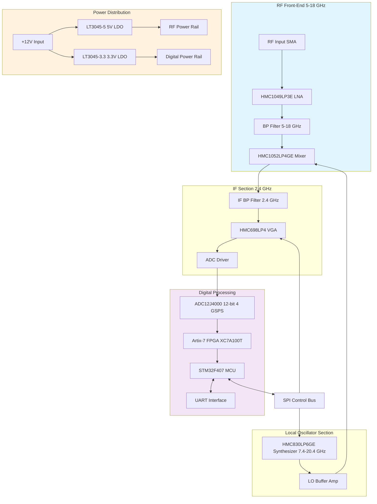

# System Architecture
## rf tx

```mermaid
graph TD
    subgraph RF_FRONTEND[RF Front-End 5-18 GHz]
        RF_IN[RF Input SMA] --> LNA[HMC1049LP3E LNA]
        LNA --> FILTER1[BP Filter 5-18 GHz]
        FILTER1 --> MIXER[HMC1052LP4GE Mixer]
    end
    
    subgraph LO_SECTION[Local Oscillator Section]
        LO_SYNTH[HMC830LP6GE Synthesizer 7.4-20.4 GHz] --> LO_AMP[LO Buffer Amp]
        LO_AMP --> MIXER
    end
    
    subgraph IF_SECTION[IF Section 2.4 GHz]
        MIXER --> FILTER2[IF BP Filter 2.4 GHz]
        FILTER2 --> VGA[HMC698LP4 VGA]
        VGA --> ADC_DRV[ADC Driver]
    end
    
    subgraph DIGITAL[Digital Processing]
        ADC_DRV --> ADC[ADC12J4000 12-bit 4 GSPS]
        ADC --> FPGA[Artix-7 FPGA XC7A100T]
        FPGA --> MCU[STM32F407 MCU]
        MCU <--> UART_CTRL[UART Interface]
    end
    
    subgraph POWER[Power Distribution]
        PWR_IN[+12V Input] --> REG_5V[LT3045-5 5V LDO]
        PWR_IN --> REG_33V[LT3045-3.3 3.3V LDO]
        REG_5V --> PWR_RF[RF Power Rail]
        REG_33V --> PWR_DIG[Digital Power Rail]
    end
    
    MCU <--> SPI_BUS[SPI Control Bus]
    SPI_BUS --> LO_SYNTH
    SPI_BUS --> VGA
    
    style RF_FRONTEND fill:#e1f5fe
    style DIGITAL fill:#f3e5f5
    style POWER fill:#fff3e0
```
