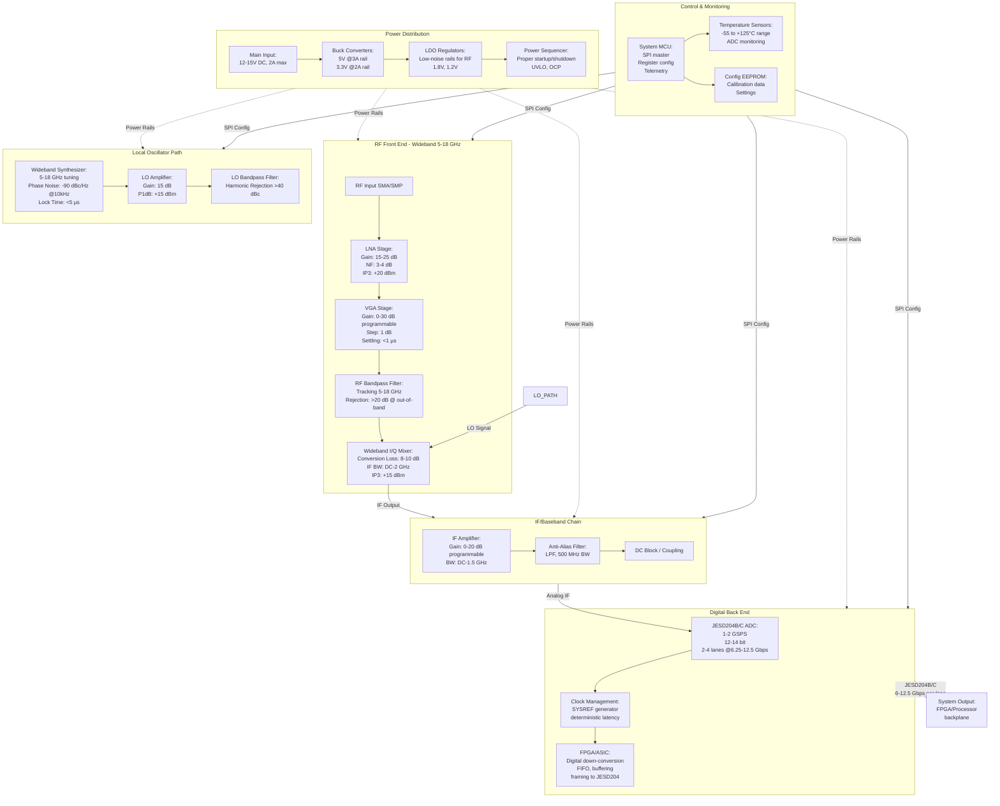

# System Architecture
## khgk

```mermaid
flowchart TD
    subgraph RF_Front_End["RF Front End - Wideband 5-18 GHz"]
        RF_IN["RF Input SMA/SMP"]
        LNA_STAGE["LNA Stage:\nGain: 15-25 dB\nNF: 3-4 dB\nIP3: +20 dBm"]
        VGA_STAGE["VGA Stage:\nGain: 0-30 dB programmable\nStep: 1 dB\nSettling: <1 µs"]
        RF_STAGE_BPF["RF Bandpass Filter:\nTracking 5-18 GHz\nRejection: >20 dB @ out-of-band"]
        MIXER_STAGE["Wideband I/Q Mixer:\nConversion Loss: 8-10 dB\nIF BW: DC-2 GHz\nIP3: +15 dBm"]
        RF_IN --> LNA_STAGE --> VGA_STAGE --> RF_STAGE_BPF --> MIXER_STAGE
    end
    
    subgraph LO_Path["Local Oscillator Path"]
        SYNTH["Wideband Synthesizer:\n5-18 GHz tuning\nPhase Noise: -90 dBc/Hz @10kHz\nLock Time: <5 µs"]
        LO_AMP["LO Amplifier:\nGain: 15 dB\nP1dB: +15 dBm"]
        LO_FILTER["LO Bandpass Filter:\nHarmonic Rejection >40 dBc"]
        SYNTH --> LO_AMP --> LO_FILTER
    end
    
    subgraph IF_Chain["IF/Baseband Chain"]
        IF_AMP["IF Amplifier:\nGain: 0-20 dB programmable\nBW: DC-1.5 GHz"]
        IF_FILTER["Anti-Alias Filter:\nLPF, 500 MHz BW"]
        DC_BLK["DC Block / Coupling"]
        IF_AMP --> IF_FILTER --> DC_BLK
    end
    
    subgraph Digital_Back_End["Digital Back End"]
        ADC["JESD204B/C ADC:\n1-2 GSPS\n12-14 bit\n2-4 lanes @6.25-12.5 Gbps"]
        CLK_MGMT["Clock Management:\nSYSREF generator\ndeterministic latency"]
        FPGA["FPGA/ASIC:\nDigital down-conversion\nFIFO, buffering\n framing to JESD204"]
        ADC --> CLK_MGMT --> FPGA
    end
    
    subgraph Power_Distribution["Power Distribution"]
        MAIN_PWR["Main Input:\n12-15V DC, 2A max"]
        BUCK_CONV["Buck Converters:\n5V @3A rail\n3.3V @2A rail"]
        LDO_REG["LDO Regulators:\nLow-noise rails for RF\n1.8V, 1.2V"]
        SEQ_CTRL["Power Sequencer:\nProper startup/shutdown\nUVLO, OCP"]
        MAIN_PWR --> BUCK_CONV --> LDO_REG --> SEQ_CTRL
    end
    
    subgraph Control_Interface["Control & Monitoring"]
        MCU["System MCU:\nSPI master\nRegister config\nTelemetry"]
        TEMP_MON["Temperature Sensors:\n-55 to +125°C range\nADC monitoring"]
        EEPROM["Config EEPROM:\nCalibration data\nSettings"]
        MCU --> TEMP_MON
        MCU --> EEPROM
    end
    
    LO_PATH -->|LO Signal| MIXER_STAGE
    MIXER_STAGE -->|IF Output| IF_Chain
    IF_Chain -->|Analog IF| ADC
    Power_Distribution -.->|Power Rails| RF_Front_End
    Power_Distribution -.->|Power Rails| LO_Path
    Power_Distribution -.->|Power Rails| IF_Chain
    Power_Distribution -.->|Power Rails| Digital_Back_End
    Control_Interface -->|SPI Config| RF_Front_End
    Control_Interface -->|SPI Config| LO_Path
    Control_Interface -->|SPI Config| IF_Chain
    Control_Interface -->|SPI Config| Digital_Back_End
    
    Digital_Back_End -->|JESD204B/C\n6-12.5 Gbps per lane| SYSTEM_OUT["System Output:\nFPGA/Processor\nbackplane"]
```
