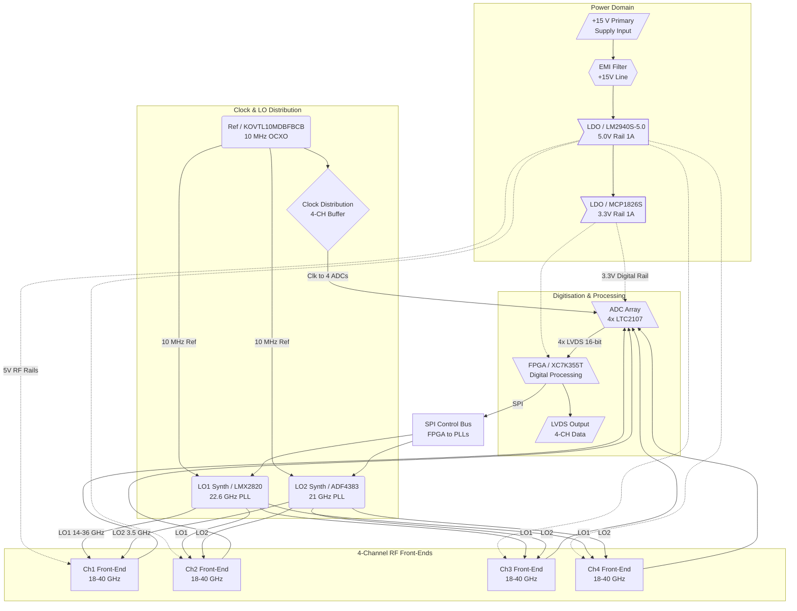

# System Architecture
## rx band

```mermaid
flowchart TB
    PWRIN[/"+15 V Primary<br/>Supply Input"/]
    EMIFIL{{"EMI Filter<br/>+15V Line"}}
    LDO5V>"LDO / LM2940S-5.0<br/>5.0V Rail 1A"]
    LDO33V>"LDO / MCP1826S<br/>3.3V Rail 1A"]
    OCXO1("Ref / KOVTL10MDBFBCB<br/>10 MHz OCXO")
    PLL1("LO1 Synth / LMX2820<br/>22.6 GHz PLL")
    PLL2("LO2 Synth / ADF4383<br/>21 GHz PLL")
    CLKDIST{"Clock Distribution<br/>4-CH Buffer"}
    CH1FE["Ch1 Front-End<br/>18-40 GHz"]
    CH2FE["Ch2 Front-End<br/>18-40 GHz"]
    CH3FE["Ch3 Front-End<br/>18-40 GHz"]
    CH4FE["Ch4 Front-End<br/>18-40 GHz"]
    ADCARR[\"ADC Array<br/>4x LTC2107"\]
    FPGAA[\"FPGA / XC7K355T<br/>Digital Processing"\]
    LVDSOUT[/"LVDS Output<br/>4-CH Data"/]
    SPICTL["SPI Control Bus<br/>FPGA to PLLs"]
    PWRIN --> EMIFIL
    EMIFIL --> LDO5V
    LDO5V --> LDO33V
    LDO5V -.->|5V RF Rails| CH1FE
    LDO5V -.-> CH2FE
    LDO5V -.-> CH3FE
    LDO5V -.-> CH4FE
    LDO33V -.->|3.3V Digital Rail| ADCARR
    LDO33V -.-> FPGAA
    OCXO1 -->|10 MHz Ref| PLL1
    OCXO1 -->|10 MHz Ref| PLL2
    OCXO1 --> CLKDIST
    CLKDIST -->|Clk to 4 ADCs| ADCARR
    PLL1 -->|LO1 14-36 GHz| CH1FE
    PLL2 -->|LO2 3.5 GHz| CH1FE
    PLL1 -->|LO1| CH2FE
    PLL2 -->|LO2| CH2FE
    PLL1 -->|LO1| CH3FE
    PLL2 -->|LO2| CH3FE
    PLL1 -->|LO1| CH4FE
    PLL2 -->|LO2| CH4FE
    CH1FE --> ADCARR
    CH2FE --> ADCARR
    CH3FE --> ADCARR
    CH4FE --> ADCARR
    ADCARR -->|4x LVDS 16-bit| FPGAA
    FPGAA --> LVDSOUT
    FPGAA -->|SPI| SPICTL
    SPICTL --> PLL1
    SPICTL --> PLL2
    subgraph PWR["Power Domain"]
        PWRIN
        EMIFIL
        LDO5V
        LDO33V
    end
    subgraph CLK["Clock & LO Distribution"]
        OCXO1
        PLL1
        PLL2
        CLKDIST
    end
    subgraph RF["4-Channel RF Front-Ends"]
        CH1FE
        CH2FE
        CH3FE
        CH4FE
    end
    subgraph DIG["Digitisation & Processing"]
        ADCARR
        FPGAA
        LVDSOUT
    end
```
