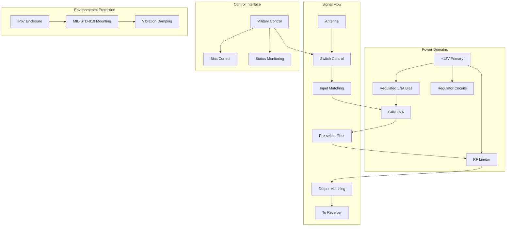

# System Architecture
## gvng

```mermaid
flowchart TD
    subgraph Power Domains
        PD1[+12V Primary] --> PD2[Regulated LNA Bias]
        PD1 --> PD3[Regulator Circuits]
        PD2 --> E[GaN LNA]
        PD1 --> G[RF Limiter]
    end
    
    subgraph Signal Flow
        A[Antenna] --> B[8:1 Switch]
        B --> C[Input Matching]
        C --> E
        E --> F[Pre-select Filter]
        F --> G
        G --> H[Output Matching]
        H --> I[To Receiver]
    end
    
    subgraph Control Interface
        J[Military Control] --> B[Switch Control]
        J --> L[Bias Control]
        J --> M[Status Monitoring]
    end
    
    subgraph Environmental Protection
        N[IP67 Enclosure] --> O[MIL-STD-810 Mounting]
        O --> P[Vibration Damping]
    end
```
