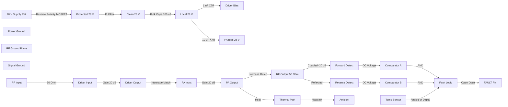

# System Architecture
## rf78

```mermaid
graph LR
    P28[28 V Supply Rail]
    PGND[Power Ground]
    RF_GND[RF Ground Plane]
    SIG_GND[Signal Ground]
    THERM[Thermal Path]

    P28 -->|Reverse Polarity MOSFET| P28_PROT[Protected 28 V]
    P28_PROT -->|Pi Filter| P28_CLEAN[Clean 28 V]
    P28_CLEAN -->|Bulk Caps 100 uF| P28_LOCAL[Local 28 V]
    P28_LOCAL -->|1 uF X7R| DRV_BIAS[Driver Bias]
    P28_LOCAL -->|10 uF X7R| PA_BIAS[PA Bias 28 V]

    RF_IN[RF Input] -->|50 Ohm| DRV_IN[Driver Input]
    DRV_IN -->|Gain 20 dB| DRV_OUT[Driver Output]
    DRV_OUT -->|Interstage Match| PA_IN[PA Input]
    PA_IN -->|Gain 20 dB| PA_OUT[PA Output]
    PA_OUT -->|Lowpass Match| RF_OUT[RF Output 50 Ohm]

    RF_OUT -->|Coupled -20 dB| FWD_PWR[Forward Detect]
    RF_OUT -->|Reflected| REV_PWR[Reverse Detect]
    FWD_PWR -->|DC Voltage| CMPA[Comparator A]
    REV_PWR -->|DC Voltage| CMPB[Comparator B]
    CMPA -->|AND| FAULT_LOGIC[Fault Logic]
    CMPB -->|AND| FAULT_LOGIC
    TEMP_SENSE[Temp Sensor] -->|Analog or Digital| FAULT_LOGIC
    FAULT_LOGIC -->|Open Drain| FAULT_PIN[FAULT Pin]

    PA_OUT -->|Heat| THERM
    THERM -->|Heatsink| AMBIENT[Ambient]

    class Power P28,P28_PROT,P28_CLEAN,P28_LOCAL,DRV_BIAS,PA_BIAS
    class RF RF_IN,DRV_IN,DRV_OUT,PA_IN,PA_OUT,RF_OUT,FWD_PWR,REV_PWR
    class Ground PGND,RF_GND,SIG_GND
```
