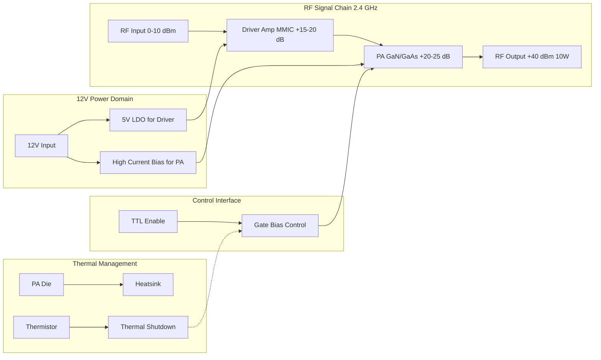

# System Architecture
## rf4

```mermaid
graph LR
    subgraph RF_Power_Distribution["RF Signal Chain 2.4 GHz"]
        RF_IN[RF Input 0-10 dBm]
        STAGE1[Driver Amp MMIC +15-20 dB]
        STAGE2[PA GaN/GaAs +20-25 dB]
        RF_OUT[RF Output +40 dBm 10W]
        
        RF_IN --> STAGE1 --> STAGE2 --> RF_OUT
    end
    
    subgraph DC_Power["12V Power Domain"]
        PWR[12V Input]
        REG[5V LDO for Driver]
        BIAS[High Current Bias for PA]
        
        PWR --> REG
        PWR --> BIAS
        REG --> STAGE1
        BIAS --> STAGE2
    end
    
    subgraph Thermal["Thermal Management"]
        HEATSINK[Heatsink]
        PA_THERM[PA Die]
        TEMP_SENSE[Thermistor]
        
        PA_THERM --> HEATSINK
        TEMP_SENSE --> SHUTDOWN[Thermal Shutdown]
    end
    
    subgraph Control["Control Interface"]
        ENABLE[TTL Enable]
        GATE[Gate Bias Control]
        
        ENABLE --> GATE
        GATE --> STAGE2
    end
    
    SHUTDOWN -.-> GATE
```
