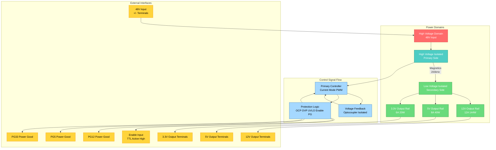

# System Architecture
## fjxm

```mermaid
graph TD
    subgraph Power_Power_Domains[Power Domains]
        HV[High Voltage Domain<br/>48V Input]
        HV_ISO[High Voltage Isolated<br/>Primary Side]
        LV_ISO[Low Voltage Isolated<br/>Secondary Side]
        LV_12V[12V Output Rail<br/>12A 144W]
        LV_5V[5V Output Rail<br/>8A 40W]
        LV_33V[3.3V Output Rail<br/>6A 20W]
    end
    
    subgraph Signal_Flow[Control Signal Flow]
        CTRL[Primary Controller<br/>Current Mode PWM]
        FB[Voltage Feedback<br/>Optocoupler Isolated]
        PROT[Protection Logic<br/>OCP OVP UVLO Enable PG]
    end
    
    subgraph Interfaces[External Interfaces]
        IN[48V Input<br/>+/- Terminals]
        OUT12[12V Output Terminals]
        OUT5[5V Output Terminals]
        OUT33[3.3V Output Terminals]
        EN[Enable Input<br/>TTL Active High]
        PG12[PG12 Power Good]
        PG5[PG5 Power Good]
        PG33[PG33 Power Good]
    end
    
    HV --> HV_ISO
    HV_ISO -->|Magnetics<br/>200kHz| LV_ISO
    LV_ISO --> LV_12V
    LV_ISO --> LV_5V
    LV_ISO --> LV_33V
    
    CTRL --> FB
    FB --> CTRL
    CTRL --> PROT
    PROT --> CTRL
    
    IN --> HV
    HV_ISO --> CTRL
    LV_12V --> OUT12
    LV_5V --> OUT5
    LV_33V --> OUT33
    PROT --> EN
    PROT --> PG12
    PROT --> PG5
    PROT --> PG33
    
    class HV highvoltage
    class HV_ISO isolated
    class LV_ISO,LV_12V,LV_5V,LV_33V lowvoltage
    class CTRL,FB,PROT control
    class IN,OUT12,OUT5,OUT33,EN,PG12,PG5,PG33 interface
    
    classDef highvoltage fill:#ff6b6b,stroke:#c92a2a,color:#fff
    classDef isolated fill:#4ecdc4,stroke:#087f5b,color:#fff
    classDef lowvoltage fill:#69db7c,stroke:#2b8a3e,color:#fff
    classDef control fill:#a5d8ff,stroke:#1864ab,color:#000
    classDef interface fill:#ffd43b,stroke:#f08c00,color:#000
```
