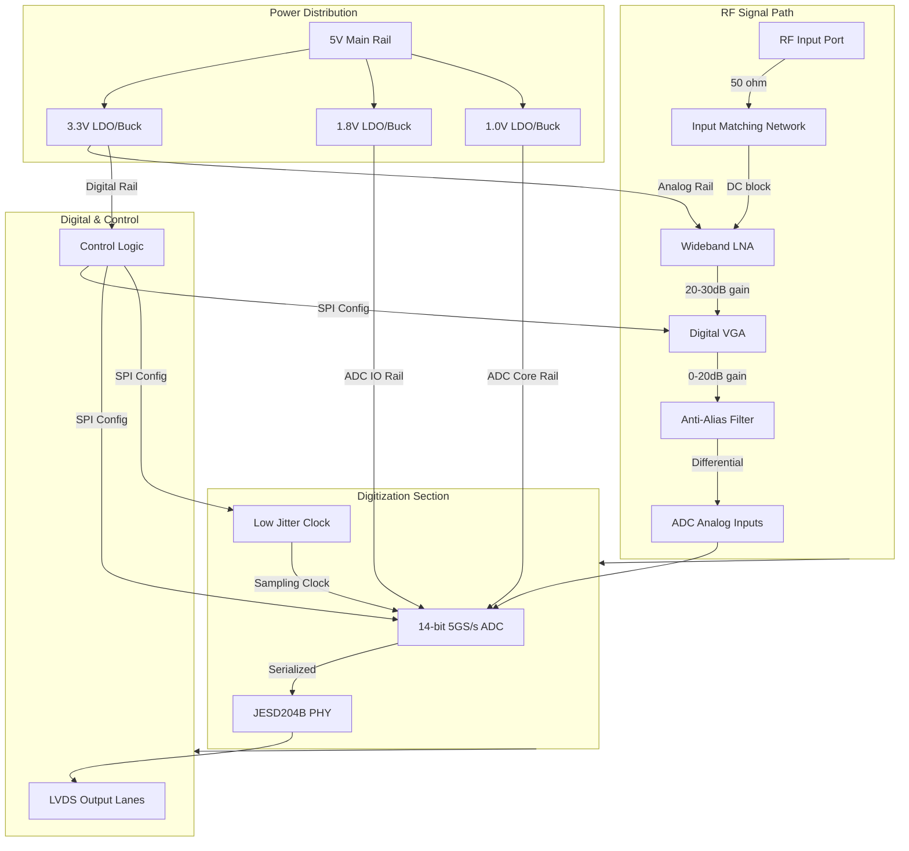

# System Architecture
## Test

```mermaid
flowchart TD
    subgraph RF_PATH[RF Signal Path]
        IN[RF Input Port] -->|50 ohm| MATCH[Input Matching Network]
        MATCH -->|DC block| LNA[Wideband LNA]
        LNA -->|20-30dB gain| VGA[Digital VGA]
        VGA -->|0-20dB gain| BPF[Anti-Alias Filter]
        BPF -->|Differential| ADC_INPUT[ADC Analog Inputs]
    end
    
    subgraph CONVERSION[Digitization Section]
        ADC_INPUT --> ADC[14-bit 5GS/s ADC]
        CLK[Low Jitter Clock] -->|Sampling Clock| ADC
        ADC -->|Serialized| JESD_PHY[JESD204B PHY]
    end
    
    subgraph DIGITAL[Digital & Control]
        JESD_PHY --> SER[LVDS Output Lanes]
        CTRL[Control Logic] -->|SPI Config| VGA
        CTRL -->|SPI Config| ADC
        CTRL -->|SPI Config| CLK
    end
    
    subgraph POWER[Power Distribution]
        RAIL_5V[5V Main Rail] --> REG_3V3[3.3V LDO/Buck]
        RAIL_5V --> REG_1V8[1.8V LDO/Buck]
        RAIL_5V --> REG_1V0[1.0V LDO/Buck]
        REG_3V3 -->|Analog Rail| LNA
        REG_3V3 -->|Digital Rail| CTRL
        REG_1V8 -->|ADC IO Rail| ADC
        REG_1V0 -->|ADC Core Rail| ADC
    end
    
    RF_PATH --> CONVERSION
    CONVERSION --> DIGITAL
```
