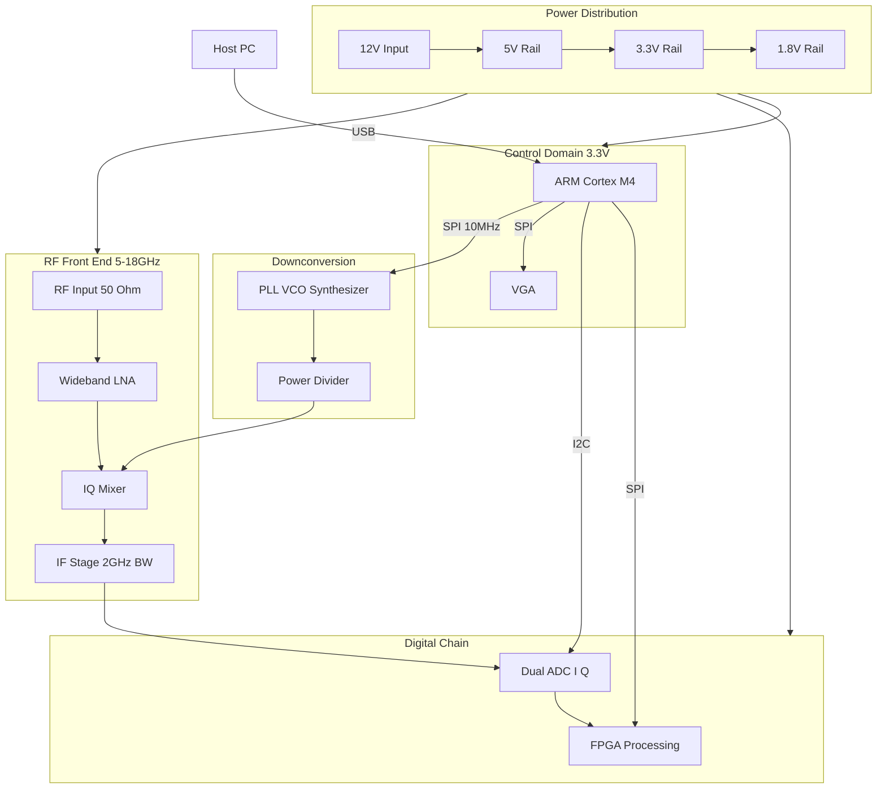

# System Architecture
## rx receiver

```mermaid
flowchart TD
    subgraph RF_CHAIN[RF Front End 5-18GHz]
        RF_IN[RF Input 50 Ohm]
        LNA[Wideband LNA]
        MIXER[IQ Mixer]
        IF[IF Stage 2GHz BW]
        RF_IN --> LNA --> MIXER --> IF
    end
    
    subgraph CONVERSION[Downconversion]
        LO[PLL VCO Synthesizer]
        DIV[Power Divider]
        LO --> DIV --> MIXER
    end
    
    subgraph DIGITAL[Digital Chain]
        ADC[Dual ADC I Q]
        FPGA[FPGA Processing]
        ADC --> FPGA
    end
    
    subgraph CONTROL[Control Domain 3.3V]
        MCU[ARM Cortex M4]
        MCU -->|SPI 10MHz| LO
        MCU -->|SPI| VGA
        MCU -->|I2C| ADC
        MCU -->|SPI| FPGA
    end
    
    subgraph POWER[Power Distribution]
        PWR[12V Input]
        REG_5V[5V Rail]
        REG_3V3[3.3V Rail]
        REG_1V8[1.8V Rail]
        PWR --> REG_5V --> REG_3V3 --> REG_1V8
    end
    
    IF --> ADC
    POWER --> RF_CHAIN
    POWER --> DIGITAL
    POWER --> CONTROL
    
    HOST[Host PC] -->|USB| MCU
```
