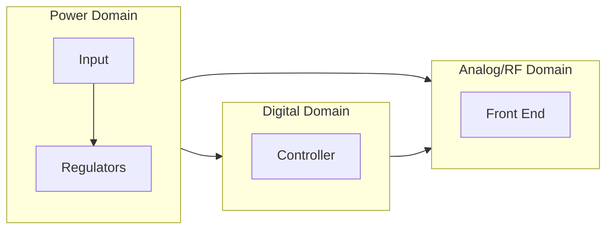

# System Architecture
## rx module

```mermaid
graph LR
    subgraph POWER["Power Domain"]
        PWR_IN[Input] --> REG[Regulators]
    end
    subgraph DIGITAL["Digital Domain"]
        MCU[Controller]
    end
    subgraph ANALOG["Analog/RF Domain"]
        AFE[Front End]
    end
    POWER --> DIGITAL
    POWER --> ANALOG
    DIGITAL --> ANALOG
```
