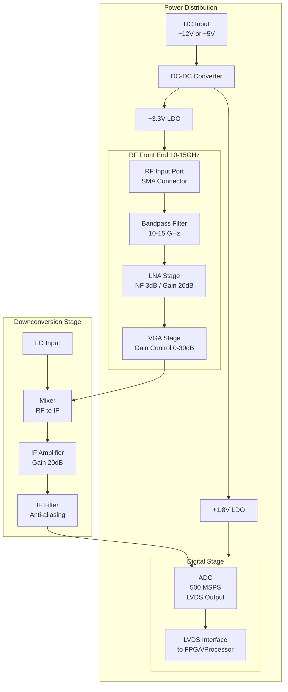

# System Architecture
## kh

```mermaid
flowchart TD
    subgraph RF_Front_End["RF Front End 10-15GHz"]
        RFIN["RF Input Port<br/>SMA Connector"] --> BPF1["Bandpass Filter<br/>10-15 GHz"]
        BPF1 --> LNA1["LNA Stage<br/>NF 3dB / Gain 20dB"]
        LNA1 --> VGA1["VGA Stage<br/>Gain Control 0-30dB"]
    end
    
    subgraph Downconversion["Downconversion Stage"]
        VGA1 --> MIX1["Mixer<br/>RF to IF"]
        LO["LO Input"] --> MIX1
        MIX1 --> IFAMP["IF Amplifier<br/>Gain 20dB"]
        IFAMP --> IF_FILTER["IF Filter<br/>Anti-aliasing"]
    end
    
    subgraph Digital["Digital Stage"]
        IF_FILTER --> ADC1["ADC<br/>500 MSPS<br/>LVDS Output"]
        ADC1 --> FPGA_IF["LVDS Interface<br/>to FPGA/Processor"]
    end
    
    subgraph Power["Power Distribution"]
        DC_IN["DC Input<br/>+12V or +5V"] --> DC_DC["DC-DC Converter"]
        DC_DC --> LDO_1["+3.3V LDO"]
        DC_DC --> LDO_2["+1.8V LDO"]
        LDO_1 --> RF_Front_End
        LDO_2 --> Digital
    end
```
