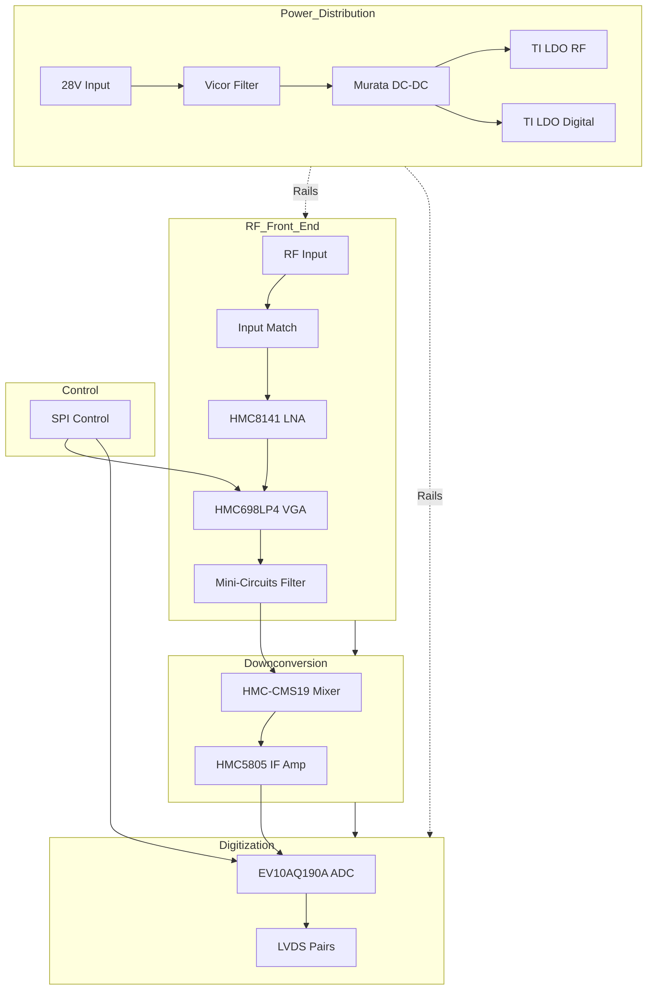

# System Architecture
## ehg

```mermaid
flowchart TD
    subgraph RF_Front_End
        RF_IN[RF Input] --> MATCH[Input Match]
        MATCH --> LNA[HMC8141 LNA]
        LNA --> VGA[HMC698LP4 VGA]
        VGA --> FILTER[Mini-Circuits Filter]
    end
    
    subgraph Downconversion
        FILTER --> MIXER[HMC-CMS19 Mixer]
        MIXER --> IF_AMP[HMC5805 IF Amp]
    end
    
    subgraph Digitization
        IF_AMP --> ADC[EV10AQ190A ADC]
        ADC --> LVDS_OUT[LVDS Pairs]
    end
    
    subgraph Power_Distribution
        PWR_IN[28V Input] --> REG1[Vicor Filter]
        REG1 --> REG2[Murata DC-DC]
        REG2 --> LDO1[TI LDO RF]
        REG2 --> LDO2[TI LDO Digital]
    end
    
    subgraph Control
        SPI_CTRL[SPI Control] --> VGA
        SPI_CTRL --> ADC
    end
    
    RF_Front_End --> Downconversion
    Downconversion --> Digitization
    Power_Distribution -.->|Rails| RF_Front_End
    Power_Distribution -.->|Rails| Digitization
```
