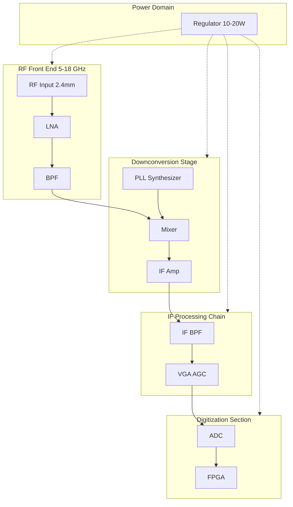

# System Architecture
## iguyc

```mermaid
flowchart TD
    subgraph RF_FRONT_END[RF Front End 5-18 GHz]
        RF_IN[RF Input 2.4mm]
        LNA[LNA]
        BPF1[BPF]
    end
    
    subgraph DOWNCONVERSION[Downconversion Stage]
        MIXER[Mixer]
        LO[PLL Synthesizer]
        IF_AMP[IF Amp]
    end
    
    subgraph IF_CHAIN[IF Processing Chain]
        BPF2[IF BPF]
        VGA[VGA AGC]
    end
    
    subgraph DIGITIZATION[Digitization Section]
        ADC[ADC]
        FPGA[FPGA]
    end
    
    subgraph POWER[Power Domain]
        PWR[Regulator 10-20W]
    end
    
    RF_IN --> LNA --> BPF1 --> MIXER
    LO --> MIXER
    MIXER --> IF_AMP --> BPF2 --> VGA --> ADC --> FPGA
    PWR -.-> RF_FRONT_END
    PWR -.-> DOWNCONVERSION
    PWR -.-> IF_CHAIN
    PWR -.-> DIGITIZATION
```
