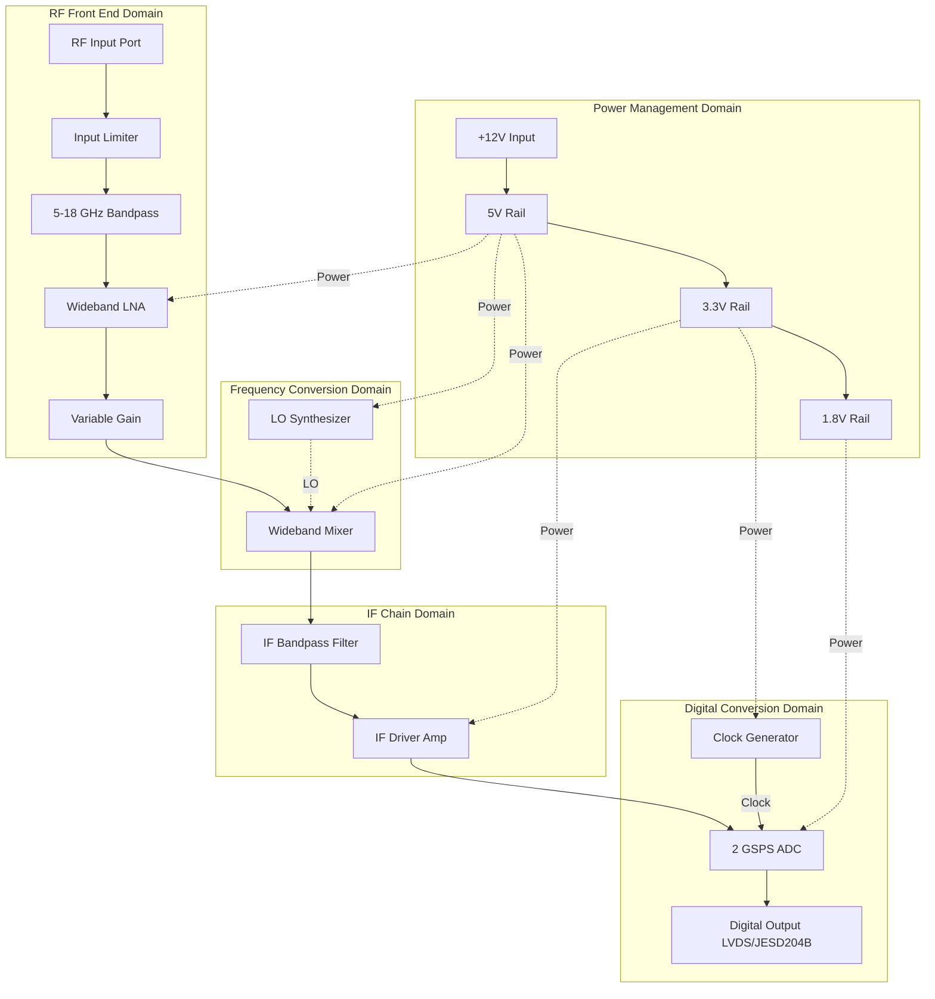

# System Architecture
## kb

```mermaid
flowchart TD
    subgraph RF_Front_End["RF Front End Domain"]
        RF_IN[RF Input Port]
        LIMITER[Input Limiter]
        BPF[5-18 GHz Bandpass]
        LNA[Wideband LNA]
        VGA[Variable Gain]
    end
    
    subgraph Frequency_Conversion["Frequency Conversion Domain"]
        MIXER[Wideband Mixer]
        LO[LO Synthesizer]
    end
    
    subgraph IF_Chain["IF Chain Domain"]
        IF_BPF[IF Bandpass Filter]
        IF_AMP[IF Driver Amp]
    end
    
    subgraph Digital_Conversion["Digital Conversion Domain"]
        CLK_GEN[Clock Generator]
        ADC[2 GSPS ADC]
        DIG_OUT[Digital Output LVDS/JESD204B]
    end
    
    subgraph Power_Domain["Power Management Domain"]
        PWR_IN[+12V Input]
        LDO_5V[5V Rail]
        LDO_3V3[3.3V Rail]
        LDO_1V8[1.8V Rail]
    end
    
    RF_IN --> LIMITER --> BPF --> LNA --> VGA
    VGA --> MIXER
    LO -.->|LO| MIXER
    MIXER --> IF_BPF --> IF_AMP --> ADC
    CLK_GEN -->|Clock| ADC
    ADC --> DIG_OUT
    
    PWR_IN --> LDO_5V
    LDO_5V --> LDO_3V3
    LDO_3V3 --> LDO_1V8
    
    LDO_5V -.->|Power| LNA
    LDO_5V -.->|Power| MIXER
    LDO_5V -.->|Power| LO
    LDO_3V3 -.->|Power| IF_AMP
    LDO_3V3 -.->|Power| CLK_GEN
    LDO_1V8 -.->|Power| ADC
```
