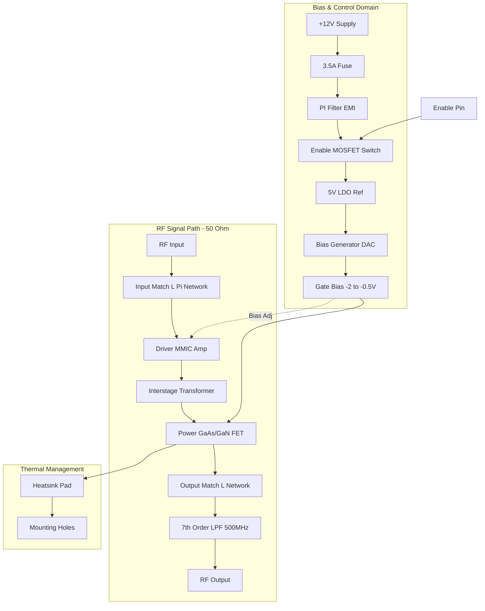

# System Architecture
## hkgg

```mermaid
graph TD
    subgraph RF_PATH["RF Signal Path - 50 Ohm"]
        IN[RF Input] --> M1[Input Match L Pi Network]
        M1 --> DRV[Driver MMIC Amp]
        DRV --> M2[Interstage Transformer]
        M2 --> PA[Power GaAs/GaN FET]
        PA --> M3[Output Match L Network]
        M3 --> FLT[7th Order LPF 500MHz]
        FLT --> OUT[RF Output]
    end
    
    subgraph BIAS_NETWORK["Bias & Control Domain"]
        VDC[+12V Supply] --> FUSE[3.5A Fuse]
        FUSE --> EMI[PI Filter EMI]
        EMI --> SW[Enable MOSFET Switch]
        SW --> LDO[5V LDO Ref]
        LDO --> VREF[Bias Generator DAC]
        VREF --> VGG[Gate Bias -2 to -0.5V]
        VGG --> PA
    end
    
    subgraph THERMAL["Thermal Management"]
        PA --> HS[Heatsink Pad]
        HS --> MTG[Mounting Holes]
    end
    
    CTRL_EXT[Enable Pin] --> SW
    VGG -.->|Bias Adj| DRV
```
