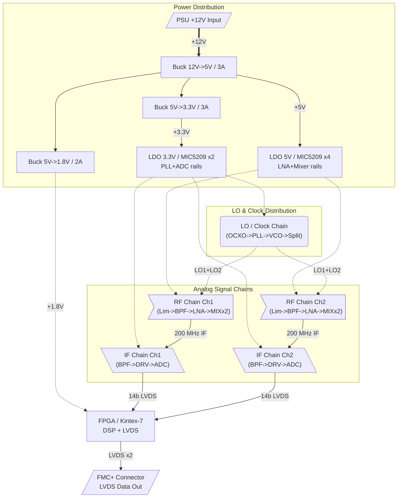

# System Architecture
## hjjg

```mermaid
flowchart TB
    PSU[/"PSU +12V Input"/]
    BUCK1["Buck 12V->5V / 3A"]
    BUCK2["Buck 5V->3.3V / 3A"]
    BUCK3["Buck 5V->1.8V / 2A"]
    LDO_5V["LDO 5V / MIC5209 x4<br/>LNA+Mixer rails"]
    LDO_3V3["LDO 3.3V / MIC5209 x2<br/>PLL+ADC rails"]
    RF_CH1>"RF Chain Ch1<br/>(Lim->BPF->LNA->MIXx2)"]
    RF_CH2>"RF Chain Ch2<br/>(Lim->BPF->LNA->MIXx2)"]
    IF_CH1[\"IF Chain Ch1<br/>(BPF->DRV->ADC)"\]
    IF_CH2[\"IF Chain Ch2<br/>(BPF->DRV->ADC)"\]
    LO_CLK("LO / Clock Chain<br/>(OCXO->PLL->VCO->Split)")
    FPGA["FPGA / Kintex-7<br/>DSP + LVDS"]
    FMC[/"FMC+ Connector<br/>LVDS Data Out"/]
    PSU == "+12V" ==> BUCK1
    BUCK1 --> BUCK2
    BUCK1 --> BUCK3
    BUCK1 -- "+5V" --> LDO_5V
    BUCK2 -- "+3.3V" --> LDO_3V3
    LDO_5V -.-> RF_CH1
    LDO_5V -.-> RF_CH2
    LDO_3V3 -.-> LO_CLK
    LDO_3V3 -.-> IF_CH1
    LDO_3V3 -.-> IF_CH2
    BUCK3 -. "+1.8V" .-> FPGA
    RF_CH1 -- "200 MHz IF" --> IF_CH1
    RF_CH2 -- "200 MHz IF" --> IF_CH2
    LO_CLK -. "LO1+LO2" .-> RF_CH1
    LO_CLK -. "LO1+LO2" .-> RF_CH2
    IF_CH1 -- "14b LVDS" --> FPGA
    IF_CH2 -- "14b LVDS" --> FPGA
    FPGA -- "LVDS x2" --> FMC
    subgraph POWER["Power Distribution"]
        PSU
        BUCK1
        BUCK2
        BUCK3
        LDO_5V
        LDO_3V3
    end
    subgraph ANALOG["Analog Signal Chains"]
        RF_CH1
        RF_CH2
        IF_CH1
        IF_CH2
    end
    subgraph CLK_TREE["LO & Clock Distribution"]
        LO_CLK
    end
```
