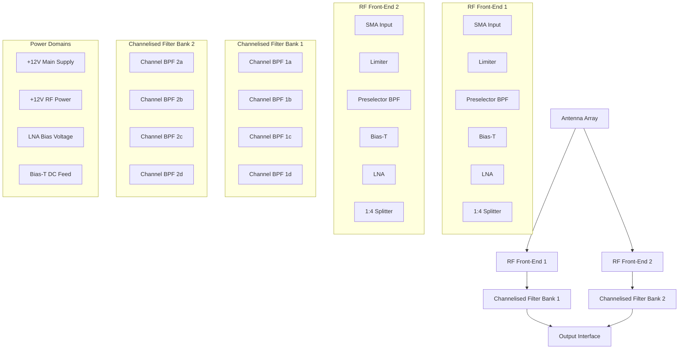

# System Architecture
## hh

```mermaid
flowchart TD
    A[Antenna Array] --> B[RF Front-End 1]
    A --> C[RF Front-End 2]
    
    B --> D[Channelised Filter Bank 1]
    C --> E[Channelised Filter Bank 2]
    
    D --> F[Output Interface]
    E --> F
    
    subgraph RF Front-End 1
        G[SMA Input]
        H[Limiter]
        I[Preselector BPF]
        J[Bias-T]
        K[LNA]
        L[1:4 Splitter]
    end
    
    subgraph RF Front-End 2
        M[SMA Input]
        N[Limiter]
        O[Preselector BPF]
        P[Bias-T]
        Q[LNA]
        R[1:4 Splitter]
    end
    
    subgraph Channelised Filter Bank 1
        S[Channel BPF 1a]
        T[Channel BPF 1b]
        U[Channel BPF 1c]
        V[Channel BPF 1d]
    end
    
    subgraph Channelised Filter Bank 2
        W[Channel BPF 2a]
        X[Channel BPF 2b]
        Y[Channel BPF 2c]
        Z[Channel BPF 2d]
    end
    
    subgraph Power Domains
        AA[+12V Main Supply]
        BB[+12V RF Power]
        CC[LNA Bias Voltage]
        DD[Bias-T DC Feed]
    end
```
