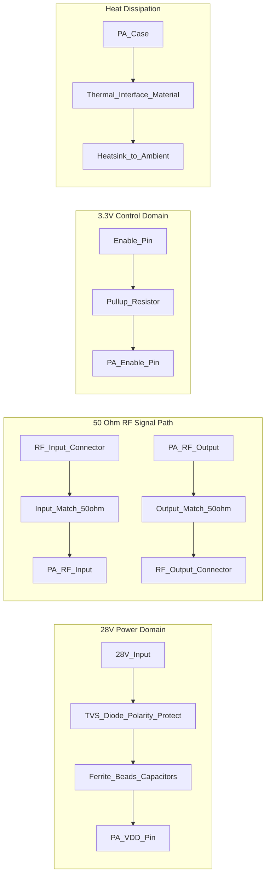

# System Architecture
## rfff

```mermaid
graph LR
    subgraph Power_Domain[28V Power Domain]
        PWR_IN[28V_Input] --> PWR_PROT[TVS_Diode_Polarity_Protect]
        PWR_PROT --> PWR_FILT[Ferrite_Beads_Capacitors]
        PWR_FILT --> PA_VDD[PA_VDD_Pin]
    end
    
    subgraph RF_Signal_Path[50 Ohm RF Signal Path]
        RF_IN_PORT[RF_Input_Connector] --> RF_IN_MATCH[Input_Match_50ohm]
        RF_IN_MATCH --> PA_IN[PA_RF_Input]
        PA_OUT[PA_RF_Output] --> RF_OUT_MATCH[Output_Match_50ohm]
        RF_OUT_MATCH --> RF_OUT_PORT[RF_Output_Connector]
    end
    
    subgraph Control_Signals[3.3V Control Domain]
        EN_PIN[Enable_Pin] --> EN_RES[Pullup_Resistor]
        EN_RES --> PA_EN[PA_Enable_Pin]
    end
    
    subgraph Thermal_Path[Heat Dissipation]
        PA_CASE[PA_Case] --> TIM[Thermal_Interface_Material]
        TIM --> HEATSINK[Heatsink_to_Ambient]
    end
```
