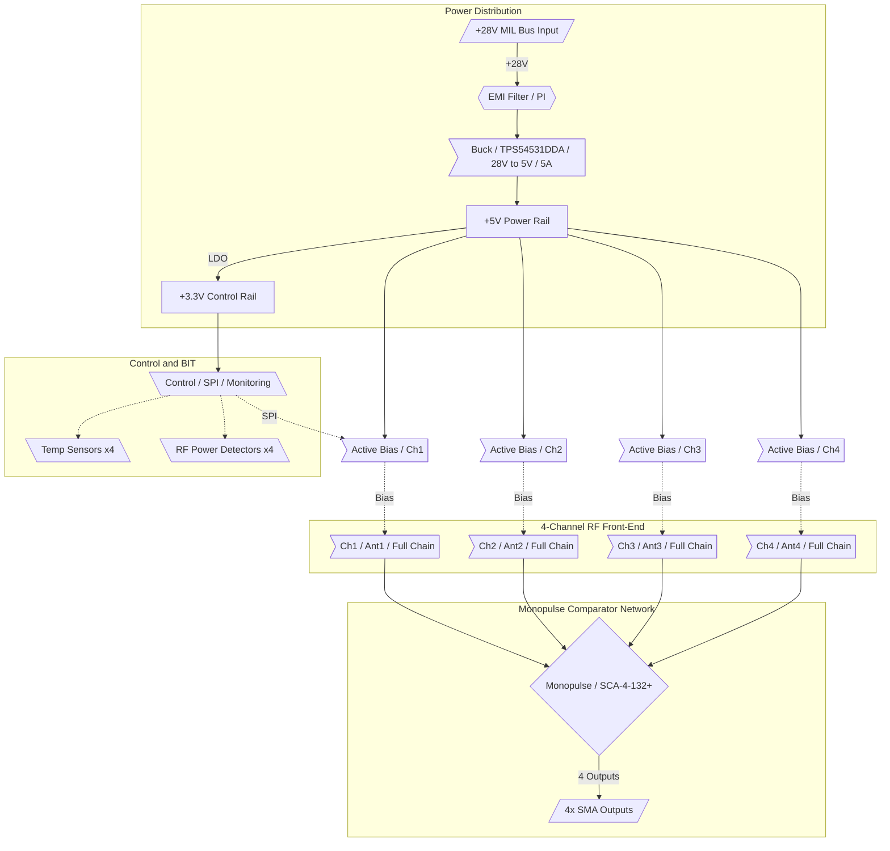

# System Architecture
## yhh

```mermaid
flowchart TD
    VIN[/"+28V MIL Bus Input"/]
    EMIFIL{{"EMI Filter / PI"}}
    BUCK>"Buck / TPS54531DDA / 28V to 5V / 5A"]
    RAIL5["+5V Power Rail"]
    RAIL3["+3.3V Control Rail"]
    BIAS1>"Active Bias / Ch1"]
    BIAS2>"Active Bias / Ch2"]
    BIAS3>"Active Bias / Ch3"]
    BIAS4>"Active Bias / Ch4"]
    RF1>"Ch1 / Ant1 / Full Chain"]
    RF2>"Ch2 / Ant2 / Full Chain"]
    RF3>"Ch3 / Ant3 / Full Chain"]
    RF4>"Ch4 / Ant4 / Full Chain"]
    MC{"Monopulse / SCA-4-132+"}
    OUT4[/"4x SMA Outputs"/]
    CTRL[\"Control / SPI / Monitoring"\]
    TEMP[\"Temp Sensors x4"\]
    PDET[\"RF Power Detectors x4"\]
    VIN -- "+28V" --> EMIFIL
    EMIFIL --> BUCK
    BUCK --> RAIL5
    RAIL5 --> BIAS1
    RAIL5 --> BIAS2
    RAIL5 --> BIAS3
    RAIL5 --> BIAS4
    RAIL5 -- "LDO" --> RAIL3
    RAIL3 --> CTRL
    BIAS1 -. "Bias" .-> RF1
    BIAS2 -. "Bias" .-> RF2
    BIAS3 -. "Bias" .-> RF3
    BIAS4 -. "Bias" .-> RF4
    RF1 --> MC
    RF2 --> MC
    RF3 --> MC
    RF4 --> MC
    MC -- "4 Outputs" --> OUT4
    CTRL -. "SPI" .-> BIAS1
    CTRL -.-> TEMP
    CTRL -.-> PDET
    subgraph PWR["Power Distribution"]
        VIN
        EMIFIL
        BUCK
        RAIL5
        RAIL3
    end
    subgraph RF["4-Channel RF Front-End"]
        RF1
        RF2
        RF3
        RF4
    end
    subgraph MONOPULSE["Monopulse Comparator Network"]
        MC
        OUT4
    end
    subgraph MONITOR["Control and BIT"]
        CTRL
        TEMP
        PDET
    end
```
