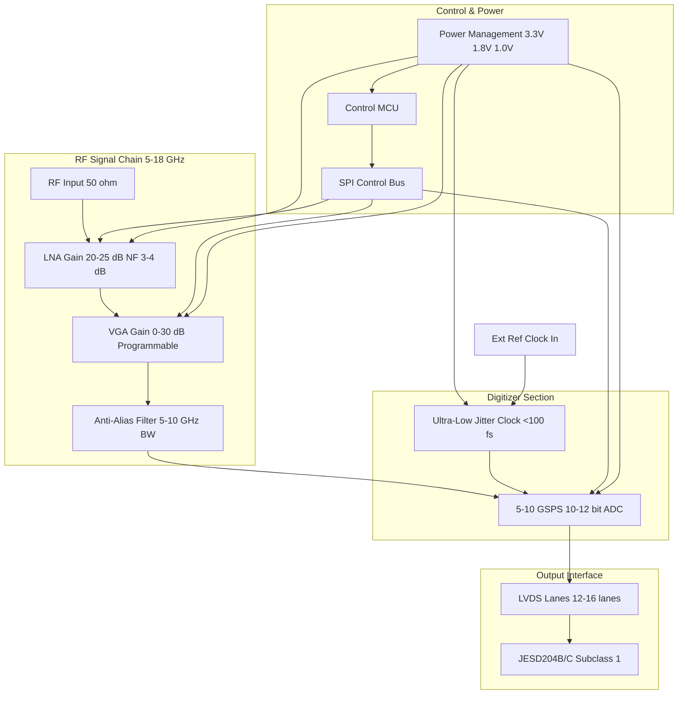

# System Architecture
## hgyu

```mermaid
flowchart TD
    subgraph RF_CHAIN["RF Signal Chain 5-18 GHz"]
        RF_IN[RF Input 50 ohm]
        LNA[LNA Gain 20-25 dB NF 3-4 dB]
        VGA[VGA Gain 0-30 dB Programmable]
        BPF[Anti-Alias Filter 5-10 GHz BW]
    end
    
    subgraph DIGITIZER["Digitizer Section"]
        ADC[5-10 GSPS 10-12 bit ADC]
        CLK[Ultra-Low Jitter Clock <100 fs]
    end
    
    subgraph INTERFACE["Output Interface"]
        LVDS[LVDS Lanes 12-16 lanes]
        JESD[JESD204B/C Subclass 1]
    end
    
    subgraph CONTROL["Control & Power"]
        MCU[Control MCU]
        SPI[SPI Control Bus]
        PMG[Power Management 3.3V 1.8V 1.0V]
    end
    
    RF_IN --> LNA
    LNA --> VGA
    VGA --> BPF
    BPF --> ADC
    CLK --> ADC
    ADC --> LVDS
    LVDS --> JESD
    
    MCU --> SPI
    SPI --> LNA
    SPI --> VGA
    SPI --> ADC
    
    PMG --> LNA
    PMG --> VGA
    PMG --> ADC
    PMG --> CLK
    PMG --> MCU
    
    EXT_REF[Ext Ref Clock In] --> CLK
```
