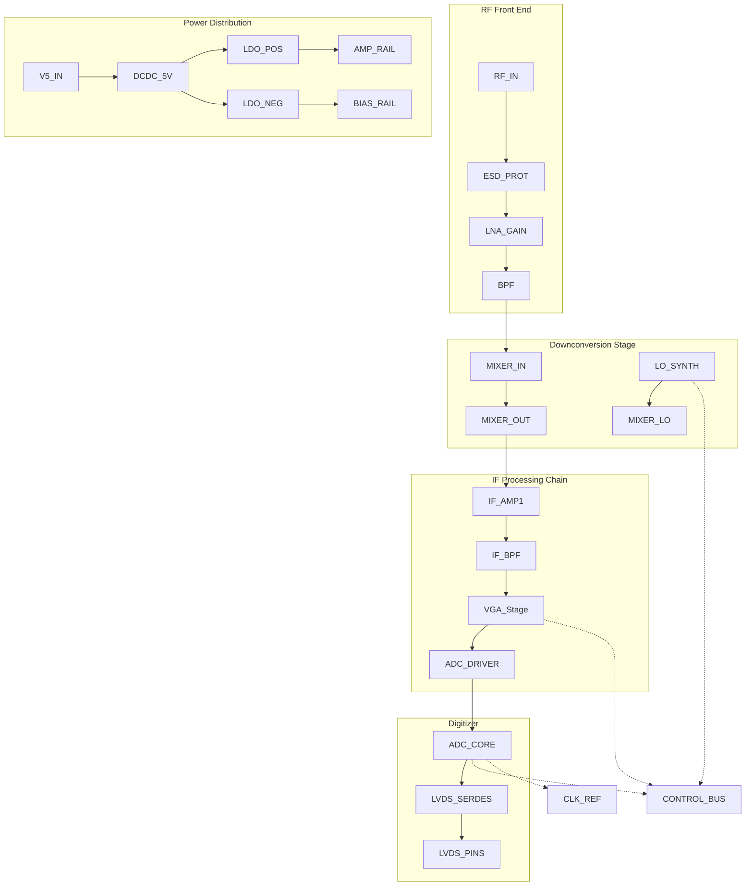

# System Architecture
## j,fj

```mermaid
flowchart TD
    subgraph RF_FRONT_END["RF Front End"]
        RF_IN --> ESD_PROT
        ESD_PROT --> LNA_GAIN
        LNA_GAIN --> BPF
    end
    
    subgraph DOWNCONVERTER["Downconversion Stage"]
        BPF --> MIXER_IN
        LO_SYNTH --> MIXER_LO
        MIXER_IN --> MIXER_OUT
    end
    
    subgraph IF_CHAIN["IF Processing Chain"]
        MIXER_OUT --> IF_AMP1
        IF_AMP1 --> IF_BPF
        IF_BPF --> VGA_Stage
        VGA_Stage --> ADC_DRIVER
    end
    
    subgraph DIGITIZER["Digitizer"]
        ADC_DRIVER --> ADC_CORE
        ADC_CORE --> LVDS_SERDES
        LVDS_SERDES --> LVDS_PINS
    end
    
    subgraph POWER_DOMAIN["Power Distribution"]
        V5_IN --> DCDC_5V
        DCDC_5V --> LDO_POS
        DCDC_5V --> LDO_NEG
        LDO_POS --> AMP_RAIL
        LDO_NEG --> BIAS_RAIL
    end
    
    LO_SYNTH -.-> CONTROL_BUS
    VGA_Stage -.-> CONTROL_BUS
    ADC_CORE -.-> CONTROL_BUS
    ADC_CORE -.-> CLK_REF
```
