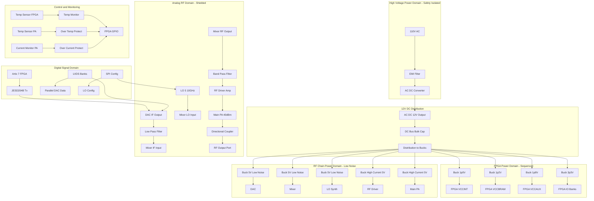

# System Architecture
## rffff

```mermaid
graph TD
    subgraph Power_Domain_High_Voltage["High Voltage Power Domain - Safety Isolated"]
        HV1[110V AC] --> HV2[EMI Filter]
        HV2 --> HV3[AC DC Converter]
    end
    
    subgraph Power_Domain_12V["12V DC Distribution"]
        PV1[AC DC 12V Output] --> PV2[DC Bus Bulk Cap]
        PV2 --> PV3[Distribution to Bucks]
    end
    
    subgraph Power_Domain_FPGA["FPGA Power Domain - Sequenced"]
        FV1[Buck 1p0V] --> FV2[FPGA VCCINT]
        FV3[Buck 1p2V] --> FV4[FPGA VCCBRAM]
        FV5[Buck 1p8V] --> FV6[FPGA VCCAUX]
        FV7[Buck 3p3V] --> FV8[FPGA IO Banks]
    end
    
    subgraph Power_Domain_RF["RF Chain Power Domain - Low Noise"]
        RV1[Buck 5V Low Noise] --> RV2[DAC]
        RV3[Buck 5V Low Noise] --> RV4[Mixer]
        RV5[Buck 5V Low Noise] --> RV6[LO Synth]
        RV7[Buck High Current 5V] --> RV8[RF Driver]
        RV9[Buck High Current 5V] --> RV10[Main PA]
    end
    
    subgraph Signal_Domain_Digital["Digital Signal Domain"]
        DG1[Artix 7 FPGA] --> DG2[JESD204B Tx]
        DG3[LVDS Banks] --> DG4[Parallel DAC Data]
        DG5[SPI Config] --> DG6[LO Config]
    end
    
    subgraph Signal_Domain_Analog["Analog RF Domain - Shielded"]
        AG1[DAC IF Output] --> AG2[Low Pass Filter]
        AG2 --> AG3[Mixer IF Input]
        AG4[LO 5 10GHz] --> AG5[Mixer LO Input]
        AG6[Mixer RF Output] --> AG7[Band Pass Filter]
        AG7 --> AG8[RF Driver Amp]
        AG8 --> AG9[Main PA 40dBm]
        AG9 --> AG10[Directional Coupler]
        AG10 --> AG11[RF Output Port]
    end
    
    subgraph Control_Monitoring["Control and Monitoring"]
        CM1[Temp Sensor FPGA] --> CM2[Temp Monitor]
        CM3[Temp Sensor PA] --> CM4[Over Temp Protect]
        CM5[Current Monitor PA] --> CM6[Over Current Protect]
        CM2 --> CM7[FPGA GPIO]
        CM4 --> CM7
        CM6 --> CM7
    end
    
    PV3 --> FV1
    PV3 --> FV3
    PV3 --> FV5
    PV3 --> FV7
    PV3 --> RV1
    PV3 --> RV3
    PV3 --> RV5
    PV3 --> RV7
    PV3 --> RV9
    
    HV3 --> PV1
    
    DG2 --> AG1
    DG3 --> AG1
    DG5 --> AG4
```
