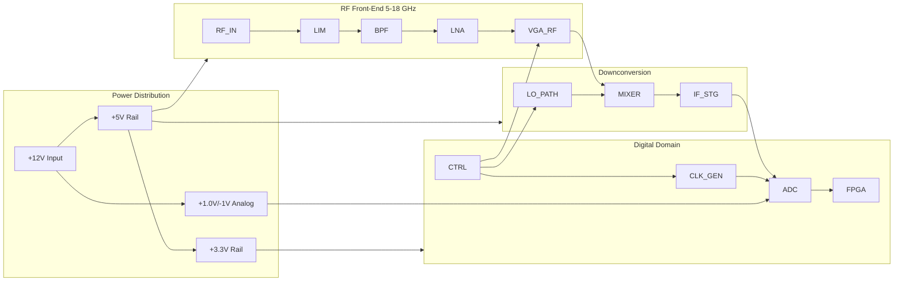

# System Architecture
## rf txrxxp

```mermaid
graph LR
    subgraph RF_DOMAIN["RF Front-End 5-18 GHz"]
        RF_IN
        LIM
        BPF
        LNA
        VGA_RF
    end
    
    subgraph CONVERSION["Downconversion"]
        MIXER
        LO_PATH
        IF_STG
    end
    
    subgraph DIGITAL["Digital Domain"]
        ADC
        CLK_GEN
        FPGA
        CTRL
    end
    
    subgraph POWER["Power Distribution"]
        REG_12V["+12V Input"]
        REG_5V["+5V Rail"]
        REG_3V3["+3.3V Rail"]
        REG_N["+1.0V/-1V Analog"]
    end
    
    RF_IN --> LIM --> BPF --> LNA --> VGA_RF --> MIXER
    LO_PATH --> MIXER
    MIXER --> IF_STG --> ADC
    CLK_GEN --> ADC
    ADC --> FPGA
    CTRL --> VGA_RF
    CTRL --> LO_PATH
    CTRL --> CLK_GEN
    
    REG_12V --> REG_5V
    REG_12V --> REG_N
    REG_5V --> REG_3V3
    REG_5V --> RF_DOMAIN
    REG_5V --> CONVERSION
    REG_3V3 --> DIGITAL
    REG_N --> ADC
```
