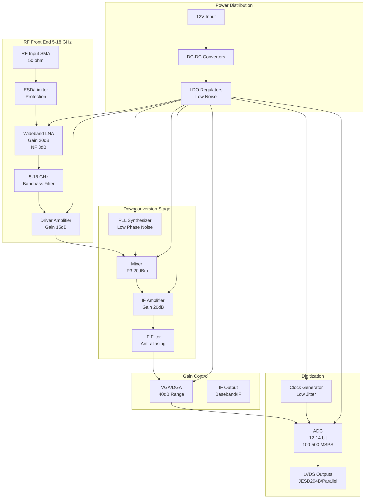

# System Architecture
## dfbvd

```mermaid
flowchart TD
    subgraph RF_FRONTEND["RF Front End 5-18 GHz"]
        RF_IN["RF Input SMA\n50 ohm"]
        ESD_PROT["ESD/Limiter\nProtection"]
        WIDEBAND_LNA["Wideband LNA\nGain 20dB\nNF 3dB"]
        RF_BPF["5-18 GHz\nBandpass Filter"]
        DRIVER_AMP["Driver Amplifier\nGain 15dB"]
    end
    
    subgraph DOWNCONVERSION["Downconversion Stage"]
        MIXER["Mixer\nIP3 20dBm"]
        LO_SYNTH["PLL Synthesizer\nLow Phase Noise"]
        IF_AMP_STG["IF Amplifier\nGain 20dB"]
        IF_FILTER["IF Filter\nAnti-aliasing"]
    end
    
    subgraph VGA_STAGE["Gain Control"]
        VGA["VGA/DGA\n40dB Range"]
        IF_OUT["IF Output\nBaseband/IF"]
    end
    
    subgraph DIGITIZER["Digitization"]
        ADC_CHIP["ADC\n12-14 bit\n100-500 MSPS"]
        CLK_GEN["Clock Generator\nLow Jitter"]
        LVDS_DRV["LVDS Outputs\nJESD204B/Parallel"]
    end
    
    subgraph POWER["Power Distribution"]
        PWR_IN["12V Input"]
        DC_DC["DC-DC Converters"]
        LDO_REG["LDO Regulators\nLow Noise"]
    end
    
    RF_IN --> ESD_PROT
    ESD_PROT --> WIDEBAND_LNA
    WIDEBAND_LNA --> RF_BPF
    RF_BPF --> DRIVER_AMP
    DRIVER_AMP --> MIXER
    LO_SYNTH --> MIXER
    MIXER --> IF_AMP_STG
    IF_AMP_STG --> IF_FILTER
    IF_FILTER --> VGA
    VGA --> ADC_CHIP
    CLK_GEN --> ADC_CHIP
    ADC_CHIP --> LVDS_DRV
    
    PWR_IN --> DC_DC
    DC_DC --> LDO_REG
    LDO_REG --> WIDEBAND_LNA
    LDO_REG --> DRIVER_AMP
    LDO_REG --> MIXER
    LDO_REG --> LO_SYNTH
    LDO_REG --> IF_AMP_STG
    LDO_REG --> VGA
    LDO_REG --> ADC_CHIP
    LDO_REG --> CLK_GEN
```
