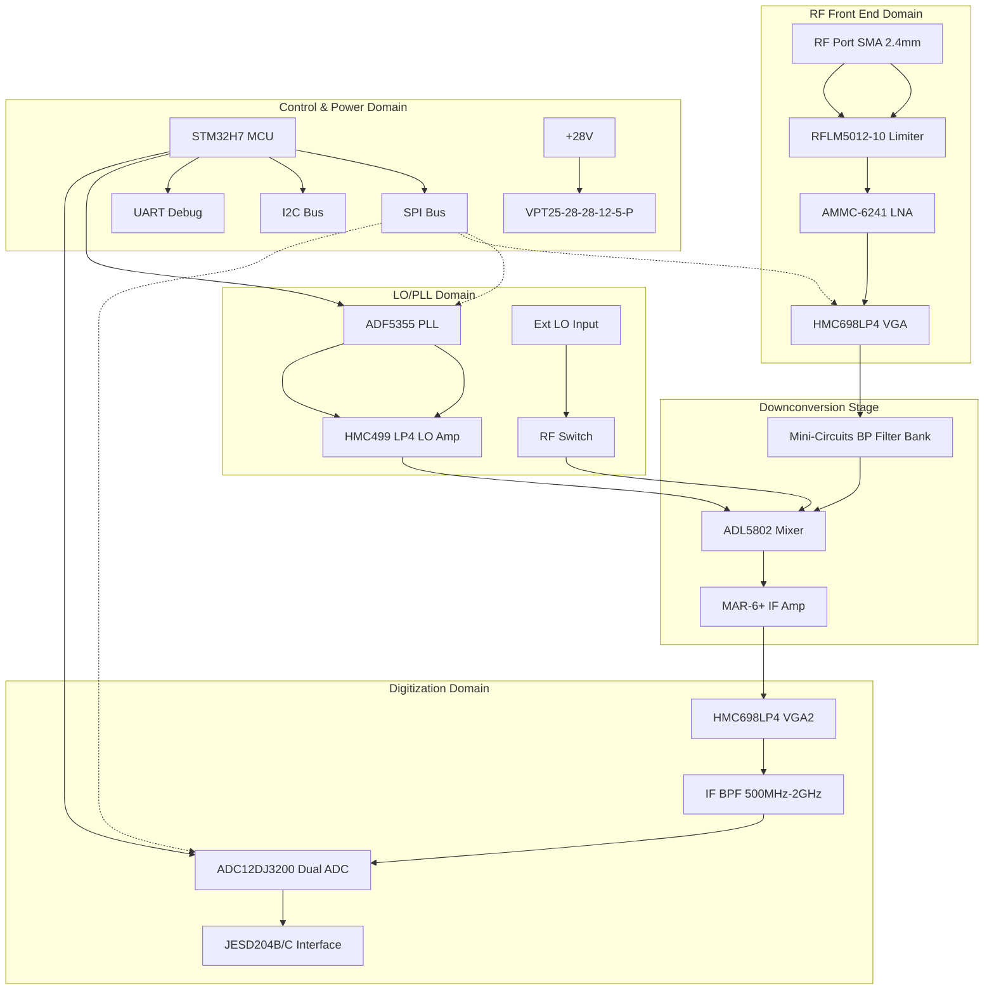

# System Architecture
## rbhjdaz

```mermaid
graph TD
    subgraph RF_FRONT_END["RF Front End Domain"]
        ANT[RF Port SMA 2.4mm] --> LIM[RFLM5012-10 Limiter]
        LIM --> LNA[AMMC-6241 LNA]
        LNA --> VGA[HMC698LP4 VGA]
    end
    
    subgraph DOWNCONVERT["Downconversion Stage"]
        VGA --> FILT[Mini-Circuits BP Filter Bank]
        FILT --> MIX[ADL5802 Mixer]
        MIX --> AMP_IF[MAR-6+ IF Amp]
    end
    
    subgraph LO_DOMAIN["LO/PLL Domain"]
        PLL[ADF5355 PLL] --> LO_AMP[HMC499 LP4 LO Amp]
        EXT_LO[Ext LO Input] --> SW_RF[RF Switch]
        SW_RF --> MIX
    end
    
    subgraph DIGITIZE["Digitization Domain"]
        AMP_IF --> VGA2[HMC698LP4 VGA2]
        VGA2 --> FILT_IF[IF BPF 500MHz-2GHz]
        FILT_IF --> ADC[ADC12DJ3200 Dual ADC]
        ADC --> JESD[JESD204B/C Interface]
    end
    
    subgraph CONTROL_PWR["Control & Power Domain"]
        MCU[STM32H7 MCU] --> SPI1[SPI Bus]
        MCU --> I2C1[I2C Bus]
        MCU --> UART1[UART Debug]
        SPI1 -.-> PLL
        SPI1 -.-> VGA
        SPI1 -.-> ADC
        PSU[+28V] --> DCDC[VPT25-28-28-12-5-P]
    end
    
    ANT --> LIM
    PLL --> LO_AMP
    LO_AMP --> MIX
    MCU --> PLL
    MCU --> ADC
```
