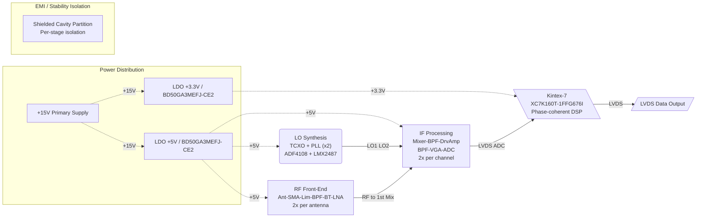

# System Architecture
## hv

```mermaid
flowchart LR
    P15V["+15V Primary Supply"]
    LDO5V["LDO +5V / BD50GA3MEFJ-CE2"]
    LDO3V3["LDO +3.3V / BD50GA3MEFJ-CE2"]
    RF_FRONT["RF Front-End<br/>Ant-SMA-Lim-BPF-BT-LNA<br/>2x per antenna"]
    LO_SYNTH("LO Synthesis<br/>TCXO + PLL (x2)<br/>ADF4108 + LMX2487")
    IF_CHAIN["IF Processing<br/>Mixer-BPF-DrvAmp<br/>BPF-VGA-ADC<br/>2x per channel"]
    FPGA[\"Kintex-7<br/>XC7K160T-1FFG676I<br/>Phase-coherent DSP"\]
    DATA_OUT[/"LVDS Data Output"/]
    GND_SHIELD["Shielded Cavity Partition<br/>Per-stage isolation"]
    P15V -.->|+15V| LDO5V
    P15V -.->|+15V| LDO3V3
    LDO5V -.->|+5V| RF_FRONT
    LDO5V -.->|+5V| IF_CHAIN
    LDO5V -.->|+5V| LO_SYNTH
    LDO3V3 -.->|+3.3V| FPGA
    LO_SYNTH -->|LO1 LO2| IF_CHAIN
    RF_FRONT -->|RF to 1st Mix| IF_CHAIN
    IF_CHAIN -->|LVDS ADC| FPGA
    FPGA -->|LVDS| DATA_OUT
    subgraph POWER_DOMAIN["Power Distribution"]
        P15V
        LDO5V
        LDO3V3
    end
    subgraph SHIELDING["EMI / Stability Isolation"]
        GND_SHIELD
    end
```
