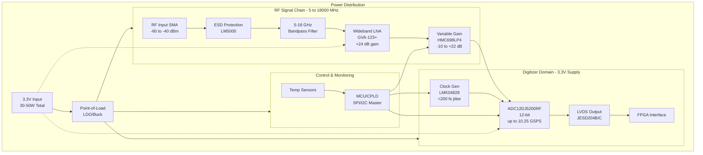

# System Architecture
## dghb

```mermaid
flowchart TD
    subgraph RF_CHAIN[RF Signal Chain - 5 to 18000 MHz]
        RF_IN[RF Input SMA\n-60 to -40 dBm] --> ESD1[ESD Protection\nLM5000]
        ESD1 --> BPF1[5-18 GHz\nBandpass Filter]
        BPF1 --> LNA1[Wideband LNA\nGVA-123+\n+24 dB gain]
        LNA1 --> VGA1[Variable Gain\nHMC698LP4\n-10 to +22 dB]
    end
    subgraph DIGITIZER[Digitizer Domain - 3.3V Supply]
        VGA1 --> ADC1[ADC12DJ5200RF\n12-bit\nup to 10.25 GSPS]
        CLK[Clock Gen\nLMK04828\n<200 fs jitter] --> ADC1
        ADC1 --> LVDS1[LVDS Output\nJESD204B/C]
        LVDS1 --> FPGA_INT[FPGA Interface]
    end
    subgraph CONTROL[Control & Monitoring]
        MCU1[MCU/CPLD\nSPI/I2C Master] --> VGA1
        MCU1 --> ADC1
        MCU1 --> CLK
        TEMP[Temp Sensors] --> MCU1
    end
    subgraph POWER[Power Distribution]
        PWR_IN[3.3V Input\n30-50W Total] --> REG1[Point-of-Load\nLDO/Buck]
        REG1 --> RF_CHAIN
        REG1 --> DIGITIZER
        REG1 --> CONTROL
    end
    PWR_IN -.-> ADC1
    PWR_IN -.-> LNA1
```
