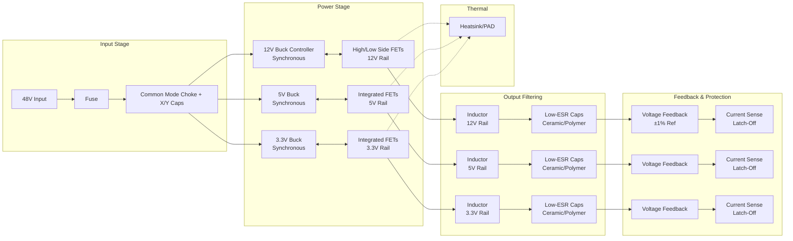

# System Architecture
## rf1

```mermaid
graph LR
    subgraph "Input Stage"
        IN48["48V Input"]-->FUSE["Fuse"]
        FUSE-->PI_FILTER["Common Mode Choke + X/Y Caps"]
    end
    subgraph "Power Stage"
        PI_FILTER-->CTRL12["12V Buck Controller\nSynchronous"]
        PI_FILTER-->CTRL5["5V Buck\nSynchronous"]
        PI_FILTER-->CTRL33["3.3V Buck\nSynchronous"]
        CTRL12<-->MOS12["High/Low Side FETs\n12V Rail"]
        CTRL5<-->MOS5["Integrated FETs\n5V Rail"]
        CTRL33<-->MOS33["Integrated FETs\n3.3V Rail"]
    end
    subgraph "Output Filtering"
        MOS12-->IND12["Inductor\n12V Rail"]
        MOS5-->IND5["Inductor\n5V Rail"]
        MOS33-->IND33["Inductor\n3.3V Rail"]
        IND12-->CAP12["Low-ESR Caps\nCeramic/Polymer"]
        IND5-->CAP5["Low-ESR Caps\nCeramic/Polymer"]
        IND33-->CAP33["Low-ESR Caps\nCeramic/Polymer"]
    end
    subgraph "Feedback & Protection"
        CAP12-->FB12["Voltage Feedback\n±1% Ref"]
        CAP5-->FB5["Voltage Feedback"]
        CAP33-->FB33["Voltage Feedback"]
        FB12-->OCP12["Current Sense\nLatch-Off"]
        FB5-->OCP5["Current Sense\nLatch-Off"]
        FB33-->OCP33["Current Sense\nLatch-Off"]
    end
    subgraph "Thermal"
        MOS12-.->HEAT["Heatsink/PAD"]
        MOS5-.->HEAT
        MOS33-.->HEAT
    end
```
