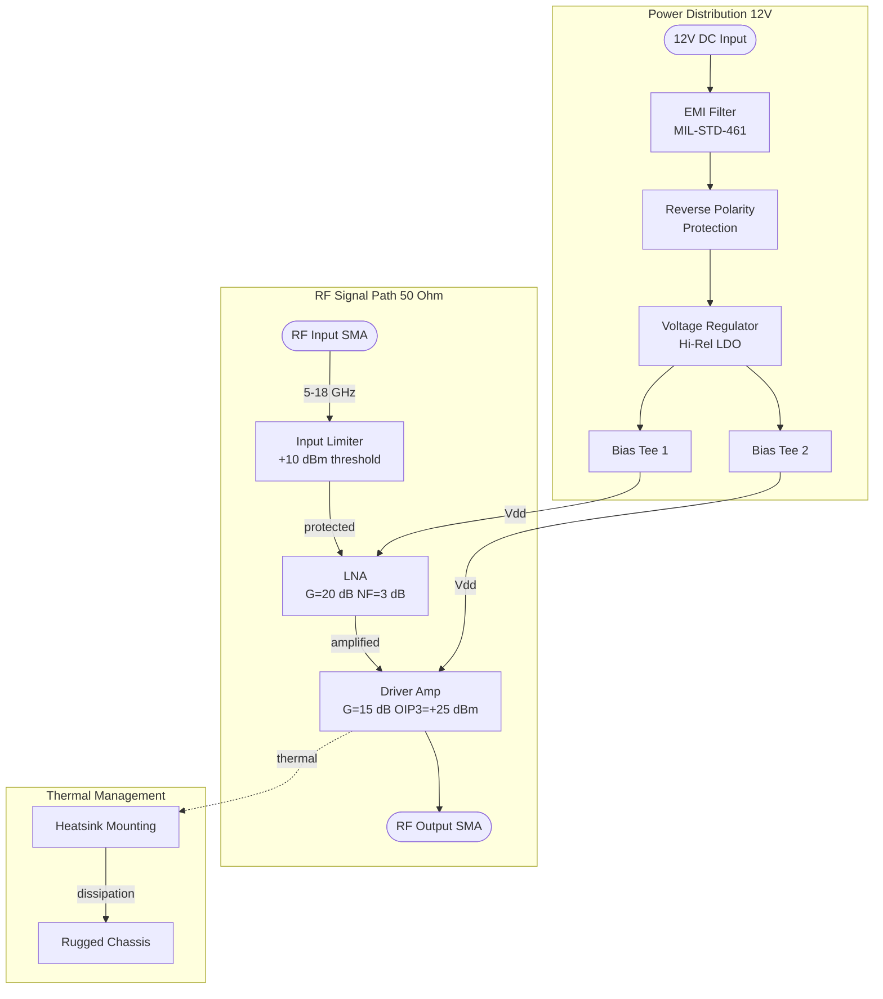

# System Architecture
## Rf Receiver

```mermaid
flowchart TD
    subgraph RF_PATH[RF Signal Path 50 Ohm]
        RF_IN([RF Input SMA]) -->|5-18 GHz| LIMITER[Input Limiter<br/>+10 dBm threshold]
        LIMITER -->|protected| LNA[LNA<br/>G=20 dB NF=3 dB]
        LNA -->|amplified| DRIVER[Driver Amp<br/>G=15 dB OIP3=+25 dBm]
        DRIVER --> RF_OUT([RF Output SMA])
    end
    
    subgraph POWER_DOMAIN[Power Distribution 12V]
        PWR_IN([12V DC Input]) --> EMI[EMI Filter<br/>MIL-STD-461]
        EMI --> REV[Reverse Polarity<br/>Protection]
        REV --> REG[Voltage Regulator<br/>Hi-Rel LDO]
        REG --> BIAS1[Bias Tee 1]
        REG --> BIAS2[Bias Tee 2]
        BIAS1 -->|Vdd| LNA
        BIAS2 -->|Vdd| DRIVER
    end
    
    subgraph THERMAL[Thermal Management]
        HEATSINK[Heatsink Mounting] -->|dissipation| CHASSIS[Rugged Chassis]
    end
    
    DRIVER -.->|thermal| HEATSINK
```
