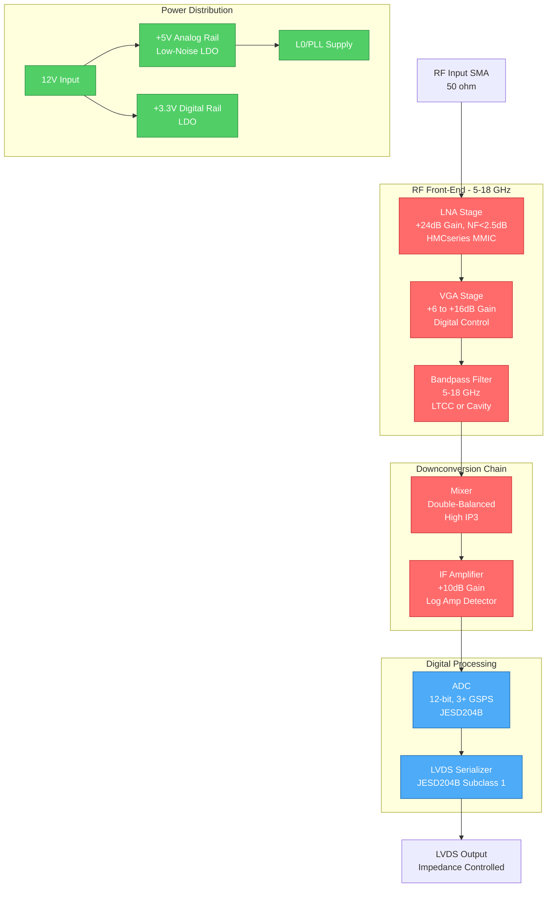

# System Architecture
## dkfjg

```mermaid
flowchart TD
    subgraph RF_FRONT_END[RF Front-End - 5-18 GHz]
        LNA_STAGE[LNA Stage<br/>+24dB Gain, NF<2.5dB<br/>HMCseries MMIC]:::rfpath
        VGA_STAGE[VGA Stage<br/>+6 to +16dB Gain<br/>Digital Control]:::rfpath
        FILTER_STAGE[Bandpass Filter<br/>5-18 GHz<br/>LTCC or Cavity]:::rfpath
        LNA_STAGE --> VGA_STAGE --> FILTER_STAGE
    end
    
    subgraph CONVERSION[Downconversion Chain]
        MIXER_STAGE[Mixer<br/>Double-Balanced<br/>High IP3]:::rfpath
        IF_STAGE[IF Amplifier<br/>+10dB Gain<br/>Log Amp Detector]:::rfpath
        MIXER_STAGE --> IF_STAGE
    end
    
    subgraph DIGITAL_CHAIN[Digital Processing]
        ADC_STAGE[ADC<br/>12-bit, 3+ GSPS<br/>JESD204B]:::digital
        LVDS_SERIALIZER[LVDS Serializer<br/>JESD204B Subclass 1]:::digital
        ADC_STAGE --> LVDS_SERIALIZER
    end
    
    subgraph POWER_DOMAINS[Power Distribution]
        PWR_12V[12V Input]:::power
        PWR_5V[+5V Analog Rail<br/>Low-Noise LDO]:::power
        PWR_3V3[+3.3V Digital Rail<br/>LDO]:::power
        PWR_LO[L0/PLL Supply]:::power
        PWR_12V --> PWR_5V
        PWR_12V --> PWR_3V3
        PWR_5V --> PWR_LO
    end
    
    RF_IN[RF Input SMA<br/>50 ohm] --> LNA_STAGE
    FILTER_STAGE --> MIXER_STAGE
    IF_STAGE --> ADC_STAGE
    LVDS_SERIALIZER --> LVDS_OUT[LVDS Output<br/>Impedance Controlled]
    
    classDef rfpath fill:#ff6b6b,stroke:#c92a2a,color:#fff
    classDef digital fill:#4dabf7,stroke:#1864ab,color:#fff
    classDef power fill:#51cf66,stroke:#2b8a3e,color:#fff
```
