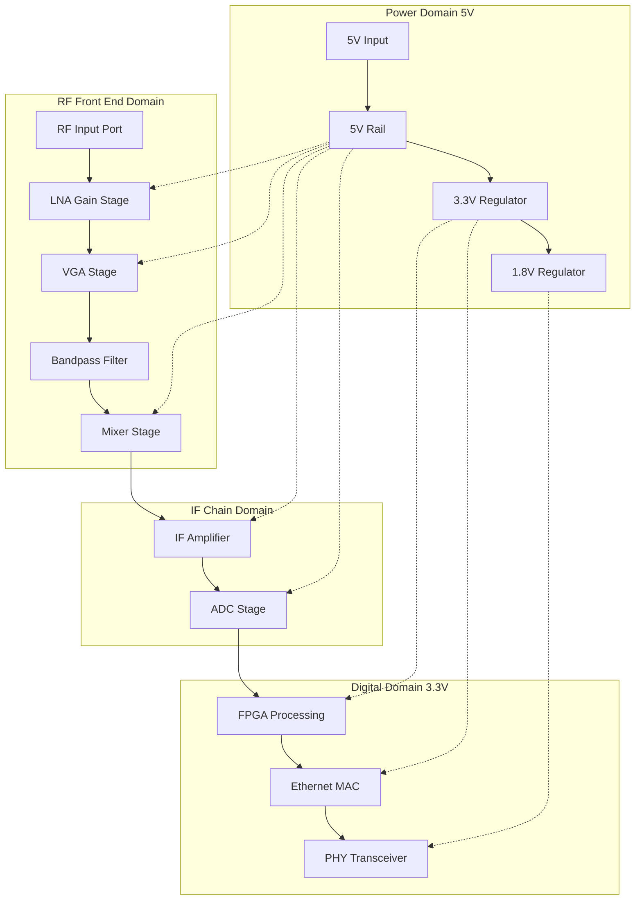

# System Architecture
## mn

```mermaid
flowchart TD
    subgraph RF_Front_End[RF Front End Domain]
        RF_IN[RF Input Port]
        LNA[LNA Gain Stage]
        VGA[VGA Stage]
        BPF[Bandpass Filter]
        MIXER[Mixer Stage]
    end
    
    subgraph IF_Chain[IF Chain Domain]
        IF_AMP[IF Amplifier]
        ADC[ADC Stage]
    end
    
    subgraph Digital_Processing[Digital Domain 3.3V]
        FPGA[FPGA Processing]
        GIGE[Ethernet MAC]
        PHY[PHY Transceiver]
    end
    
    subgraph Power_Domain[Power Domain 5V]
        PWR[5V Input]
        REG_5V[5V Rail]
        REG_3V3[3.3V Regulator]
        REG_1V8[1.8V Regulator]
    end
    
    RF_IN --> LNA
    LNA --> VGA
    VGA --> BPF
    BPF --> MIXER
    MIXER --> IF_AMP
    IF_AMP --> ADC
    ADC --> FPGA
    FPGA --> GIGE
    GIGE --> PHY
    
    PWR --> REG_5V
    REG_5V --> REG_3V3
    REG_3V3 --> REG_1V8
    
    REG_5V -.-> LNA
    REG_5V -.-> VGA
    REG_5V -.-> MIXER
    REG_5V -.-> IF_AMP
    REG_5V -.-> ADC
    REG_3V3 -.-> FPGA
    REG_3V3 -.-> GIGE
    REG_1V8 -.-> PHY
```
