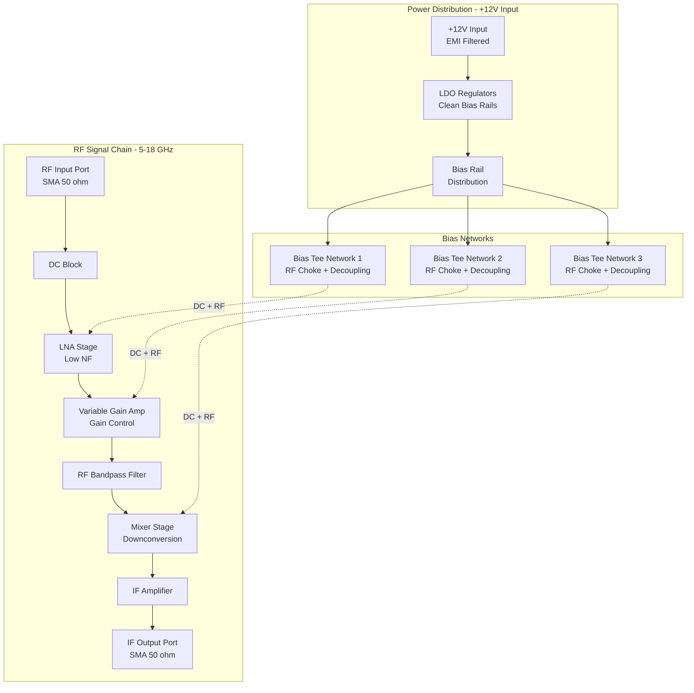

# System Architecture
## Receiver Module

```mermaid
flowchart TD
    subgraph RF_SIGNAL_CHAIN[RF Signal Chain - 5-18 GHz]
        RF_IN[RF Input Port<br/>SMA 50 ohm]
        DCB1[DC Block]
        LNA[LNA Stage<br/>Low NF]
        VGA[Variable Gain Amp<br/>Gain Control]
        FILTER[RF Bandpass Filter]
        MIXER[Mixer Stage<br/>Downconversion]
        IFAMP[IF Amplifier]
        IFOUT[IF Output Port<br/>SMA 50 ohm]
        
        RF_IN --> DCB1 --> LNA --> VGA --> FILTER --> MIXER --> IFAMP --> IFOUT
    end
    
    subgraph BIAS_NETWORKS[Bias Networks]
        BIAS1[Bias Tee Network 1<br/>RF Choke + Decoupling]
        BIAS2[Bias Tee Network 2<br/>RF Choke + Decoupling]
        BIAS3[Bias Tee Network 3<br/>RF Choke + Decoupling]
        
        BIAS1 -.->|DC + RF| LNA
        BIAS2 -.->|DC + RF| VGA
        BIAS3 -.->|DC + RF| MIXER
    end
    
    subgraph POWER_DOMAIN[Power Distribution - +12V Input]
        PWR_IN[+12V Input<br/>EMI Filtered]
        REG[LDO Regulators<br/>Clean Bias Rails]
        BIAS_DIST[Bias Rail<br/>Distribution]
        
        PWR_IN --> REG --> BIAS_DIST
    end
    
    BIAS_DIST --> BIAS1
    BIAS_DIST --> BIAS2
    BIAS_DIST --> BIAS3
```
