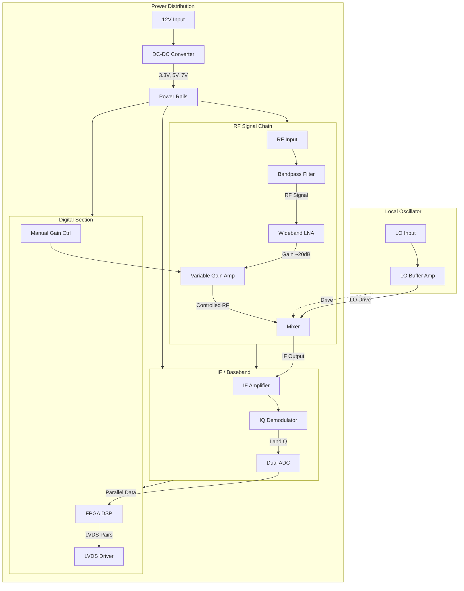

# System Architecture
## rx module

```mermaid
flowchart TD
    subgraph RF_CHAIN["RF Signal Chain"]
        RF_IN["RF Input"] --> BPF["Bandpass Filter"]
        BPF -->|RF Signal| LNA["Wideband LNA"]
        LNA -->|Gain ~20dB| VGA["Variable Gain Amp"]
        VGA -->|Controlled RF| MIX["Mixer"]
    end
    
    subgraph LO_SECTION["Local Oscillator"]
        LO_IN["LO Input"] --> LO_BUF["LO Buffer Amp"]
        LO_BUF -->|LO Drive| MIX
    end
    
    subgraph IF_CHAIN["IF / Baseband"]
        MIX -->|IF Output| IF_AMP["IF Amplifier"]
        IF_AMP --> IQ_MOD["IQ Demodulator"]
        IQ_MOD -->|I and Q| ADC["Dual ADC"]
    end
    
    subgraph DIGITAL["Digital Section"]
        ADC -->|Parallel Data| FPGA["FPGA DSP"]
        FPGA -->|LVDS Pairs| LVDS["LVDS Driver"]
        MGC["Manual Gain Ctrl"] --> VGA
    end
    
    subgraph POWER["Power Distribution"]
        PWR_IN["12V Input"] --> DCDC["DC-DC Converter"]
        DCDC -->|3.3V, 5V, 7V| PWR_DIST["Power Rails"]
        PWR_DIST --> RF_CHAIN
        PWR_DIST --> IF_CHAIN
        PWR_DIST --> DIGITAL
    end
    
    LO_SECTION -.->|Drive| MIX
    RF_CHAIN --> IF_CHAIN
    IF_CHAIN --> DIGITAL
```
