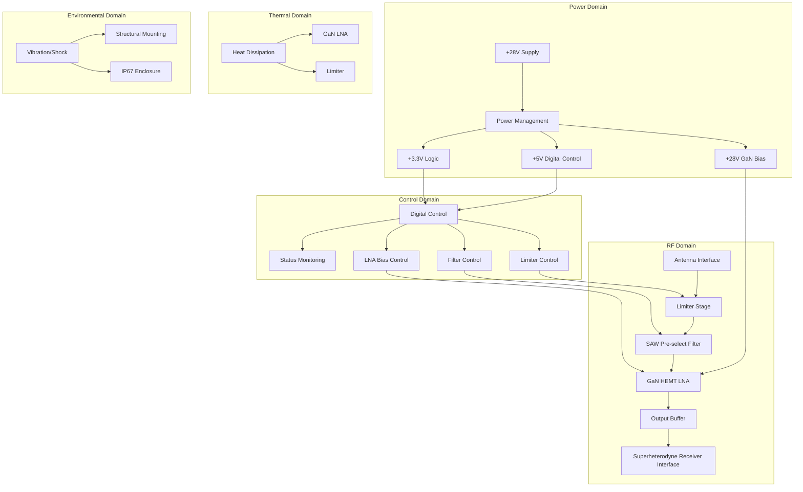

# System Architecture
## dgh

```mermaid
flowchart TD
    subgraph Power Domain
        A[+28V Supply] --> B[Power Management]
        B --> C[+28V GaN Bias]
        B --> D[+5V Digital Control]
        B --> E[+3.3V Logic]
    end
    
    subgraph RF Domain
        F[Antenna Interface] --> G[Limiter Stage]
        G --> H[SAW Pre-select Filter]
        H --> I[GaN HEMT LNA]
        I --> J[Output Buffer]
        J --> K[Superheterodyne Receiver Interface]
    end
    
    subgraph Control Domain
        L[Digital Control] --> M[Limiter Control]
        L --> N[Filter Control]
        L --> O[LNA Bias Control]
        L --> P[Status Monitoring]
    end
    
    subgraph Thermal Domain
        Q[Heat Dissipation] --> R[GaN LNA]
        Q --> S[Limiter]
    end
    
    subgraph Environmental Domain
        T[Vibration/Shock] --> U[Structural Mounting]
        T --> V[IP67 Enclosure]
    end
    
    C --> I
    D --> L
    E --> L
    M --> G
    N --> H
    O --> I
```
