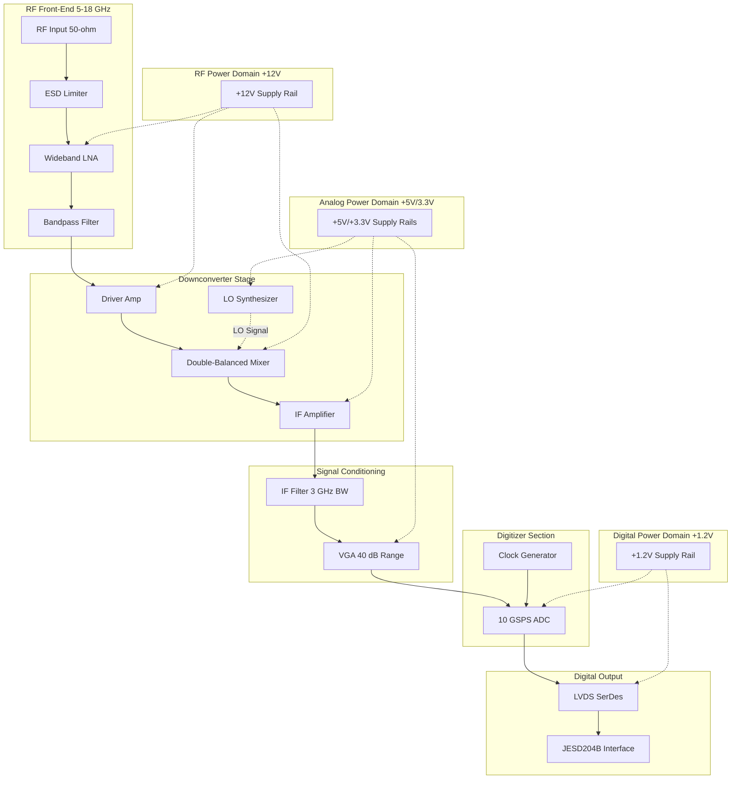

# System Architecture
## dsf

```mermaid
flowchart TD
    subgraph RF_Power_Domain["RF Power Domain +12V"]
        RF_SUPPLY["+12V Supply Rail"]
    end
    
    subgraph Digital_Power_Domain["Digital Power Domain +1.2V"]
        DIG_SUPPLY["+1.2V Supply Rail"]
    end
    
    subgraph Analog_Power_Domain["Analog Power Domain +5V/3.3V"]
        AN_SUPPLY["+5V/+3.3V Supply Rails"]
    end
    
    subgraph RF_Front_End["RF Front-End 5-18 GHz"]
        RF_IN["RF Input 50-ohm"]
        LIMITER["ESD Limiter"]
        LNA["Wideband LNA"]
        BPF["Bandpass Filter"]
    end
    
    subgraph Downconverter["Downconverter Stage"]
        DRIVER["Driver Amp"]
        MIXER["Double-Balanced Mixer"]
        LO["LO Synthesizer"]
        IF_AMP["IF Amplifier"]
    end
    
    subgraph Signal_Conditioning["Signal Conditioning"]
        VGA["VGA 40 dB Range"]
        IF_FILTER["IF Filter 3 GHz BW"]
    end
    
    subgraph Digitizer["Digitizer Section"]
        ADC["10 GSPS ADC"]
        CLK["Clock Generator"]
    end
    
    subgraph Digital_Output["Digital Output"]
        SERDES["LVDS SerDes"]
        JESD204["JESD204B Interface"]
    end
    
    RF_IN --> LIMITER
    LIMITER --> LNA
    LNA --> BPF
    BPF --> DRIVER
    DRIVER --> MIXER
    LO -.->|LO Signal| MIXER
    MIXER --> IF_AMP
    IF_AMP --> IF_FILTER
    IF_FILTER --> VGA
    VGA --> ADC
    CLK --> ADC
    ADC --> SERDES
    SERDES --> JESD204
    
    RF_SUPPLY -.-> LNA
    RF_SUPPLY -.-> DRIVER
    RF_SUPPLY -.-> MIXER
    AN_SUPPLY -.-> IF_AMP
    AN_SUPPLY -.-> VGA
    AN_SUPPLY -.-> LO
    DIG_SUPPLY -.-> ADC
    DIG_SUPPLY -.-> SERDES
```
