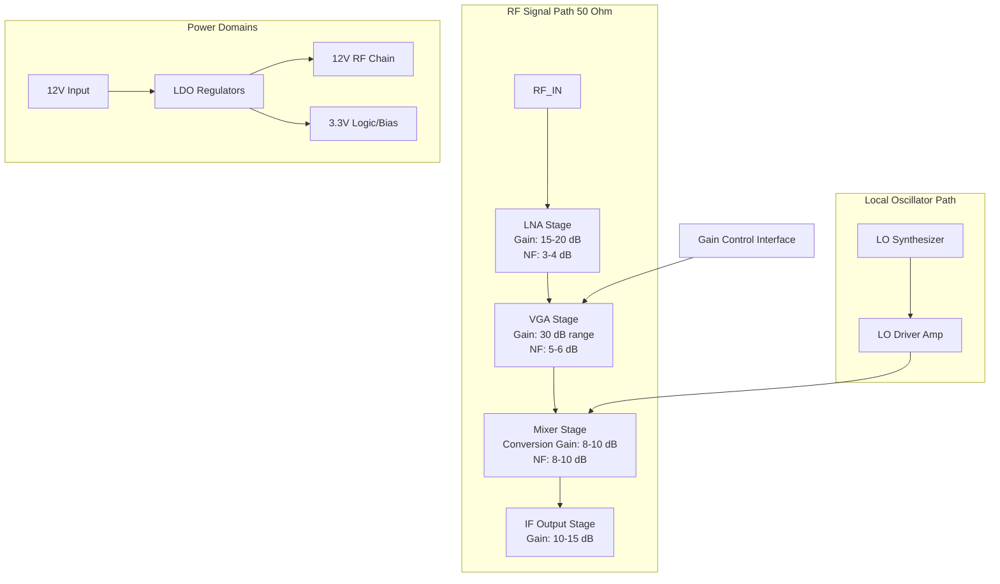

# System Architecture
## jhf

```mermaid
flowchart TD
    subgraph RF_PATH[RF Signal Path 50 Ohm]
        RF_IN --> LNA_STAGE[LNA Stage\nGain: 15-20 dB\nNF: 3-4 dB]
        LNA_STAGE --> VGA_STAGE[VGA Stage\nGain: 30 dB range\nNF: 5-6 dB]
        VGA_STAGE --> MIXER_STAGE[Mixer Stage\nConversion Gain: 8-10 dB\nNF: 8-10 dB]
        MIXER_STAGE --> IF_STAGE[IF Output Stage\nGain: 10-15 dB]
    end
    subgraph LO_PATH[Local Oscillator Path]
        LO_SRC[LO Synthesizer] --> LO_AMP[LO Driver Amp]
        LO_AMP --> MIXER_STAGE
    end
    subgraph PWR_DOMAINS[Power Domains]
        PWR_IN[12V Input] --> REG[LDO Regulators]
        REG --> PWR_RF[12V RF Chain]
        REG --> PWR_LOGIC[3.3V Logic/Bias]
    end
    CTRL_INT[Gain Control Interface] --> VGA_STAGE
```
