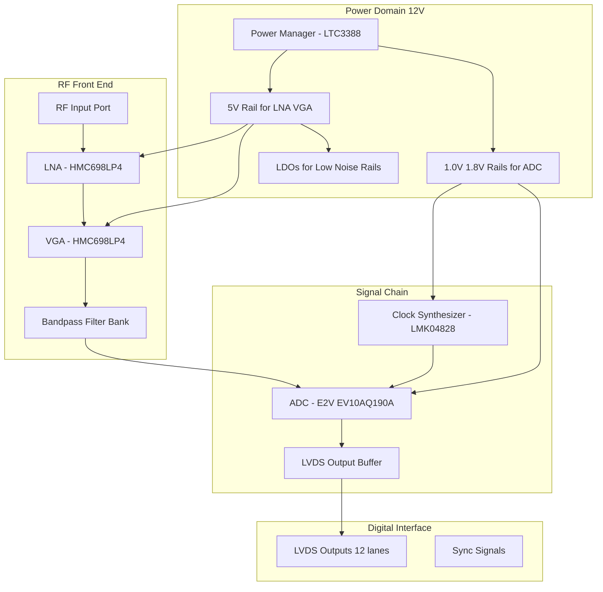

# System Architecture
## khv

```mermaid
flowchart TD
    subgraph RF_Front_End[RF Front End]
        RF_IN[RF Input Port]
        LNA[LNA - HMC698LP4]
        VGA[VGA - HMC698LP4]
        BPF[Bandpass Filter Bank]
    end
    
    subgraph Signal_Chain[Signal Chain]
        ADC[ADC - E2V EV10AQ190A]
        CLK[Clock Synthesizer - LMK04828]
        DIO[LVDS Output Buffer]
    end
    
    subgraph Power_Domain[Power Domain 12V]
        PM[Power Manager - LTC3388]
        DCDC1[5V Rail for LNA VGA]
        DCDC2[1.0V 1.8V Rails for ADC]
        LDO[LDOs for Low Noise Rails]
    end
    
    subgraph Digital_Interface[Digital Interface]
        LVDS_OUT[LVDS Outputs 12 lanes]
        SYNC[Sync Signals]
    end
    
    RF_IN --> LNA
    LNA --> VGA
    VGA --> BPF
    BPF --> ADC
    CLK --> ADC
    ADC --> DIO
    DIO --> LVDS_OUT
    PM --> DCDC1
    PM --> DCDC2
    DCDC1 --> LDO
    DCDC1 --> LNA
    DCDC1 --> VGA
    DCDC2 --> ADC
    DCDC2 --> CLK
```
