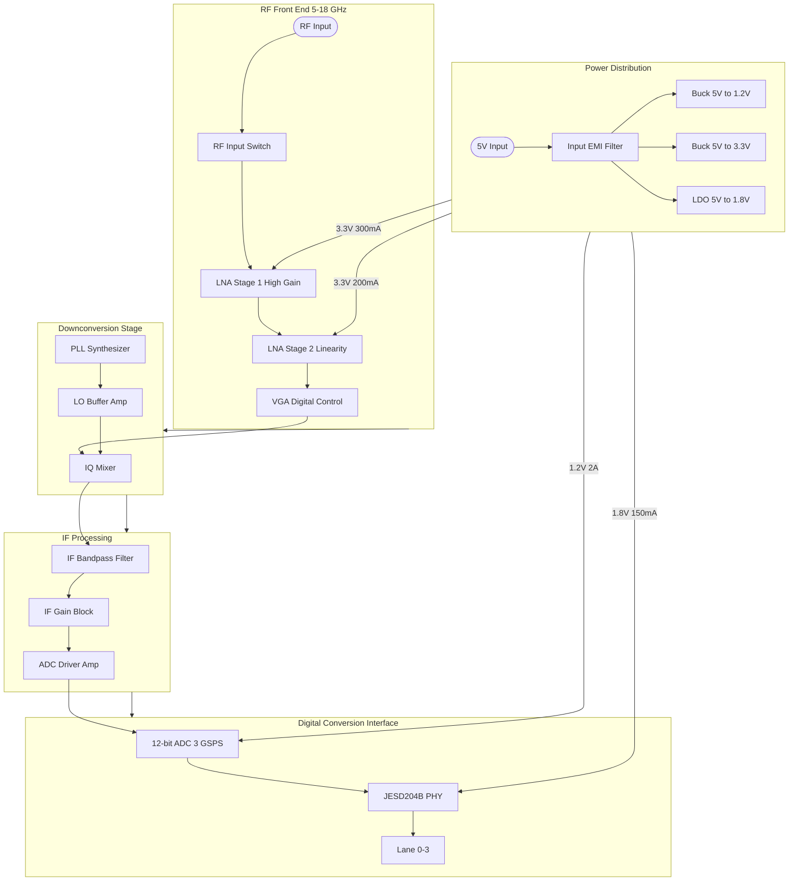

# System Architecture
## sdfjbks

```mermaid
flowchart TD
    subgraph RF_Chain[RF Front End 5-18 GHz]
        RF_IN([RF Input]) --> RF_SW[RF Input Switch]
        RF_SW --> LNA1[LNA Stage 1 High Gain]
        LNA1 --> LNA2[LNA Stage 2 Linearity]
        LNA2 --> VGA[VGA Digital Control]
    end
    
    subgraph Downconversion[Downconversion Stage]
        VGA --> MIXER[IQ Mixer]
        LO_PLL[PLL Synthesizer] --> LO_AMP[LO Buffer Amp]
        LO_AMP --> MIXER
    end
    
    subgraph IF_Chain[IF Processing]
        MIXER --> IF_FILT[IF Bandpass Filter]
        IF_FILT --> IF_AMP[IF Gain Block]
        IF_AMP --> ADC_DRV[ADC Driver Amp]
    end
    
    subgraph Digital[Digital Conversion Interface]
        ADC_DRV --> ADC[12-bit ADC 3 GSPS]
        ADC --> JESD_PHY[JESD204B PHY]
        JESD_PHY --> Lanes[Lane 0-3]
    end
    
    subgraph Power[Power Distribution]
        PWR_IN([5V Input]) --> PWR_FILT[Input EMI Filter]
        PWR_FILT --> BUCK_1_2[Buck 5V to 1.2V]
        PWR_FILT --> BUCK_3_3[Buck 5V to 3.3V]
        PWR_FILT --> LDO_1_8[LDO 5V to 1.8V]
    end
    
    RF_Chain --> Downconversion
    Downconversion --> IF_Chain
    IF_Chain --> Digital
    
    Power -->|1.2V 2A| ADC
    Power -->|3.3V 300mA| LNA1
    Power -->|3.3V 200mA| LNA2
    Power -->|1.8V 150mA| JESD_PHY
```
